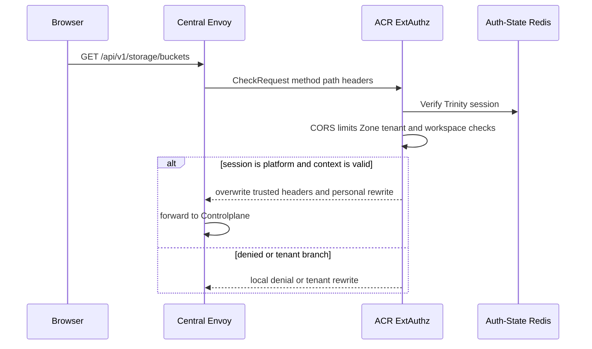
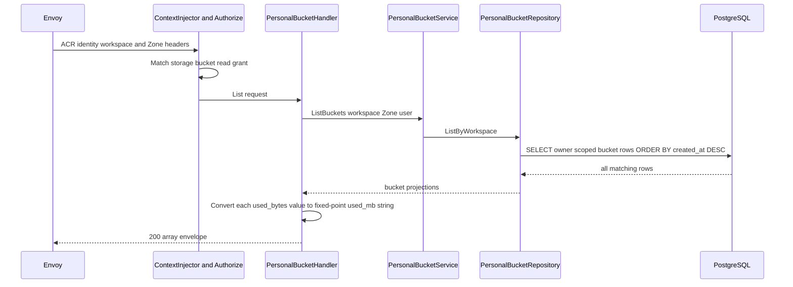

# Personal Bucket List — God View

Danh sách bucket là read workflow theo workspace và Zone đang được ACR xác
minh. Nó trả PostgreSQL projection hiện có, không phải catalogue trực tiếp từ
MinIO.

## API-scope contract

Browser gọi `GET /api/v1/storage/buckets`. ACR chỉ rewrite sang
`/api/v1/personal/storage/buckets` với session platform. Permission là
`{username}:{workspace_id}:storage:bucket:read` hoặc wildcard. Repository
requires đồng thời `bucket.workspace_id`, `bucket.zone_id`, `workspace.zone_id`
và workspace owner khớp trusted context.

## REST input and output

### Request headers used

| Header | Use |
|---|---|
| `Cookie` | ACR verified session and cookie-derived workspace plus Zone. |
| `Origin` | CORS enforcement. |
| `traceparent` | Trace context. |

### Query payload

Không có query, cursor hay page-size đang được implementation nhận. Đây là
contract AS-IS, không phải page API.

### Response headers

| Result | Headers |
|---|---|
| All JSON responses | `Content-Type: application/json` |

### Response payload

| Status | `data` |
|---|---|
| `200` | Array ordered `created_at DESC`, each `id`, `name`, `capacity_quota_bytes`, `used_mb` (fixed-point decimal string), `created_at`, `updated_at` |
| `403` | Session, context or compiled permission failure |
| `500` | Database list failure |

## Key contract

| Key / store | Operation | Authority |
|---|---|---|
| Trinity session in Auth-State Redis | ACR lookup | User, platform tenant, Zone and active workspace selection. |
| `user_role:{user_id}` cache entry | Read by `Authorize` | Compiled read grant. |
| `storage.personal_buckets` plus `hierarchy.personal_workspaces` | Ordered PostgreSQL SELECT | Durable catalogue and last `used_bytes` projection; handler serializes it as `used_mb`. |
| `aurora.storage.sizes.v1` | Not read synchronously | It updates `used_bytes` in a separate runtime workflow only. |

## Phase 1 — Client → Envoy → ACR

Envoy asks ACR before forwarding. ACR checks CORS, the general pre/post-auth
rate limits, Trinity session, Zone and tenant binding. `GET` does not require
a CSRF mutation signal. ACR removes a caller-supplied workspace header and
injects only the session cookie selection. Direct `/personal` access is denied.

## Phase 2 — Controlplane scoped catalogue read

The global context middleware parses injected UUIDs. `Authorize` checks the
five-level personal key and handler reads user, workspace and Zone from context
under a five-second deadline. Repository performs one ordered query with all
four scope predicates. There is no cursor and no server-side upper bound.

## Failure and documented gap

| Condition | Behavior |
|---|---|
| No buckets | `200` with an empty array. |
| Wrong workspace or Zone | Query returns no matching bucket rather than exposing another scope. |
| Postgres unavailable | `500`; there is no read cache fallback. |
| Very large workspace catalogue | Current code loads all matching rows. The earlier God View claim of pagination is false; adding a cursor needs a separate contract change. |
| Tenant session | ACR routes to registered tenant endpoint, whose handler is currently empty. It does not produce this personal list response. |

## Code map

- `controlplane/internal/storage/route.go`
- `controlplane/internal/storage/transport/http/handler/personal_bucket_handler.go`
- `controlplane/internal/storage/repository/personal_bucket_repo.go`
- `job-orchestrator/src/storage_usage/worker.rs`
