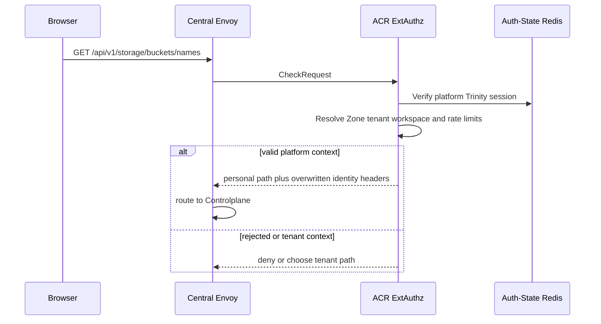
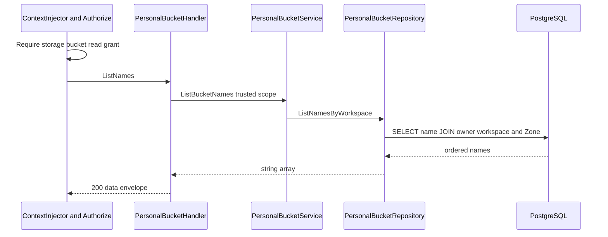

# Personal Bucket Name List — God View

Đây là lightweight catalogue read dành cho UI cần các tên bucket vật lý. Nó
không trả credential và không gọi MinIO.

## API-scope contract

Public route là `GET /api/v1/storage/buckets/names`. ACR chọn personal branch
từ verified platform session và rewrites nội bộ sang
`/api/v1/personal/storage/buckets/names`. `storage:bucket:read` cùng
workspace-scoped compiled permission được yêu cầu. Repository limits names to
the selected workspace, selected Zone and verified personal owner.

## REST input and output

### Request headers used

| Header | Use |
|---|---|
| `Cookie` | Verified Trinity session and workspace/Zone selection at ACR. |
| `Origin` | CORS enforcement. |

### Payload

No path parameter, query or body is consumed.

### Response headers

| Result | Headers |
|---|---|
| All JSON responses | `Content-Type: application/json` |

### Response payload

| Status | `data` |
|---|---|
| `200` | String array of physical names, ordered `created_at DESC` |
| `403` | ACR or compiled permission denial |
| `500` | Repository error |

## Key contract

| Store/key | Operation | Invariant |
|---|---|---|
| Auth-State Redis session | ACR read | Browser cannot set owner/workspace headers directly. |
| Compiled personal role cache | Permission lookup | Requires `storage:bucket:read`. |
| `storage.personal_buckets` | SELECT name | Join to personal workspace, Zone and owner is mandatory. |

## Phase 1 — Client → Envoy → ACR

ACR executes CORS, rate and session/context validation, then removes and
rewrites trusted headers exactly as other neutral personal reads. No upstream
request is made on a failed edge check.

## Phase 2 — Controlplane name projection read

`Authorize` runs before the handler. Handler reads trusted user, workspace and
Zone, asks `ListBucketNames`, and repository performs the scoped ordered
query. The service does no name transformation, so returned strings are
physical `ws-...` names and must be treated as opaque identifiers by clients.

## Failure rules

| Case | Behavior |
|---|---|
| No match | `200 []`. |
| Invalid or missing workspace selection | Permission/context path returns `403` before query. |
| Database error | `500`; no MinIO fallback exists. |
| High cardinality | No pagination exists, so caller receives all names. This is an explicit implementation limit. |

## Code map

- `controlplane/internal/storage/transport/http/handler/personal_bucket_handler.go`
- `controlplane/internal/storage/service/personal_bucket_service.go`
- `controlplane/internal/storage/repository/personal_bucket_repo.go`
