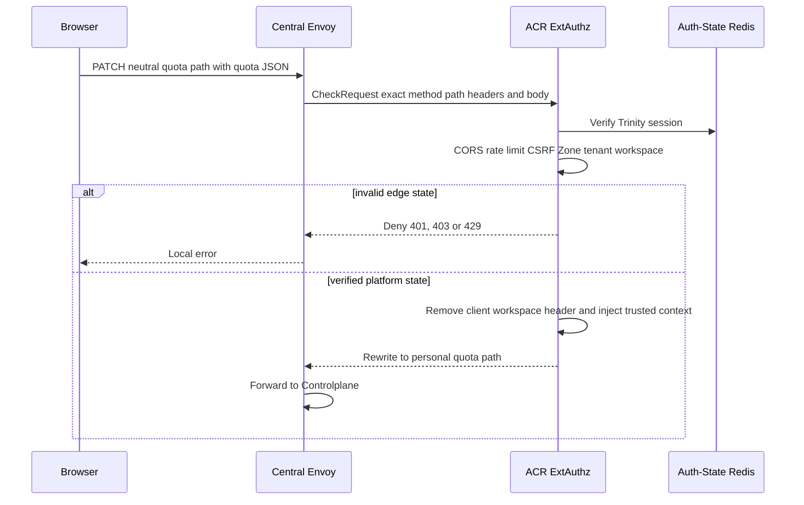
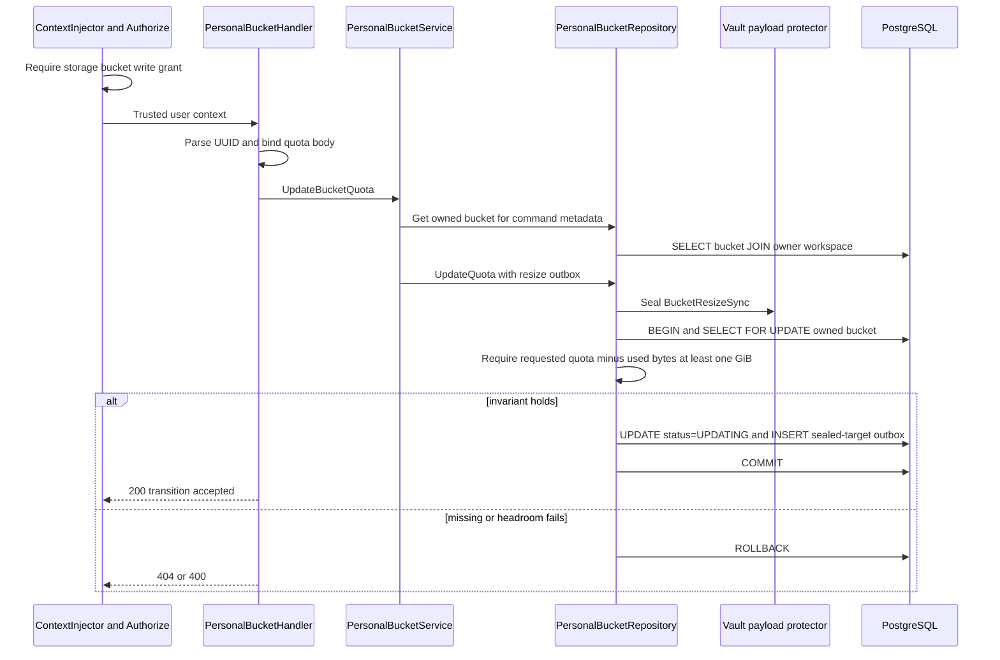
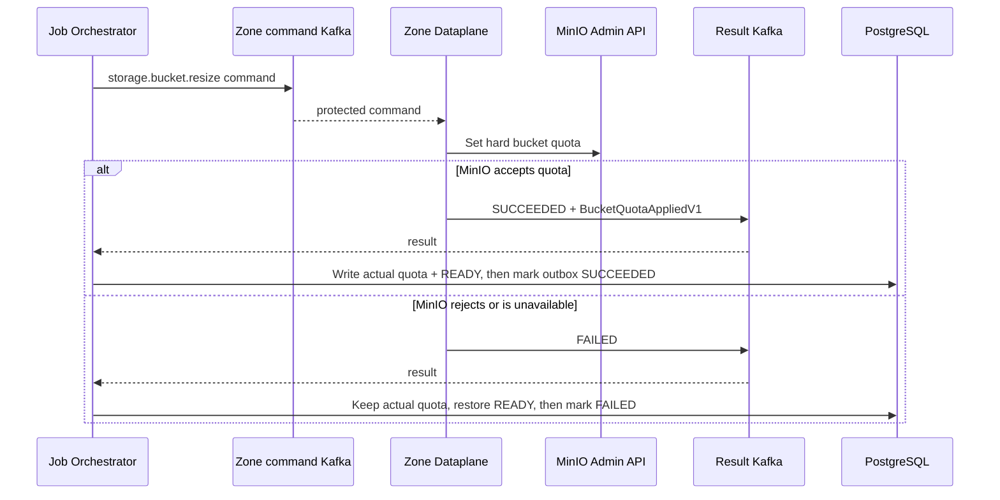
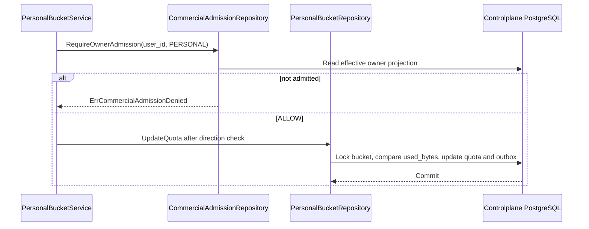

# Personal Bucket Quota Update — God View

> **Critical-route revision (2026-08-26):** ACR consumes the exact session proof for the public `/api/v1/critical/storage/...` mutation and rewrites only to the corresponding `/api/v1/personal/critical/storage/...` target. Controlplane runs `RequireSessionProof` before `Authorize`; older non-critical route text below is superseded.

Quota update is an asynchronous physical mutation. Controlplane keeps the last
confirmed quota unchanged, transitions the bucket `READY -> UPDATING`, and writes
the requested target only inside the sealed Zone command. A `200` means the
operation promise is durable, not that MinIO has applied the hard quota.

## API-scope contract

Browser calls `PATCH /api/v1/storage/buckets/{bucket_id}/quota`. ACR rewrites
only a verified platform session to the personal internal route and injects
trusted user, workspace and Zone headers. Controlplane requires
`{username}:{workspace_id}:storage:bucket:write` or wildcard. Repository locks
the owned bucket row and does not trust Zone in browser input.

## REST input and output

### Request headers used

| Header | Use |
|---|---|
| `Cookie` | ACR derives session, Zone and workspace context. |
| `Origin` | CORS enforcement. |
| `X-Requested-With` or `Sec-Fetch-Site` | Required by ACR CSRF check for `PATCH`. |
| `traceparent` | Copied into outbox trace field when valid. |

### JSON payload

| Field | Contract |
|---|---|
| `quota_bytes` | Required `int64`. Handler only binds it. Repository rejects a value leaving less than `1,073,741,824` bytes above projected `used_bytes`. |

### Response headers

| Result | Headers |
|---|---|
| All responses | `Content-Type: application/json` |

### Response payload

| Status | Payload |
|---|---|
| `200` | `data: null`, message `bucket quota updated` after transition/outbox commit |
| `400` | Invalid UUID/body or quota leaves less than one GiB free |
| `403` | ACR, context or permission failure |
| `404` | Bucket absent or not owned by user |
| `500` | Payload protection, transaction or command-preparation failure |

## Key and transport contract

| Key / transport | Store | Operation | Invariant |
|---|---|---|---|
| Auth-State session and workspace cookie | ACR | Verify then overwrite context headers | Browser cannot set authoritative user, Zone or workspace header. |
| `storage.personal_buckets.capacity_quota_bytes` | PostgreSQL | Read, then JO actual update | Always the latest Zone-confirmed hard quota. |
| `storage.personal_buckets.used_bytes` | PostgreSQL | Read under `FOR UPDATE` | Last size projection is the one-GiB safety input. |
| `storage.storage_outbox_records` | PostgreSQL | Insert `storage.bucket.resize` | Generic transport metadata plus protected `BucketResizeSync`; the requested quota exists only in the sealed payload. |
| Zone command and result topics | Kafka | At-least-once command/result | Job id plus topic guard terminal settlement. |

## Phase 1 — Client → Envoy → ACR

ACR receives exact `PATCH` body in Envoy `CheckRequest`, applies CORS and both
rate limits, validates Trinity session, requires a CSRF signal, resolves Zone,
tenant and workspace cookie. It rejects direct `/personal` selection. On a
platform session it overwrites identity/workspace context and changes only
upstream `:path` to `/api/v1/personal/...`. Body bytes remain unchanged.

## Phase 2 — Controlplane transition transaction

Handler parses bucket UUID and body under a five-second context. Service first
loads owned bucket to construct a `BucketResizeSync` containing old and
requested quota. It prepares outbox metadata from the bucket's durable Zone.
Repository seals payload, starts a transaction, `SELECT ... FOR UPDATE` joins
bucket to owner workspace, enforces headroom, transitions only `status` to
`UPDATING`, and inserts outbox. The actual quota is not overwritten before Zone
success and the generic outbox does not become a resource-state projection.

## Phase 3 — MinIO application and actual-state settlement

JO consumes the durable row through WAL, publishes protected
`storage.bucket.resize` to exact Zone. Dataplane validates payload and
`resource_id`, applies the MinIO hard quota, then returns typed
`BucketQuotaAppliedV1 { bucket_id, actual_quota_bytes }`. JO validates result
schema and identity. Success writes the confirmed quota and `READY` first, then
settles the outbox in the same CTE. Failure leaves the last confirmed quota
unchanged, restores only `UPDATING -> READY`, then marks the outbox failed.

Before publishing either terminal result, Dataplane CAS-creates
`AURORA_ZONE_JOB_COMPLETION/job.completion.{job_id}.{delivery_epoch}` as protobuf
`JobCompletionReceiptV1`. Its exact fields are `schema_version=2`,
`command_sha256`, `attempt`, `message`, `result_payload`,
`result_payload_schema_version`, `result_status` and optional `error_code`.
This KV is replay evidence only; quota authority remains in MinIO and the
settled PostgreSQL projection.

## Failure semantics

| Condition | Behavior |
|---|---|
| Concurrent resize | Repository serializes desired-state writes with bucket row lock. |
| Database update succeeds, process dies | WAL delivery eventually produces the same stable command. |
| Physical resize fails | Confirmed quota was never overwritten; JO restores only lifecycle state to `READY`. |
| Result replay | Only PENDING or PROCESSING outbox state can settle. |
| Cross-workspace bucket UUID | Authorization key uses current workspace, while service/repository ownership lookup uses user id only. A user knowing another personal bucket UUID can mutate its quota if current grant permits the operation. |
| Usage projection is stale | One-GiB check uses last Kafka snapshot, not live S3 measurement. |
| Requested quota non-positive | Handler/repository can accept it if arithmetic passes, but Dataplane rejects it. Result then rolls state back. This validation split is an AS-IS discrepancy. |

## Code map

- `controlplane/internal/storage/transport/http/handler/personal_bucket_handler.go`
- `controlplane/internal/storage/service/personal_bucket_service.go`
- `controlplane/internal/storage/repository/personal_bucket_repo.go`
- `dataplane/src/executor/storage/resize.rs`
- `job-orchestrator/src/results/storage/bucket.rs`

## Commercial admission gate

Quota increase is a billable expansion and requires the local personal owner
projection to be current `ALLOW`. The service checks this before the repository
locks `used_bytes`; missing, expired or suspended admission maps to `503
STORAGE_COMMERCIAL_ADMISSION_UNAVAILABLE`. Quota decrease remains a cleanup and
footprint-reduction action and does not use this gate.

