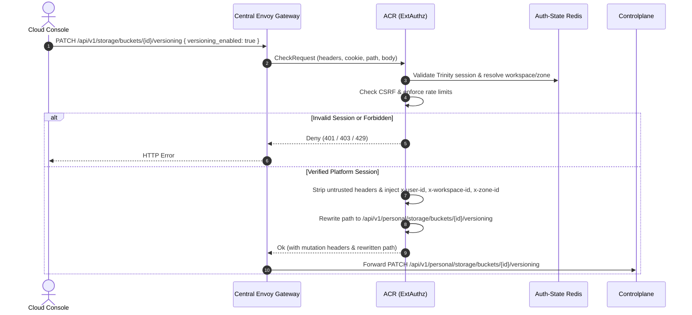
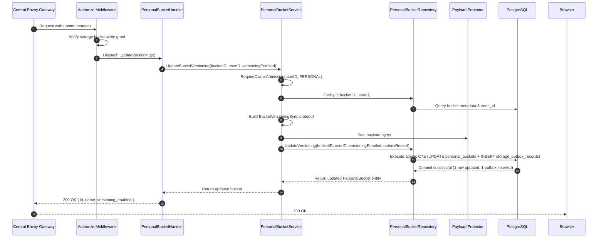
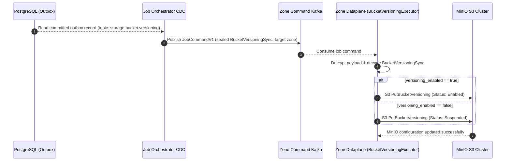
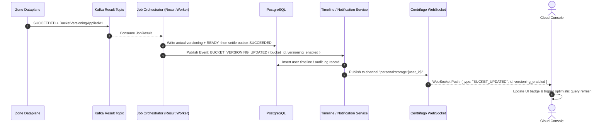

# Personal Bucket Versioning Update — God View

> **Critical-route revision (2026-08-26):** ACR consumes the exact session proof for the public `/api/v1/critical/storage/...` mutation and rewrites only to the corresponding `/api/v1/personal/critical/storage/...` target. Controlplane runs `RequireSessionProof` before `Authorize`; older non-critical route text below is superseded.

Bucket Versioning update is an asynchronous state synchronization workflow.
Controlplane keeps the confirmed `versioning_enabled` value unchanged, transitions
the bucket `READY -> UPDATING`, and writes the target only in a sealed Zone command.
A `200 OK` means that promise is durable; Dataplane applies the physical setting and
JO later promotes the typed actual result.

---

## API-scope contract

Browser calls `PATCH /api/v1/storage/buckets/{bucket_id}/versioning`. ACR validates the
Trinity session, extracts workspace/zone authority, rewrites the path to
`/api/v1/personal/storage/buckets/{bucket_id}/versioning`, and injects trusted identity
headers (`x-user-id`, `x-workspace-id`, `x-zone-id`). Controlplane requires
`storage:bucket:write` permission. Repository updates the owned bucket record and inserts
a `BucketVersioningSync` outbox job.

---

## REST input and output

### Request headers used

| Header | Use |
|---|---|
| `Cookie` | ACR derives Trinity session, Zone, and workspace context. |
| `Origin` | CORS enforcement at Envoy / ACR. |
| `X-Requested-With` or `Sec-Fetch-Site` | Required by ACR CSRF check for `PATCH`. |
| `traceparent` | Injected into outbox record for distributed OpenTelemetry tracing. |

### JSON payload

```json
{
  "versioning_enabled": true
}
```

| Field | Type | Contract |
|---|---|---|
| `versioning_enabled` | `boolean` | **Required**. `true` enables object versioning; `false` suspends versioning. |

### Response payload

| Status | Payload | Reason |
|---|---|---|
| `200` | `data` includes `id`, `name`, `status=UPDATING` and the last confirmed `versioning_enabled` | Transition and sealed target command committed. |
| `400` | `{"status": "error", "code": "BAD_REQUEST", "message": "invalid request body"}` | Invalid JSON or missing `versioning_enabled` boolean. |
| `401` | `{"status": "error", "code": "UNAUTHORIZED", "message": "unauthorized"}` | Missing or invalid Trinity session cookie. |
| `403` | `{"status": "error", "code": "FORBIDDEN", "message": "permission denied"}` | Missing `storage:bucket:write` permission grant. |
| `404` | `{"status": "error", "code": "NOT_FOUND", "message": "bucket not found"}` | Bucket does not exist or is not owned by the user. |
| `503` | `{"status": "error", "code": "STORAGE_WALLET_ADMISSION_UNAVAILABLE", "message": "storage billing admission is not currently available"}` | Billing / admission gate check denied. |
| `500` | `{"status": "error", "code": "INTERNAL_ERROR", "message": "internal_error"}` | Database error, payload sealing failure, or outbox insert error. |

---

## Key and transport contract

| Key / Transport | Store | Operation | Invariant |
|---|---|---|---|
| Auth-State session | Redis (Central) | Read / verify | Edge must never allow client to forge user or workspace context. |
| `storage.personal_buckets.versioning_enabled` | PostgreSQL | Read, then JO actual update | Latest Zone-confirmed versioning state. |
| `storage.storage_outbox_records` | PostgreSQL | Insert | Topic `storage.bucket.versioning`, payload `BucketVersioningSync`. |
| `storage.bucket.versioning` | Kafka (Zone Command) | At-least-once publish | Sealed binary payload dispatched to the bucket's target Zone. |
| `dataplane.job_result` | Kafka (Result) | Publish result | Dataplane returns terminal status (`SUCCEEDED` / `FAILED`). |
| Centrifugo WebSocket | Centrifugo | Publish channel | `personal:storage:{user_id}` receives live bucket state update. |

---

## Phase 1 — Client → Envoy → ACR



### Hop-by-Hop Contract — Phase 1

#### Hop 1.1: Browser → Central Envoy Gateway
- **Input**:
  - Method: `PATCH`
  - URL: `/api/v1/storage/buckets/{bucket_id}/versioning`
  - Headers: `Cookie: trinity_session=...`, `Origin: https://console.aurora.local`, `Content-Type: application/json`, `X-Requested-With: XMLHttpRequest`
  - Body: `{"versioning_enabled": true}`
- **Output**: Forwarded verbatim as gRPC `CheckRequest` to ACR ExtAuthz filter.

#### Hop 1.2: Envoy → ACR (ExtAuthz gRPC CheckRequest)
- **Input**:
  - `envoy.service.auth.v3.CheckRequest` with full HTTP attributes (method, path, headers, client IP, raw body).
- **Processing**:
  1. Validates CORS preflight/origin against allowed console domains.
  2. Enforces IP-based and user-based token bucket rate limits.
  3. Queries Auth-State Redis with `trinity_session` key to extract `user_id`, `workspace_id`, and `zone_id`.
  4. Verifies CSRF protection header (`X-Requested-With` or `Sec-Fetch-Site`).
- **Output**:
  - On failure: gRPC `DeniedHttpResponse` with status `401 Unauthorized`, `403 Forbidden`, or `429 Too Many Requests`.
  - On success: `OkHttpResponse` containing:
    - `headers_to_remove`: `["cookie", "authorization", "x-user-id", "x-workspace-id", "x-zone-id"]`
    - `headers_to_add`: `x-user-id: {uuid}`, `x-workspace-id: {uuid}`, `x-zone-id: {uuid}`, `x-actor-type: personal`
    - `path_mutation`: rewrite `:path` to `/api/v1/personal/storage/buckets/{bucket_id}/versioning`.

#### Hop 1.3: Envoy → Controlplane Upstream
- **Input**:
  - `PATCH /api/v1/personal/storage/buckets/{bucket_id}/versioning` with trusted identity headers injected by ACR and unchanged request body.
- **Output**: HTTP connection to Controlplane Go HTTP router.

---

## Phase 2 — Controlplane Desired-State Transaction



### Hop-by-Hop Contract — Phase 2

#### Hop 2.1: ContextInjector & Authorize Middleware
- **Input**: Request context containing `x-user-id`, `x-workspace-id`, `x-zone-id`.
- **Processing**: Evaluates L1 Permission Registry for action `storage:bucket:write`.
- **Output**: Enriched `context.Context` containing validated `userID`, `workspaceID`, and `zoneID`.

#### Hop 2.2: PersonalBucketHandler → PersonalBucketService
- **Input**:
  - `bucketID`: UUID parsed from URL path `:id`.
  - `userID`: UUID from trusted request context.
  - `versioningEnabled`: Boolean bound from JSON body `UpdateBucketVersioningRequest`.
- **Processing**:
  1. Checks Commercial Admission Gate (`RequireOwnerAdmission`) for owner status `ALLOW`.
  2. Queries current bucket details (`GetByID`) to retrieve durable `name` and `zone_id`.
  3. Constructs Protobuf message `BucketVersioningSync`:
     ```protobuf
     BucketVersioningSync {
       bucket_id: "3fa85f64-5717-4562-b3fc-2c963f66afa6",
       name: "ws-personal-user1-bucket",
       versioning_enabled: true
     }
     ```
  4. Marshals protobuf and seals bytes via Vault Payload Protector (topic: `storage.bucket.versioning`).
  5. Prepares `StorageOutboxRecord` with `job_topic: "storage.bucket.versioning"`, `zone_id`, `event_id` (UUIDv7).
- **Output**: Call to `repo.UpdateVersioning(ctx, bucketID, userID, versioningEnabled, outboxRecord)`.

#### Hop 2.3: PersonalBucketRepository → PostgreSQL Atomic CTE
- **Input SQL Query**:
  ```sql
  WITH target_bucket AS (
      SELECT b.id, b.name, b.zone_id
      FROM storage.personal_buckets b
      JOIN hierarchy.personal_workspaces w ON b.workspace_id = w.id
      WHERE b.id = $1 AND w.user_id = $2
      FOR UPDATE OF b
  ),
  updated_bucket AS (
      UPDATE storage.personal_buckets
      SET status = 'UPDATING',
          updated_at = NOW()
      WHERE id IN (SELECT id FROM target_bucket)
      RETURNING id, name, workspace_id, zone_id, capacity_quota_bytes, used_bytes, versioning_enabled, lifecycle_rules, created_at, updated_at
  ),
  inserted_outbox AS (
      INSERT INTO storage.storage_outbox_records (
          event_id, zone_id, job_topic, payload, owner_id, owner_type, actor_user_id, status, job_version, resource_id, resource_name, payload_schema_version, trace_id, idle
      )
      SELECT $4, tb.zone_id, $5, $6, $7, $8, $9, $10, 1, tb.id::text, tb.name, 1, $11, 30
      FROM target_bucket tb
  )
  SELECT id, name, workspace_id, zone_id, capacity_quota_bytes, used_bytes, versioning_enabled, lifecycle_rules, created_at, updated_at
  FROM updated_bucket;
  ```
- **Output**: Atomic `READY -> UPDATING` and pending outbox. The returned entity still contains the last confirmed versioning value.

#### Hop 2.4: Controlplane → Browser
- **Input**: Updated `PersonalBucket` entity.
- **Output**: HTTP `200 OK` JSON:
  ```json
  {
    "status": "success",
    "data": {
      "id": "3fa85f64-5717-4562-b3fc-2c963f66afa6",
      "name": "ws-personal-user1-bucket",
      "versioning_enabled": true
    },
    "message": "bucket versioning updated"
  }
  ```

---

## Phase 3 — Outbox CDC Dispatch & Dataplane Execution



### Hop-by-Hop Contract — Phase 3

#### Hop 3.1: PostgreSQL WAL → Job Orchestrator CDC Engine
- **Input**: Database CDC changefeed record from `storage.storage_outbox_records` where `status = 'PENDING'` and `job_topic = 'storage.bucket.versioning'`.
- **Output**: Internal `JobCommandV1` containing `event_id`, `zone_id`, `payload` (ciphertext), and trace headers.

#### Hop 3.2: Job Orchestrator → Zone Command Kafka Topic
- **Input**: `JobCommandV1` partitioned by `zone_id`.
- **Topic**: `aurora.zone.{zone_id}.storage.bucket.versioning`
- **Output**: Message committed to Kafka broker partition.

#### Hop 3.3: Kafka → Zone Dataplane (`BucketVersioningExecutor`)
- **Input**: Consumed Kafka record delivered to Dataplane runtime.
- **Processing**:
  1. Validates payload envelope and decrypts payload using Zone key.
  2. Decodes `storage_proto::BucketVersioningSync`.
  3. Initializes AWS SDK S3 client configured with local MinIO cluster endpoint.
  4. Builds `aws_sdk_s3::types::VersioningConfiguration`:
     - If `versioning_enabled == true`: `BucketVersioningStatus::Enabled`
     - If `versioning_enabled == false`: `BucketVersioningStatus::Suspended`
  5. Executes S3 SDK `PutBucketVersioning`:
     ```rust
     s3_client.put_bucket_versioning()
         .bucket(&sync_data.name)
         .versioning_configuration(config)
         .send().await
     ```
  6. Falls back to `mc version enable/suspend` CLI if S3 API endpoint encounters transient protocol error.
- **Output**: MinIO S3 cluster updates physical bucket versioning state.

---

## Phase 4 — Job Settlement, Timeline & Realtime Notification



### Hop-by-Hop Contract — Phase 4

#### Hop 4.1: Zone Dataplane → Kafka Result Topic
- **Input**:
  - Protobuf `JobResult`:
    ```protobuf
    JobResult {
      job_id: "01916fe8-444a-714d-91b5-555e5fbdd98b",
      topic: "storage.bucket.versioning",
      status: JOB_STATUS_SUCCEEDED,
      result_payload: BucketVersioningAppliedV1,
      error_message: ""
    }
    ```
- **Topic**: `aurora.central.job_results`
- **Output**: Result message persisted in Kafka.

#### Hop 4.2: Kafka Result → Job Orchestrator Result Worker
- **Input**: `JobResult` consumed by Central Job Orchestrator.
- **SQL Execution**:
  ```sql
  WITH updated_bucket AS (
    UPDATE storage.personal_buckets
    SET versioning_enabled = $actual, status = 'READY', updated_at = NOW()
    WHERE id = $bucket_id AND status = 'UPDATING' RETURNING id
  )
  UPDATE storage.storage_outbox_records
  SET status = 'SUCCEEDED', completed_at = NOW(), updated_at = NOW()
  WHERE event_id = $event_id AND EXISTS (SELECT 1 FROM updated_bucket);
  ```
- **Output**: Outbox record transition to terminal state `SUCCEEDED`.

#### Hop 4.3: Job Orchestrator → Timeline / Notification Service
- **Input**: Internal Domain Event `STORAGE_BUCKET_VERSIONING_UPDATED`:
  - `user_id`: UUID
  - `bucket_id`: UUID
  - `bucket_name`: string
  - `versioning_enabled`: boolean
- **Processing**: Inserts record into `user_timeline_records` table:
  - Event: `"storage.bucket.versioning.updated"`
  - Description: `"Bucket {name} versioning was {enabled|suspended}."`
- **Output**: Timeline database record created.

#### Hop 4.4: Timeline Service → Centrifugo WebSocket Engine
- **Input**: HTTP POST to Centrifugo Server API:
  - Endpoint: `http://centrifugo:8000/api/publish`
  - Body:
    ```json
    {
      "channel": "personal:storage:3fa85f64-5717-4562-b3fc-2c963f66afa6",
      "data": {
        "type": "BUCKET_VERSIONING_UPDATED",
        "bucket_id": "3fa85f64-5717-4562-b3fc-2c963f66afa6",
        "versioning_enabled": true,
        "timestamp": "2026-08-20T13:45:00Z"
      }
    }
    ```
- **Output**: Centrifugo broadcasts frame over active WebSocket connection.

#### Hop 4.5: Centrifugo → Browser (Cloud Console UI)
- **Input**: WebSocket frame delivered to user's browser session.
- **Processing**:
  - React hook `useBucketRealtimeSync` / TanStack Query client intercepts event.
  - Updates cached bucket state in TanStack Query store: `versioning_enabled = true`.
  - Re-renders `OverviewTab` badge and `LifecycleTab` status banner without requiring full page reload.
- **Output**: Live UI state updated for the user.

---

## Failure and security rules

| Condition | Failure Semantics | Recovery / Settlement |
|---|---|---|
| Client sends invalid boolean | HTTP `400 Bad Request` | Request terminated before DB interaction. |
| User does not own bucket | HTTP `404 Not Found` | No DB mutation or outbox insert occurs. |
| DB transaction fails | HTTP `500 Internal Error` | Transaction rolled back; outbox record is never published. |
| MinIO API temporarily unreachable | Dataplane retries with exponential backoff | Terminal failure carries no success payload; JO keeps the confirmed value, restores `READY`, then marks outbox `FAILED`. |
| Duplicate Kafka message delivery | Idempotent S3 `PutBucketVersioning` execution | MinIO accepts identical versioning status without side-effects. |

---

## Code map

- **God View SoT**: `god_view/storage/personal_bucket_versioning_update_god_view_workflow.md`
- **Protobuf Contract**: `proto/dataplane/storage_job.proto` (`BucketVersioningSync`)
- **Controlplane Route**: `controlplane/internal/storage/route.go`
- **Controlplane Handler**: `controlplane/internal/storage/transport/http/handler/personal_bucket_handler.go` (`UpdateVersioning`)
- **Controlplane Service**: `controlplane/internal/storage/service/personal_bucket_service.go` (`UpdateBucketVersioning`)
- **Controlplane Repository**: `controlplane/internal/storage/repository/personal_bucket_repo.go` (`UpdateVersioning`)
- **Dataplane Executor**: `dataplane/src/executor/storage/versioning.rs` (`BucketVersioningExecutor`)
- **Dataplane Router**: `dataplane/src/executor/storage/delivery.rs` (`"bucket.versioning"`)
- **Cloud Console UI**: `cloud-console/src/app/(console)/storage/[id]/components/OverviewTab.tsx` & `LifecycleTab.tsx`
