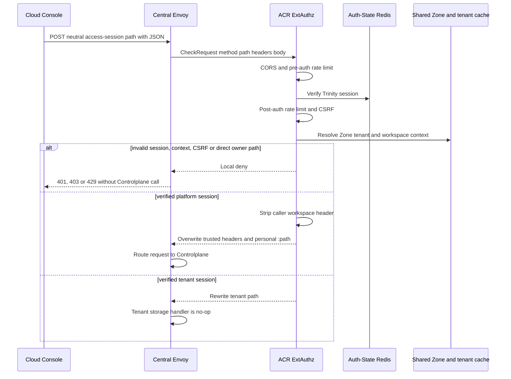
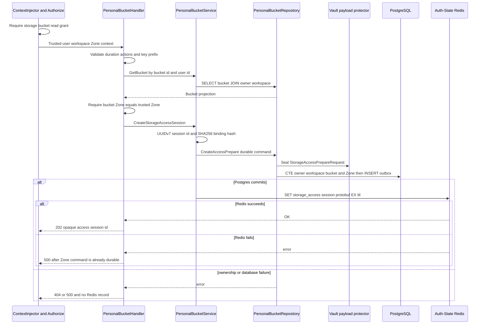
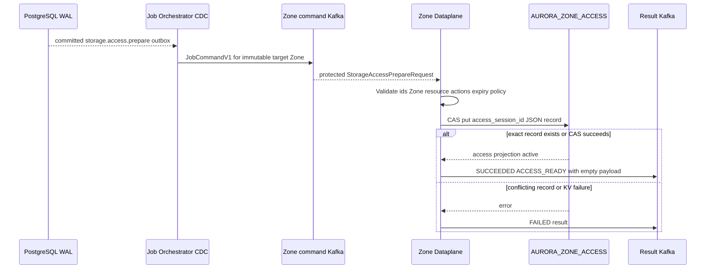
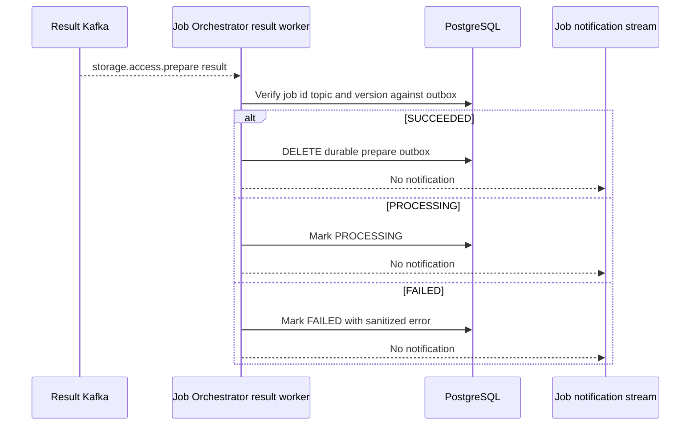
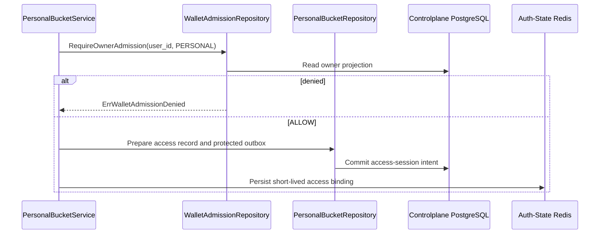

# Personal Storage Access-Session Prepare — God View

Access session prepares a short-lived, metadata-only authorization projection for
the Zone Control Edge Gateway. It does not issue an S3 access key, secret key,
STS token, presigned URL, or success notification. A `202` confirms Central
PostgreSQL command plus Auth-State Redis record were written. Zone readiness is
eventual and the browser retry loop handles the projection race.

## API-scope contract

Browser calls `POST /api/v1/storage/buckets/{bucket_id}/access-sessions`.
ACR chooses personal only from verified `platform` tenant session and rewrites
to `/api/v1/personal/storage/buckets/{bucket_id}/access-sessions`. The request
requires five-level `storage:bucket:read` permission. Handler and repository
also prove that bucket belongs to user, selected workspace and selected Zone.

The follow-up Zone Control APIs remain user-session requests. Possession of
`access_session_id` alone authorizes nothing. ACR reloads this record and binds
its `actor_id` to Trinity claims on every follow-up operation.

## REST input and output

### Request headers used

| Header | Use |
|---|---|
| `Cookie` | ACR verifies Trinity session and derives platform tenant, Zone and workspace. |
| `Origin` | ACR CORS allow-list. |
| `X-Requested-With` or `Sec-Fetch-Site` | Required CSRF signal for this `POST`. |
| `X-Client-Device-ID` cookie | Rate-limit dimension. It is not included in access record. |
| `traceparent` | Captured in durable outbox tracing metadata. |

### Path and JSON payload

| Field | Contract |
|---|---|
| `bucket_id` path | UUID. Handler returns `400` if malformed. |
| `duration_seconds` | Required integer in inclusive range `60..3600`. |
| `actions` | Optional. Empty defaults to `ListBucket`, `GetObject`, `PutObject`, `DeleteObject`, `GetObjectTagging`, `PutObjectTagging`. Unknown values are `400`. |
| `key_prefix` | Trimmed, at most 256 bytes and cannot contain CR/LF. It scopes object paths and list prefix. |
| Duplicate actions | Handler notices duplicates but accidentally retains the original slice. Zone executor accepts repeated allowed actions up to 16. This is a harmless-but-inconsistent validation gap. |

### Response headers

| Result | Headers |
|---|---|
| All JSON responses | `Content-Type: application/json` |

### Response payload

| Status | `data` fields | Meaning |
|---|---|---|
| `202` | `access_session_id`, `zone_id`, `bucket_id`, `expires_at`, `gateway_path=/zone-control/v1/storage/` | Central record and Zone prepare command are durable. Gateway may still return `503` until Zone KV receives it. |
| `400` | `error`, `message` | Invalid UUID/body/duration/action/prefix. |
| `403` | `error`, `message` | ACR, context or five-level permission denial. |
| `404` | `error`, `message` | Bucket absent, not owned, or belongs to another Zone. |
| `500` | `error=internal_error`, `message` | Outbox protection, PostgreSQL or Auth-State Redis write failure. |

## Key and transport contract

| Key / transport | Store | Value and operation | Owner / invariant |
|---|---|---|---|
| `iam:user_session:{zone}:{tenant}:{user}:{access_key}` | Auth-State Redis | ACR session read | User claims must bind the later Zone Control request. |
| `storage_access:{access_session_id}` | Auth-State Redis | Version 1 protobuf `StorageAccessRecord`, `SET EX ttl` after Postgres commit | ACR capability source. Missing/corrupt/expired record denies later requests. |
| `storage.storage_outbox_records` | PostgreSQL | Protected `storage.access.prepare` command. `event_id=access_session_id` | First durable command fence. It has no business aggregate. |
| `aurora.jobs.commands.zone.{zone_id}.v1` | Kafka | Protected `StorageAccessPrepareRequest` | Immutable Zone/resource command route. |
| `AURORA_ZONE_ACCESS/{access_session_id}` | Zone NATS JetStream KV | JSON record inserted by CAS | Zone projection. Exact replay is accepted, conflicting same id is rejected. |
| Authorizer Moka L1 | Zone authorizer process | Watch-hydrated `AccessRecord` cache | Direct KV reads are not inserted, avoiding stale overwrite race. |
| `aurora.jobs.results.v1` | Kafka | `ACCESS_READY` result without payload | JO deletes prepare outbox on success and never sends customer notification. |

## Phase 1 — Client → Envoy → ACR

Envoy sends full `CheckRequest` including bounded JSON body to ACR. ACR checks
Origin, route-group pre-auth limit, Trinity session, post-auth limit and CSRF.
It resolves tenant and Zone from verified session/cookie state, rejects direct
owner path and deletes any browser `x-workspace-id` header. For platform it
injects `x-user-id`, `x-user-name`, `x-user-level`, `x-tenant-id=platform`,
`x-zone-id`, `x-client-device-id`, cookie-derived `x-workspace-id` and a
rewritten internal `:path`. It does not create or sign the access record.

## Phase 2 — Controlplane durable command and Central projection

`ContextInjector` and `Authorize(storage:bucket:read)` execute first. Handler
validates client capability request, creates UUIDv7 session id, looks up owned
bucket, requires `bucket.ZoneID == trusted_zone_id`, then gives physical bucket
name only to service. Service calculates a random SHA-256 binding hash from
session, actor and fresh UUID. It serializes equal V1 records for Central Redis
and Zone command.

Repository HPKE-seals command then performs CTE ownership/Zone recheck and
inserts outbox. Only after that transaction succeeds, service writes Central
Auth-State Redis record with TTL until expiry. That ordering prevents an
ACR-authorizable record without durable ownership command, but creates one
failure gap described below.

## Phase 3 — JO dispatch and Zone access projection

JO reads committed outbox change from logical replication and builds a
`JobCommandV1` with source `STORAGE`, topic `storage.access.prepare`, target
Zone and same resource id. Dataplane opens protected payload and checks UUID
syntax, job Zone/resource fences, bucket/prefix/binding/action/expiry/policy
limits. It performs `access_put`. Exact existing record is idempotent, a same
session id with unequal content fails, and CAS retries at most five times.

## Phase 4 — Result settlement and readiness behavior

Access preparation has no aggregate state to update. JO consumes result only
after verifying it against existing command fence. Success deletes prepare
outbox row. Processing updates state. Failure marks it FAILED. Neither branch
publishes user notification. Browser receives only initial `202` and retries
the actual gateway request after its `403` or `503` response.

## Failure, retry and security invariants

| Condition | Actual behavior |
|---|---|
| Central Redis write fails after Postgres commit | HTTP returns `500`, but JO can still create a Zone record. It remains unusable because ACR has no Central record. No automated cleanup or replay-to-Redis path exists in this workflow. |
| Zone record not ready | Zone Control authorizer maps missing record to `503`. Cloud Console retries with exponential delay. |
| ACR record expires first | ACR denies even if Zone KV still retains record until broader KV retention. |
| Zone record expires first or KV unavailable | Zone authorizer denies or returns `503` even if Central Redis record exists. |
| Session id replay | Zone CAS accepts only byte-equivalent record. ACR signs a unique 10 second assertion for each later request. |
| Client steals opaque id | ACR binds record actor and Zone to fresh verified Trinity claims, so id alone does not pass. |
| Duplicate requested actions | Handler observes but does not remove duplicates. It does not widen action set, but violates implied de-duplication behavior. |
| No STS fallback | There is intentionally no secret-bearing access-session result, no STS topic and no customer notification payload. |

## Code map

- `controlplane/internal/storage/transport/http/handler/personal_bucket_handler.go`
- `controlplane/internal/storage/service/personal_bucket_service.go`
- `controlplane/internal/storage/repository/personal_bucket_repo.go`
- `dataplane/src/executor/storage/access.rs`
- `dataplane/src/infra/zone_kv.rs`
- `job-orchestrator/src/results/storage/access.rs`

## Wallet admission gate

Preparing an access session enables billable object operations. The personal
bucket service therefore requires the local owner projection to be effective,
unexpired and `ALLOW` before writing the access record or prepare outbox.
Missing/stale/suspended admission returns `503
STORAGE_WALLET_ADMISSION_UNAVAILABLE`; the service never calls Billing inline.

