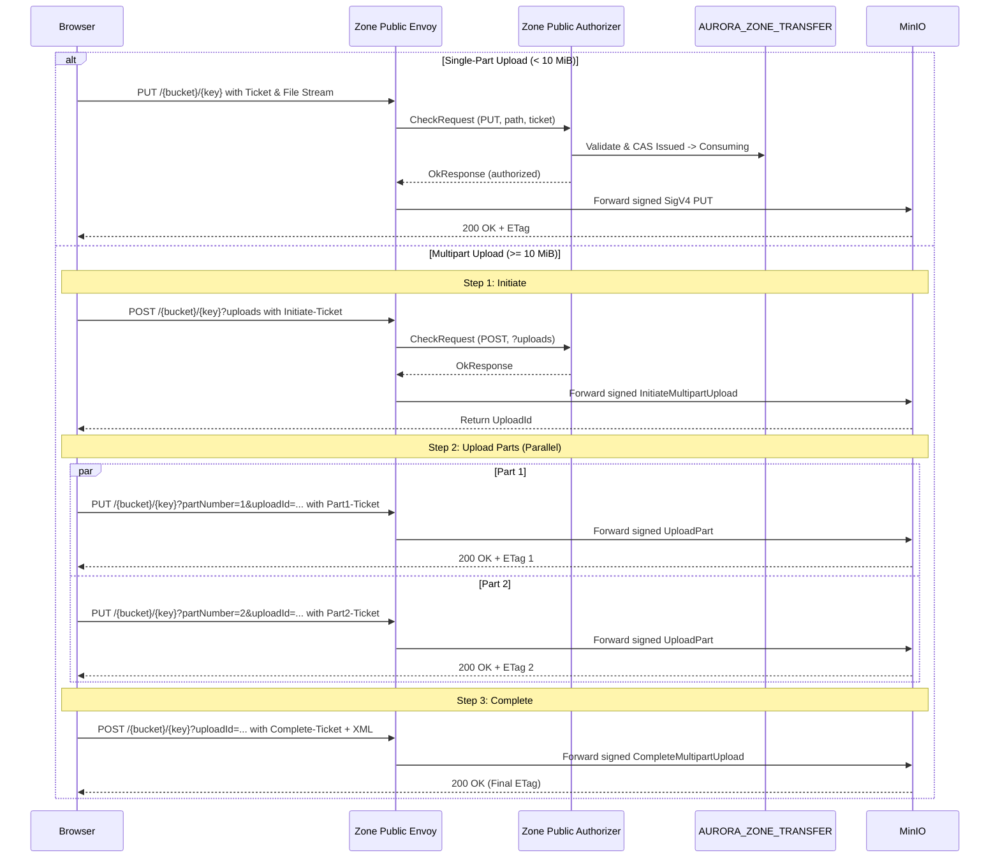
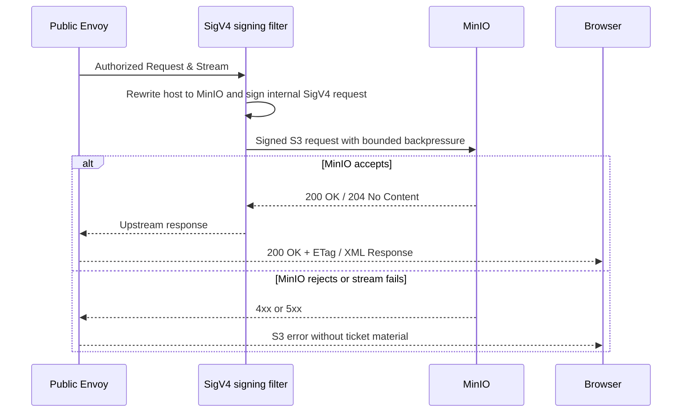

# Personal Storage Browser Upload — God View

This workflow transfers browser-selected objects through the Zone Public Edge
after personal storage transfer tickets have been issued. The browser never
receives storage credentials, STS tokens, or presigned URLs, and never calls MinIO directly.
Ticket issuance is a separate API boundary; this document specifies the upload data path
including automatic branching between Single-Part and Multipart Chunked Upload.

## API-scope contract

Browser uploads branch into two execution modes based on file size:
1. **Single-Part PUT Upload (File size < 10 MiB)**: Uses a single one-time PUT transfer ticket.
2. **S3 Multipart Chunked Upload (File size >= 10 MiB / 10,485,760 bytes)**: Divides the file into discrete chunks (default 10 MiB, minimum 5 MiB) and executes a four-phase Zero-Trust S3 Multipart flow (`multipart_initiate` → parallel `multipart_upload_part` → `multipart_complete` / `multipart_abort`).

No `/personal`, `/tenant` or `/me` owner rewrite happens on this data path.
Authority is solely the one-time transfer ticket(s) validated against Zone KV and Admission.

---

## 1. Single-Part Upload (< 10 MiB)

### Request headers

| Header | Use |
|---|---|
| `Origin` | Public Edge CORS allow-list. |
| `X-Aurora-Transfer-Ticket` | Opaque ticket id and secret (`ticket_id.secret`). The only browser authority. |
| `Content-Type` | Same value bound into the ticket grant. |
| `Content-Length` | Browser-provided Blob length (checked against ticket grant). |
| `traceparent` | Distributed tracing correlation only. |

### Request body & Response
- Body: In-memory file stream.
- Public Path: `/{bucket}/{object_key}` (HTTP `PUT`).
- MinIO Response: `200 OK` with optional `ETag`.

---

## 2. S3 Multipart Chunked Upload (>= 10 MiB)

When `file.size >= 10 MiB`, Cloud Console automatically executes the multipart workflow:

### A. Initiate Phase (`multipart_initiate`)
- **Ticket Request**: `POST /zone-control/v1/transfer-tickets` with `operation: "multipart_initiate"`.
- **Public Edge Request**: `POST /{bucket}/{object_key}?uploads` with `X-Aurora-Transfer-Ticket`.
- **MinIO Response**: `200 OK` XML `<InitiateMultipartUploadResult><UploadId>...</UploadId></InitiateMultipartUploadResult>`.

### B. Upload Parts Phase (`multipart_upload_part` in Parallel)
- The file is sliced into chunks of 10 MiB (scaled if parts > 9,900 to ensure total parts <= 10,000).
- Chunks are uploaded concurrently (default 3 workers) with independent tickets:
  - **Ticket Request**: `POST /zone-control/v1/transfer-tickets` with `operation: "multipart_upload_part"`, `upload_id`, `part_number` (1..10,000), `content_length`.
  - **Public Edge Request**: `PUT /{bucket}/{object_key}?partNumber={N}&uploadId={UploadId}` with `X-Aurora-Transfer-Ticket` and chunk binary body.
  - **MinIO Response**: `200 OK` with header `ETag: "..."`.
  - **Fault Tolerance**: If a single chunk network transfer fails, it is retried up to 3 times with exponential backoff before failing the job. Other chunks continue independently.

### C. Complete Phase (`multipart_complete`)
- Once all part ETags are collected and sorted by `PartNumber`:
  - **Ticket Request**: `POST /zone-control/v1/transfer-tickets` with `operation: "multipart_complete"`, `upload_id`.
  - **Public Edge Request**: `POST /{bucket}/{object_key}?uploadId={UploadId}` with `X-Aurora-Transfer-Ticket` and XML payload:
    ```xml
    <CompleteMultipartUpload>
      <Part><PartNumber>1</PartNumber><ETag>"etag1"</ETag></Part>
      <Part><PartNumber>2</PartNumber><ETag>"etag2"</ETag></Part>
    </CompleteMultipartUpload>
    ```
  - **MinIO Response**: `200 OK` XML with final Object ETag and Location.

### D. Abort Phase (`multipart_abort`)
- Triggered if the user cancels or an unrecoverable failure occurs:
  - **Ticket Request**: `POST /zone-control/v1/transfer-tickets` with `operation: "multipart_abort"`, `upload_id`.
  - **Public Edge Request**: `DELETE /{bucket}/{object_key}?uploadId={UploadId}` with `X-Aurora-Transfer-Ticket`.
  - **MinIO Response**: `204 No Content` (frees incomplete part storage on MinIO cluster).

---

## Key and State Contract

| Key | Read / Write | Invariant |
|---|---|---|
| `AURORA_ZONE_ACCESS/{access_session_id}` | Zone Control | Checked before issuing any ticket. Required action: `PutObject`. |
| `AURORA_ZONE_ADMISSION/{resource_id}` | Zone Control & Public Edge | Public Authorizer checks `decision == "ALLOW"`. Suspended/depleted wallet halts upload immediately. |
| `AURORA_ZONE_TRANSFER/{ticket_id}` | Public authorizer | CAS state transition (`Issued` → `Consuming`). Each part uses an isolated one-time ticket. |
| `TransferTicketV1.public_path` | Public authorizer | Exact match against Envoy `:path` (including query strings like `?uploads`, `?partNumber=X&uploadId=Y`, `?uploadId=Y`). |
| `TransferTicketV1.method` | Public authorizer | Must equal request method (`PUT`, `POST`, or `DELETE`). |

---

## Phase 1 — Browser → Zone Public Envoy → Public Authorizer

The browser sends the ticket header and body to the Zone Public Edge hostname.
Envoy forwards the `CheckRequest` to `PublicAuthorizer` (without buffering the stream payload, keeping gateway RAM bounded).



---

## Phase 2 — MinIO Streaming & Signing

Public Envoy applies bounded connection buffers and stream idle timeouts.
The upstream signing filter applies internal AWS SigV4 credentials. The browser ticket
is removed before the upstream hop.



---

## Failure and Recovery

| Failure Mode | Detection Boundary | Recovery Action |
|---|---|---|
| Single-part transfer failure | Browser / Public Edge | Request a fresh ticket and retry. |
| Single multipart chunk failure | Browser | Retry only the failed `part_number` with a fresh part ticket (up to 3 retries). |
| User cancels upload in modal | Cloud Console | Trigger `multipart_abort` to delete incomplete chunks on MinIO. |
| Ticket expired or consumed | Public authorizer | Request a new ticket; replayed tickets are strictly rejected. |
| Wallet suspended mid-transfer | Public Edge Authorizer | Public Edge rejects next part request with `403 Commercial Admission Suspended`. |
| Zone KV unavailable | Public authorizer | Fail closed. |

---

## Code Map

- `cloud-console/src/features/storage/objects/api.ts`
- `cloud-console/src/app/(console)/storage/[id]/components/UploadModal.tsx`
- `cloud-console/src/app/(console)/storage/[id]/components/ObjectsTab.tsx`
- `zone-public-edge-gateway/envoy.yaml`
- `zone-public-edge-gateway/authorizer/src/main.rs`
- `zone-control-edge-gateway/authorizer/src/transfer_ticket.rs`
- `zone-control/src/transfer_ticket/app.rs`
- `acr/src/storage/control_assertion.rs`
- `proto/zone/transfer_ticket.proto`
