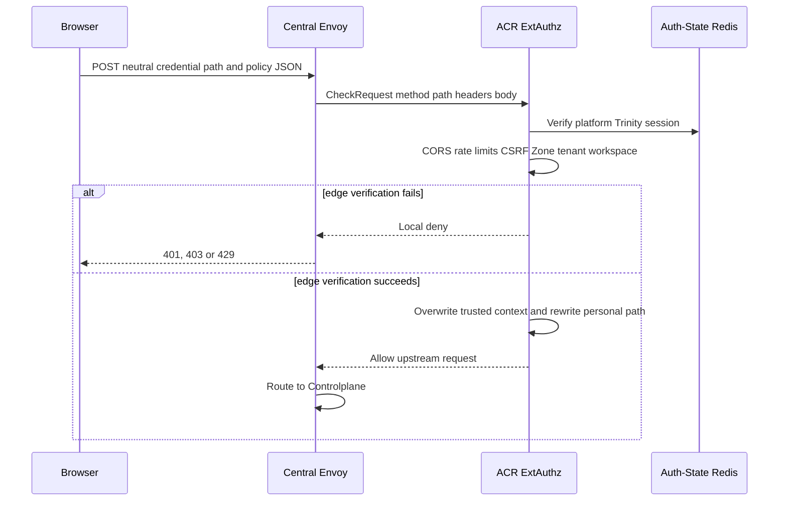
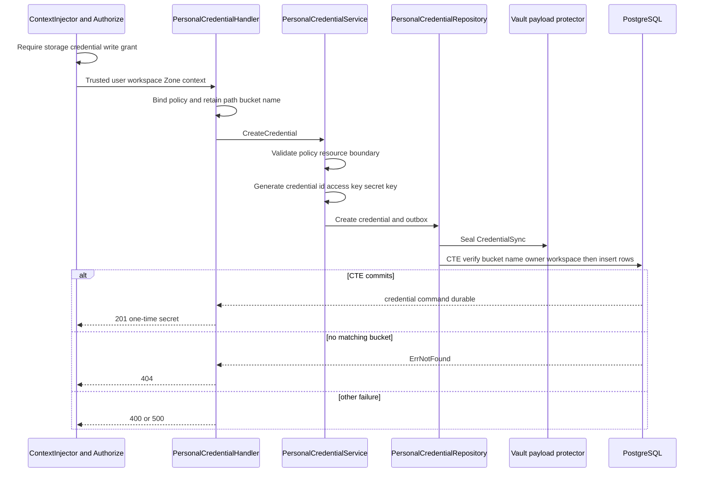
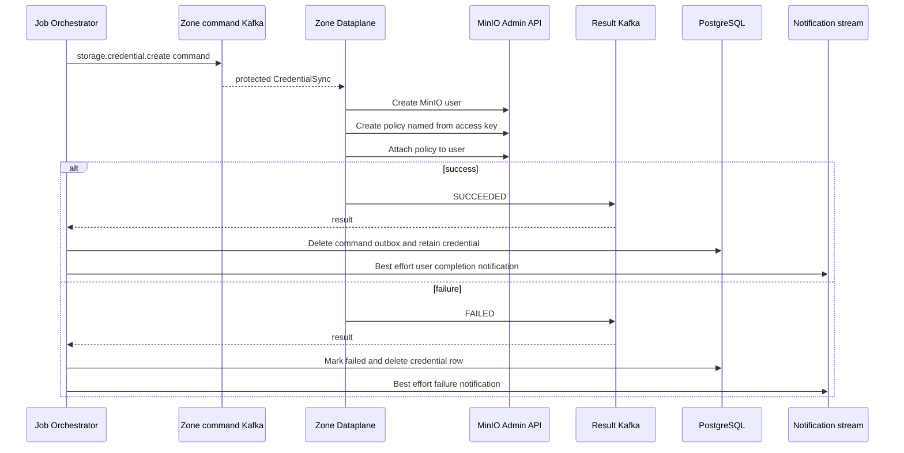

# Personal Storage Credential Create — God View

This workflow creates an additional legacy MinIO access key. It is distinct from
metadata-only access sessions: it returns a plaintext `secret_key` to browser
and sends it inside an encrypted asynchronous provisioning command. The
one-time secret exposure and path identifier inconsistency are AS-IS contracts,
not design recommendations.

## API-scope contract

Browser calls `POST /api/v1/storage/buckets/{physical_bucket_name}/credentials`.
The neutral route is rewritten by ACR to the personal branch only for platform
session. `Authorize` requires
`{username}:{workspace_id}:storage:credential:write` or wildcard. Handler calls
the path parameter `id` but interprets it as a physical bucket **name**, unlike
credential list/delete, which interpret the same path segment as bucket UUID.

Repository proves `personal_buckets.name`, selected workspace and user owner in
the same CTE that inserts credential/outbox. It does not use client policy as
permission authority, but policy validation has limitations below.

## REST input and output

### Request headers used

| Header | Use |
|---|---|
| `Cookie` | ACR session, platform tenant, Zone and workspace selection. |
| `Origin` | CORS. |
| `X-Requested-With` or `Sec-Fetch-Site` | CSRF for `POST`. |
| `traceparent` | Outbox trace metadata. |

### Path and JSON payload

| Field | Contract |
|---|---|
| `physical_bucket_name` path | Required non-empty physical name such as `ws-{workspace-prefix}-{name}`. It is not parsed as UUID. |
| `policy` | Required JSON string. Service parses its `Statement` values and rejects an `Allow` resource that is neither bucket ARN nor prefix below this path bucket name. |

### Response headers

| Result | Headers |
|---|---|
| All JSON responses | `Content-Type: application/json` |

### Response payload

| Status | `data` fields |
|---|---|
| `201` | `id`, `access_key`, `secret_key`, `policy`, `created_at`, `updated_at` |
| `400` | Invalid body or policy violates bucket boundary |
| `403` | ACR, context or `storage:credential:write` denial |
| `404` | No bucket with path name in selected owned workspace |
| `500` | Key generation, payload protection or persistence error |

## Key and transport contract

| Key / transport | Store | Operation | Invariant |
|---|---|---|---|
| Trinity session and workspace cookie | Auth-State Redis / ACR | Verify and inject context | Browser cannot choose owner route or trusted workspace header. |
| `storage.personal_credentials` | PostgreSQL | Insert access key and policy | Secret key is not stored in this table. |
| `storage.storage_outbox_records` | PostgreSQL | Insert `storage.credential.create` | Protected `CredentialSync` contains plaintext secret only inside ciphertext. |
| Zone command/results topics | Kafka | At-least-once provisioning and terminal result | Result decides whether Central credential survives. |

## Phase 1 — Client → Envoy → ACR

ACR receives exact method/path/body in `CheckRequest`. The neutral path is in
the ACR `General` rate group, so it checks CORS, general pre/post-auth limits,
Trinity session, CSRF and verified
Zone/tenant/workspace. Direct owner paths are denied. For a platform session it
removes caller workspace header, overwrites trusted identity headers and rewrites
the path. Physical bucket name remains a normal path segment and is not looked
up at ACR.

## Phase 2 — Controlplane credential command transaction

The handler gets user/workspace/Zone from injected context and passes physical
bucket name plus requested policy to service. Service validates Allow resources,
generates UUIDv4 credential id, random access key and random secret. It creates
`CredentialSync` and protected `storage.credential.create` outbox command.
Repository seals payload before a CTE which verifies bucket name plus owner and
workspace, inserts credential, then inserts outbox atomically.

## Phase 3 — Zone user/policy provisioning and settlement

Dataplane decodes `CredentialSync` and requires non-empty access key, secret key
and policy. It creates MinIO user, writes `policy-{access_key}`, then attaches
that policy. It emits terminal result. JO deletes command outbox on success and
retains Central credential. On failure it marks outbox failed and deletes the
new personal credential row. It may then enqueue a customer notification.

## Security and failure rules

| Condition | Actual behavior |
|---|---|
| HTTP `201` before MinIO completes | Caller has a secret that can become unusable if Zone provisioning later fails. Completion state is asynchronous. |
| Policy contains only `Deny` or no `Statement` | Current validator can accept it because it only constrains `Allow` resources. This may create a useless credential, not broader access. |
| MinIO user created, later policy operation fails | Executor returns error without compensating user/policy cleanup. Central row is removed by JO, leaving possible Zone residue. |
| Duplicate command | Executor create-user path has no explicit already-exists success mapping. |
| Path parameter confusion | Calling create with bucket UUID will almost always be `404`; calling list/delete with physical name is `400`. This is an API contract inconsistency. |
| Workspace Zone differs from current ACR Zone | Repository CTE checks bucket name, workspace and user but not bucket/workspace Zone against outbox Zone. The credential command may reach a Zone different from the physical bucket. |
| Secret | Never persisted in Central credential row, but it exists in response and encrypted job payload. It must not enter logs or notification body. |

## Code map

- `controlplane/internal/storage/transport/http/handler/personal_credential_handler.go`
- `controlplane/internal/storage/service/personal_credential_service.go`
- `controlplane/internal/storage/repository/personal_credential_repo.go`
- `dataplane/src/executor/storage/credential.rs`
- `job-orchestrator/src/results/storage/credential.rs`
