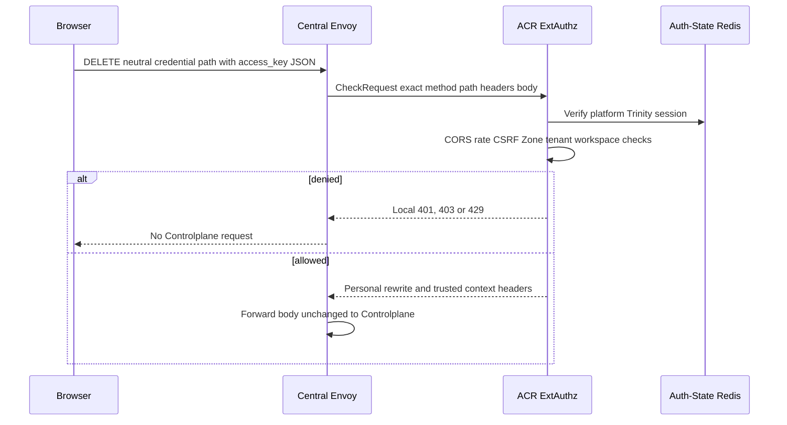
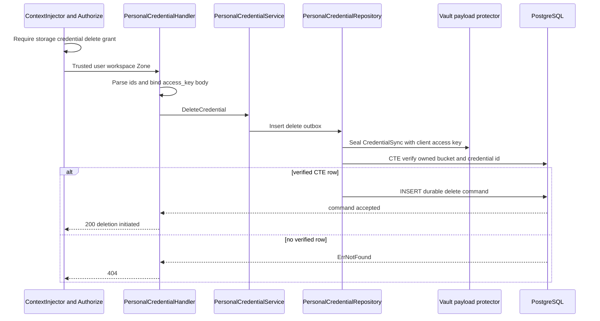
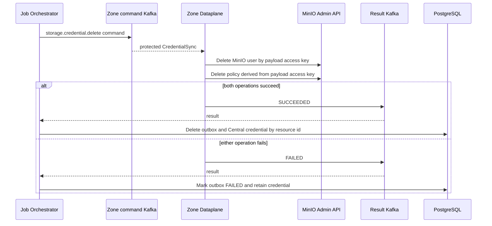
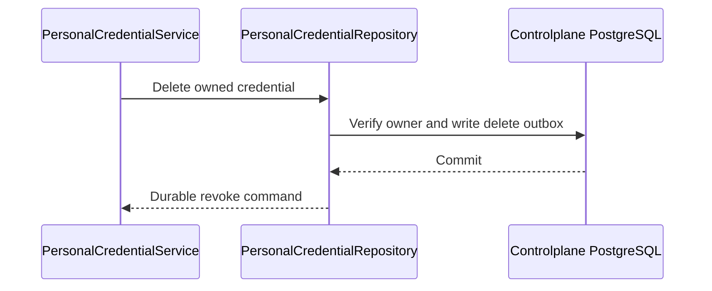

# Personal Storage Credential Delete — God View

Credential deletion is asynchronous. Central credential record remains until
Dataplane has successfully deleted the physical MinIO user and policy. The
current payload binds credential id to an owned bucket, but it does **not** bind
the client-supplied access key to that credential before the Zone command.

## API-scope contract

Browser calls
`DELETE /api/v1/storage/buckets/{bucket_id}/credentials/{credential_id}` with
JSON `access_key`. ACR chooses the personal path only for verified platform
session and injects user/workspace/Zone. Controlplane requires
`{username}:{workspace_id}:storage:credential:delete` or wildcard. Repository
proves the credential id belongs to bucket and the bucket belongs to the user
and workspace. It does not compare `access_key` body to the selected
credential's persisted access key.

## REST input and output

### Request headers used

| Header | Use |
|---|---|
| `Cookie` | ACR session, platform tenant, Zone and workspace context. |
| `Origin` | CORS. |
| `X-Requested-With` or `Sec-Fetch-Site` | Required CSRF input for `DELETE`. |
| `traceparent` | Stored in command metadata. |

### Path and JSON payload

| Field | Contract |
|---|---|
| `bucket_id` | UUID. |
| `credential_id` | UUID belonging to this bucket. |
| `access_key` body | Required string and copied directly into `CredentialSync` delete payload. It is not verified against `credential_id`. |

### Response headers

| Result | Headers |
|---|---|
| All JSON responses | `Content-Type: application/json` |

### Response payload

| Status | Payload |
|---|---|
| `200` | `data: null`, message `credential deleted successfully` means deletion command is durable |
| `400` | Missing or malformed IDs/body |
| `403` | ACR/context/compiled permission failure |
| `404` | Missing/non-owned bucket or credential id |
| `500` | Protection/persistence failure |

## Key and transport contract

| Store / transport | Operation | Invariant |
|---|---|---|
| Auth-State session plus workspace cookie | ACR verify and overwrite | Browser cannot choose owner or trusted context. |
| `storage.personal_credentials` | Read/retain initially, delete after Zone success | Credential id is Central resource fence. |
| `storage.storage_outbox_records` | Insert `storage.credential.delete` | Ciphertext carries body access key, trusted Zone and credential resource id. |
| Zone command and result Kafka topics | At-least-once | Result is authoritative for Central hard delete. |

## Phase 1 — Client → Envoy → ACR

ACR validates CORS, limits, Trinity session, CSRF, Zone and tenant before
rewriting neutral route. It does not inspect `access_key` body, so the raw value
remains available to Controlplane. All caller identity/workspace headers are
removed or overwritten before upstream.

## Phase 2 — Controlplane deletion command fence

Handler parses both UUIDs and requires JSON access key. Service serializes
`CredentialSync{id=credential_id,access_key=client_value}` and sets
`storage.credential.delete` outbox metadata from trusted Zone. Repository
seals payload then CTE verifies bucket owner/workspace and credential id, and
inserts outbox. It does not delete credential row yet.

## Phase 3 — Zone deletion and terminal hard delete

Dataplane decodes `CredentialSync`, requires non-empty access key, then deletes
MinIO user and derived `policy-{access_key}`. It returns a Kafka result. JO on
success deletes matching outbox and Central credential id. On failure it keeps
credential row and records terminal failure, allowing later retry of the
workflow.

## Security discrepancy and recovery

| Condition | Actual behavior |
|---|---|
| Body access key differs from credential id | CTE still accepts owned credential id, but Dataplane deletes MinIO user/policy for body value. This is a critical command-binding vulnerability that can affect another physical key reachable by the Zone admin credential. |
| Current Zone differs from credential bucket Zone | CTE validates user/workspace/credential id but not Zone. It routes outbox using current ACR Zone, which can direct a valid credential id to a wrong Zone. |
| MinIO user delete succeeds, policy delete fails | Dataplane reports FAILED. Central credential remains even though user is already deleted; retry can fail because user no longer exists. |
| Result replay | Outbox status guard prevents second Central delete. |
| Caller learns credential existence | Owner/credential mismatch maps to `404`. |
| Safer future contract | Repository must obtain persisted access key under the same ownership fence and derive payload from that row, never from body. This is implementation work, not performed by this documentation change. |

## Code map

- `controlplane/internal/storage/transport/http/handler/personal_credential_handler.go`
- `controlplane/internal/storage/service/personal_credential_service.go`
- `controlplane/internal/storage/repository/personal_credential_repo.go`
- `dataplane/src/executor/storage/credential.rs`
- `job-orchestrator/src/results/storage/credential.rs`

## Wallet admission rule

Credential delete is outside the billable-expansion gate. The workflow still
enforces verified personal ownership, the bucket/credential fence and the
protected outbox transaction, but it does not require `ALLOW`. This preserves a
cleanup path after `SUSPEND_BILLABLE`.

