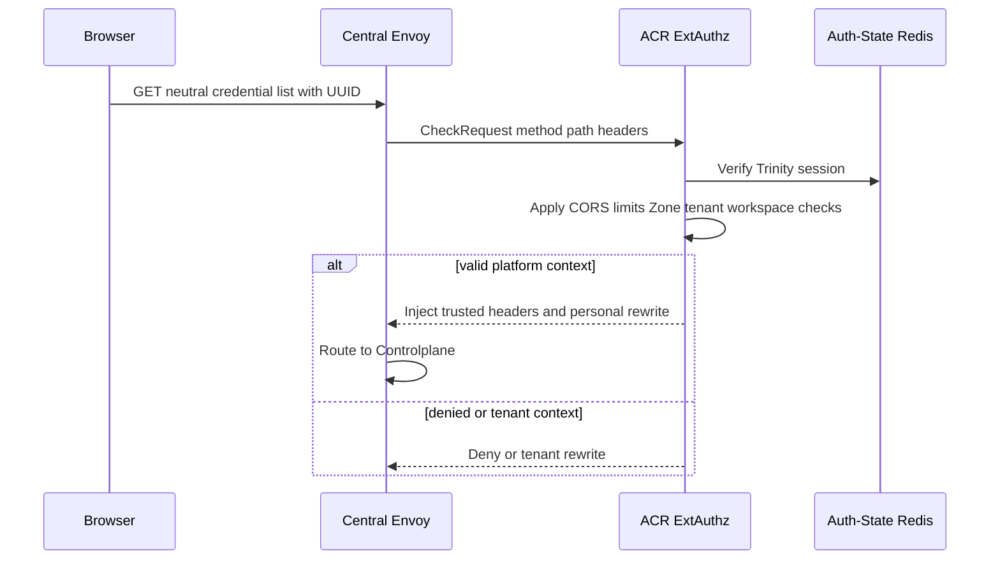
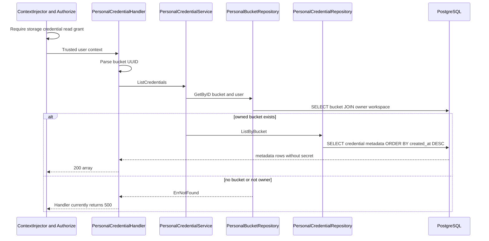

# Personal Storage Credential List — God View

This is the read workflow for metadata of legacy MinIO credentials. It never
returns `secret_key`, never calls MinIO and does not mean every returned key has
already been provisioned successfully.

## API-scope contract

Browser calls `GET /api/v1/storage/buckets/{bucket_id}/credentials`. ACR selects
personal only for a verified platform session and rewrites the neutral route.
Controlplane requires
`{username}:{workspace_id}:storage:credential:read` or wildcard. Unlike
credential create, `bucket_id` here must be UUID. Service first proves the
bucket is owned by the verified user, then lists records by bucket id.

## REST input and output

### Request headers used

| Header | Use |
|---|---|
| `Cookie` | ACR loads Trinity session plus trusted workspace and Zone context. |
| `Origin` | ACR CORS check. |
| `traceparent` | Trace only. |

### Path payload

| Field | Contract |
|---|---|
| `bucket_id` | Required UUID. Empty/malformed path is `400`. |

### Response headers

| Result | Headers |
|---|---|
| All JSON responses | `Content-Type: application/json` |

### Response payload

| Status | `data` |
|---|---|
| `200` | Array of `id`, `access_key`, `policy`, `created_at`, `updated_at`. No secret field. |
| `400` | Bucket id malformed |
| `403` | ACR, context or compiled permission denial |
| `404` | Service maps non-owned/missing bucket to `ErrNotFound`, but handler currently maps any list service error to `500`. |
| `500` | Actual handler result for any service/database error, including its `ErrNotFound` mapping. |

## Key contract

| Store/key | Operation | Invariant |
|---|---|---|
| Auth-State session and workspace cookie | ACR verify / overwrite | Browser cannot select personal path or author identity. |
| Personal role cache | `Authorize` read | Requires credential read grant scoped to workspace or wildcard. |
| `storage.personal_buckets` joined with `hierarchy.personal_workspaces` | Ownership SELECT | Bucket must belong to verified user before credential list query. |
| `storage.personal_credentials` | Ordered SELECT | Selects only metadata and explicitly excludes secret because database has no secret column. |

## Phase 1 — Client → Envoy → ACR

ACR handles CORS, pre/post-auth rate limits, session verification, Zone/tenant
resolution and workspace cookie overwrite. `GET` does not need a CSRF mutation
header. Valid platform session is rewritten to personal; tenant session reaches
the no-op tenant handler rather than this workflow.

## Phase 2 — Ownership read then credential metadata read

`Authorize` executes before handler. Handler parses UUID under five-second
deadline. Service calls `bucketRepo.GetByID(bucketID,userID)` first. That query
joins bucket to personal workspace owner. Only after it succeeds does credential
repository list entries ordered by creation time. It does not read Zone or call
Dataplane.

## Failure semantics and discrepancy

| Condition | Behavior |
|---|---|
| Credential provisioning is pending | Row is inserted before Zone provisioning, so list can show a key not yet usable. |
| Credential provisioning later fails | JO removes its row. |
| Missing/non-owned bucket | Service intentionally maps to not found, but handler lacks an `ErrNotFound` branch and responds `500`. This leaks no existence but violates expected HTTP taxonomy. |
| Cross-workspace or cross-Zone owned bucket UUID | Ownership lookup uses user id only. Current workspace/Zone permission context does not constrain this read after `Authorize` passes. |
| No credentials | `200 []` after successful owner check. |
| Pagination | No cursor or upper bound is implemented. |

## Code map

- `controlplane/internal/storage/transport/http/handler/personal_credential_handler.go`
- `controlplane/internal/storage/service/personal_credential_service.go`
- `controlplane/internal/storage/repository/personal_bucket_repo.go`
- `controlplane/internal/storage/repository/personal_credential_repo.go`
