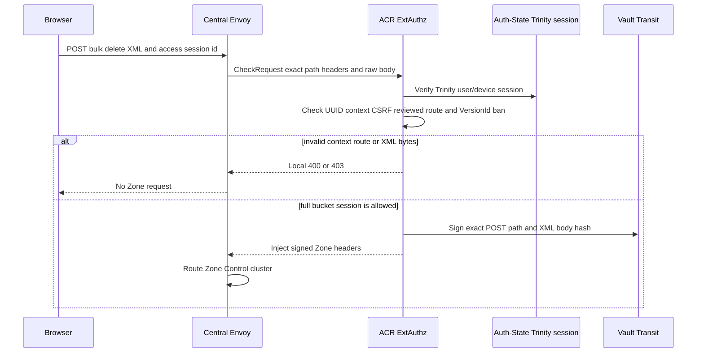
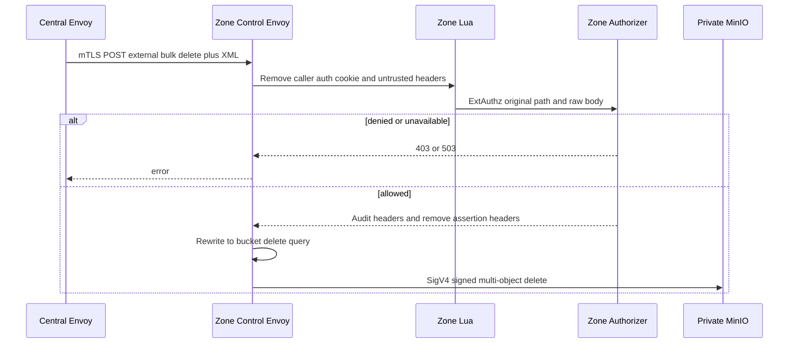
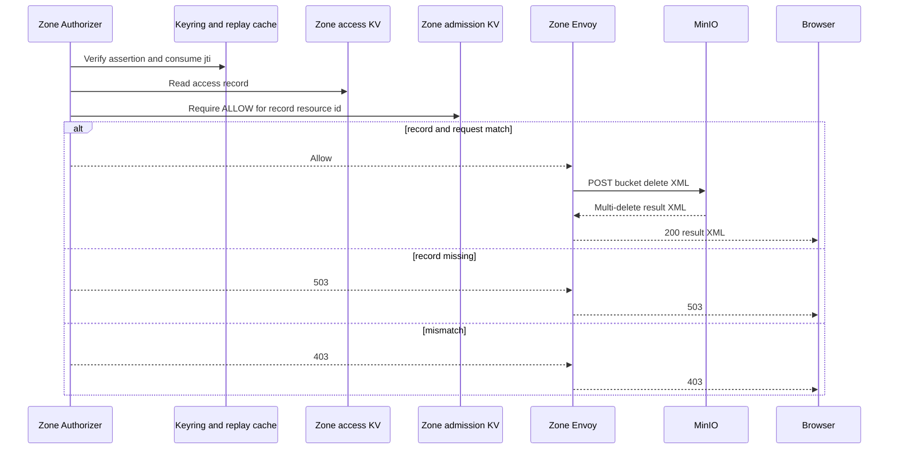

# Personal Storage Object Bulk Delete — God View

This workflow deletes objects through the S3 multi-object-delete subresource. It
is separate from bucket deletion and only accepts non-versioned delete XML. It
does not call Controlplane or create a storage outbox.

## API-scope contract

Browser calls
`POST /zone-control/v1/storage/buckets/{physical_bucket}/bulk-delete` with
non-empty Delete XML and `x-aurora-access-session-id`. ACR authenticates
Trinity and signs exact request facts. Zone KV must grant `DeleteObject` to the
same actor/workspace/Zone/session. The external path must bind the Zone record
bucket name. The key prefix contract has a deliberate
behavior: when `key_prefix` is non-empty, this bulk-delete path is rejected
because it has no `/objects/{key}` segment to prove prefix. For empty scope,
ACR and Zone do not inspect XML object keys beyond forbidding `VersionId`.

## REST input and output

### Request headers used

| Header | Use |
|---|---|
| `Cookie` | ACR authenticates Trinity session; stripped before MinIO. |
| `x-aurora-access-session-id` | Opaque Zone capability correlation UUID, not a bearer credential. |
| `Origin` | CORS. |
| `X-Requested-With` or `Sec-Fetch-Site` | Required ACR CSRF signal for `POST`. |
| `Content-Type: application/xml` | Cloud Console sets it. Gateway binds exact bytes but does not require this header value. |

### Path and body payload

| Part | Contract |
|---|---|
| Bucket | Must equal recorded physical bucket. |
| Path | Exactly `/bulk-delete`; no query is allowed. |
| Delete body | Non-empty valid UTF-8 required only insofar XML scan can read it. Both ACR and Zone ExtAuthz cap body at 64 KiB. |
| `VersionId` | ACR and Zone scan XML tokens case-insensitively and reject any `VersionId` element, including namespace-prefixed form. |
| Object keys | Cloud Console accepts 1 to 1000 selected keys. Server does not parse count, key syntax or individual scope for empty-prefix sessions. |

### Response headers

| Boundary | Headers |
|---|---|
| ACR to Zone | Four signed headers are injected with overwrite semantics. |
| Zone authorizer | Removes these four after verification and adds audit action `DeleteObject`. |
| Zone Lua | Removes all remaining Aurora/AWS/MinIO/cookie/client auth headers. |
| Zone to MinIO | Rewrites to `/{bucket}?delete` and signs with Envoy SigV4. |

### Response payload

| Status | Payload |
|---|---|
| `200` | MinIO multi-delete XML result. Cloud Console currently treats successful HTTP response as completion without parsing per-key errors. |
| `400` | Empty/oversized/unreadable body, `VersionId`, unsafe route, or MinIO XML error. |
| `401` / `403` | Session, CSRF, action, assertion or scope mismatch. |
| `503` | Zone authorizer/KV is unavailable or access projection not ready. |
| `5xx` | MinIO or proxy failure. |

## Key contract

| Key/component | Store | Operation | Invariant |
|---|---|---|---|
| Vault assertion | Signed request headers | Schema 2 binds authenticated actor/workspace/Zone/session, exact POST route and raw XML SHA-256; no policy fields | 10-second lease and fresh operation id. |
| Zone replay cache | Authorizer Moka | Claims jti | Local replay guard. |
| `AURORA_ZONE_ACCESS/{session_id}` | Zone JetStream KV | Sole capability record | Action, resource, bucket, prefix and expiry are decided here. |
| `AURORA_ZONE_ADMISSION/{resource_id}` | Zone JetStream KV | Admission read | Current `ALLOW` is mandatory before delete reaches MinIO. |

## Phase 1 — Client → Envoy → ACR

ACR executes CORS, Zone Control rate limits, Trinity verification and CSRF. Its
Auth-State read is only the Trinity session. It classifies the reviewed
`POST /bulk-delete` route and requires a body without `VersionId`; it does not
decide action, bucket or prefix and does not parse object keys. Its assertion body
hash covers raw XML and signs via Vault Transit.

## Phase 2 — Zone Control edge rewrite

Central Envoy sends original request over mTLS. Zone Lua keeps only required
assertion headers and strips cookie/client credentials. Zone authorizer receives
unrewritten external body and independently checks the same semantics. On
allow, regex rewrite maps route to `/{bucket}?delete`; then Envoy performs SigV4
with the post-rewrite path and streams XML to private MinIO.

## Phase 3 — Zone record recheck and physical delete

Zone authorizer verifies signature, key id, its Zone, issuer/audience, exact
path/body hashes, 10-second validity and jti. It reads KV and checks assertion
identity, record integrity/expiry, `DeleteObject`, bucket and prefix semantics,
then requires current resource admission. MinIO then processes
individual delete elements. The gateway forwards result XML but current browser
client does not inspect whether MinIO reported individual failures.

Phase 3 reads `AURORA_ZONE_ACCESS/{access_session_id}` JSON fields
`access_session_id`, `binding_hash`, `actor_id`, `resource_id`, `bucket_name`,
`workspace_id`, `zone_id`, `actions`, `key_prefix`,
`expires_at_unix_seconds` and `policy_revision`. The subsequent
`AURORA_ZONE_ADMISSION/{resource_id}` read uses only `policy_version`,
`decision`, `effective_at_unix_seconds` and `valid_until_unix_seconds`.

## Failure and security rules

| Condition | Behavior |
|---|---|
| Key prefix is non-empty | Bulk delete is unavailable by construction. Caller needs an endpoint with each key in a canonical path or a new reviewed body schema. |
| Client asks version delete | `VersionId` is forbidden. Versioned delete requires a separate workflow/capability. |
| Multi-delete body has 1000 long keys | It can exceed 64 KiB and is denied before MinIO despite UI count limit. |
| Per-object MinIO error in `200` XML | UI currently reports success because it does not parse XML error entries. This is a product correctness gap. |
| Retry after lost response | New request gets new assertion. Multi-delete is generally idempotent for missing keys but response semantics are MinIO-owned. |
| Static Central Zone route mismatch | Wrong Zone denies assertion rather than permitting cross-zone delete. |
| Commercial admission missing or suspended | Zone denies before MinIO. |

## Code map

- `cloud-console/src/features/storage/objects/api.ts`
- `acr/src/storage/control_assertion.rs`
- `zone-control-edge-gateway/envoy.yaml`
- `zone-control-edge-gateway/authorizer/src/authorization.rs`
