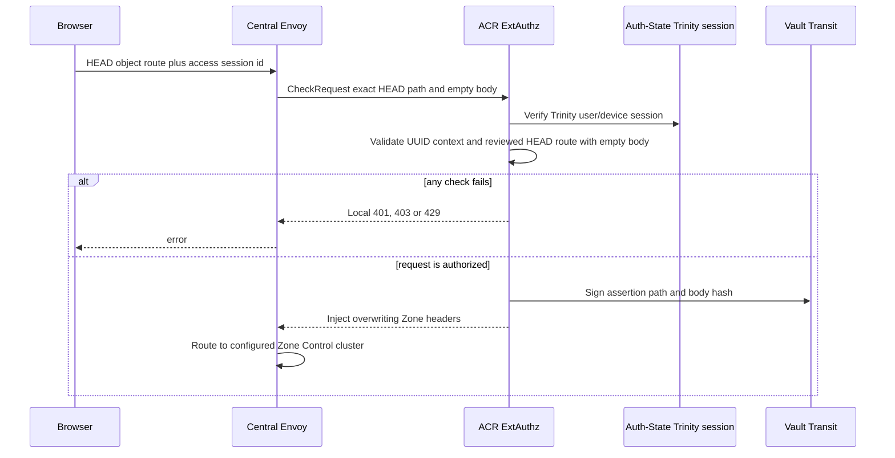
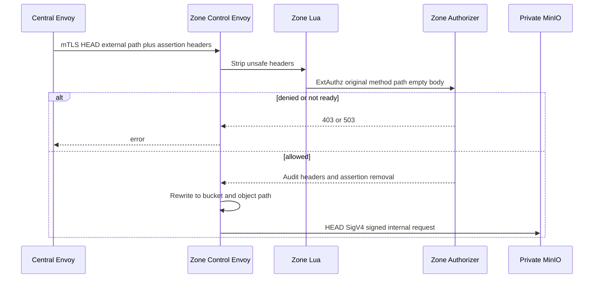
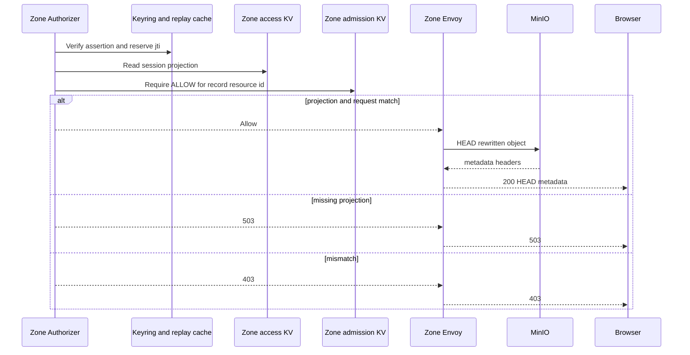

# Personal Storage Object Head — God View

This workflow reads object metadata through Zone Control Edge. It does not return
object bytes. Cloud Console uses it before showing object detail and combines it
with the separate tag-read workflow.

## API-scope contract

Browser calls
`HEAD /zone-control/v1/storage/buckets/{physical_bucket}/objects/{object_key}`
with Trinity cookies and `x-aurora-access-session-id`. ACR authenticates the
session and signs actor/workspace/Zone/session plus exact request facts. Zone
KV supplies the resource policy and Zone requires `GetObject`. The literal
path bucket must equal the Zone record bucket; object path must start with its
`key_prefix` when scope is non-empty. Encoded slash/backslash/dot,
double slash, `%25`, `.` and `..` segments are rejected before Zone routing.

There is no Controlplane owner rewrite or `Authorize` call here. Ownership was
durably checked during access-session prepare, while Zone rechecks the
short-lived capability and current resource admission per request.

## REST input and output

### Request headers used

| Header | Use |
|---|---|
| `Cookie` | ACR authenticates Trinity session. Zone Lua strips it before MinIO. |
| `x-aurora-access-session-id` | Opaque Zone record correlation UUID; it is not bearer authority. |
| `Origin` | ACR CORS check. |
| `traceparent` | Trace only. No client-provided `x-amz-*` or `Authorization` survives. |

### Path payload

| Field | Contract |
|---|---|
| `physical_bucket` | Must exactly equal access record bucket name. |
| `object_key` | Non-empty. All components are path-sensitive and must be within configured prefix. |
| Query | Not allowed for object head. Any query makes path binding fail. |
| Body | Must be empty. |

### Response headers

| Result | Headers |
|---|---|
| `200` | MinIO metadata such as `content-type`, `etag`, `x-amz-meta-*`, optional `x-amz-version-id`. |
| ACR to Zone | Four overwritten access/assertion headers only. |
| Zone to MinIO | Assertion/access headers removed, audit headers added, Envoy generates SigV4 after rewrite. |
| `403` / `503` | No assertion material in response. |

### Response payload

`HEAD` has no response body. `403` represents failed authentication, Zone
capability binding or admission. `503` represents unavailable Zone authorizer/dependency or
missing Zone access record. MinIO may return normal S3 `404` or `5xx`.

## Key contract

| Key/component | Store | Operation | Invariant |
|---|---|---|---|
| Signed assertion | Vault Transit and request headers | Schema 2 authenticated actor/workspace/Zone/session plus exact external `HEAD`, path and empty-body hashes; no resource policy | 10-second maximum lease. |
| Zone replay cache | Authorizer Moka | Claim `jti` | Local replay protection only. |
| `AURORA_ZONE_ACCESS/{session_id}` | JetStream KV | Watch/direct read | Sole capability SoT; Zone derives resource/bucket/action/prefix/expiry and binds assertion identity. |
| `AURORA_ZONE_ADMISSION/{resource_id}` | JetStream KV | Zone read | Current `ALLOW` is required before MinIO. |

## Phase 1 — Client → Envoy → ACR

ACR applies CORS, Zone Control rate limits, Trinity session verification and
request classification. Its Auth-State read is only Trinity authentication. It
rejects invalid UUID context, unreviewed route shape or non-empty body, then
signs request facts through Vault without reading Storage policy.

## Phase 2 — Zone gateway filter chain and route rewrite

Central Envoy uses client mTLS toward Zone Control Envoy. Zone Lua strips
cookies, authorization, all `x-amz-*`, `x-minio-*`, and unapproved
`x-aurora-*`. Zone ExtAuthz receives the original external `HEAD` path. After
authorization, regex rewrite maps it to `/{bucket}/{object_key}`, then upstream
AWS request signing signs that rewritten path for private MinIO.

## Phase 3 — Zone recheck and response

Zone authorizer verifies signature/key id, own Zone, request hashes, short
validity and one-time jti. It reads access KV, binds assertion identity and
rechecks record integrity, expiry, action, bucket and prefix. It then requires
current resource admission. MinIO is called only on success. Metadata headers flow back
through both Envoys; cookies and client authorization never reach MinIO.

## Failure rules

| Condition | Behavior |
|---|---|
| Object key outside `key_prefix` | Zone rejects before MinIO. |
| Any object query | Zone rejects because object head has no reviewed query contract. |
| Admission missing or suspended | Zone rejects before MinIO. |
| Zone replay of assertion | Local authorizer rejects same `jti`. |
| MinIO object absent | Auth succeeds; MinIO returns its normal `404`. |
| Central static zone route mismatch | Target Zone authorizer rejects assertion whose Zone differs, so cross-Zone access fails closed. |

## Code map

- `acr/src/storage/control_assertion.rs`
- `zone-control-edge-gateway/envoy.yaml`
- `zone-control-edge-gateway/authorizer/src/authorization.rs`
- `zone-control-edge-gateway/authorizer/src/control_assertion.rs`
