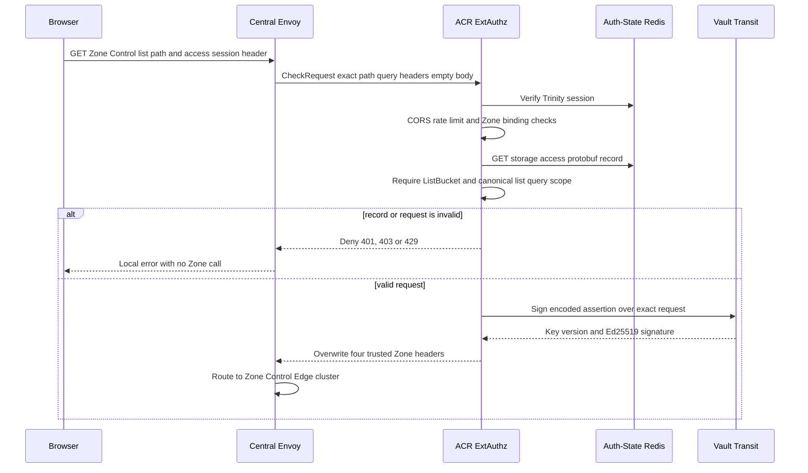
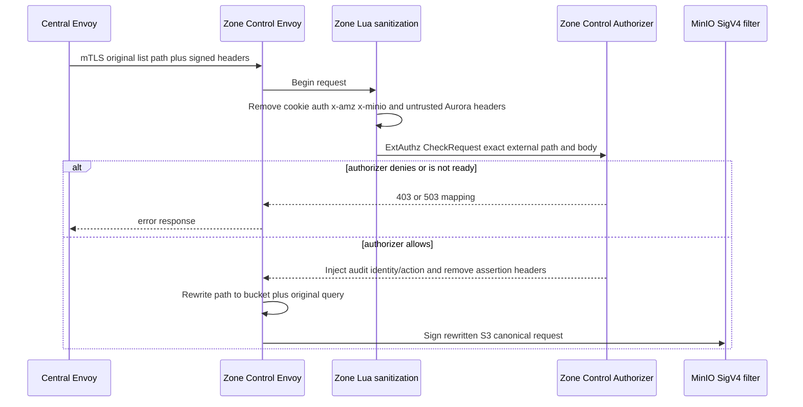
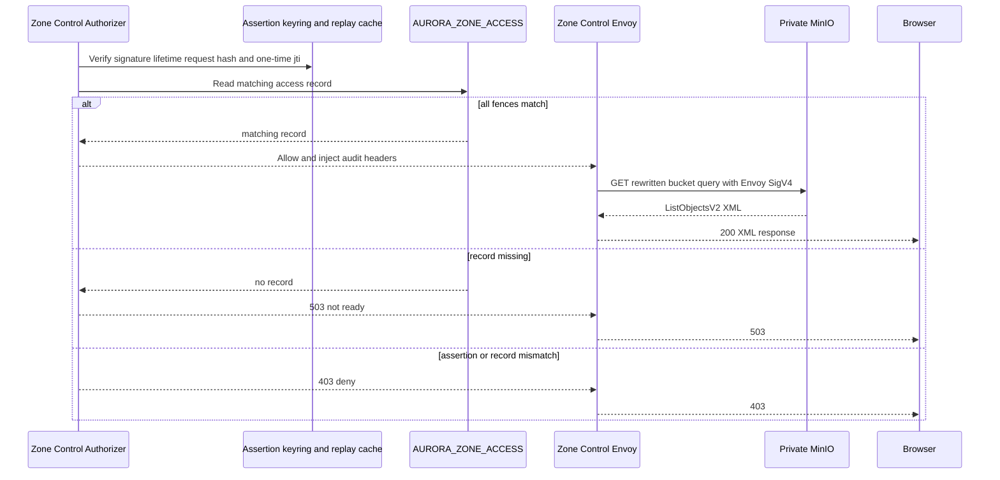

# Personal Storage Object List — God View

This workflow lists S3 objects through the Zone Control Edge Gateway. It is not a
Controlplane list API and it has no `/personal` or `/tenant` path rewrite. It
is personal because the access-session preparation workflow has already bound
this access id to one personal bucket, actor, workspace and Zone.

## API-scope contract

Browser calls
`GET /zone-control/v1/storage/buckets/{physical_bucket}/objects?list-type=2&...`
with Trinity cookies and `x-aurora-access-session-id`. This path is an
ACR-local authorization boundary, not a neutral owner route. ACR requires an
authenticated Trinity session and requires its verified claim Zone to equal the
Central access record Zone. It does not run Controlplane `Authorize`; the
durable repository authorization occurred when creating access session.

For list action, ACR requires `ListBucket` in session actions. Query must have
exactly one `list-type=2`. `prefix`, if session key scope is non-empty, is
required and must begin with `key_prefix`. Only reviewed query parameters are
permitted: `prefix`, `delimiter`, `max-keys` from 1 to 1000,
`continuation-token`, `start-after`, `encoding-type=url` and
`fetch-owner=false`, each at most once. Encoded separators, dot segments,
double slash, encoded percent and malformed percent encoding fail closed.

## REST input and output

### Request headers used

| Header | Use |
|---|---|
| `Cookie` | Envoy supplies it to ACR for Trinity session verification. It is stripped by Zone Control Envoy before MinIO. |
| `x-aurora-access-session-id` | Opaque UUID lookup handle in ACR Auth-State Redis. It is overwritten/injected toward Zone and stripped after Zone authorization. |
| `Origin` | ACR CORS enforcement. |
| `X-Requested-With` or `Sec-Fetch-Site` | Not required for `GET`, but may be present. |
| `traceparent` | Normal propagation, not part of access assertion. |

### Query payload

| Field | Contract |
|---|---|
| `physical_bucket` | Must equal `StorageAccessRecord.bucket_name` byte-for-byte in external route. |
| `list-type=2` | Mandatory exactly once. |
| `prefix` | Optional only when session scope is empty. Required and scope-prefixed when `key_prefix` is non-empty. |
| `max-keys` | Optional `1..1000`. |
| `continuation-token` and `start-after` | Either optional individually, never together. |
| Other query parameters | Denied. |

### Response headers

| Layer | Headers that matter |
|---|---|
| Browser response | S3/MinIO response headers pass through. No Aurora assertion material is exposed. |
| ACR to Zone Control | Injects `x-aurora-access-session-id`, `x-aurora-control-assertion`, `x-aurora-control-signature`, `x-aurora-control-key-id`, all overwrite semantics. |
| Zone authorizer to MinIO | Removes the four assertion/access headers and injects `x-aurora-actor-id`, `x-aurora-resource-id`, `x-aurora-control-capability=storage.object`, `x-aurora-control-action=ListBucket`, `x-aurora-operation-id`, `x-aurora-bucket-name`. |
| Zone Lua before MinIO | Removes all other `x-aurora-*`, all `x-amz-*`, all `x-minio-*`, `authorization`, `cookie`, and `x-csrf-token`. |
| Upstream signer | Envoy generates its own AWS Signature V4 after path rewrite. |

### Response payload

| Status | Payload |
|---|---|
| `200` | MinIO `ListObjectsV2` XML. Cloud Console parses `Contents`, size, last modified and continuation token. |
| `401` / `403` | ACR denial for session, action, session record or canonical request mismatch. |
| `429` | ACR Zone Control rate limit. |
| `503` | Zone authorizer unavailable, overloaded dependency or missing Zone access projection. |
| `4xx` / `5xx` from MinIO | S3 error body after authenticated proxying. |

## Key contract

| Key / component | Store | Operation | Invariant |
|---|---|---|---|
| `storage_access:{access_session_id}` | Central Auth-State Redis | Protobuf record GET by ACR | Schema 1, actor id, session id, Zone, expiry and policy revision must all bind claims. |
| Assertion `jti` | ACR signed JSON | One assertion per request, expires in 10 seconds | Includes exact external method, full path including query SHA-256, empty body SHA-256 and scope. |
| Zone authorizer replay cache | Per-process Moka | Insert assertion `jti` with 30 second TTL | Replay shield is local only. |
| `AURORA_ZONE_ACCESS/{access_session_id}` | JetStream KV | Authorizer watch/direct read | Must equal every identity, resource, scope/action and expiry field from assertion. |
| Central Zone cluster | Central Envoy | Route prefix to `zone_control_edge_gateway_cluster` | Current config is a static `zone-z1` Kubernetes DNS endpoint. A non-z1 assertion fails closed at Zone authorizer; production needs xDS per Zone before other Zones work. |

## Phase 1 — Client → Envoy → ACR assertion issue

ACR performs CORS, Zone Control pre-auth limit, Trinity verification, post-auth
limit, and CSRF method check. It loads opaque session record from dedicated
Auth-State Redis. It rejects absent/corrupt/expired records, actor or claim-Zone
mismatch, disallowed action, bucket/prefix/query mismatch and any non-empty
body. It creates assertion JSON, base64url encodes it and requests Vault Transit
signature with configured key id. It removes caller workspace and cryptographic
headers before overwriting signed headers to Central Envoy.

## Phase 2 — Central Envoy mTLS and Zone Control Edge routing

Central Envoy sends the original external path and ACR-injected headers to the
configured Zone Control cluster over mTLS. The zone gateway accepts only client
certificates chained to Central client CA with SAN `central-envoy`. Its Lua
filter removes client-derived sensitive headers, retains only the four assertion
headers, then calls Zone authorizer ExtAuthz with a 64 KiB body cap. For list
route, Envoy regex rewrites external path to `/{bucket}?{query}` and uses
private MinIO cluster with SigV4 after rewrite.

## Phase 3 — Zone authorization and MinIO response

Zone authorizer verifies Ed25519 key id, assertion size and base64 JSON, issuer,
audience, schema, own Zone id, 10 second lifetime with clock skew, exact method,
external-path hash and body hash. It inserts assertion `jti` into local replay
cache. It reads Zone access record and checks every field, `ListBucket` action,
scope and canonical query once more. It allows Envoy to call private MinIO; the
reverse XML response is returned without assertion headers.

## Failure and security rules

| Condition | Behavior |
|---|---|
| Access prepare has not reached Zone | Authorizer returns `503`, and UI may retry. It must not fail open to MinIO. |
| Assertion replay at same replica | Moka replay cache rejects it. Cross-replica exactly-once is not claimed; mutating operations carry `operation_id`. |
| Client sends forged Aurora/S3 auth headers | ACR overwrites trusted headers and Zone Lua strips all caller S3/Aurora material before Envoy signs. |
| Central route points to wrong Zone | Assertion Zone mismatch denies at that Zone. Current static dev cluster therefore has availability, not cross-Zone authorization, limitation. |
| Query canonicalization disagreement | Both ACR and Zone authorizer apply the same strict path/query contract before Envoy rewrite. |
| MinIO is down | Authorized request may return upstream `5xx`; access record is unchanged. |

## Code map

- `acr/src/storage/control_assertion.rs`
- `acr/src/gateway/ext_authz.rs`
- `dev/central/envoy/routes/https_routes.yaml`
- `dev/central/envoy/envoy.yaml`
- `zone-control-edge-gateway/envoy.yaml`
- `zone-control-edge-gateway/authorizer/src/authorization.rs`
- `zone-control-edge-gateway/authorizer/src/request_binding.rs`
