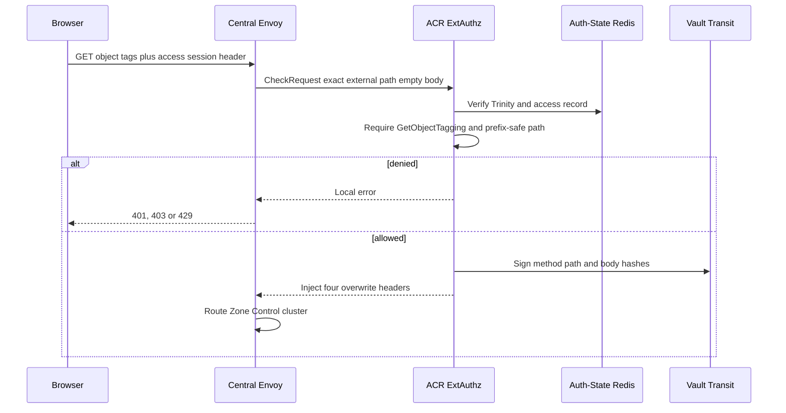
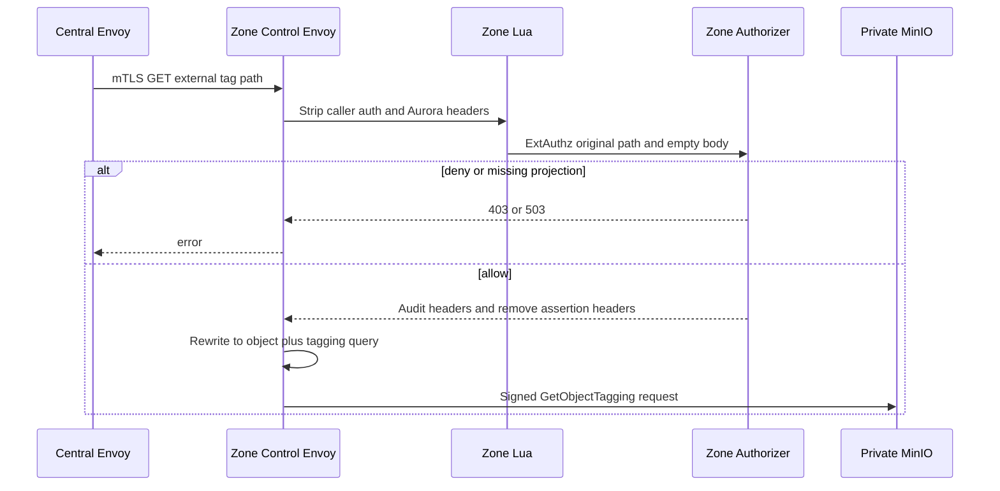
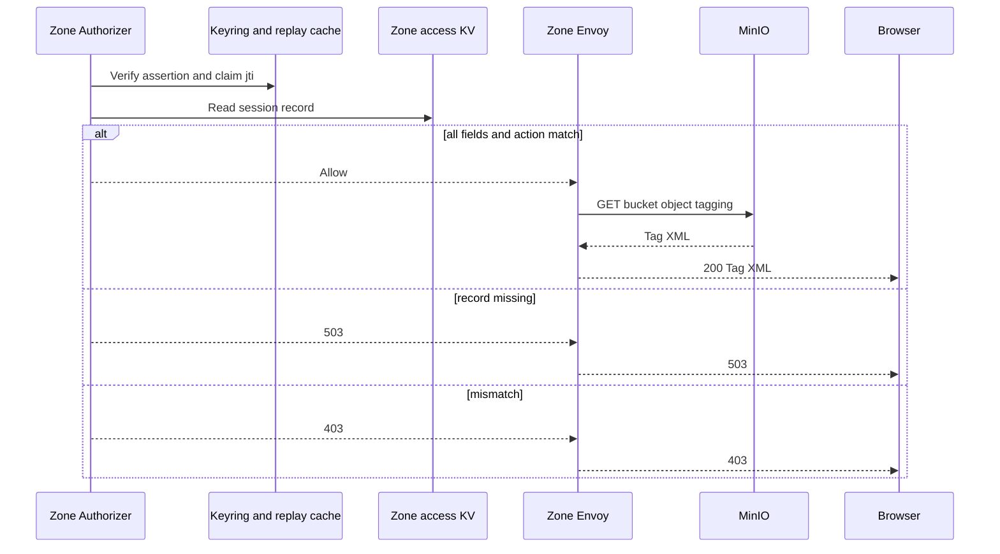

# Personal Storage Object Tag Read — God View

This workflow reads S3 object tags through Zone Control Edge. It is a separate
capability from object metadata, even though both use the same object path.

## API-scope contract

Browser calls
`GET /zone-control/v1/storage/buckets/{physical_bucket}/objects/{object_key}/tags`
with Trinity cookies and `x-aurora-access-session-id`. ACR requires
`GetObjectTagging` in the Central access record. The bucket and object key must
match record bucket and `key_prefix`; body must be empty and query is forbidden.
No Controlplane route, owner rewrite or permission middleware is involved.

## REST input and output

### Request headers used

| Header | Use |
|---|---|
| `Cookie` | ACR validates Trinity and claim Zone. Removed before MinIO. |
| `x-aurora-access-session-id` | ACR record lookup, assertion correlation and Zone record lookup. |
| `Origin` | CORS. |
| `traceparent` | Observability only. |

### Path payload

| Field | Contract |
|---|---|
| Bucket | Equal to record `bucket_name`. |
| Object key | Non-empty and starts record `key_prefix` when non-empty. |
| `/tags` suffix | Required and selects `GetObjectTagging` only for `GET`. |
| Query/body | Both forbidden. |

### Response headers

| Layer | Headers |
|---|---|
| ACR to Zone | Overwrites access id, assertion, signature and key id. |
| Zone authorizer to MinIO | Removes these four and injects actor/resource/capability/action/operation/bucket audit headers. |
| Zone Lua | Removes cookies, authorization, all client Aurora/AWS/MinIO headers. |
| Browser `200` | MinIO tag XML content type and normal S3 headers. |

### Response payload

| Status | Payload |
|---|---|
| `200` | MinIO `GetObjectTagging` XML. UI parses each `Tag` key/value. |
| `401` / `403` | ACR or Zone authorization rejection. |
| `503` | Zone authorizer or access KV unavailable, or projection not ready. |
| MinIO error | Normal downstream S3 error body/status. |

## Key contract

| Key/component | Store | Invariant |
|---|---|---|
| `storage_access:{session_id}` | Central Auth-State Redis | ACR requires schema, actor, Zone, action, expiry and scope match. |
| Vault Transit assertion | ACR signing boundary | Exact external GET path and empty body are hashed in short-lived assertion. |
| Authorizer replay key | Zone process Moka | One assertion jti is accepted once per process. |
| `AURORA_ZONE_ACCESS/{session_id}` | Zone JetStream KV | Record equality and `GetObjectTagging` action are rechecked. |

## Phase 1 — Client → Envoy → ACR

ACR executes CORS, Zone Control pre/post-auth rate limits, session and Zone
checks. It loads Central access record, classifies only `GET .../tags` as
`GetObjectTagging`, requires empty body/path scope, signs assertion with Vault
Transit and overwrites four Zone headers. Invalid access session, path encoding,
action or prefix cannot reach Central or Zone upstream.

## Phase 2 — Zone Control routing and S3 subresource rewrite

mTLS Central Envoy reaches Zone Control Envoy. Lua sanitizes inbound headers,
Zone ExtAuthz evaluates original external request, and only then Envoy regex
rewrites `/zone-control/v1/storage/buckets/{bucket}/objects/{object}/tags` to
`/{bucket}/{object}?tagging`. The upstream AWS signing filter runs after that
rewrite and signs private MinIO request.

## Phase 3 — Zone assertion and record recheck

The authorizer verifies Ed25519 signature/key id, 8 KiB assertion size, issuer,
audience, its own Zone id, method/path/body SHA256 and timestamp window. It
claims jti in local replay cache, loads Zone record and requires complete field
equality, action and prefix before MinIO call. XML returns via Envoys unchanged
except security request headers were stripped on ingress.

## Failure rules

| Condition | Behavior |
|---|---|
| User has `GetObject` but not `GetObjectTagging` | ACR denies. Actions are not interchangeable. |
| Query appended to tag path | ACR and Zone binding reject it. |
| Object missing | Authorization can succeed and MinIO returns `404`. |
| Zone KV watch/read problem | Authorizer returns dependency `503`, not stale allow. |
| Assertion reuse | Local jti replay denial. |

## Code map

- `acr/src/storage/control_assertion.rs`
- `zone-control-edge-gateway/envoy.yaml`
- `zone-control-edge-gateway/authorizer/src/request_binding.rs`
- `zone-control-edge-gateway/authorizer/src/authorization.rs`
