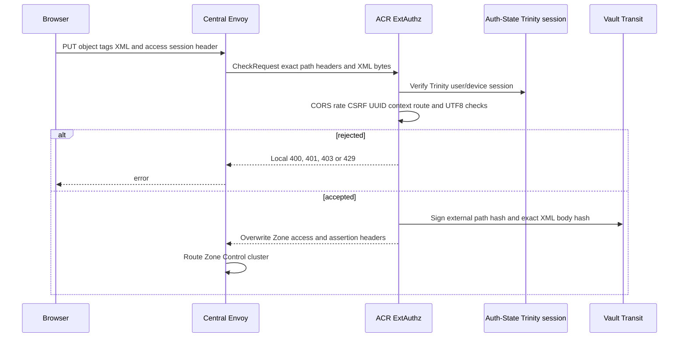
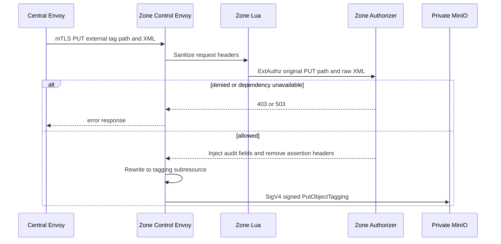
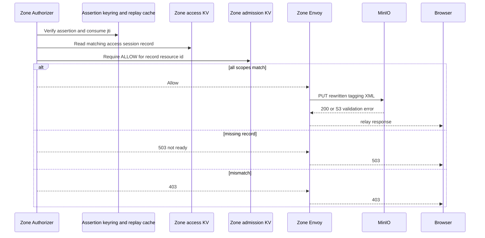

# Personal Storage Object Tag Write — God View

This workflow replaces tags on one object through Zone Control Edge. It is a
state-changing request, therefore ACR additionally requires a browser CSRF
signal. The write itself is private S3 `PutObjectTagging` signed by Zone Envoy.

## API-scope contract

Browser calls
`PUT /zone-control/v1/storage/buckets/{physical_bucket}/objects/{object_key}/tags`
with a non-empty UTF-8 tag XML body and `x-aurora-access-session-id`. ACR
authenticates and signs actor/workspace/Zone/session plus exact request facts.
Zone KV must grant `PutObjectTagging` and the prefix-safe external path. No `/personal` route rewrite or Controlplane
`Authorize` middleware runs at this request; ownership was proved in the
access-session workflow and every request is re-bound at ACR/Zone.

## REST input and output

### Request headers used

| Header | Use |
|---|---|
| `Cookie` | ACR authenticates Trinity session. Zone Lua strips it. |
| `x-aurora-access-session-id` | Opaque Zone capability correlation UUID, not bearer authority. |
| `Origin` | ACR CORS allow-list. |
| `X-Requested-With: XMLHttpRequest` or `Sec-Fetch-Site: same-origin|same-site` | ACR CSRF condition for `PUT`. |
| `Content-Type: application/xml` | Set by Cloud Console. ACR body checker only requires non-empty UTF-8; MinIO interprets XML. |

### Path and body payload

| Part | Contract |
|---|---|
| Bucket/object path | Must exactly bind recorded bucket and configured object prefix. Query is forbidden. |
| XML body | Non-empty valid UTF-8 required by ACR and Zone helper. It is bounded at 64 KiB by both Central/Zone ExtAuthz request-body configuration. |
| Tag application syntax | ACR/Zone do not parse tag count, key/value size, or XML schema. Cloud Console limits UI to 10 tags, 128-char key and 256-char value, but non-UI caller reaches MinIO if body is valid UTF-8. |
| Assertion body binding | SHA-256 of exact byte body is signed by ACR and rechecked by Zone. |

### Response headers

| Boundary | Headers |
|---|---|
| ACR to Central Envoy | Overwrites four access/assertion headers. |
| Zone Lua | Retains only those four before authorizer and strips cookies, caller `Authorization`, all `x-amz-*`, `x-minio-*` and all other Aurora headers. |
| Zone authorizer to MinIO | Removes the four secret assertion headers; adds audit identity/action headers. |
| MinIO upstream | Zone Envoy generates SigV4 after rewrite to object `?tagging` subresource. |

### Response payload

| Status | Payload |
|---|---|
| `200` | MinIO successful PutObjectTagging response, normally empty. |
| `400` | ACR route/body rejection or MinIO invalid tag XML. |
| `401` / `403` | Session, CSRF, access record, assertion or scope/action denial. |
| `429` | ACR Zone Control limit. |
| `503` | Zone authorizer unavailable/not ready or its NATS dependency unavailable. |

## Key contract

| Key / component | Store | Operation | Invariant |
|---|---|---|---|
| Signed assertion | Vault Transit | Schema-2 identity/request facts and Ed25519 signature | Exact external PUT, path and XML bytes are bound for up to 10 seconds; no policy fields. |
| `AURORA_ZONE_ACCESS/{session_id}` | Zone JetStream KV | Sole capability read | Zone derives resource/bucket/policy and binds action/scope/identity/expiry. |
| `AURORA_ZONE_ADMISSION/{resource_id}` | Zone JetStream KV | Admission read | Current `ALLOW` required before mutation. |
| jti replay entry | Zone authorizer Moka | One local consume | Prevents same assertion bytes being reused at the same replica. |

## Phase 1 — Client → Envoy → ACR

Envoy sends body to ACR as `CheckRequest`. ACR performs CORS, Zone Control
pre/post-auth limits, Trinity verification and CSRF. Its Auth-State read is only
the Trinity session. It classifies the reviewed `PUT .../tags` route, rejects
empty/non-UTF8 body, hashes original bytes and signs without deciding policy.

## Phase 2 — Zone gateway sanitization and signed subresource routing

The Central-to-Zone hop is mTLS and Zone Control accepts only Central Envoy
client identity. Lua removes all untrusted S3/Aurora/cookie/auth headers. Zone
ExtAuthz evaluates the unrewritten external route plus body. On allow, Envoy
rewrites path to `/{bucket}/{object}?tagging`, removes assertion input and
SigV4-signs that post-rewrite request to MinIO.

## Phase 3 — Zone recheck, S3 write and response

Zone authorizer verifies key id/signature, issuer/audience, its Zone, 8 KiB
assertion size, method/path/body hashes, timestamp and jti. It then reads KV,
binds assertion identity, checks record integrity, `PutObjectTagging`, bucket,
prefix and expiry, and requires current resource admission. Only then is the body delivered to MinIO.

Phase 3 reads `AURORA_ZONE_ACCESS/{access_session_id}` JSON fields
`access_session_id`, `binding_hash`, `actor_id`, `resource_id`, `bucket_name`,
`workspace_id`, `zone_id`, `actions`, `key_prefix`,
`expires_at_unix_seconds` and `policy_revision`; the action must contain
`PutObjectTagging`. `AURORA_ZONE_ADMISSION/{resource_id}` contributes only
`policy_version`, `decision`, `effective_at_unix_seconds` and
`valid_until_unix_seconds`.

## Failure and security rules

| Condition | Behavior |
|---|---|
| Browser omits CSRF signal | ACR denies before Vault signing or Zone call. |
| Commercial admission missing or suspended | Zone denies before MinIO. |
| XML changes in transit | Zone body hash no longer matches assertion and denies. |
| Client exceeds UI tag limits | Gateway may still forward valid UTF-8; MinIO decides semantic validity. UI limits are not a server authorization contract. |
| Same assertion resent | Zone local replay cache rejects; a fresh request gets a fresh assertion. |
| Zone authorizer has no KV record | Returns `503`, never a permissive fallback. |
| MinIO writes but response is lost | There is no application idempotency key at this workflow boundary. Browser retry is a new signed S3 tagging request and should be treated as replacement semantics. |

## Code map

- `cloud-console/src/features/storage/objects/api.ts`
- `acr/src/storage/control_assertion.rs`
- `zone-control-edge-gateway/envoy.yaml`
- `zone-control-edge-gateway/authorizer/src/authorization.rs`
