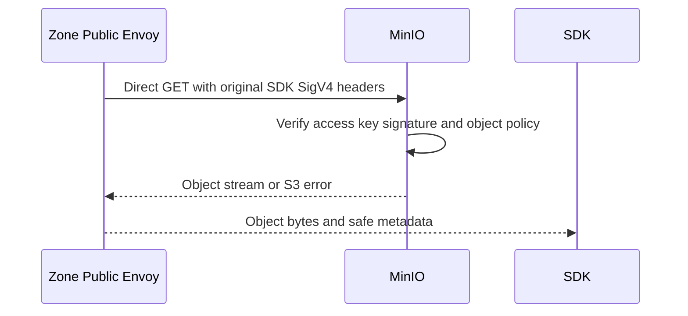

# Personal Storage SDK Object Download — God View

This is the direct S3-compatible personal download path for a provisioned
access key. It has no browser transfer ticket and no user-session context. The
Public Authorizer still enforces the Zone commercial admission projection before a
GET reaches MinIO.

## API-scope contract

The SDK sends `GET /{bucket}/{object-key}` to the Zone Public Edge with SigV4.
The bucket name selects the admission name index; the client cannot select a
different resource, wallet, Zone or owner by header. It must not send
`X-Aurora-Transfer-Ticket`: absence of that header selects the SDK branch;
`Origin`, User-Agent and SigV4 syntax do not.

Only `GET /{bucket}` or `GET /{bucket}/` is classified as a non-billable bucket
list and exempt from commercial admission. Any path with an object-key segment is
an object download and must pass admission even if the key ends in `/` or the
query contains `prefix`/`list-type`.

## Input and output

| Input | Contract |
|---|---|
| `Authorization` | SigV4 credential; retained for MinIO. |
| `X-Amz-Date`, `X-Amz-Content-Sha256`, optional security token | Retained for SigV4. |
| `Range`, `If-None-Match` | Passed to MinIO for normal S3 semantics. |
| `Cookie`, spoofed `X-Aurora-*` | Removed and never authority. `X-Aurora-Transfer-Ticket` must be absent or the request becomes the ticket branch. |
| Request body | Empty for GET. |

Successful output is the MinIO object stream and safe S3 metadata. Admission
denial is `403` before MinIO; admission dependency failure is `503`.

## Key and state contract

| Key | Rule |
|---|---|
| `AURORA_ZONE_ADMISSION/name/{bucket}` | Must contain current `ALLOW` and the matching resource id. |
| MinIO IAM policy | Independently checks the access key and object path. |
| `storage.access.completed.v1` | Records response status and `bytes_sent` without credentials/path. |

## Phase 1 — Client → Zone Public Envoy → Public Authorizer

```mermaid
sequenceDiagram
    participant SDK as Personal SDK
    participant E as Zone Public Envoy
    participant A as Public Authorizer
    participant KV as AURORA_ZONE_ADMISSION

    SDK->>E: GET /bucket/object with SigV4 headers
    E->>E: No ticket: select direct minio route; preserve AWS headers
    E->>A: CheckRequest method/path/headers
    A->>A: Confirm no transfer ticket; enter SDK branch
    A->>KV: Read name/{bucket} admission
    alt missing, expired, suspended or malformed
        A-->>E: 403 or 503
        E-->>SDK: No MinIO request
    else current ALLOW
        A-->>E: OkResponse with trusted x-aurora-resource-id
    end
```

The authorizer first classifies list only by the exact bucket-root path. Every
object GET then checks policy version, exact bucket-name binding and the
effective window. It never performs a central wallet lookup.

Envoy's ordered route and Public Authorizer use the same selector. With no
ticket, Lua strips cookies and spoofed Aurora headers while preserving the
client's SigV4 fields. If a client supplies both SigV4 and a ticket, it is
treated only as a ticket request: Envoy selects `minio_transfer`, removes the
client SigV4 headers and requires a valid one-time ticket.

This phase reads only the name-index JSON schema at
`AURORA_ZONE_ADMISSION/name/{bucket}`: `resource_id`, `resource_name`,
`policy_version`, `decision`, `effective_at_unix_seconds` and
`valid_until_unix_seconds`. Projection-only `restriction_reason` and
`source_event_id` do not participate in this authorization decision.

## Phase 2 — Public Envoy → MinIO



Envoy does not re-sign this branch; MinIO validates the original SDK SigV4.
The stream is bounded by Envoy connection flow control. Access logging emits a
generic metering event with the trusted resource id and transfer counters only.

## Phase 3 — Metering projection and recovery

Zone OTel stores the completed access event in the local ClickHouse journal and
the Zone report later carries `download_bytes` to the Storage Cost Engine. A
commercial suspension takes effect on the next request after the admission event
reaches Zone KV; an in-flight GET is not replayed or charged twice.

## Code map

- `zone-public-edge-gateway/envoy.yaml`
- `zone-public-edge-gateway/authorizer/src/main.rs`
- `dataplane/src/executor/storage/commercial_admission.rs`
- `cost-manager/engine/src/service/storage/usage_report_settlement.rs`
