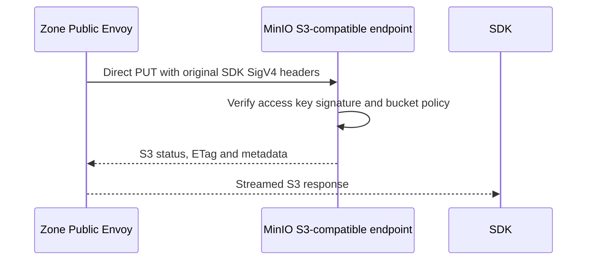

# Personal Storage SDK Object Upload — God View

This is the direct S3-compatible personal upload path for an SDK that already
holds a provisioned access key and secret. It is a data-plane workflow: there
is no browser session, workspace cookie, `/personal` rewrite or synchronous
Controlplane/Billing call. MinIO remains the credential and object-policy
authority; the Zone admission projection is the independent billable-runtime
fence.

## API-scope contract

The SDK sends `PUT /{bucket}/{object-key}` to the Zone Public Edge with AWS
SigV4 `Authorization`. The bucket credential was created by the personal
credential workflow and is not accepted unless the Zone has a current
`AURORA_ZONE_ADMISSION/name/{bucket}` record. The client cannot supply a Zone,
owner, wallet or admission header. It must omit `X-Aurora-Transfer-Ticket`:
absence of that header is what selects the SDK branch. `Origin`, User-Agent and
the presence of `Authorization` are not branch selectors.

This workflow covers single-request SDK `PUT`. A no-ticket `POST` is currently
denied by Public Authorizer, so SDK multipart initiate/complete is not supported
by this contract; Console multipart remains a ticket workflow.

## Input and output

### Headers used

| Header | Boundary |
|---|---|
| `Authorization` | Preserved for MinIO SigV4 credential/policy verification. |
| `X-Amz-Date`, `X-Amz-Content-Sha256`, `X-Amz-Security-Token` | Preserved for SigV4 when present. |
| `Content-Length`, `Content-Type` | Stream contract and MinIO object metadata. |
| `Origin` | Public Edge CORS when the SDK is browser-based. |
| `Cookie`, spoofed `X-Aurora-*` | Removed; never authority for this path. `X-Aurora-Transfer-Ticket` must be absent or the request becomes the ticket branch. |

### Body

The request body is the object stream. Envoy does not buffer it for ext_authz;
TCP flow control and MinIO provide the streaming boundary.

### Output

`200`/`201` and normal S3 response headers are returned from MinIO after the
request has passed admission and SigV4. `403` is returned before MinIO for a
missing/expired/suspended admission or invalid credential. `503` is returned
when the Zone admission KV is unavailable or corrupt.

## Key and state contract

| Key | Owner | Rule |
|---|---|---|
| `AURORA_ZONE_ADMISSION/name/{bucket}` | Dataplane admission projection | Current resource id/name, policy version, decision and validity window. |
| MinIO access key | MinIO IAM | SigV4 identity and bucket policy; client secret is never logged. |
| `storage.access.completed.v1` | Zone Public Envoy log | Generic metering envelope with resource id and transfer counters only. |

## Phase 1 — Client → Zone Public Envoy → Public Authorizer

```mermaid
sequenceDiagram
    participant SDK as Personal SDK
    participant E as Zone Public Envoy
    participant A as Public Authorizer
    participant KV as AURORA_ZONE_ADMISSION

    SDK->>E: PUT /bucket/object with SigV4 headers and stream
    E->>E: No ticket: select direct minio route; preserve AWS headers
    E->>A: CheckRequest method/path/headers (body not buffered)
    A->>A: Detect no transfer-ticket header; require GET or PUT
    A->>KV: Read name/{bucket} admission record
    alt missing, expired, non-ALLOW or corrupt
        A-->>E: 403 or 503
        E-->>SDK: No MinIO request
    else current ALLOW
        A-->>E: OkResponse with trusted x-aurora-resource-id
    end
```

The authorizer validates `policy_version > 0`, exact bucket-name binding,
`ALLOW`, `effective_at <= now` and `valid_until > now`. It does not trust a
client-supplied resource id and does not query Billing.

Envoy and Public Authorizer use the same binary classification rule. With no
ticket, Lua removes cookies and spoofed Aurora headers but preserves the
client's `Authorization` and `X-Amz-*` headers. A request that accidentally
adds a ticket is instead routed to `minio_transfer`, loses its client SigV4
headers and must pass the complete one-time ticket contract.

This phase reads only the name-index JSON schema at
`AURORA_ZONE_ADMISSION/name/{bucket}`: `resource_id`, `resource_name`,
`policy_version`, `decision`, `effective_at_unix_seconds` and
`valid_until_unix_seconds`. `restriction_reason` and `source_event_id` may be
stored for projection recovery but are not Public Authorizer inputs.

The shared SDK classifier exempts only an exact bucket-root GET (`/{bucket}` or
`/{bucket}/`) as a non-billable list. A GET with any object-key segment remains
admission-gated regardless of a trailing slash or `prefix`/`list-type` query;
PUT is always admission-gated.

## Phase 2 — Public Envoy → MinIO



The public Lua filter removes cookies and untrusted Aurora headers but leaves
AWS signing headers on this non-ticket route. Envoy does not re-sign the SDK
request; MinIO verifies the original client signature. Envoy access logging emits only
the generic metering envelope; it never emits the access key, secret, ticket or
object key.

## Phase 3 — Metering projection

The completed response is observed by the Zone OTel pipeline and stored in the
Zone-local ClickHouse metering journal. It is later aggregated into the closed
Storage usage report; Cost Engine rates it by the pinned Storage network-in
schedule. A failed metering projection does not turn a successful MinIO PUT
into a second request, and a suspended commercial decision blocks the next SDK request at
Phase 1.

## Failure and recovery

- Missing/expired admission: `403`; the SDK must retry after the wallet is
  admitted, not bypass the edge.
- KV unavailable/corrupt: `503`; fail closed before MinIO.
- MinIO `4xx/5xx` or stream reset: return the S3 result; the metering record is
  retained with the response status and bytes observed.
- Duplicate admission events: Zone CAS keeps the highest policy version;
  reordered lower versions cannot resurrect `ALLOW`.

## Code map

- `zone-public-edge-gateway/envoy.yaml`
- `zone-public-edge-gateway/authorizer/src/main.rs`
- `dataplane/src/executor/storage/commercial_admission.rs`
- `cost-manager/engine/src/service/storage/usage_report_settlement.rs`
