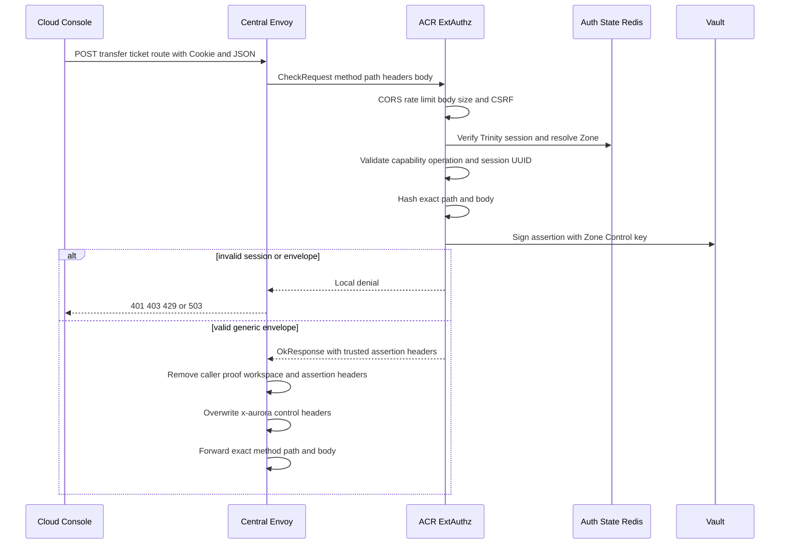
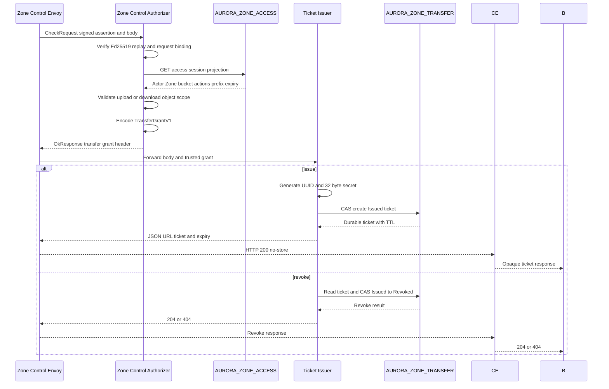

# Personal Storage Transfer Ticket Issue and Revoke — God View

This workflow turns an already prepared personal storage access session into a
short-lived, one-time browser transfer capability. ACR signs only a generic
verified session and operation envelope. Zone Control reads the storage
projection and is the only component that converts it into a public object
path. No access key, secret key, STS credential, or presigned URL is returned.

## API-scope contract

The browser uses `POST /zone-control/v1/transfer-tickets` to issue and
`DELETE /zone-control/v1/transfer-tickets/{ticket_id}` to revoke. The request
is personal storage because `access_session_id` was created by the personal
access-session workflow and is rebound to the verified user by ACR. Tenant
storage remains a separate no-op branch.

## REST input and output

### Request headers used

| Header | Use |
|---|---|
| `Cookie` | ACR verifies the Trinity session and derives the Zone. |
| `Origin` | ACR CORS and Public Edge CORS allow-list. |
| `X-Aurora-Requested-With` | CSRF signal for issue and revoke. |
| `X-Aurora-Access-Session-Id` | Opaque session marker carried to Zone Envoy. |
| `Content-Type` | Must be `application/json`. |
| `traceparent` | Trace correlation only, never authority. |

### JSON payload

| Field | Issue | Revoke |
|---|---|---|
| `capability` | Exactly `storage.object` | Exactly `storage.object` |
| `operation` | `upload` or `download` | `revoke` |
| `access_session_id` | Prepared session UUID | UUID that issued the ticket |
| `resource.bucket_name` | Physical bucket | Same bucket |
| `resource.object_key` | Non-empty safe object key | Same key for audit binding |
| `constraints.content_length` | Required for upload | Omitted |
| `constraints.content_type` | Optional printable MIME value | Omitted |

Issue returns JSON with `method`, `url`, `transfer_ticket` and
`expires_at_unix_seconds`. Revoke returns `204` or `404`. Every issuer
response has `Cache-Control: no-store`.

### Trusted ACR response headers

ACR returns only an Envoy mutation, never a ticket:

| Header | Value |
|---|---|
| `x-aurora-access-session-id` | Body session UUID |
| `x-aurora-control-assertion` | URL-safe base64 JSON assertion |
| `x-aurora-control-signature` | Vault Ed25519 signature |
| `x-aurora-control-key-id` | Vault key version |
| `x-session-proof-verified` | Critical-proof marker |

ACR removes caller workspace, critical-proof, admin and caller assertion
headers. It does not read Zone KV or storage policy.

## Key and state contract

| Key | Owner | Rule |
|---|---|---|
| `storage_access:{access_session_id}` | Auth-State Redis | Central binding of actor, bucket, Zone, actions, prefix and expiry. |
| `AURORA_ZONE_ACCESS/{access_session_id}` | Zone Control | Durable Zone projection; missing means not ready. |
| `AURORA_ZONE_TRANSFER/{ticket_id}` | Issuer and Public Authorizer | File KV, history 1, bounded TTL, CAS state. |
| `operation_id` | ACR and audit | Correlates issue or revoke attempts. |
| `jti` | Zone authorizer replay cache | One assertion use per process. |

## Phase 1 — Client → Envoy → ACR

Envoy creates an ext_authz `CheckRequest` with the exact method, full path,
headers and bounded JSON body. ACR runs CORS, pre-auth rate limit, Trinity
verification, post-auth rate limit, CSRF and generic envelope validation. The
ACR branch is generic and does not branch on bucket or object semantics.

Revoke follows the same sequence with `DELETE` and a ticket UUID suffix. The
path hash binds the assertion to that exact ticket and prevents path replay.

## Phase 2 — Zone Control authorizer and issuer

Zone Envoy Lua preserves only ACR assertion headers and the opaque access
session marker. The Rust authorizer verifies signature, issuer, audience, Zone,
method/path/body hashes, time window and replay `jti`. It then reads the Zone
access projection and checks actor, actions, bucket, prefix, expiry and policy
revision.

Storage-specific invariants are enforced here:

- Upload requires `PutObject`, a positive size no greater than 5 GiB and an
  allowed printable content type.
- Download requires `GetObject` and has no upload size constraint.
- Object keys cannot contain NUL, traversal segments, empty segments or leave
  the access record prefix.
- Revoke requires the same actor, Zone and access-session identity and a UUID
  ticket path.

## Phase 3 — ticket settlement and recovery

The browser keeps the plaintext ticket only in memory. A failed KV create,
missing access projection, NATS timeout or corrupt grant is a bounded `503`.
The browser obtains a fresh assertion and ticket; it never replays the old
assertion.

| Result | Browser behavior | State |
|---|---|---|
| `200` issue | Use the ticket once before expiry | `Issued` |
| `204` revoke | Forget the ticket | `Revoked` |
| `403` | Show expired, used or forbidden | No new state |
| `404` revoke | Treat as already gone | No new state |
| `503` | Exponential retry with a new `jti` | Existing KV remains authority |

## Security and failure invariants

- Ticket secrets are stored only as SHA-256 digests.
- Public authorizer performs `Issued → Consuming` using KV CAS.
- A second request with the same ticket is denied even inside TTL.
- Ticket KV retention is five minutes and ticket TTL is shorter.
- ACR and Zone dependency failures fail closed.
- No browser header can select tenant, workspace, bucket owner or Zone.
- Ticket issue and revoke are generic at ACR but storage-specific at Zone
  Control, preserving dependency direction.

## Code map

- `acr/src/storage/control_assertion.rs`
- `acr/src/gateway/ext_authz.rs`
- `zone-control-edge-gateway/authorizer/src/transfer_ticket.rs`
- `zone-control-edge-gateway/authorizer/src/authorization.rs`
- `zone-transfer-ticket-issuer/src/app.rs`
- `zone-transfer-ticket-issuer/src/store.rs`
- `zone-transfer-contract/src/lib.rs`

