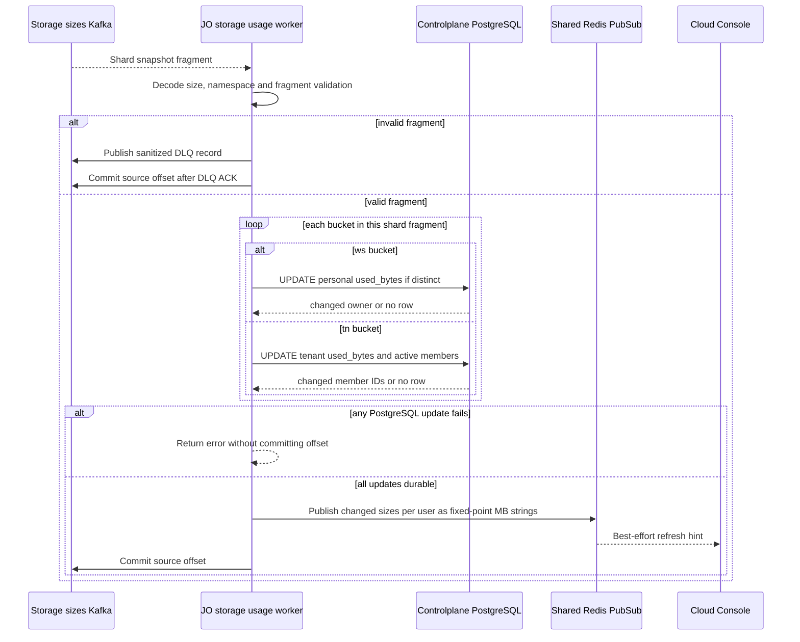
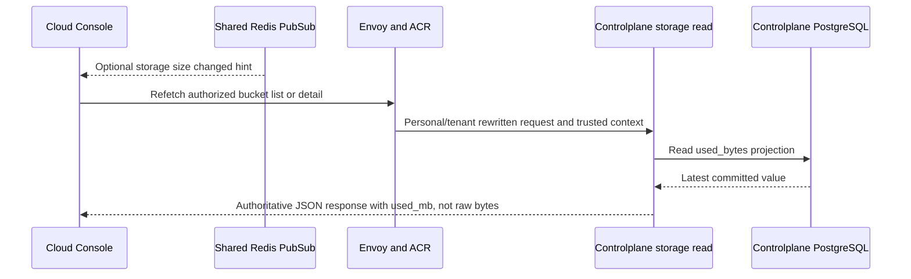

# Storage Bucket Usage Projection — God View

This runtime workflow projects physically observed MinIO usage into
Controlplane PostgreSQL for bucket list/detail views. It is not an API request
and does not use the storage command/result outbox. PostgreSQL `used_bytes` is
the durable read model; the HTTP boundary serializes it as fixed-point `used_mb`
for the UI. Redis only wakes the UI after a changed projection.

The scanner also writes the Zone-local capacity journal used by the separate
hourly billing-report workflow. A UI projection failure must not silently
become a billing observation, and a billing report never reads Controlplane
PostgreSQL.

## Runtime contract

| Item | Contract |
|---|---|
| Trigger | One hourly UTC-boundary scan from each assigned `storage_scan.<shard>` work unit. |
| Producer authority | Only the current assignment epoch may scan, journal and publish. |
| Eligibility | Zone metadata must read successfully, status must be `active`, and `services.storage` must be true. |
| Source observation | MinIO `ListBuckets`, then paginated `ListObjectsV2` for names beginning `ws-` or `tn-`. |
| Work split | Stable bucket-name hash selects one of `ZONE_CONTROL_ASSIGNMENT_SHARDS` shards; batches are paused to bound load. |
| UI transport | Shard fragment `StorageBucketSizesSnapshotV1` on `{prefix}.storage.sizes.v1`, keyed by `zone_id`. |
| Billing journal | `storage.bucket_capacity_journal` plus one `storage.bucket_capacity_scan_completions` marker per shard. |
| Consumer | JO group `aurora-job-orchestrator-storage-sizes-v1`. |
| Durable UI SoT | Controlplane PostgreSQL `personal_buckets.used_bytes` or `tenant_buckets.used_bytes`. |
| Soft projection | Shared Redis Pub/Sub `aurora:realtime:notifications`; loss does not block Kafka offset commit. |

## Message and key contract

| Field/key | Store | Constraint / operation |
|---|---|---|
| `StorageBucketSizesSnapshotV1.event_id` | Kafka protobuf | Exactly 16 bytes; identifies one shard fragment. |
| `zone_id` | Kafka protobuf | Exactly 16 bytes and producer key; JO validates it before projection. |
| `observed_at_unix_ms` | Kafka protobuf | Observation timestamp persisted as the PostgreSQL ordering fence. |
| Bucket entries | Kafka protobuf | At most 50,000; non-negative size; non-empty name ≤128 beginning `ws-` or `tn-`. |
| `storage.bucket_capacity_journal` | Zone ClickHouse | One observed byte count per bucket/shard/generation for billing. |
| `storage.bucket_capacity_scan_completions` | Zone ClickHouse | Barrier marker; billing waits for all configured shard IDs for one hour. |
| `storage.personal_buckets.used_bytes` | PostgreSQL | CTE locks the target and applies only a strictly newer observation; owner is returned only when value changed. |
| `storage.tenant_buckets.used_bytes` | PostgreSQL | Same timestamp fence, then query active tenant member IDs only when value changed. |
| `aurora:realtime:notifications` | Shared Redis Pub/Sub | JSON `{kind:"storage",user_id,payload:{unit:"MB",sizes:{bucket:"decimal"}}}`, best effort only. |
| Dead-letter topic | Kafka | Invalid fragments are DLQ-published before source offset commit. |

## Phase 1 — assigned Zone Control MinIO shard scan

Zone Control starts one scanner per owned `assignment.storage_scan.<shard>`.
The scanner aligns to the next UTC hour, reads `AURORA_ZONE_CONFIG`, skips an
inactive/disabled Zone, lists the bucket catalog, keeps only this shard's
names, and scans object pages in bounded batches with a configured pause.
Assignment epoch checks happen before each batch and before every side effect.
A non-empty shard emits a UI fragment; an empty shard emits no UI fragment but
still records its capacity completion marker for billing.

```mermaid
sequenceDiagram
    participant ZC as Zone Control scheduler
    participant KV as Assignment and Zone metadata KV
    participant W as Storage scan shard worker
    participant M as Private MinIO
    participant H as Zone CH capacity journal/barrier
    participant K as Storage sizes Kafka

    ZC->>KV: Heartbeat and reconcile assignment.storage_scan.shard
    KV-->>ZC: Current member and assignment epoch
    ZC->>W: Start shard with epoch
    W->>W: Wait for next UTC hour boundary
    W->>KV: Read Zone metadata
    alt metadata unavailable, inactive or storage disabled
        KV-->>W: Skip this cycle
    else eligible and assignment current
        W->>M: ListBuckets and retain this shard's names
        loop each bounded batch and every object page
            W->>KV: Verify assignment epoch
            W->>M: ListObjectsV2
            M-->>W: Object sizes and continuation token
            W->>W: Pause between batches
        end
        W->>H: Insert capacity rows and shard completion marker
        W->>KV: Verify assignment before publish
        alt non-empty fragment and assignment still current
            W->>K: Publish StorageBucketSizesSnapshotV1 fragment keyed by Zone
        else empty or assignment lost
            W->>W: Skip UI publish; retain only a complete marker for an empty shard
        end
    end
```

## Phase 2 — JO validation, PostgreSQL projection and soft notification

JO polls the storage-sizes Kafka topic manually. It requires payload ≤8 MiB,
schema version 1, exact event/Zone byte lengths, ≤50,000 entries, namespace
validity and non-negative sizes. A valid fragment updates only the bucket
entries it contains; fragments from different shards therefore compose into
the current projection. A PostgreSQL side-effect error stops the listener
before committing the current or later partition offsets.



## Phase 3 — read-side visibility

Personal and tenant bucket list/detail APIs read `used_bytes` only after their
normal ACR and Controlplane authorization, then serialize it as `used_mb`.
The Pub/Sub message carries the same unit as fixed-point MB strings. The
message is a refresh hint; loss, duplication or reordering cannot alter the
value returned after a refetch.



## Failure, ordering and accuracy rules

| Condition | Actual behavior |
|---|---|
| MinIO scan fails part way | Drop the entire shard cycle; do not emit a partial fragment or billing completion. |
| Assignment is lost | Cancel before the next batch or publish; another replica can rebalance the shard. |
| Empty shard | No UI fragment; completion marker still allows the hourly billing barrier to close. |
| Kafka publish fails | Capacity journal remains durable; UI fragment retries on the next assigned cycle. |
| Invalid source fragment | DLQ publish must succeed before source offset is committed. |
| PostgreSQL update fails | Worker stops before committing current offset, causing replay; `IS DISTINCT FROM` makes replay safe. |
| Redis notification fails | Offset commits after durable PostgreSQL update; UI learns by refetch. |
| Fragment ordering | A late or replayed fragment cannot overwrite a newer `used_bytes_observed_at`; an equal observation is idempotent. |
| Tenant runtime path | `tn-` projection is supported although tenant HTTP storage handlers remain no-op; projection support is not API enablement. |

## Code map

- `zone-control/src/orchestrator.rs`
- `zone-control/src/zone_storage.rs`
- `job-orchestrator/src/storage_usage/worker.rs`
- `job-orchestrator/src/storage_usage/store.rs`
- `proto/storage/storage_sizes.proto`
