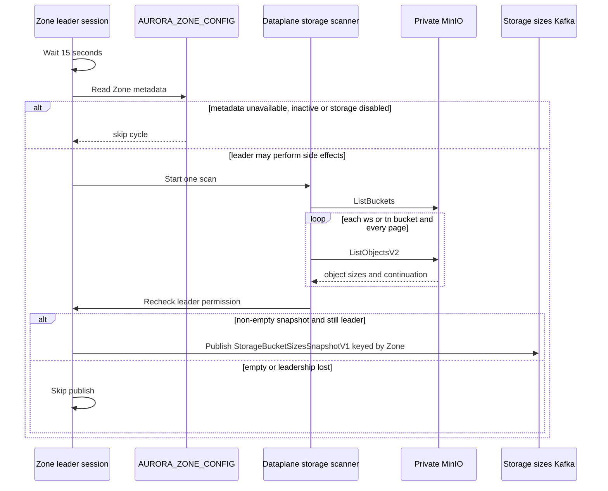
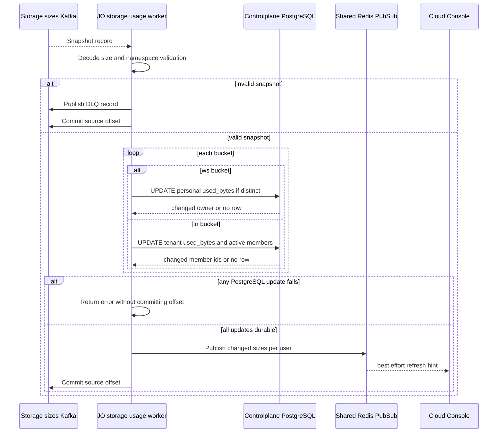
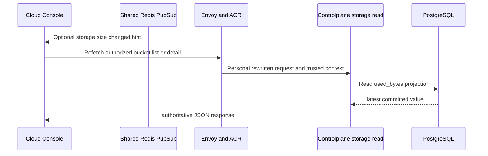

# Storage Bucket Usage Projection — God View

This runtime workflow projects physically observed MinIO usage into
Controlplane PostgreSQL. It is not an API request and it does not use the
storage command/result outbox. PostgreSQL `used_bytes` is the durable read model
for bucket list/detail and a soft realtime notification wakes the UI after a
changed projection.

## Runtime contract

| Item | Contract |
|---|---|
| Trigger | Every 15 seconds from the current Zone Dataplane leader. |
| Producer authority | Only a leader session that still permits external side effects. |
| Eligibility | Zone metadata must read successfully, status must be `active`, and `services.storage` must be true. |
| Source observation | MinIO `ListBuckets`, then `ListObjectsV2` pages for names beginning `ws-` or `tn-`. |
| Transport | `StorageBucketSizesSnapshotV1` on `{prefix}.storage.sizes.v1`, key `zone_id`. |
| Consumer | JO consumer group `aurora-job-orchestrator-storage-sizes-v1`. |
| Durable SoT | Controlplane PostgreSQL `personal_buckets.used_bytes` or `tenant_buckets.used_bytes`. |
| Soft projection | Shared Redis Pub/Sub `aurora:realtime:notifications`; loss does not block Kafka offset commit. |

## Message and key contract

| Field/key | Store | Constraint / operation |
|---|---|---|
| `StorageBucketSizesSnapshotV1.event_id` | Kafka protobuf | Exactly 16 bytes. It is diagnostic, not a per-bucket dedup table. |
| `zone_id` | Kafka protobuf | Exactly 16 bytes and used as producer key. JO currently parses but discards it after validation. |
| `observed_at_unix_ms` | Kafka protobuf | Carried but not used as a PostgreSQL ordering fence. |
| Bucket entries | Kafka protobuf | At most 50,000; non-negative size; non-empty name ≤128 beginning `ws-` or `tn-`. |
| `storage.personal_buckets.used_bytes` | PostgreSQL | `UPDATE ... IS DISTINCT FROM` returns owner only if value changed. |
| `storage.tenant_buckets.used_bytes` | PostgreSQL | Same distinct update, then query active tenant member ids. |
| `aurora:realtime:notifications` | Shared Redis Pub/Sub | JSON `{kind:"storage",user_id,payload:{sizes}}`, best effort only. |
| Dead-letter topic | Kafka | Invalid snapshots are DLQ-published before source offset commit. |

## Phase 1 — Leader-gated MinIO scan in Dataplane

A Dataplane process starts the scanner only as a Zone leader duty. At each
cycle it waits 15 seconds, reads Zone metadata from `AURORA_ZONE_CONFIG`, skips
when metadata read fails or storage is disabled/inactive, and checks leader
permission both before scanning and before publishing. It lists all buckets,
ignores system names outside `ws-`/`tn-`, scans every paginated object list and
uses saturating addition for object sizes. It publishes a complete snapshot only
when non-empty.

## Phase 2 — JO validation, PostgreSQL projection and soft notification

JO polls Kafka manually. It requires payload ≤8 MiB, decodes schema version 1,
validates byte lengths/count/names/non-negative sizes, and sends malformed
records to DLQ before committing their source offset. For a valid snapshot it
iterates entries. Personal update joins workspace and returns one owner only
when value changed. Tenant update returns all active members only when its
bucket changed. Database side-effect error exits listener without committing
this or later partition offsets. After all durable updates, it publishes a
per-user size map to Redis. Pub/Sub failure is logged and ignored because the
database projection is already authoritative.

## Phase 3 — Read-side visibility

Personal bucket list/detail reads `used_bytes` directly from PostgreSQL after
normal ACR and Controlplane authorization. UI can receive Pub/Sub hint, but
loss/reordering of notification cannot alter the value it sees after refetch.

## Failure, ordering and accuracy rules

| Condition | Actual behavior |
|---|---|
| MinIO scan fails part way | Entire cycle is dropped and no partial snapshot is published. |
| Snapshot is empty | No snapshot is emitted, so a bucket disappearing from MinIO does not itself set Central usage to zero. |
| Kafka publish fails | Error is logged. Next successful leader cycle retries with a new full snapshot. |
| Invalid source snapshot | DLQ publish must succeed before source offset is committed. |
| PostgreSQL update fails | Worker stops with error before committing current offset, causing replay. Replays are safe with `IS DISTINCT FROM`. |
| Redis notification fails | Offset commits after durable PG update. UI eventually learns by refetch. |
| Snapshot ordering | `observed_at_unix_ms` is not used to fence out-of-order snapshot writes. A late snapshot can overwrite a newer `used_bytes`; this is an accuracy discrepancy. |
| Snapshot source Zone | JO validates that `zone_id` is 16 bytes but discards it before updating by globally unique bucket name. The consumer does not prove that snapshot Zone equals stored bucket Zone. |
| Tenant runtime path | Worker supports `tn-` projections although tenant HTTP handlers are currently no-op. This is a runtime data path, not evidence that tenant storage API is enabled. |

## Code map

- `dataplane/src/leader/leadership.rs`
- `dataplane/src/leader/infra/storage.rs`
- `dataplane/src/infra/kafka.rs`
- `job-orchestrator/src/storage_usage/worker.rs`
- `job-orchestrator/src/storage_usage/store.rs`
- `proto/platform_transport.proto`
