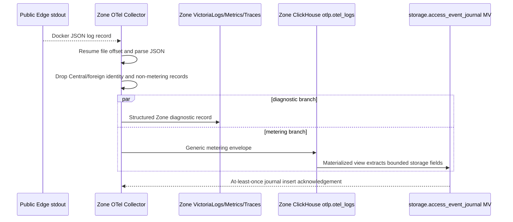

# Storage Usage Report Publish — God View

This is the Zone-owned hourly metering workflow for storage transfer and
occupied capacity. It converts trusted Zone observations into a bounded
`StorageUsageReportV1`; it never infers a payer and never mutates a wallet.
The report is the only billable hand-off from a Zone to Central for these
three usage kinds:

- `NETWORK_IN`: successful upload bytes (`bytes_received`)
- `NETWORK_OUT`: successful download bytes (`bytes_sent`)
- `STORAGE`: end-of-hour occupied capacity represented exactly as
  `BYTE_HOUR` for the fixed one-hour window

This is a background workflow, not HTTP, so it has no ACR phase. Tickets,
cookies, access keys, authorization headers and object paths are excluded at
the Public Edge boundary and never enter any journal or report.

## Scope and ownership

| Item | Contract |
| --- | --- |
| Owner | Zone Control: `storage_scan.<shard>` capacity workers and `storage_report.0` publisher |
| Input | Successful storage transfer access event plus MinIO bucket capacity observations |
| Window | UTC half-open hourly window `[window_start, window_end)`; five-minute late-event grace |
| Zone stores | Zone OTel/Victoria for diagnostics; Zone ClickHouse for metering journals; Zone JetStream File for report outbox |
| Central transport | Kafka `{topic_prefix}.storage.usage.reports.v1`, keyed by Zone UUID |
| Output | `StorageUsageReportV1`, at-least-once; report identity is deterministic for Zone/window/sequence |
| Payer authority | Central Billing PostgreSQL ownership projection; never Zone ClickHouse or Zone Control |

## Phase 1 — Public Edge emits the trusted access event

The event is emitted only after either a browser transfer ticket or a direct
SDK request has passed the embedded Public Authorizer and the upstream request
has completed. Envoy owns the byte counters and final status. The client cannot
select `resource_id` or any metering classification.

The branch selector is exactly header presence. A request containing
`X-Aurora-Transfer-Ticket` is routed to `minio_transfer`, has caller SigV4
headers removed and must pass the ticket branch. Without that header, Envoy
uses the direct `minio` route, preserves SDK SigV4 and the authorizer uses the
admission name index. `Origin`, User-Agent and `Authorization` never choose the
branch; sending both ticket and SigV4 still selects only the ticket branch.

```mermaid
sequenceDiagram
    participant C as Browser or SDK
    participant E as Zone Public Edge Envoy
    participant A as Embedded Public Authorizer
    participant K as Zone transfer/admission KV
    participant M as MinIO or runtime stream
    participant L as Envoy access logger

    C->>E: Browser method-bound ticket request or SDK SigV4 GET/PUT
    E->>A: ExtAuthz CheckRequest(method, path, headers, metadata)
    alt browser ticket branch
        A->>A: Split ticket id/secret and hash the secret
        A->>K: Read resource ticket and admission; CAS Issued to Consuming
    else direct SDK branch
        A->>K: Read admission name/{bucket}; preserve SigV4 for MinIO
    end
    alt authority invalid, expired, replayed or KV unavailable
        A-->>E: Deny or fail-closed unavailable decision
        E-->>C: Error; no upstream request and no metering event
    else authorized
        A-->>E: Allow; remove client identity and inject trusted resource headers
        E->>M: Sanitized method/path/body with trusted resource context
        M-->>E: Final status and transfer counters
        E-->>C: Upstream response
        E->>L: Generic metering envelope after response completion
    end
```

The logger records only the fields needed by the Zone projection:

| Field | Source and invariant |
| --- | --- |
| `log_type` | Exactly `metering` |
| `module` | Exactly `storage` |
| `metering_schema` | Exactly `storage.access.completed.v1` |
| `event_id` | Trusted request identity; generated by Envoy if absent |
| `request_id` | Compatibility alias of `event_id` during journal migration |
| `zone_id` | Zone configuration, not a client header |
| `resource_id` | Authorizer-injected `X-AURORA-RESOURCE-ID`, non-nil UUID |
| `method` | Original authorized method. Browser multipart may journal `POST`/`DELETE`; only successful `GET`/`PUT` enters transfer billing. |
| `status` | Final HTTP status; only 2xx rows are billable |
| `bytes_received` | Envoy upload counter, input to `NETWORK_IN` |
| `bytes_sent` | Envoy download counter, input to `NETWORK_OUT` |
| `duration_ms` | Diagnostic only; never a price input |

No ticket, cookie, `Authorization`, access secret, object key or raw path is
written to the access event.

At the KV boundary, the Public Authorizer reads
`AURORA_ZONE_TRANSFER/{ticket_id}` protobuf `TransferTicketV1` fields
`schema_version`, `ticket_id`, `secret_sha256`, `capability`, `actor_id`,
`zone_id`, `resource_id`, `workspace_id`, `operation_id`, `method`,
`public_path`, optional content constraints, issue/expiry timestamps,
`one_time` and `state`, then CASes `Issued` to `Consuming`. It also reads
`AURORA_ZONE_ADMISSION/{resource_id}` JSON fields `resource_id`,
`policy_version`, `decision`, `effective_at_unix_seconds` and
`valid_until_unix_seconds`. Only a current `ALLOW` reaches MinIO and therefore
the response-completion logger.

For the direct SDK branch there is no transfer-ticket KV access. The
authorizer reads `AURORA_ZONE_ADMISSION/name/{bucket}` JSON fields
`resource_id`, `resource_name`, `policy_version`, `decision`,
`effective_at_unix_seconds` and optional `valid_until_unix_seconds`; it requires
the record name to equal the path bucket and a current `ALLOW`, then injects the
record's `resource_id` for metering. MinIO, not KV, validates the preserved
SigV4 credential and bucket policy.

The journal retains authorized browser multipart control calls for diagnosis,
but the hourly publisher filters to `method IN ('GET', 'PUT')`. Consequently
multipart initiate/complete/abort are not transfer quantities; uploaded part
bytes are counted from their successful ticket-bound `PUT` requests.

## Phase 2 — Zone OTel routes diagnostic and metering copies

Zone OTel reads the access stream using persistent file offsets. It sends all
bounded records to the Zone Victoria stack for diagnostics and sends only the
generic `log_type=metering` envelope to Zone ClickHouse. The collector does
not contain a storage-specific pricing rule.



`storage.access_event_journal` is a `ReplacingMergeTree` keyed by the trusted
resource/request identity. The publisher queries `FINAL` and never treats an
OTel retry as another billable transfer. Unknown modules or schemas remain in
raw Zone telemetry and do not enter the storage projection.

## Phase 3 — Zone Control scans capacity by shard

Capacity is not read from Central and is not scanned every few seconds. Zone
Control creates `ZONE_CONTROL_ASSIGNMENT_SHARDS` independent work units. Each
replica owns zero or more `assignment.storage_scan.<shard>` units through the
NATS KV membership/assignment coordinator. A shard scans only bucket names whose
stable SHA-256 rendezvous maps to that shard.

The default cadence is one scan at the next UTC hour boundary and then once per
hour. Every shard lists its buckets, processes them in bounded batches, pauses
between batches, and checks its assignment epoch before the next batch and
before publishing. A lost assignment cancels the scan without publishing a
partial completion.

```mermaid
sequenceDiagram
    participant C as Zone Control replica
    participant A as NATS KV assignment.storage_scan.shard
    participant S as Zone Control shard worker
    participant M as MinIO catalog
    participant O as MinIO object paginator
    participant J as Zone CH capacity journal
    participant B as Zone CH completion barrier
    participant U as Zone storage-size Kafka topic

    C->>A: Heartbeat capacity and reconcile weighted shard assignment
    A-->>C: member and assignment epoch
    C->>S: Start storage_scan.<shard> with epoch
    S->>S: Wait for hourly boundary and verify Zone storage is active
    S->>M: List bucket catalog
    M-->>S: Bucket names; retain only this shard's names
    loop bounded batch with configured pause
        S->>A: Verify assignment epoch is still current
        S->>O: List object pages for one bucket batch
        O-->>S: Object sizes and pagination state
    end
    S->>J: Insert observed bytes, window end, bucket and shard
    S->>B: Insert one completion marker for this shard generation
    S->>A: Verify assignment before side effects
    S->>U: Publish UI snapshot only after journal/completion success
```

The completion marker is the barrier for billing. A report publisher must see
all configured shard IDs for the same hourly `billing_window_end`; otherwise
the window remains pending and no partial storage charge is emitted.

The scanner's KV inputs are local orchestration only:
`AURORA_ZONE_CONFIG/zone.metadata` stores JSON `status`, `services`,
`updated_at`; and
`AURORA_ZONE_CONTROL_ASSIGNMENTS/assignment.storage_scan.{shard}` stores JSON
`unit_key`, `member_id`, `assignment_epoch`, `assigned_at_unix_ms`,
`expires_at_unix_ms`. Neither schema carries bucket usage or billing quantity.

## Phase 4 — Zone Control closes the hourly window and writes the outbox

The single `assignment.storage_report.0` worker runs every few seconds only to
check eligibility; it does not rescan storage. After the five-minute grace
period it reads the transfer journal and the capacity journal for each closed
hour. It skips a window until every capacity shard completion marker exists.

```mermaid
sequenceDiagram
    participant W as Zone Control storage_report.0
    participant A as Assignment KV
    participant T as storage.access_event_journal FINAL
    participant C as capacity journal and completion barrier
    participant P as Report protobuf builder
    participant Q as Zone JetStream File outbox

    W->>A: Check assignment.storage_report.0 epoch
    W->>C: Count completed shard IDs for closed hour
    alt capacity barrier incomplete
        C-->>W: Fewer than configured shard count
        W-->>W: Leave window pending; retry/backfill later
    else barrier complete
        W->>T: Sum bytes_received/bytes_sent and request count by resource UUID
        T-->>W: NETWORK_IN and NETWORK_OUT observations
        W->>C: Read argMax occupied bytes by bucket name
        C-->>W: STORAGE observations and fixed-point GB-hour quantity
        W->>P: Validate bounds, identities and hourly window
        P->>P: SHA-256 canonical payload with report_sha256 empty
        P->>Q: Publish Nats-Msg-Id=report_id and await JetStream ACK
    end
```

The report may contain multiple aggregates for one hour. Transfer aggregates
use `resource_id`; capacity aggregates use a validated `resource_name` and a
deterministic synthetic line identity downstream. `storage_bytes` is retained
for audit/diagnostics and must equal the billable `storage_byte_hours`
observation. Keeping bytes exact prevents a quantity rounding step before the
PAYG money boundary.

The producer contract is bounded to 512 KiB and 10,000 aggregates. Startup
backfill and every downstream validator share the 30-day Zone outbox recovery
horizon; startup recovery uses `METERING_MAX_BACKFILL_WINDOWS`, which defaults
to and is capped at 720 hourly windows. After a successful startup pass, the
steady loop retries only the newest 24 windows to avoid a permanent 30-day
ClickHouse rescan. Reports older than the explicit retention boundary are
quarantined rather than silently charged.

`AURORA_ZONE_CONTROL_ASSIGNMENTS/assignment.storage_report.0` uses the same
assignment JSON schema (`unit_key`, `member_id`, `assignment_epoch`,
`assigned_at_unix_ms`, `expires_at_unix_ms`). Phase 4 consumes only the matching
epoch and unexpired lease; report contents come from ClickHouse, not this KV.

## Phase 5 — Durable Zone outbox relay to Kafka

The relay is a separate outbox consumer. It never calls Billing PostgreSQL and
does not create an outbox in the Zone database (a Zone has no billing Postgres).

```mermaid
sequenceDiagram
    participant Q as Zone JetStream report outbox
    participant R as Zone Control relay
    participant K as Kafka storage.usage.reports.v1
    participant J as Job Orchestrator consumer

    R->>Q: Pull pending report
    Q-->>R: Payload, report ID and delivery attempt
    R->>R: Recheck assignment and validate protobuf/checksum
    alt Kafka unavailable or publish rejected
        R-->>Q: Leave message pending; retry same report ID
    else Kafka acks all
        R->>K: Publish keyed by zone_id with idempotent producer
        K-->>R: Durable acknowledgement
        R->>Q: ACK report after Kafka acknowledgement
        K->>J: Consumer receives the same versioned report
    end
```

Job Orchestrator validates the report again, writes the payload to the shared
Redis stream, and commits Kafka only after `XADD` succeeds. The Cost Engine is
the next workflow owner: it opens the three pricing runs and atomically settles
wallet/ledger lines in Billing PostgreSQL. Central ClickHouse is not involved.

## Contract and key table

| Key or contract | Value |
| --- | --- |
| Protobuf | `proto/billing/storage/usage/v1/usage_report.proto` |
| Usage kinds | `NETWORK_IN/BYTE`, `NETWORK_OUT/BYTE`, `STORAGE/BYTE_HOUR` |
| Kafka topic | `{topic_prefix}.storage.usage.reports.v1` |
| Kafka key | `zone_id` |
| Report identity | UUIDv5 of Zone, hourly start/end and sequence |
| Transfer journal identity | `(resource_id, request_id)` |
| Capacity journal identity | `(zone_id, billing_window_end, bucket_name, scan_generation, shard_id)` |
| Capacity barrier | `storage.bucket_capacity_scan_completions`, all configured shard IDs required |
| Assignment keys | `assignment.storage_scan.<shard>` and `assignment.storage_report.0` |
| Generic envelope | `log_type=metering`, `module=storage`, `metering_schema=storage.access.completed.v1` |
| Report outbox | `AURORA_ZONE_STORAGE_USAGE_OUTBOX`, subject `aurora.zone.storage.usage.report.<zone_uuid>` |
| Quarantine | `AURORA_ZONE_STORAGE_USAGE_DLQ`, sanitized reason and checksum only |

## Failure and security rules

| Failure | Behavior |
| --- | --- |
| Authorizer denial or upstream non-2xx | No billable access row |
| OTel retry/restart | Replacing journal plus `FINAL` query prevents duplicate billing |
| Unknown module/schema | Raw Zone diagnostics only; no storage projection |
| MinIO list/page error | Shard scan retries; no completion marker for the failed generation |
| Shard assignment loss | Cancel before next batch or publish; another replica rebalances the shard |
| Incomplete shard barrier | Keep the hourly report pending; never charge a partial capacity snapshot |
| Zone ClickHouse unavailable | Keep collector/scan/report work retryable; do not publish a partial report |
| Kafka unavailable | JetStream outbox remains pending with the same report ID |
| Job Orchestrator/Redis unavailable | Kafka offset is not committed until the Redis `XADD` succeeds |
| Report replay | Deterministic report/line identities and Billing inbox make replay idempotent |
| Correction | Append-only lineage; no mutation of a settled report or ledger |
| Secret leakage attempt | Ticket, cookie, Authorization, access secret, object path and payer identity are absent from the envelope |

## Code and deployment map

- `zone-public-edge-gateway/envoy.yaml`
- `dev/zone/otel/otel-collector.yml`
- `dev/zone/clickhouse/init.sql`
- `zone-control/src/zone_storage.rs` (hourly sharded capacity scanner)
- `zone-control/src/metering.rs` (closed-window report builder and durable NATS outbox publisher)
- `zone-control/src/storage_report_relay.rs` (independently restartable NATS outbox → Kafka relay and quarantine)
- `zone-control/src/orchestrator.rs` (assignment, rebalance and lifecycle)
- `job-orchestrator/src/storage_metering.rs` (Kafka to Shared Redis relay)
- `proto/billing/storage/usage/v1/usage_report.proto`
