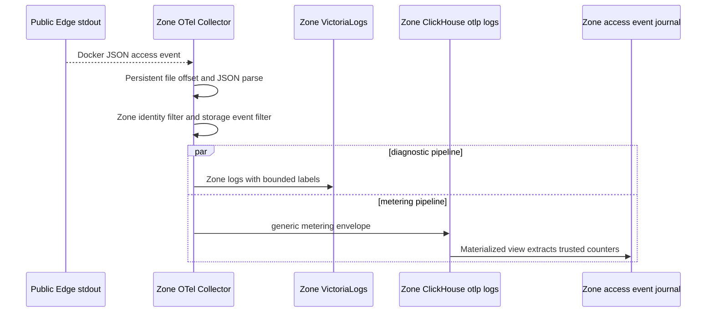

# Storage Usage Report Publish — God View

This is the Zone-owned background workflow that turns completed storage
transfers into a bounded report for Central billing. It is not an HTTP API and
has no ACR phase. The browser ticket remains an authorization capability only;
it is never copied into telemetry or a billing report. The report describes
observed bytes for a stable resource reference inside one Zone and one closed
UTC window.

**Implementation status:** the reviewed generic metering envelope, storage
module projection, Zone-local journal,
canonical report contract, closed-window publisher and durable JetStream outbox
are implemented behind `ZONE_CONTROL_METERING_ENABLED=false` by default. The
publisher runs only while the `storage_report` work unit is assigned to the
current Zone Control replica, with an assignment epoch and cancellation fence;
it relays to Kafka and never mutates a wallet. Until the flag and the Cost
cutover gates are approved, the existing Central ClickHouse polling path remains
the only charge-producing billing runtime.

## Scope and ownership

| Item | Contract |
| --- | --- |
| Owner | Zone Control metering workflow, `storage_report` work-unit assignment |
| Input | Post-upstream generic metering event from Zone Public Edge |
| Billable fields | `resource_id`, `bytes_sent` for `NETWORK_OUT`; `bytes_received` is retained for the approved upload branch |
| Identity | Zone UUID plus stable resource UUID; no payer is inferred in Zone |
| Window | UTC half-open `[window_start, window_end)` with a maximum of 24 hours |
| Durable local state | Zone ClickHouse access-event journal and JetStream File outbox `AURORA_ZONE_STORAGE_USAGE_OUTBOX` |
| Transport | Kafka topic `{prefix}.storage.usage.reports.v1`, keyed by Zone UUID |
| Output | `StorageUsageReportV1` protobuf, at-least-once |

## Phase 1 — Public Edge emits a reviewed access event

The event exists only after the Public Authorizer has consumed the ticket and
Envoy has received a successful upstream result. The authorizer injects the
trusted resource header; the client cannot choose it. Envoy records transfer
counters and status, but the access log intentionally omits the ticket,
cookie, Authorization value, access key and object path.


The event fields are:

| Field | Source | Rule |
| --- | --- | --- |
| `log_type` | Generic envelope discriminator | Exactly `metering` |
| `module` | Generic envelope module | Exactly `storage` for this projection |
| `metering_schema` | Module contract version | Exactly `storage.access.completed.v1` |
| `event_id` | `X-REQUEST-ID` | Generic event identity; generated by the edge if absent |
| `request_id` | `event_id` compatibility projection | Required for storage deduplication during migration |
| `resource_id` | Authorizer mutation `X-AURORA-RESOURCE-ID` | Trusted UUID only; empty events are rejected by the journal view |
| `method` | HTTP method | `GET` or `PUT` for the browser transfer branch |
| `status` | Final response code | Only successful statuses enter the future billable aggregate |
| `bytes_received` | Envoy counter | Upload observation |
| `bytes_sent` | Envoy counter | Download or `NETWORK_OUT` observation |
| `duration_ms` | Envoy duration | Diagnostic, never a price input |

## Phase 2 — Zone OTel and local journal

The Zone collector reads the Docker access log once using persistent file
offsets. The normal logs pipeline sends the event to Zone VictoriaLogs. A
second generic `logs/metering` pipeline selects `log_type=metering` without a
module-specific collector rule and sends it to the Zone ClickHouse
`otlp.otel_logs` table. A storage-owned materialized view accepts only
`module=storage` plus `metering_schema=storage.access.completed.v1` and copies
the bounded fields to `storage.access_event_journal` keyed by
`(resource_id, request_id)`.



The journal is `ReplacingMergeTree` rather than a direct summing table. The
future publisher must query the deduplicated request identity before creating
an aggregate. OTel retry or collector restart therefore cannot be treated as
an additional billable request.

## Phase 3 — Closed-window aggregation and report outbox

After the window close time and a bounded late-event grace period, the assigned
Zone Control work unit reads the deduplicated journal. It groups by resource and
direction, validates numeric limits, computes the canonical checksum with
`report_sha256` cleared, and writes the complete protobuf to the local
JetStream File outbox before contacting Kafka. The report identity is UUIDv5 of
Zone plus window and sequence, so a retry cannot append a second report. The
assignment epoch is checked before the workflow starts; losing assignment
cancels the task and the durable outbox/idempotent report identity bounds any
in-flight replay. A worker restart resumes the durable outbox consumer; it does
not create a new identity.

```mermaid
sequenceDiagram
    participant O as Assigned Zone Control metering worker
    participant L as Zone access event journal
    participant Q as JetStream File report outbox
    participant K as Kafka storage report topic

    O->>O: Check current assignment epoch and closed UTC window
    O->>L: Read request-deduplicated events for one resource window
    L-->>O: Counters and request count
    O->>O: Validate bounds and build StorageUsageReportV1
    O->>O: Compute SHA-256 over canonical protobuf with checksum empty
    O->>Q: Publish report with Nats-Msg-Id=report_id and await ACK
    alt Kafka unavailable
        Q-->>O: Keep pending; the durable outbox has no Kafka side effect yet
    else Kafka available
        O->>K: Publish with idempotent producer, acks=all and Zone key
        K-->>O: Durable acknowledgement
        O->>Q: ACK outbox message after Kafka acknowledgement
    end
```

## Contract and key table

| Key or contract | Value |
| --- | --- |
| Protobuf | `proto/cost-manager/engine/storage_usage_report.proto` |
| Kafka topic | `{topic_prefix}.storage.usage.reports.v1` |
| Kafka key | `zone_id` |
| Report identity | `report_id` UUID plus `zone_id`, window and `sequence` |
| Correction identity | `correction=true` and `correction_of_report_id`; append-only |
| Local journal identity | `(resource_id, request_id)` |
| Generic envelope | `log_type=metering`, `module=storage`, `metering_schema=storage.access.completed.v1` |
| Outbox state | `PENDING -> PUBLISHED`, never delete before retention/audit boundary |
| JetStream outbox | Stream `AURORA_ZONE_STORAGE_USAGE_OUTBOX`, subject `aurora.zone.storage.usage.report.<zone_uuid>`, durable consumer `zone-control-storage-report-kafka-v1` |
| Quarantine | Stream `AURORA_ZONE_STORAGE_USAGE_DLQ`, sanitized reason plus payload SHA-256 only |

## Failure and security rules

| Failure | Behavior |
| --- | --- |
| Authorizer denial | No upstream call and no billable event |
| OTel restart or retry | Journal may receive a duplicate; publisher deduplicates request ID |
| Invalid resource or oversized event | Reject and expose a bounded metric; do not report |
| Unknown metering module/schema | Keep in generic raw telemetry only; no storage projection or billing report |
| Existing ClickHouse volume during envelope migration | Apply the re-runnable journal/view migration before collector restart; keep the legacy storage event accepted only for the bounded transition window |
| ClickHouse unavailable | Keep collector queue pending; no report is closed from partial input |
| Zone Control loses assignment or membership heartbeat | Assignment-scoped metering task is cancelled; no new aggregation/outbox/Kafka side effect is started |
| Kafka publish fails | Keep outbox pending and retry with the same report ID |
| Correction | Publish a new report lineage; never edit a settled report or ledger |
| Secret leakage attempt | Ticket, cookie, Authorization, access secret and object path are excluded at the Envoy schema boundary |

## Code and deployment map

- `zone-public-edge-gateway/envoy.yaml`
- `dev/zone/otel/otel-collector.yml`
- `dev/zone/clickhouse/init.sql`
- `proto/cost-manager/engine/storage_usage_report.proto`
- `zone-control/src/metering.rs` (opt-in closed-window publisher and Kafka relay)
- `zone-control/src/orchestrator.rs` (membership, assignment epoch, rebalance and metering lifecycle)
- Future God Plan: `cost-manager/tmp/zone-local-storage-metering-refactor-plan.md`
