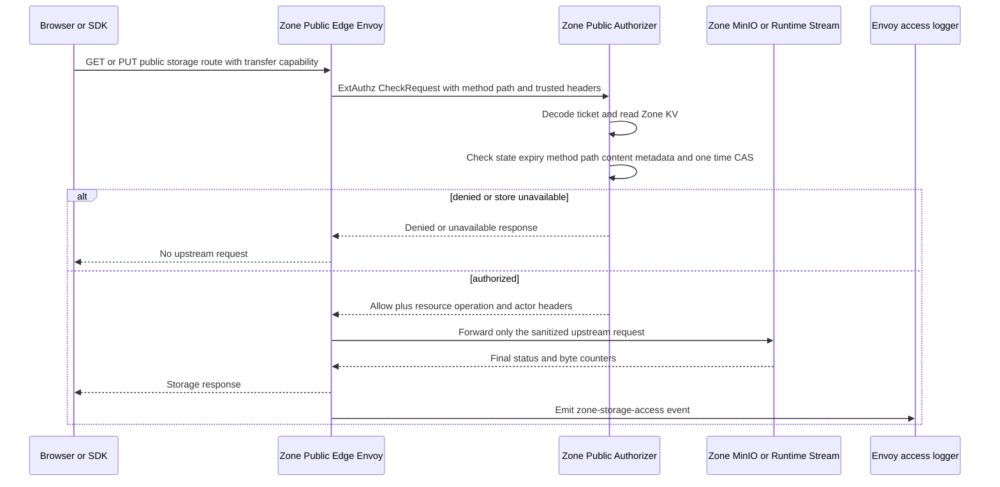
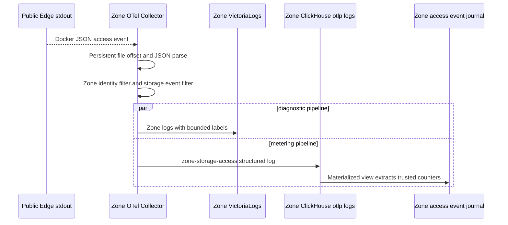
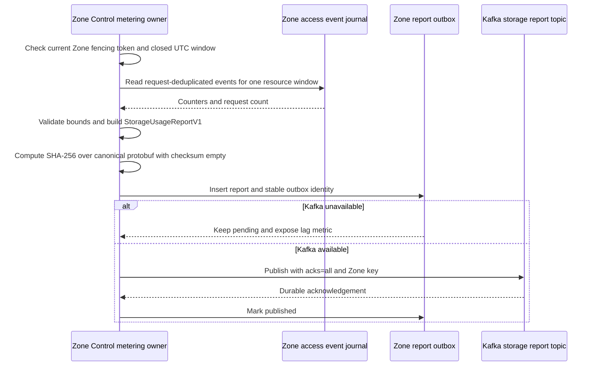

# Storage Usage Report Publish — God View

This is the Zone-owned background workflow that turns completed storage
transfers into a bounded report for Central billing. It is not an HTTP API and
has no ACR phase. The browser ticket remains an authorization capability only;
it is never copied into telemetry or a billing report. The report describes
observed bytes for a stable resource reference inside one Zone and one closed
UTC window.

**Implementation status:** the reviewed access-event schema, Zone-local journal
deployment and canonical report contract are staged. The Zone report publisher
and Kafka outbox remain shadow-mode work in the God Plan. Until that publisher
is enabled, the existing Central ClickHouse polling path remains the billing
runtime and this workflow must not debit a wallet.

## Scope and ownership

| Item | Contract |
| --- | --- |
| Owner | Zone Control metering workflow, leader-gated after duty takeover |
| Input | Post-upstream storage access event from Zone Public Edge |
| Billable fields | `resource_id`, `bytes_sent` for `NETWORK_OUT`; `bytes_received` is retained for the approved upload branch |
| Identity | Zone UUID plus stable resource UUID; no payer is inferred in Zone |
| Window | UTC half-open `[window_start, window_end)` with a maximum of 24 hours |
| Durable local state | Zone ClickHouse access-event journal and a report outbox owned by the future publisher |
| Transport | Kafka topic `{prefix}.storage.usage.reports.v1`, keyed by Zone UUID |
| Output | `StorageUsageReportV1` protobuf, at-least-once |

## Phase 1 — Public Edge emits a reviewed access event

The event exists only after the Public Authorizer has consumed the ticket and
Envoy has received a successful upstream result. The authorizer injects the
trusted resource header; the client cannot choose it. Envoy records transfer
counters and status, but the access log intentionally omits the ticket,
cookie, Authorization value, access key and object path.

The event fields are:

| Field | Source | Rule |
| --- | --- | --- |
| `log_type` | Envoy static schema | Exactly `zone-storage-access` |
| `request_id` | `X-REQUEST-ID` | Required for deduplication; generated by the edge if absent |
| `resource_id` | Authorizer mutation `X-AURORA-RESOURCE-ID` | Trusted UUID only; empty events are rejected by the journal view |
| `method` | HTTP method | `GET` or `PUT` for the browser transfer branch |
| `status` | Final response code | Only successful statuses enter the future billable aggregate |
| `bytes_received` | Envoy counter | Upload observation |
| `bytes_sent` | Envoy counter | Download or `NETWORK_OUT` observation |
| `duration_ms` | Envoy duration | Diagnostic, never a price input |

## Phase 2 — Zone OTel and local journal

The Zone collector reads the Docker access log once using persistent file
offsets. The normal logs pipeline sends the event to Zone VictoriaLogs. A
second filter-isolated `logs/storage-metering` pipeline sends only this event
type to the Zone ClickHouse `otlp.otel_logs` table. A materialized view copies
the bounded fields to `storage.access_event_journal` keyed by
`(resource_id, request_id)`.

The journal is `ReplacingMergeTree` rather than a direct summing table. The
future publisher must query the deduplicated request identity before creating
an aggregate. OTel retry or collector restart therefore cannot be treated as
an additional billable request.

## Phase 3 — Closed-window aggregation and report outbox

After the window close time and a bounded late-event grace period, the Zone
Control metering owner reads the deduplicated journal. It groups by resource and
direction, validates numeric limits, computes the canonical checksum with
`report_sha256` cleared, and writes the complete protobuf to the local report
outbox before contacting Kafka. Only the current fenced Zone Control owner may
publish a report. A worker restart resumes the outbox row; it does not create a
new report identity for the same window.

## Contract and key table

| Key or contract | Value |
| --- | --- |
| Protobuf | `proto/cost-manager/engine/storage_usage_report.proto` |
| Kafka topic | `{topic_prefix}.storage.usage.reports.v1` |
| Kafka key | `zone_id` |
| Report identity | `report_id` UUID plus `zone_id`, window and `sequence` |
| Correction identity | `correction=true` and `correction_of_report_id`; append-only |
| Local journal identity | `(resource_id, request_id)` |
| Outbox state | `PENDING -> PUBLISHED`, never delete before retention/audit boundary |

## Failure and security rules

| Failure | Behavior |
| --- | --- |
| Authorizer denial | No upstream call and no billable event |
| OTel restart or retry | Journal may receive a duplicate; publisher deduplicates request ID |
| Invalid resource or oversized event | Reject and expose a bounded metric; do not report |
| ClickHouse unavailable | Keep collector queue pending; no report is closed from partial input |
| Zone Control loses lease | Stop aggregation and publish side effects immediately |
| Kafka publish fails | Keep outbox pending and retry with the same report ID |
| Correction | Publish a new report lineage; never edit a settled report or ledger |
| Secret leakage attempt | Ticket, cookie, Authorization, access secret and object path are excluded at the Envoy schema boundary |

## Code and deployment map

- `zone-public-edge-gateway/envoy.yaml`
- `dev/zone/otel/otel-collector.yml`
- `dev/zone/clickhouse/init.sql`
- `proto/cost-manager/engine/storage_usage_report.proto`
- Future owner: `zone-control/src/orchestrator.rs` metering workflow
- Future God Plan: `cost-manager/tmp/zone-local-storage-metering-refactor-plan.md`
