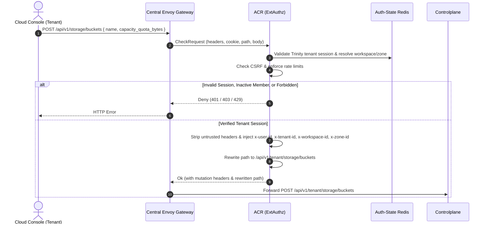
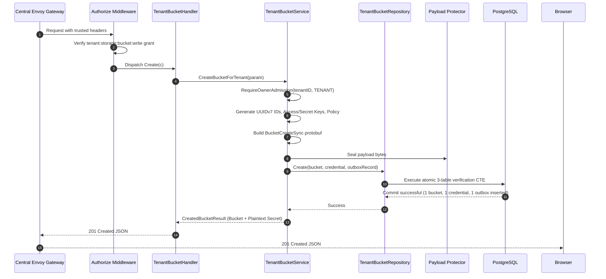
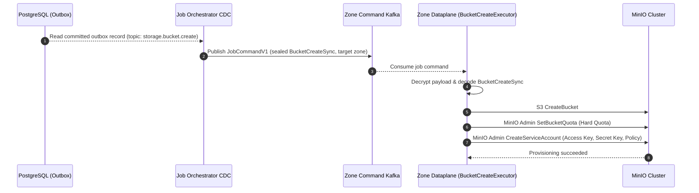
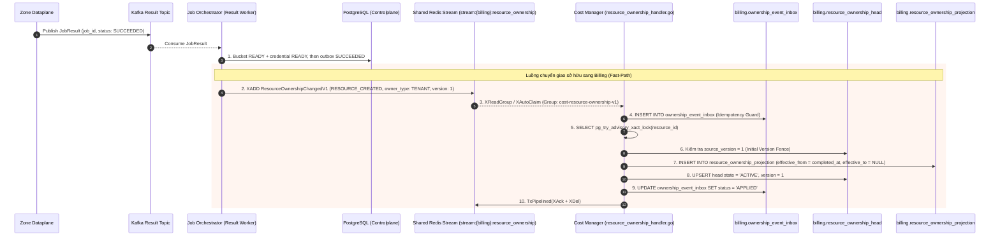
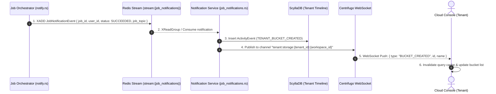
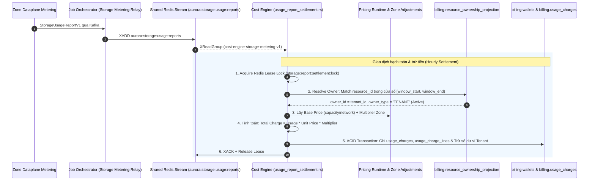

# Tenant Bucket Create — God View

> **Critical-route revision (2026-08-26):** the public request is `POST /api/v1/critical/storage/buckets`; ACR consumes the session proof bound to its exact method, path and body, then rewrites only to `/api/v1/tenant/critical/storage/buckets`. Controlplane runs `RequireSessionProof` before `Authorize`. Older non-critical route text below is superseded.

Tenant Bucket creation is an asynchronous provisioning mutation for enterprise workspaces.
Controlplane executes commercial admission verification for the tenant, generates physical
bucket identifiers, initial bootstrap credentials, and writes a sealed Zone outbox command
within an atomic CTE transaction. A `201 Created` returns the durable bucket entity and the
one-time plaintext bootstrap credentials; physical MinIO provisioning occurs asynchronously
via Dataplane at the edge zone.

---

## API-scope contract

Browser calls neutral `POST /api/v1/storage/buckets`. ACR validates the Trinity tenant membership,
resolves workspace and zone context, rewrites the path to `/api/v1/tenant/storage/buckets`,
and injects trusted identity headers (`x-user-id`, `x-workspace-id`, `x-zone-id`, `x-tenant-id`).
Controlplane requires `storage:bucket:write` permission. Repository enforces 3-table join
verification (`tenant_workspaces`, `tenant_memberships`, `tenant_buckets`) before committing.

---

## REST input and output

### Request headers used

| Header | Use |
|---|---|
| `Cookie` | ACR derives Trinity session, tenant membership, Zone, and workspace context. |
| `Origin` | CORS enforcement at Envoy / ACR. |
| `X-Requested-With` or `Sec-Fetch-Site` | Required by ACR CSRF check for `POST`. |
| `traceparent` | Injected into outbox record for distributed OpenTelemetry tracing. |

### JSON payload

```json
{
  "name": "company-assets",
  "capacity_quota_bytes": 107374182400
}
```

| Field | Type | Contract |
|---|---|---|
| `name` | `string` | **Required**. 3-63 characters, lowercase alphanumeric and hyphens. Converted to physical name `tn-{tenant_id[:8]}-{name}`. |
| `capacity_quota_bytes` | `integer` | **Required**. Initial hard storage quota boundary (`>= 1073741824` = 1 GiB). |

### Response payload

| Status | Payload | Reason |
|---|---|---|
| `201` | `{"status": "success", "data": { "bucket": { "id": "...", "name": "tn-...", "workspace_id": "...", "zone_id": "...", "tenant_id": "...", "capacity_quota_bytes": 107374182400, "used_bytes": 0, "versioning_enabled": false, "lifecycle_rules": [] }, "credential": { "id": "...", "access_key": "...", "secret_key": "...", "policy": "..." } }, "message": "tenant bucket created successfully"}` | Tenant bucket and bootstrap credential committed to PostgreSQL. |
| `400` | `{"status": "error", "code": "BAD_REQUEST", "message": "invalid bucket name or quota"}` | Validation failure on name or quota format. |
| `401` | `{"status": "error", "code": "UNAUTHORIZED", "message": "unauthorized"}` | Missing or invalid Trinity session cookie. |
| `403` | `{"status": "error", "code": "FORBIDDEN", "message": "permission denied"}` | Missing `storage:bucket:write` permission grant or inactive tenant membership. |
| `409` | `{"status": "error", "code": "CONFLICT", "message": "bucket name already exists"}` | Physical bucket name collision. |
| `503` | `{"status": "error", "code": "STORAGE_WALLET_ADMISSION_UNAVAILABLE", "message": "storage billing admission is not currently available"}` | Tenant billing / admission gate check denied. |
| `500` | `{"status": "error", "code": "INTERNAL_ERROR", "message": "internal_error"}` | Database error, payload sealing failure, or outbox insert error. |

---

## Key and transport contract

| Key / Transport | Store | Operation | Invariant |
|---|---|---|---|
| Auth-State session | Redis (Central) | Read / verify | Edge must verify tenant membership and inject authentic `x-tenant-id`. |
| `hierarchy.tenant_workspaces` | PostgreSQL | Key share check | Source of truth for `zone_id` and `tenant_id`. |
| `hierarchy.tenant_memberships` | PostgreSQL | Read under CTE | User must be in `active` status within the tenant. |
| `storage.tenant_buckets` | PostgreSQL | Insert | Physical bucket record owned by the workspace. |
| `storage.tenant_credentials` | PostgreSQL | Insert `state=CREATING` | One-time bootstrap credential promise; secret remains response/payload-only. |
| `storage.storage_outbox_records` | PostgreSQL | Insert | Topic `storage.bucket.create`, payload `BucketCreateSync`. |
| `storage.bucket.create` | Kafka (Zone Command) | At-least-once publish | Sealed binary payload dispatched to the workspace's target Zone. |

---

## Phase 1 — Client → Envoy → ACR



### Hop-by-Hop Contract — Phase 1

#### Hop 1.1: Browser → Central Envoy Gateway
- **Input**:
  - Method: `POST`
  - URL: `/api/v1/storage/buckets`
  - Headers: `Cookie: trinity_session=...; workspace_id=...`, `Origin: https://console.aurora.local`, `Content-Type: application/json`, `X-Requested-With: XMLHttpRequest`
  - Body: `{"name": "company-assets", "capacity_quota_bytes": 107374182400}`
- **Output**: Forwarded verbatim as gRPC `CheckRequest` to ACR ExtAuthz filter.

#### Hop 1.2: Envoy → ACR (ExtAuthz gRPC CheckRequest)
- **Input**:
  - `envoy.service.auth.v3.CheckRequest` with HTTP attributes.
- **Processing**:
  1. Validates CORS origin and rate limits.
  2. Queries Auth-State Redis with `trinity_session` key to extract `user_id`, `tenant_id`, and `zone_id`.
  3. Verifies workspace cookie corresponds to an authorized workspace within the tenant.
- **Output**:
  - On success: `OkHttpResponse` containing:
    - `headers_to_remove`: `["cookie", "authorization", "x-user-id", "x-workspace-id", "x-zone-id", "x-tenant-id"]`
    - `headers_to_add`: `x-user-id: {uuid}`, `x-tenant-id: {uuid}`, `x-workspace-id: {uuid}`, `x-zone-id: {uuid}`, `x-actor-type: tenant`
    - `path_mutation`: rewrite `:path` to `/api/v1/tenant/storage/buckets`.

#### Hop 1.3: Envoy → Controlplane Upstream
- **Input**:
  - `POST /api/v1/tenant/storage/buckets` with trusted headers and request body.
- **Output**: HTTP stream to Controlplane Go HTTP router.

---

## Phase 2 — Controlplane Desired-State Transaction



### Hop-by-Hop Contract — Phase 2

#### Hop 2.1: ContextInjector & Authorize Middleware
- **Input**: Headers `x-user-id`, `x-tenant-id`, `x-workspace-id`, `x-zone-id`.
- **Processing**: Evaluates L1 Permission Registry for key `{tenant_id}:{workspace_id}:storage:bucket:write` (or wildcard).
- **Output**: Validated request context.

#### Hop 2.2: TenantBucketHandler → TenantBucketService
- **Input**: `CreateTenantBucketRequest` DTO containing `name` and `capacity_quota_bytes`.
- **Processing**:
  1. Validates input schema (alphanumeric name, minimum 1 GiB quota).
  2. Verifies commercial admission gate for `StorageOwnerTypeTenant`.
  3. Formats physical bucket name: `tn-{tenant_id[:8]}-{name}`.
  4. Generates cryptographically secure access key and secret key.
  5. Builds standard AWS S3 policy scoped to `arn:aws:s3:::{physicalName}/*`.
  6. Constructs Protobuf `BucketCreateSync`.
  7. Seals payload bytes via Protector with topic `storage.bucket.create`.
- **Output**: Call to `repo.Create(ctx, bucket, credential, outboxRecord)`.

#### Hop 2.3: TenantBucketRepository → PostgreSQL Atomic CTE
- **Input SQL Query**:
  ```sql
  WITH authorized_workspace AS (
      SELECT w.id, w.tenant_id, w.zone_id
      FROM hierarchy.tenant_workspaces w
      JOIN hierarchy.tenant_memberships m 
        ON m.tenant_id = w.tenant_id 
       AND m.user_id = $actor_user_id 
       AND m.status = 'active'
      WHERE w.id = $workspace_id 
        AND w.tenant_id = $tenant_id 
        AND w.zone_id = $context_zone_id
      FOR KEY SHARE OF w
  ),
  ins_bucket AS (
      INSERT INTO storage.tenant_buckets (
          id, name, workspace_id, zone_id, tenant_id, status, capacity_quota_bytes, created_at, updated_at
      )
      SELECT $bucket_id, $bucket_name, aw.id, aw.zone_id, aw.tenant_id, 'PROVISIONING', $quota_bytes, NOW(), NOW()
      FROM authorized_workspace aw
      RETURNING id, name, workspace_id, zone_id, tenant_id, status, capacity_quota_bytes, created_at, updated_at
  ),
  ins_credential AS (
      INSERT INTO storage.tenant_credentials (
          id, bucket_id, access_key, policy, state, created_at, updated_at
      )
      SELECT $cred_id, ib.id, $access_key, $policy, 'CREATING', NOW(), NOW()
      FROM ins_bucket ib
  ),
  inserted_outbox AS (
      INSERT INTO storage.storage_outbox_records (
          event_id, zone_id, job_topic, payload, owner_id, owner_type, status,
          job_version, resource_id, resource_name, payload_schema_version, trace_id, idle,
          actor_user_id, payload_key_id
      )
      SELECT $event_id, ib.zone_id, 'storage.bucket.create', $sealed_payload, ib.tenant_id, 'TENANT', 'PENDING',
             1, ib.id::text, ib.name, 1, $trace_id, 30,
             $actor_user_id, $payload_key_id
      FROM ins_bucket ib
  )
  SELECT id, name, workspace_id, zone_id, tenant_id, status, capacity_quota_bytes, created_at, updated_at
  FROM ins_bucket;
  ```
- **Output**: Atomic commit of one `PROVISIONING` bucket, one `CREATING` credential, and one pending outbox row.

#### Hop 2.4: Controlplane → Browser
- **Input**: `CreatedBucketResult` entity.
- **Output**: HTTP `201 Created` JSON:
  ```json
  {
    "status": "success",
    "data": {
      "bucket": {
        "id": "01916fe8-444a-714d-91b5-555e5fbdd98b",
        "name": "tn-b78f9a2c-company-assets",
        "workspace_id": "01916fe8-444a-714d-91b5-555e5fbdd98a",
        "zone_id": "01916fe8-444a-714d-91b5-555e5fbdd980",
        "tenant_id": "b78f9a2c-0000-0000-0000-000000000000",
        "status": "PROVISIONING",
        "capacity_quota_bytes": 107374182400,
        "used_bytes": 0,
        "versioning_enabled": false,
        "lifecycle_rules": []
      },
      "credential": {
        "id": "01916fe8-444a-714d-91b5-555e5fbdd98c",
        "access_key": "AKIA...",
        "secret_key": "wJalrXUtnFEMI...",
        "policy": "..."
      }
    },
    "message": "tenant bucket created successfully"
  }
  ```

---

## Phase 3 — Outbox CDC Dispatch & Dataplane Execution



### Hop-by-Hop Contract — Phase 3

#### Hop 3.1: PostgreSQL WAL → Job Orchestrator CDC Engine
- **Input**: Database CDC changefeed record from `storage.storage_outbox_records` where `job_topic = 'storage.bucket.create'` and `owner_type = 'TENANT'`.
- **Output**: `JobCommandV1` struct partitioned by `zone_id`.

#### Hop 3.2: Job Orchestrator → Zone Command Kafka Topic
- **Input**: `JobCommandV1` published to topic `aurora.zone.{zone_id}.storage.bucket.create`.
- **Output**: Message committed to Kafka broker partition.

#### Hop 3.3: Kafka → Zone Dataplane (`BucketCreateExecutor`)
- **Input**: Consumed Kafka record delivered to Dataplane runtime.
- **Processing**:
  1. Decrypts payload and decodes `storage_proto::BucketCreateSync`.
  2. Calls S3 `CreateBucket` with physical bucket name.
  3. Calls MinIO Admin API to apply hard storage quota.
  4. Calls MinIO Admin API to create user / service account and attach scoped policy.
- **Output**: MinIO S3 cluster fully provisioned.

---

---

## Phase 4 — Job Settlement & Resource Ownership Handover (Billing Registry)

JO settles resource first: bucket `PROVISIONING -> READY` and bootstrap
credential `CREATING -> READY`; only then may the outbox become `SUCCEEDED` and
the ownership fast path open billing.



### Hop-by-Hop Contract — Phase 4

#### Hop 4.1: Zone Dataplane → Kafka Result Topic
- **Input Contract (`JobResult` Protobuf)**:
  - `job_id`: UUID (`event_id` của outbox record)
  - `job_topic`: `"storage.bucket.create"`
  - `status`: `JOB_STATUS_SUCCEEDED` / `JOB_STATUS_FAILED`
  - `error_code`: string (khi thất bại)
  - `error_message`: string (khi thất bại)
- **Topic**: `aurora.central.job_results`

#### Hop 4.2: Kafka Result → Job Orchestrator Result Worker
- **Input**: Consumed `JobResult` Protobuf.
- **Authority & Idempotency Fence**:
  - `owner_type`: `"TENANT"`
  - `status`: `IN ('PENDING', 'PROCESSING')` (chống replay kết quả cũ)
- **State Transition / Durable Effects**:
  - Khi `SUCCEEDED`:
    - Resource status: Cập nhật `storage.tenant_buckets.status = 'READY'`.
    - Bootstrap credential: Cập nhật `storage.tenant_credentials.state = 'READY'`.
    - Outbox settlement: `storage.storage_outbox_records` chuyển trạng thái `status = 'SUCCEEDED'`, cập nhật `completed_at = NOW()`.
  - Khi `FAILED`:
    - Resource evidence: Cập nhật bucket `PROVISIONING -> FAILED` và bootstrap credential `CREATING -> ERROR`; không xóa dấu vết resource từ một failure result.
    - Outbox settlement: `storage.storage_outbox_records` chuyển trạng thái `status = 'FAILED'`, cập nhật `completed_at = NOW()`.
- **Output Schema (`SettledOutboxRecord`)**:
  - `resource_id`: UUID (`bucket_id`)
  - `resource_name`: string (`bucket_name`)
  - `owner_id`: UUID (`tenant_id`)
  - `owner_type`: `"TENANT"`
  - `zone_id`: UUID
  - `actor_user_id`: UUID
  - `trace_id`: UUID

#### Hop 4.3: Job Orchestrator → Shared Redis Stream
- **Method / Transport**: Lua Script Atomic Check `XLEN < stream_capacity` + `XADD` + `WAITAOF(1, replica_acks, timeout)`.
- **Stream**: `stream:{billing}:resource_ownership`
- **Protobuf**: `ResourceOwnershipChangedV1`
  - `event_id`: Deterministic UUIDv5 (`ownership_event_id`).
  - `event_type`: `"RESOURCE_CREATED"`
  - `resource_type`: `"STORAGE_BUCKET"`
  - `resource_id`: `bucket_id`
  - `resource_name`: `bucket_name`
  - `owner_id`: `tenant_id`
  - `owner_type`: `"TENANT"`
  - `zone_id`: `zone_id`
  - `source_version`: `1`
  - `effective_at`: RFC3339 timestamp (`completed_at`).
  - `source_job_id`: `job_id`
- **Durability Guarantee**: `WAITAOF` đảm bảo Redis đã ghi AOF và sync replica trước khi JO cập nhật `ownership_published_at = NOW()` trong PostgreSQL.
- **Failover / Recovery**: `OwnershipRelay` chạy ngầm định kỳ quét các dòng outbox `status = 'SUCCEEDED' AND ownership_published_at IS NULL` với `FOR UPDATE SKIP LOCKED` để phát bù nếu Redis gặp sự cố.

#### Hop 4.4: Cost Manager Consumer → Billing Database
- **Consumer**: `ResourceOwnershipConsumer` (`cost-resource-ownership-v1`) đọc tin qua `XReadGroup` và `XAutoClaim` (reclaim pending sau 30s).
- **Contract Boundary Validation**: Kiểm tra kích thước payload `<= 64KB`, schema_version == 1, UUID hợp lệ, owner_type `TENANT`, W3C traceparent.
- **Single SQL Transaction**:
  1. `INSERT INTO billing.ownership_event_inbox` bảo đảm Idempotency.
  2. `SELECT pg_try_advisory_xact_lock(hashtextextended(resource_id, 0))` chống race condition giữa các pod.
  3. Kiểm tra `source_version == 1` trên `billing.resource_ownership_head`.
  4. Mở cửa sổ cước: `INSERT INTO billing.resource_ownership_projection (id, resource_type, resource_id, resource_name, owner_id, owner_type, zone_id, ownership_version, effective_from, source_updated_at) VALUES ($1, 'STORAGE_BUCKET', $2, $3, $4, 'TENANT', $5, 1, $6, NOW())`.
  5. Cập nhật `billing.resource_ownership_head` sang trạng thái `ACTIVE`.
  6. Cập nhật inbox `status = 'APPLIED'`.
- **Post-Commit Clean**: Thực thi Redis Pipeline `XACK` + `XDEL` để giải phóng RAM.

---

## Phase 5 — Timeline Projection & Realtime Client Notification

Sau khi hoàn tất hạch toán sở hữu, Job Orchestrator phát sự kiện thông báo kết quả vào Redis Notification Stream để Notification Service lưu audit log và phát realtime qua Centrifugo WebSocket tới Cloud Console.



### Hop-by-Hop Contract — Phase 5

#### Hop 5.1: Job Orchestrator → Redis Notification Stream
- **Input**: Struct `NotificationIntent`
- **Stream**: `stream:{job_notifications}`
- **Payload**: JSON / MsgPack `JobNotificationEvent`
  - `job_id`: UUID
  - `user_id`: UUID (`actor_user_id`)
  - `status`: `"SUCCEEDED"`
  - `job_topic`: `"storage.bucket.create"`
  - `resource_id`: `bucket_id`

#### Hop 5.2: Notification Service → Timeline & Centrifugo
- **Processing**:
  - Ghi bản ghi audit `ActivityEvent` vào ScyllaDB Timeline.
  - Gọi HTTP API của Centrifugo phát tin nhắn sang channel `tenant:storage:{tenant_id}:{workspace_id}`.

#### Hop 5.3: Centrifugo → Browser Client (UI Wakeup)
- **Transport**: WebSocket Push.
- **Client Processing**: TanStack Query client nhận tin, tự động vô hiệu hóa query `["tenant", "storage", "buckets", workspace_id]` và làm mới danh sách bucket trên giao diện trong 0ms.

---

## Phase 6 — Cost Engine Hourly Settlement & Rating Initiation (Background Accounting)

Sau khi Phase 4 mở cửa sổ sở hữu (`effective_from = completed_at, effective_to = NULL`), tenant bucket chính thức bước vào chu kỳ tính cước định kỳ hàng giờ (Hourly Rating Engine). Dataplane định kỳ quét MinIO, gửi báo cáo đo kiểm `StorageUsageReportV1` qua Kafka sang Shared Redis Stream `aurora:storage:usage:reports`. Cost Engine background consumer (`cost-engine-storage-metering-v1`) sẽ đối soát và trừ ví tiền của Tenant.



### Hop-by-Hop Contract — Phase 6

#### Hop 6.1: Dataplane → Shared Redis Stream (via JO)
- **Transport**: Kafka `{prefix}.storage.usage.reports.v1` → JO Relay → Redis Stream `aurora:storage:usage:reports`.
- **Payload**: Protobuf `StorageUsageReportV1`
  - `report_id`: UUID
  - `zone_id`: UUID
  - `window_start`, `window_end`: RFC3339 timestamps (chu kỳ 1 giờ)
  - `aggregates`: Danh sách bản ghi đo lường (`storage.capacity.gb_hour`, `storage.network_in.byte`, `storage.network_out.byte`).

#### Hop 6.2: Cost Engine Ingestion & Ownership Resolution
- **Consumer**: `usage_report_settlement.rs` (`cost-engine-storage-metering-v1`).
- **Resolution SQL Fence**:
  ```sql
  SELECT owner_id, owner_type, resource_type, zone_id
  FROM billing.resource_ownership_projection
  WHERE resource_id = $1 AND resource_type = 'STORAGE_BUCKET'
    AND effective_from <= $3 AND (effective_to IS NULL OR effective_to > $2)
  LIMIT 1;
  ```
- **Invariant**: Do Phase 4 đã ghi `effective_from`, Cost Engine xác định chính xác `owner_id = tenant_id` và `owner_type = TENANT`.

#### Hop 6.3: Rating & Wallet Settlement Transaction
- **Đơn giá & Hệ số**:
  - `Base Price`: Lấy từ bảng giá gốc `billing.pricing_schedules` (theo đơn vị `GB_HOUR` hoặc `BYTE`).
  - `Zone Multiplier`: Lấy từ `billing.storage_zone_price_adjustment_versions` theo `zone_id`.
  - **Công thức**: $\text{Amount} = \text{Usage Quantity} \times \text{Base Price} \times \frac{\text{Numerator}}{\text{Denominator}}$.
- **PostgreSQL ACID Settlement**:
  1. `INSERT INTO billing.report_inbox` / `billing.line_inbox` (Idempotency).
  2. `INSERT INTO billing.usage_charges` & `billing.usage_charge_lines` (Bản ghi hóa đơn tài chính bất biến).
  3. `UPDATE billing.wallets SET balance = balance - amount, updated_at = NOW() WHERE owner_id = $1 AND owner_type = 'TENANT'`.

---

## Failure and security rules

| Condition | Failure Semantics | Recovery / Settlement |
|---|---|---|
| User is inactive in tenant | HTTP `403 Forbidden` | CTE Block 1 returns 0 rows; zero mutations occur. |
| Workspace does not match context zone | HTTP `403 Forbidden` / `404 Not Found` | CTE Block 1 returns 0 rows; prevents cross-zone split brain. |
| Physical bucket name collision | HTTP `409 Conflict` | Unique constraint violation trapped; rolled back. |
| Zone provisioning fails | Dataplane reports `FAILED` | JO preserves bucket/credential failure evidence; provisioning failure is not deletion authority. |
| Ownership Stream unavailable | Backpressure / Network Timeout | Outbox record retains `ownership_published_at = NULL`; `OwnershipRelay` recovers asynchronously. |

---

## Code map

### Phase 1 — Client → Envoy → ACR
- **ACR ExtAuthz Filter & Session Validation**: `acr/src/auth/`
- **ACR Storage Route & Tenant Rewrite**: `acr/src/storage/route.rs`, `acr/src/storage/control_assertion.rs`

### Phase 2 — Wallet Admission & Controlplane Mutation
- **Route Registration**: `controlplane/internal/storage/route.go`
- **HTTP Handler**: `controlplane/internal/storage/transport/http/handler/tenant_bucket_handler.go` (`Create`)
- **Domain Service**: `controlplane/internal/storage/service/tenant_bucket_service.go` (`CreateBucketForTenant`)
- **Commercial Admission Repository**: `controlplane/internal/storage/repository/commercial_admission_repo.go`
- **SQL Repository**: `controlplane/internal/storage/repository/tenant_bucket_repo.go` (`Create`)

### Phase 3 — Outbox CDC Dispatch & Dataplane Execution
- **JO Outbox Changefeed Dispatch**: `job-orchestrator/src/changefeed/dispatch.rs`
- **Dataplane Command Executor**: `dataplane/src/executor/storage/bucket.rs`

### Phase 4 — Job Settlement & Resource Ownership Handover (Billing Registry)
- **JO Result Worker (DB Settlement)**: `job-orchestrator/src/results/storage/bucket.rs`, `job-orchestrator/src/results/apply.rs`
- **JO Ownership Fast-Path & Relay**: `job-orchestrator/src/outbox/ownership.rs`, `job-orchestrator/src/outbox/redis.rs`
- **Cost Manager Ownership Consumer**: `cost-manager/api/internal/transport/redis/handler/resource_ownership_handler.go`
- **Cost Manager Ownership Service**: `cost-manager/api/internal/service/resource_ownership_service.go`
- **Cost Manager Ownership Repository**: `cost-manager/api/internal/repository/resource_ownership_repo.go`

### Phase 5 — Timeline Projection & Realtime Client Notification
- **JO Realtime Notifier**: `job-orchestrator/src/results/notify.rs`
- **Notification Service Consumer**: `notification-service/src/application/job_notifications.rs`
- **Centrifugo WebSocket Push**: `notification-service/src/infrastructure/centrifugo.rs`
- **Cloud Console UI**: `cloud-console/src/`

### Phase 6 — Cost Engine Hourly Settlement & Rating Initiation
- **Cost Engine Settlement Worker**: `cost-manager/engine/src/service/storage/usage_report_settlement.rs`
- **Cost Engine Pricing Runtime & Lease**: `cost-manager/engine/src/engine/` (`pricing_runtime.rs`, `settlement.rs`, `lease.rs`)
- **Billing PostgreSQL Tables**: `billing.resource_ownership_projection`, `billing.usage_charges`, `billing.usage_charge_lines`, `billing.wallets`

## Completion replay revision — 2026-08-27

Partial bucket provisioning retries forward and never runs compensating deletes.
Completed jobs persist a protobuf success receipt in Zone config KV, bound to
the exact authenticated command hash and operation epoch, before result publication.
A matching replay republishes that result; a conflicting or unreadable receipt
fails closed. Receipt retention/garbage collection still needs an explicit safe
replay-horizon contract before high-volume production use.
