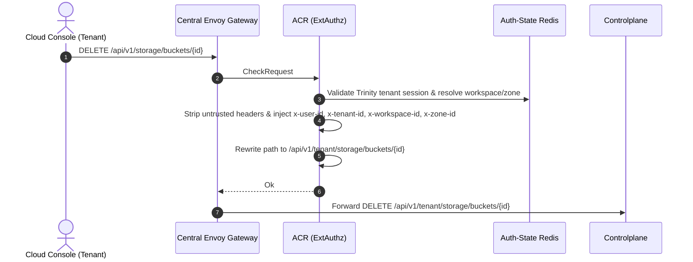
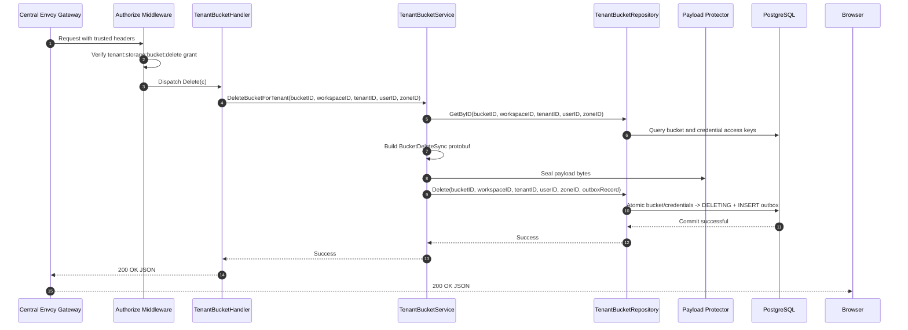
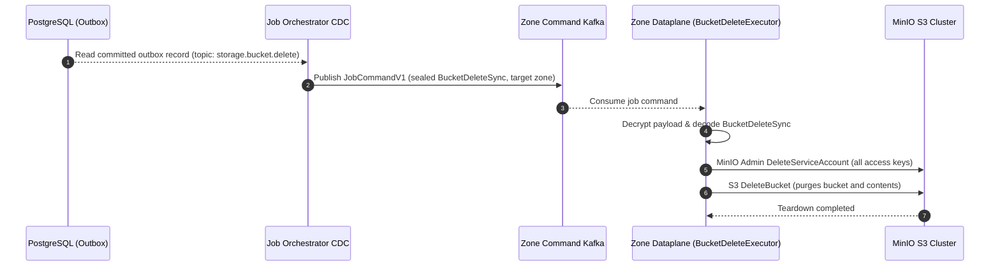
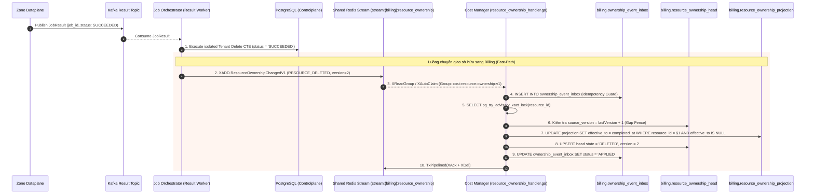
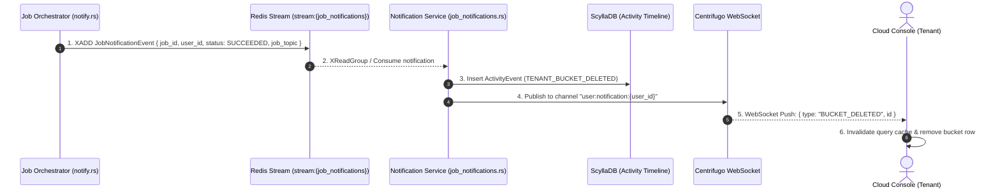
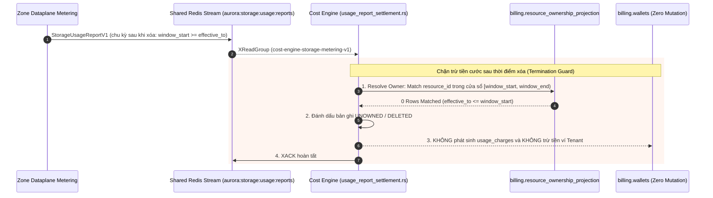

# Tenant Bucket Delete — God View

> **Critical-route revision (2026-08-26):** the public request is `DELETE /api/v1/critical/storage/buckets/{bucket_id}`; ACR consumes the exact session proof and rewrites only to `/api/v1/tenant/critical/storage/buckets/{bucket_id}`. Controlplane runs `RequireSessionProof` before `Authorize`. Older non-critical route text below is superseded.

Tenant Bucket Deletion is asynchronous. Controlplane transitions the bucket and
all child credentials to `DELETING` while inserting the sealed Zone command.
Central rows are hard-deleted only after Dataplane confirms physical teardown.

---

## API-scope contract

Browser calls neutral `DELETE /api/v1/storage/buckets/{id}`. ACR validates the Trinity
tenant membership, resolves workspace and zone context, rewrites the path to
`/api/v1/tenant/storage/buckets/{id}`, and injects trusted identity headers (`x-user-id`,
`x-workspace-id`, `x-zone-id`, `x-tenant-id`). Controlplane requires `storage:bucket:delete` permission.

---

## REST input and output

### Request headers used

| Header | Use |
|---|---|
| `Cookie` | ACR derives Trinity session, tenant membership, Zone, and workspace context. |
| `Origin` | CORS enforcement at Envoy / ACR. |
| `X-Requested-With` or `Sec-Fetch-Site` | Required by ACR CSRF check for `DELETE`. |
| `traceparent` | Injected into outbox record for distributed OpenTelemetry tracing. |

### Response payload

| Status | Payload | Reason |
|---|---|---|
| `200` | `{"status": "success", "data": null, "message": "tenant bucket deletion initiated"}` | Bucket/credentials are `DELETING`; outbox command is queued. |
| `401` | `{"status": "error", "code": "UNAUTHORIZED", "message": "unauthorized"}` | Missing or invalid Trinity session cookie. |
| `403` | `{"status": "error", "code": "FORBIDDEN", "message": "permission denied"}` | Missing `storage:bucket:delete` permission grant or inactive tenant membership. |
| `404` | `{"status": "error", "code": "NOT_FOUND", "message": "bucket not found"}` | Bucket does not exist or is not owned by the tenant workspace. |
| `500` | `{"status": "error", "code": "INTERNAL_ERROR", "message": "internal_error"}` | Database error, payload sealing failure, or outbox insert error. |

---

## Phase 1 — Client → Envoy → ACR



---

## Phase 2 — Controlplane Desired-State Transaction



### Hop-by-Hop Contract — Phase 2

#### Hop 2.1: ContextInjector & Authorize Middleware
- **Input**: Headers `x-user-id`, `x-tenant-id`, `x-workspace-id`, `x-zone-id`.
- **Processing**: Evaluates L1 Permission Registry for key `{tenant_id}:{workspace_id}:storage:bucket:delete`.
- **Output**: Validated request context.

#### Hop 2.2: TenantBucketHandler → TenantBucketService
- **Input**: `bucketID`, `workspaceID`, `tenantID`, `userID`, `zoneID`.
- **Processing**:
  1. Queries bucket and all associated access keys.
  2. Builds Protobuf `BucketDeleteSync`:
     ```protobuf
     BucketDeleteSync {
       name: "tn-b78f9a2c-company-assets",
       access_keys: ["AKIA...", "AKIB..."]
     }
     ```
  3. Seals payload bytes via Protector with topic `storage.bucket.delete`.
- **Output**: Call to `repo.Delete(ctx, bucketID, workspaceID, tenantID, userID, zoneID, outboxRecord)`.

#### Hop 2.3: TenantBucketRepository → PostgreSQL Atomic CTE
- **Input SQL Query**:
  ```sql
  WITH authorized_target AS (
      SELECT b.id, b.name, b.zone_id, b.tenant_id
      FROM storage.tenant_buckets b
      JOIN hierarchy.tenant_workspaces w ON b.workspace_id = w.id
      JOIN hierarchy.tenant_memberships m 
        ON m.tenant_id = w.tenant_id 
       AND m.user_id = $4 
       AND m.status = 'active'
      WHERE b.id = $1 
        AND b.workspace_id = $2 
        AND b.tenant_id = $3 
        AND w.zone_id = $5
      FOR UPDATE OF b
  ),
  updated_bucket AS (
      UPDATE storage.tenant_buckets
      SET status = 'DELETING',
          updated_at = NOW()
      WHERE id IN (SELECT id FROM authorized_target)
      RETURNING id, name, zone_id, tenant_id
  ),
  updated_credentials AS (
      UPDATE storage.tenant_credentials
      SET state = 'DELETING', updated_at = NOW()
      WHERE bucket_id IN (SELECT id FROM updated_bucket)
        AND state = 'READY'
      RETURNING id
  ),
  inserted_outbox AS (
      INSERT INTO storage.storage_outbox_records (
          event_id, zone_id, job_topic, payload, owner_id, owner_type, status,
          job_version, resource_id, resource_name, payload_schema_version, trace_id, idle,
          actor_user_id, payload_key_id
      )
      SELECT $6, ub.zone_id, 'storage.bucket.delete', $7, ub.tenant_id, 'TENANT', 'PENDING',
             1, ub.id::text, ub.name, 1, $8, 30,
             $4, $9
      FROM updated_bucket ub
  )
  SELECT id FROM updated_bucket;
  ```
- **Output**: Atomic bucket/credential transition to `DELETING` and pending outbox insertion.

The authorized bucket and every child credential must be `READY`. Incomplete
`PROVISIONING`/`FAILED` resources and `CREATING`/`ERROR` credentials are not
silently normalized by user delete; the repository rejects the command so a
dedicated reconciliation path can preserve their real prior state.

#### Hop 2.4: Controlplane → Browser
- **Output**: HTTP `200 OK` JSON.

---

## Phase 3 — Outbox CDC Dispatch & Dataplane Execution



---

## Phase 4 — Job Settlement & Resource Ownership Handover (Billing Registry)

Ngay sau khi nhận kết quả từ Dataplane, Job Orchestrator Result Worker thực thi CTE đóng trạng thái outbox sang `SUCCEEDED`, xóa dòng tenant bucket vật lý trong PostgreSQL, và **ngay lập tức kích hoạt luồng Fast-Path đẩy sự kiện sở hữu (`RESOURCE_DELETED`) sang Cost Manager** để đóng sổ tính cước.



### Hop-by-Hop Contract — Phase 4

#### Hop 4.1: Zone Dataplane → Kafka Result Topic
- **Input Contract (`JobResult` Protobuf)**:
  - `job_id`: UUID (`event_id` của outbox record)
  - `job_topic`: `"storage.bucket.delete"`
  - `status`: `JOB_STATUS_SUCCEEDED` / `JOB_STATUS_FAILED`
- **Topic**: `aurora.central.job_results`

#### Hop 4.2: Kafka Result → Job Orchestrator Result Worker
- **Input**: Consumed `JobResult` Protobuf.
- **Authority & Idempotency Fence**:
  - `owner_type`: `"TENANT"`
  - `status`: `IN ('PENDING', 'PROCESSING')` (chống replay kết quả cũ)
  - `zone_id`: `<> 00000000-0000-0000-0000-000000000000`
- **State Transition / Durable Effects**:
  - Khi `SUCCEEDED`:
    - Physical deletion: Hard-delete only a `DELETING` bucket; DB trigger enforces the state and cascade removes `DELETING` credentials.
    - Outbox settlement: `storage.storage_outbox_records` chuyển trạng thái `status = 'SUCCEEDED'`, cập nhật `completed_at = NOW()`.
  - Khi `FAILED`:
    - Khôi phục resource: Bucket `DELETING -> READY` và child credentials `DELETING -> READY` trước khi settle outbox `FAILED`.
    - Outbox settlement: `storage.storage_outbox_records` chuyển trạng thái `status = 'FAILED'`, cập nhật `completed_at = NOW()`.
- **Output Schema (`SettledOutboxRecord`)**:
  - `resource_id`: UUID (`bucket_id`)
  - `resource_name`: string (`bucket_name`)
  - `owner_id`: UUID (`tenant_id`)
  - `owner_type`: `"TENANT"`
  - `zone_id`: UUID
  - `actor_user_id`: UUID
  - `trace_id`: UUID

#### Hop 4.3: Job Orchestrator → Shared Redis Stream
- **Method / Transport**: Lua Script Atomic Check `XLEN < stream_capacity` + `XADD` + `WAITAOF(1, replica_acks, timeout)`.
- **Stream**: `stream:{billing}:resource_ownership`
- **Protobuf**: `ResourceOwnershipChangedV1`
  - `event_id`: Deterministic UUIDv5 (`ownership_event_id`).
  - `event_type`: `"RESOURCE_DELETED"`
  - `resource_type`: `"STORAGE_BUCKET"`
  - `resource_id`: `bucket_id`
  - `resource_name`: `bucket_name`
  - `owner_id`: `tenant_id`
  - `owner_type`: `"TENANT"`
  - `zone_id`: `zone_id`
  - `source_version`: `2`
  - `effective_at`: RFC3339 timestamp (`completed_at`).
  - `source_job_id`: `job_id`
- **Durability Guarantee**: `WAITAOF` đảm bảo Redis đã ghi AOF và sync replica trước khi JO cập nhật `ownership_published_at = NOW()` trong PostgreSQL.
- **Failover / Recovery**: `OwnershipRelay` chạy ngầm định kỳ quét các dòng outbox `status = 'SUCCEEDED' AND ownership_published_at IS NULL` với `FOR UPDATE SKIP LOCKED` để phát bù nếu Redis gặp sự cố.

#### Hop 4.4: Cost Manager Consumer → Billing Database
- **Consumer**: `ResourceOwnershipConsumer` (`cost-resource-ownership-v1`) đọc tin qua `XReadGroup` và `XAutoClaim` (reclaim pending sau 30s).
- **Contract Boundary Validation**: Kiểm tra kích thước payload `<= 64KB`, schema_version == 1, UUID hợp lệ, owner_type `TENANT`, W3C traceparent.
- **Single SQL Transaction**:
  1. `INSERT INTO billing.ownership_event_inbox` bảo đảm Idempotency.
  2. `SELECT pg_try_advisory_xact_lock(hashtextextended(resource_id, 0))` chống race condition giữa các pod.
  3. Kiểm tra `source_version == last_source_version + 1` trên `billing.resource_ownership_head`.
  4. Đóng cửa sổ cước: `UPDATE billing.resource_ownership_projection SET effective_to = $1 WHERE resource_id = $2 AND effective_to IS NULL`.
  5. Cập nhật `billing.resource_ownership_head` sang trạng thái `DELETED`.
  6. Cập nhật inbox `status = 'APPLIED'`.
- **Post-Commit Clean**: Thực thi Redis Pipeline `XACK` + `XDEL` để giải phóng RAM.

---

## Phase 5 — Timeline Projection & Realtime Client Notification

Sau khi hoàn tất hạch toán sở hữu, Job Orchestrator phát sự kiện thông báo kết quả vào Redis Notification Stream để Notification Service lưu vết ScyllaDB và đẩy thông báo realtime qua WebSocket Centrifugo lên giao diện Cloud Console.



### Hop-by-Hop Contract — Phase 5

#### Hop 5.1: Job Orchestrator → Redis Notification Stream
- **Input**: Struct `NotificationIntent`
- **Stream**: `stream:{job_notifications}`
- **Payload**: JSON / MsgPack `JobNotificationEvent`
  - `job_id`: UUID
  - `user_id`: UUID (`actor_user_id`)
  - `status`: `"SUCCEEDED"`
  - `job_topic`: `"storage.bucket.delete"`
  - `resource_id`: `bucket_id`

#### Hop 5.2: Notification Service → ScyllaDB & Centrifugo
- **Processing**:
  - Ghi bản ghi audit `ActivityEvent` vào ScyllaDB Timeline.
  - Gọi HTTP API của Centrifugo phát tin nhắn sang kênh cá nhân `user:notification:{user_id}` hoặc workspace channel.

#### Hop 5.3: Centrifugo → Browser Client (UI Wakeup)
- **Transport**: WebSocket Push.
- **Client Processing**: Hook `useStorageAccessSession` / TanStack Query client nhận tin, tự động làm mới danh sách và xóa row bucket đã xóa trên giao diện trong 0ms.

---

## Phase 6 — Cost Engine Final Rating & Settlement Termination (Rating Window Closed)

Sau khi Phase 4 cập nhật `billing.resource_ownership_projection` với `effective_to = completed_at`, vòng đời tính cước của tenant bucket chính thức chấm dứt.



### Hop-by-Hop Contract — Phase 6

#### Hop 6.1: Prorated Final Window Settlement (Kỳ cước cuối cùng)
- Đối với chu kỳ giờ chứa mốc `completed_at` (`window_start < effective_to < window_end`):
  - Cost Engine đối soát tìm thấy bản ghi ownership có `effective_to`.
  - Cước dung lượng `storage.capacity.gb_hour` được tính theo tỉ lệ thời gian thực tế bucket tồn tại trước khi bị xóa (`effective_to - window_start`).
  - Hóa đơn cước cuối cùng được chốt và trừ vào ví Tenant.

#### Hop 6.2: Post-Deletion Fencing & Zero Zombie Billing (Chặn cước sau khi xóa)
- Đối với tất cả các chu kỳ giờ sau thời điểm xóa (`window_start >= effective_to`):
  - **Resolution Guard**:
    ```sql
    SELECT owner_id, owner_type, resource_type, zone_id
    FROM billing.resource_ownership_projection
    WHERE resource_id = $1 AND resource_type = 'STORAGE_BUCKET'
      AND effective_from <= $3 AND (effective_to IS NULL OR effective_to > $2)
    LIMIT 1;
    ```
  - Truy vấn trả về `0 rows` vì `effective_to` đã đóng trước đó.
  - **Durable Guarantee**: Cost Engine ghi nhận trạng thái `UNOWNED` và bỏ qua, **tuyệt đối không trừ tiền ví của Tenant** cho bất kỳ metric dư thừa nào từ Dataplane.

---

## Code map

### Phase 1 — Client → Envoy → ACR
- **ACR ExtAuthz Filter & Session Validation**: `acr/src/auth/`
- **ACR Storage Route & Tenant Rewrite**: `acr/src/storage/route.rs`, `acr/src/storage/control_assertion.rs`

### Phase 2 — Wallet Admission & Controlplane Mutation
- **Route Registration**: `controlplane/internal/storage/route.go`
- **HTTP Handler**: `controlplane/internal/storage/transport/http/handler/tenant_bucket_handler.go` (`Delete`)
- **Domain Service**: `controlplane/internal/storage/service/tenant_bucket_service.go` (`DeleteBucketForTenant`)
- **SQL Repository**: `controlplane/internal/storage/repository/tenant_bucket_repo.go` (`Delete`)

### Phase 3 — Outbox CDC Dispatch & Dataplane Execution
- **JO Outbox Changefeed Dispatch**: `job-orchestrator/src/changefeed/dispatch.rs`
- **Dataplane Command Executor**: `dataplane/src/executor/storage/delete.rs`

### Phase 4 — Job Settlement & Resource Ownership Handover (Billing Registry)
- **JO Result Worker (DB Settlement)**: `job-orchestrator/src/results/storage/bucket.rs`, `job-orchestrator/src/results/apply.rs`
- **JO Ownership Fast-Path & Relay**: `job-orchestrator/src/outbox/ownership.rs`, `job-orchestrator/src/outbox/redis.rs`
- **Cost Manager Ownership Consumer**: `cost-manager/api/internal/transport/redis/handler/resource_ownership_handler.go`
- **Cost Manager Ownership Service**: `cost-manager/api/internal/service/resource_ownership_service.go`
- **Cost Manager Ownership Repository**: `cost-manager/api/internal/repository/resource_ownership_repo.go`

### Phase 5 — Timeline Projection & Realtime Client Notification
- **JO Realtime Notifier**: `job-orchestrator/src/results/notify.rs`
- **Notification Service Consumer**: `notification-service/src/application/job_notifications.rs`
- **Centrifugo WebSocket Push**: `notification-service/src/infrastructure/centrifugo.rs`
- **Cloud Console UI**: `cloud-console/src/`

### Phase 6 — Cost Engine Final Rating & Settlement Termination
- **Cost Engine Settlement Worker**: `cost-manager/engine/src/service/storage/usage_report_settlement.rs`
- **Cost Engine Pricing Runtime & Lease**: `cost-manager/engine/src/engine/` (`pricing_runtime.rs`, `settlement.rs`, `lease.rs`)
- **Billing PostgreSQL Tables**: `billing.resource_ownership_projection`, `billing.usage_charges`, `billing.usage_charge_lines`, `billing.wallets`

## Resource completion revision — 2026-08-27

Bucket deletion succeeds only after the bucket and every listed owned credential
and policy have been removed. S3 NoSuchBucket is idempotent; cleanup errors are not
ignored. An unknown infrastructure outcome retries the same command/attempt,
instead of exhausting into FAILED and falsely restoring READY after partial deletion.
The generic success receipt prevents repeating a completed deletion on replay.
