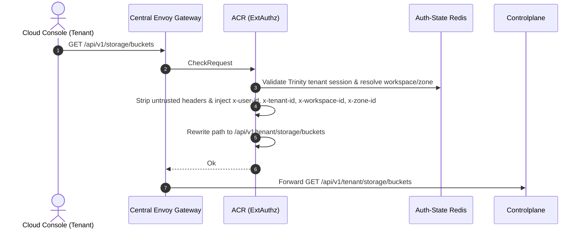
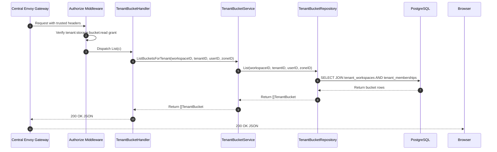

# Tenant Bucket List — God View

Tenant Bucket List is a synchronous read workflow for querying all buckets within an
enterprise workspace. Controlplane executes 3-table join verification in PostgreSQL
(`tenant_workspaces`, `tenant_memberships`, `tenant_buckets`) to return a flat projection
of buckets strictly scoped to the authorized tenant workspace and zone.

---

## API-scope contract

Browser calls neutral `GET /api/v1/storage/buckets`. ACR validates the Trinity tenant membership,
resolves workspace and zone context, rewrites the path to `/api/v1/tenant/storage/buckets`,
and injects trusted identity headers (`x-user-id`, `x-workspace-id`, `x-zone-id`, `x-tenant-id`).
Controlplane requires `storage:bucket:read` permission.

---

## REST input and output

### Request headers used

| Header | Use |
|---|---|
| `Cookie` | ACR derives Trinity session, tenant membership, Zone, and workspace context. |
| `Origin` | CORS enforcement at Envoy / ACR. |

### Response payload

| Status | Payload | Reason |
|---|---|---|
| `200` | `{"status": "success", "data": [ { "id": "...", "name": "tn-...", "workspace_id": "...", "zone_id": "...", "tenant_id": "...", "status": "READY", "capacity_quota_bytes": 107374182400, "used_bytes": 0, "versioning_enabled": false, "lifecycle_rules": [], "created_at": "...", "updated_at": "..." } ], "message": "tenant buckets retrieved successfully"}` | List of tenant buckets for the workspace. |
| `401` | `{"status": "error", "code": "UNAUTHORIZED", "message": "unauthorized"}` | Missing or invalid Trinity session cookie. |
| `403` | `{"status": "error", "code": "FORBIDDEN", "message": "permission denied"}` | Missing `storage:bucket:read` permission grant or inactive tenant membership. |
| `500` | `{"status": "error", "code": "INTERNAL_ERROR", "message": "internal_error"}` | Database query failure. |

---

## Phase 1 — Client → Envoy → ACR



---

## Phase 2 — Controlplane Read Query



### Hop-by-Hop Contract — Phase 2

#### Hop 2.1: ContextInjector & Authorize Middleware
- **Input**: Headers `x-user-id`, `x-tenant-id`, `x-workspace-id`, `x-zone-id`.
- **Processing**: Evaluates L1 Permission Registry for key `{tenant_id}:{workspace_id}:storage:bucket:read`.
- **Output**: Validated request context.

#### Hop 2.2: TenantBucketHandler → TenantBucketService
- **Input**: `workspaceID`, `tenantID`, `userID`, `zoneID` extracted from context.
- **Output**: Call to `repo.List(ctx, workspaceID, tenantID, userID, zoneID)`.

#### Hop 2.3: TenantBucketRepository → PostgreSQL Query
- **Input SQL Query**:
  ```sql
  SELECT b.id, b.name, b.workspace_id, b.zone_id, b.tenant_id, b.status,
         b.capacity_quota_bytes, b.used_bytes, b.used_bytes_observed_at,
         b.encrypt_enabled, b.versioning_enabled, b.object_locking_enabled,
         b.replication_enabled, b.retention_days, b.legal_hold_enabled,
         b.tags, b.lifecycle_rules, b.created_at, b.updated_at
  FROM storage.tenant_buckets b
  JOIN hierarchy.tenant_workspaces w ON b.workspace_id = w.id
  JOIN hierarchy.tenant_memberships m 
    ON m.tenant_id = w.tenant_id 
   AND m.user_id = $3 
   AND m.status = 'active'
  WHERE b.workspace_id = $1 
    AND b.tenant_id = $2 
    AND w.zone_id = $4
  ORDER BY b.created_at DESC;
  ```
- **Output**: Array of `TenantBucket` entities.

#### Hop 2.4: Controlplane → Browser
- **Output**: HTTP `200 OK` JSON array of bucket records.

---

## Failure and security rules

| Condition | Failure Semantics | Recovery / Settlement |
|---|---|---|
| Inactive tenant membership | HTTP `403 Forbidden` / Empty list | User membership status must be active. |
| Context zone mismatch | Empty list `[]` | User only sees buckets in the active workspace's zone. |

---

## Code map

- **God View SoT**: `god_view/storage/tenant_bucket_list_god_view_workflow.md`
- **Controlplane Route**: `controlplane/internal/storage/route.go`
- **Controlplane Handler**: `controlplane/internal/storage/transport/http/handler/tenant_bucket_handler.go` (`List`)
- **Controlplane Service**: `controlplane/internal/storage/service/tenant_bucket_service.go` (`ListBucketsForTenant`)
- **Controlplane Repository**: `controlplane/internal/storage/repository/tenant_bucket_repo.go` (`List`)
