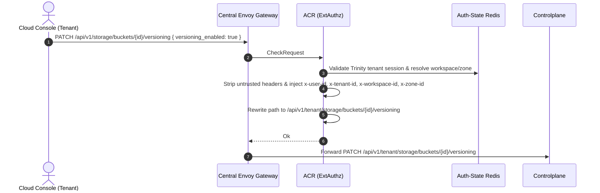
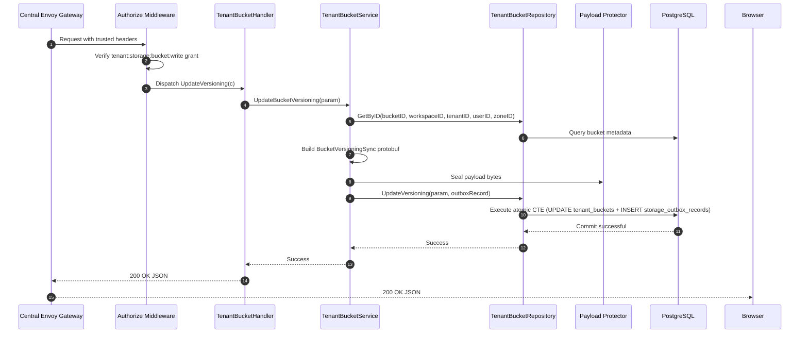
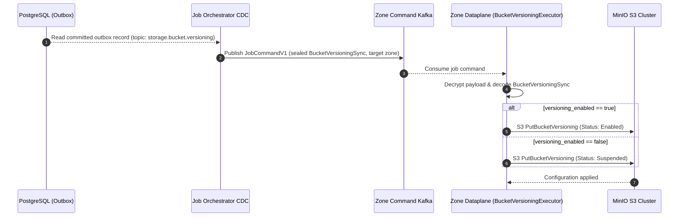
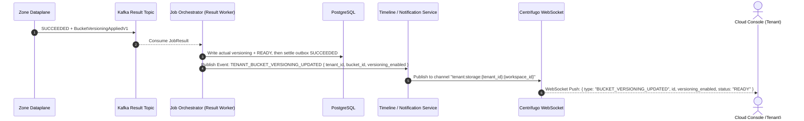

# Tenant Bucket Versioning Update — God View

> **Critical-route revision (2026-08-26):** ACR consumes the exact session proof for the public `/api/v1/critical/storage/...` mutation and rewrites only to the corresponding `/api/v1/tenant/critical/storage/...` target. Controlplane runs `RequireSessionProof` before `Authorize`; older non-critical route text below is superseded.

Tenant Bucket Versioning update is an asynchronous state synchronization workflow.
Controlplane leaves confirmed versioning unchanged, transitions `READY -> UPDATING`,
and stores the target only inside the sealed Zone command. Dataplane applies MinIO;
JO validates `BucketVersioningAppliedV1` and promotes the actual value.

---

## API-scope contract

Browser calls neutral `PATCH /api/v1/storage/buckets/{id}/versioning`. ACR validates the
Trinity tenant membership, resolves workspace and zone context, rewrites the path to
`/api/v1/tenant/storage/buckets/{id}/versioning`, and injects trusted identity headers (`x-user-id`,
`x-workspace-id`, `x-zone-id`, `x-tenant-id`). Controlplane requires `storage:bucket:write` permission.

---

## REST input and output

### Request headers used

| Header | Use |
|---|---|
| `Cookie` | ACR derives Trinity session, tenant membership, Zone, and workspace context. |
| `Origin` | CORS enforcement at Envoy / ACR. |
| `X-Requested-With` or `Sec-Fetch-Site` | Required by ACR CSRF check for `PATCH`. |
| `traceparent` | Injected into outbox record for distributed OpenTelemetry tracing. |

### JSON payload

```json
{
  "versioning_enabled": true
}
```

| Field | Type | Contract |
|---|---|---|
| `versioning_enabled` | `boolean` | **Required**. `true` enables object versioning; `false` suspends versioning. |

### Response payload

| Status | Payload | Reason |
|---|---|---|
| `200` | `data` includes `id`, `name`, `status=UPDATING` and the last confirmed `versioning_enabled` | Transition and sealed target command committed. |
| `400` | `{"status": "error", "code": "BAD_REQUEST", "message": "invalid request body"}` | Invalid JSON. |
| `401` | `{"status": "error", "code": "UNAUTHORIZED", "message": "unauthorized"}` | Missing or invalid Trinity session cookie. |
| `403` | `{"status": "error", "code": "FORBIDDEN", "message": "permission denied"}` | Missing `storage:bucket:write` permission grant or inactive tenant membership. |
| `404` | `{"status": "error", "code": "NOT_FOUND", "message": "bucket not found"}` | Bucket does not exist or is not owned by the tenant workspace. |
| `503` | `{"error": "STORAGE_COMMERCIAL_ADMISSION_UNAVAILABLE", "message": "Service Unavailable"}` | Commercial admission is absent, expired or suspended. |
| `500` | `{"status": "error", "code": "INTERNAL_ERROR", "message": "internal_error"}` | Database error, payload sealing failure, or outbox insert error. |

---

## Phase 1 — Client → Envoy → ACR



---

## Phase 2 — Controlplane Desired-State Transaction



### Hop-by-Hop Contract — Phase 2

#### Hop 2.1: ContextInjector & Authorize Middleware
- **Input**: Headers `x-user-id`, `x-tenant-id`, `x-workspace-id`, `x-zone-id`.
- **Processing**: Evaluates L1 Permission Registry for key `{tenant_id}:{workspace_id}:storage:bucket:write`.
- **Output**: Validated request context.

#### Hop 2.2: TenantBucketHandler → TenantBucketService
- **Input**: `bucketID`, `versioningEnabled`, `workspaceID`, `tenantID`, `userID`, `zoneID`.
- **Processing**:
  1. Builds Protobuf `BucketVersioningSync`.
  2. Seals payload bytes via Protector with topic `storage.bucket.versioning`.
- **Output**: Call to `repo.UpdateVersioning(ctx, param, outboxRecord)`.

#### Hop 2.3: TenantBucketRepository → PostgreSQL Atomic CTE
- **Input SQL Query**:
  ```sql
  WITH authorized_target AS (
      SELECT b.id, b.name, b.zone_id, b.tenant_id
      FROM storage.tenant_buckets b
      JOIN hierarchy.tenant_workspaces w ON b.workspace_id = w.id
      JOIN hierarchy.tenant_memberships m 
        ON m.tenant_id = w.tenant_id 
       AND m.user_id = $4 
       AND m.status = 'active'
      WHERE b.id = $1 
        AND b.workspace_id = $2 
        AND b.tenant_id = $3 
        AND w.zone_id = $5
      FOR UPDATE OF b
  ),
  updated_bucket AS (
      UPDATE storage.tenant_buckets
      SET status = 'UPDATING',
          updated_at = NOW()
      WHERE id IN (SELECT id FROM authorized_target)
      RETURNING id, name, workspace_id, zone_id, tenant_id, status, capacity_quota_bytes, used_bytes, versioning_enabled, lifecycle_rules, created_at, updated_at
  ),
  inserted_outbox AS (
      INSERT INTO storage.storage_outbox_records (
          event_id, zone_id, job_topic, payload, owner_id, owner_type, status,
          job_version, resource_id, resource_name, payload_schema_version, trace_id, idle,
          actor_user_id, payload_key_id
      )
      SELECT $7, at.zone_id, 'storage.bucket.versioning', $8, at.tenant_id, 'TENANT', 'PENDING',
             1, at.id::text, at.name, 1, $9, 30,
             $4, $10
      FROM authorized_target at
  )
  SELECT id, name, workspace_id, zone_id, tenant_id, status, capacity_quota_bytes, used_bytes, versioning_enabled, lifecycle_rules, created_at, updated_at
  FROM updated_bucket;
  ```
- **Output**: Atomic `READY -> UPDATING` and pending outbox; confirmed `versioning_enabled` remains unchanged.

#### Hop 2.4: Controlplane → Browser
- **Output**: HTTP `200 OK` JSON.

---

## Phase 3 — Outbox CDC Dispatch & Dataplane Execution



Before result publication, Dataplane CAS-creates
`AURORA_ZONE_JOB_COMPLETION/job.completion.{job_id}.{delivery_epoch}` as protobuf
`JobCompletionReceiptV1` with `schema_version=2`, `command_sha256`, `attempt`,
`message`, `result_payload`, `result_payload_schema_version`, `result_status`
and optional `error_code`. It is replay evidence only and contains no Tenant or
versioning authority.

---

## Phase 4 — Job Settlement, Timeline & Realtime Notification



On terminal failure JO requires an empty success payload, keeps the confirmed
versioning value, restores `UPDATING -> READY`, and only then marks the outbox
`FAILED`.

---

## Code map

- **God View SoT**: `god_view/storage/tenant_bucket_versioning_update_god_view_workflow.md`
- **Controlplane Route**: `controlplane/internal/storage/route.go`
- **Controlplane Handler**: `controlplane/internal/storage/transport/http/handler/tenant_bucket_handler.go` (`UpdateVersioning`)
- **Controlplane Service**: `controlplane/internal/storage/service/tenant_bucket_service.go` (`UpdateBucketVersioning`)
- **Controlplane Repository**: `controlplane/internal/storage/repository/tenant_bucket_repo.go` (`UpdateVersioning`)
- **Dataplane Executor**: `dataplane/src/executor/storage/versioning.rs`
