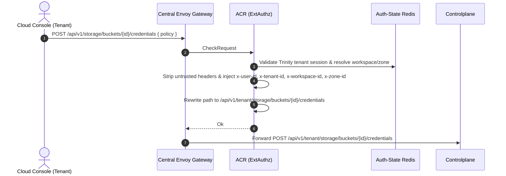
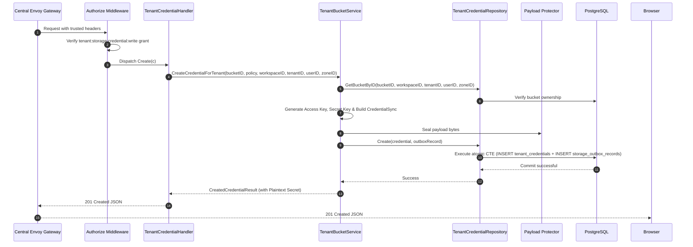
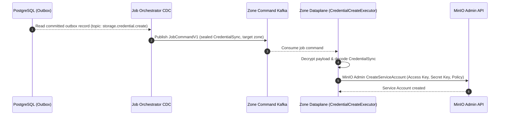
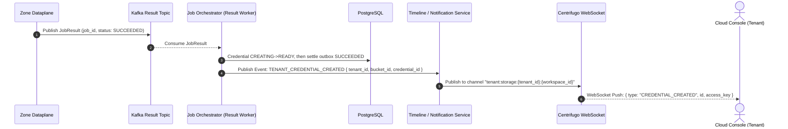

# Tenant Storage Credential Create — God View

> **Critical-route revision (2026-08-26):** credential issuance uses the public `/api/v1/critical/storage/...` route. ACR consumes the exact session proof before the sole `/api/v1/tenant/critical/storage/...` rewrite, and Controlplane runs `RequireSessionProof` before `Authorize`. Older non-critical route text below is superseded.

Tenant Credential Creation is an asynchronous credential provisioning mutation. Controlplane
validates policy constraints, generates cryptographic access and secret keys, persists the
credential record in PostgreSQL, and writes a sealed Zone outbox command in an atomic CTE transaction.
Physical service account provisioning on MinIO occurs asynchronously via Dataplane at the edge zone.

---

## API-scope contract

Browser calls neutral `POST /api/v1/storage/buckets/{id}/credentials`. ACR validates the
Trinity tenant membership, resolves workspace and zone context, rewrites the path to
`/api/v1/tenant/storage/buckets/{id}/credentials`, and injects trusted identity headers (`x-user-id`,
`x-workspace-id`, `x-zone-id`, `x-tenant-id`). Controlplane requires `storage:credential:write` permission.

---

## REST input and output

### Request headers used

| Header | Use |
|---|---|
| `Cookie` | ACR derives Trinity session, tenant membership, Zone, and workspace context. |
| `Origin` | CORS enforcement at Envoy / ACR. |
| `X-Requested-With` or `Sec-Fetch-Site` | Required by ACR CSRF check for `POST`. |
| `traceparent` | Injected into outbox record for distributed OpenTelemetry tracing. |

### JSON payload

```json
{
  "policy": "{\"Version\":\"2012-10-17\",\"Statement\":[{\"Effect\":\"Allow\",\"Action\":[\"s3:GetObject\"],\"Resource\":[\"arn:aws:s3:::tn-xxx/*\"]}]}"
}
```

| Field | Type | Contract |
|---|---|---|
| `policy` | `string` | **Optional**. Custom S3 IAM policy JSON. If empty or omitted, defaults to full read/write policy scoped strictly to the bucket. |

### Response payload

| Status | Payload | Reason |
|---|---|---|
| `201` | `{"status": "success", "data": { "id": "...", "access_key": "...", "secret_key": "...", "policy": "...", "state": "CREATING", "created_at": "..." }, "message": "tenant credential created successfully"}` | Credential promise and outbox command are durable. Plaintext secret is returned only once. |
| `400` | `{"status": "error", "code": "BAD_REQUEST", "message": "invalid policy format"}` | Invalid policy JSON. |
| `401` | `{"status": "error", "code": "UNAUTHORIZED", "message": "unauthorized"}` | Missing or invalid Trinity session cookie. |
| `403` | `{"status": "error", "code": "FORBIDDEN", "message": "permission denied"}` | Missing `storage:credential:write` permission grant or inactive tenant membership. |
| `404` | `{"status": "error", "code": "NOT_FOUND", "message": "bucket not found"}` | Bucket does not exist or is not owned by the tenant workspace. |
| `503` | `{"error": "STORAGE_COMMERCIAL_ADMISSION_UNAVAILABLE", "message": "Service Unavailable"}` | Commercial admission is absent, expired or suspended. |
| `500` | `{"status": "error", "code": "INTERNAL_ERROR", "message": "internal_error"}` | Database error, payload sealing failure, or outbox insert error. |

---

## Phase 1 — Client → Envoy → ACR



---

## Phase 2 — Controlplane Desired-State Transaction



### Hop-by-Hop Contract — Phase 2

#### Hop 2.1: ContextInjector & Authorize Middleware
- **Input**: Headers `x-user-id`, `x-tenant-id`, `x-workspace-id`, `x-zone-id`.
- **Processing**: Evaluates L1 Permission Registry for key `{tenant_id}:{workspace_id}:storage:credential:write`.
- **Output**: Validated request context.

#### Hop 2.2: TenantCredentialHandler → TenantBucketService
- **Input**: `bucketID`, `policy`, `workspaceID`, `tenantID`, `userID`, `zoneID`.
- **Processing**:
  1. Validates policy and falls back to default bucket-scoped policy if empty.
  2. Generates cryptographically secure access key and secret key.
  3. Builds Protobuf `CredentialSync`.
  4. Seals payload bytes via Protector with topic `storage.credential.create`.
- **Output**: Call to `repo.Create(ctx, credential, outboxRecord)`.

#### Hop 2.3: TenantCredentialRepository → PostgreSQL Atomic CTE
- **Input SQL Query**:
  ```sql
  WITH authorized_bucket AS (
      SELECT b.id, b.name, b.zone_id, b.tenant_id
      FROM storage.tenant_buckets b
      JOIN hierarchy.tenant_workspaces w ON b.workspace_id = w.id
      JOIN hierarchy.tenant_memberships m 
        ON m.tenant_id = w.tenant_id 
       AND m.user_id = $4 
       AND m.status = 'active'
      WHERE b.id = $1 
        AND b.workspace_id = $2 
        AND b.tenant_id = $3 
        AND w.zone_id = $5
      FOR KEY SHARE OF b
  ),
  ins_credential AS (
      INSERT INTO storage.tenant_credentials (
          id, bucket_id, access_key, policy, state, created_at, updated_at
      )
      SELECT $6, ab.id, $7, $8, 'CREATING', NOW(), NOW()
      FROM authorized_bucket ab
      RETURNING id, bucket_id, access_key, policy, created_at, updated_at
  ),
  inserted_outbox AS (
      INSERT INTO storage.storage_outbox_records (
          event_id, zone_id, job_topic, payload, owner_id, owner_type, status,
          job_version, resource_id, resource_name, payload_schema_version, trace_id, idle,
          actor_user_id, payload_key_id
      )
      SELECT $9, ab.zone_id, 'storage.credential.create', $10, ab.tenant_id, 'TENANT', 'PENDING',
             1, ic.id::text, ab.name, 1, $11, 30,
             $4, $12
      FROM ins_credential ic
      JOIN authorized_bucket ab ON ic.bucket_id = ab.id
  )
  SELECT id, bucket_id, access_key, policy, created_at, updated_at
  FROM ins_credential;
  ```
- **Output**: Atomic insertion of one `CREATING` credential and one pending outbox row.

#### Hop 2.4: Controlplane → Browser
- **Output**: HTTP `201 Created` JSON with one-time plaintext `secret_key`.

---

## Phase 3 — Outbox CDC Dispatch & Dataplane Execution



Before result publication, Dataplane CAS-creates
`AURORA_ZONE_JOB_COMPLETION/job.completion.{job_id}.{delivery_epoch}` as protobuf
`JobCompletionReceiptV1` with `schema_version=2`, `command_sha256`, `attempt`,
`message`, `result_payload`, `result_payload_schema_version`, `result_status`
and optional `error_code`. It is replay evidence only and contains no Tenant
credential secret or MinIO policy authority.

---

## Phase 4 — Job Settlement, Timeline & Realtime Notification



Terminal failure transitions `CREATING -> ERROR` before the outbox becomes
`FAILED`; JO does not erase the resource evidence merely because provisioning
failed.

---

## Code map

- **God View SoT**: `god_view/storage/tenant_storage_credential_create_god_view_workflow.md`
- **Controlplane Route**: `controlplane/internal/storage/route.go`
- **Controlplane Handler**: `controlplane/internal/storage/transport/http/handler/tenant_credential_handler.go` (`Create`)
- **Controlplane Service**: `controlplane/internal/storage/service/tenant_bucket_service.go` (`CreateCredentialForTenant`)
- **Controlplane Repository**: `controlplane/internal/storage/repository/tenant_credential_repo.go` (`Create`)
- **Dataplane Executor**: `dataplane/src/executor/storage/credential.rs`
