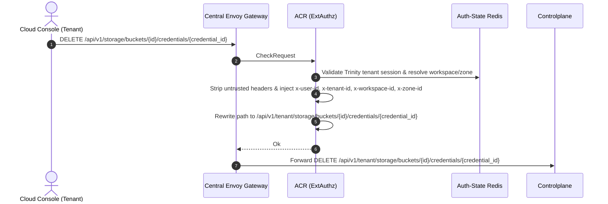
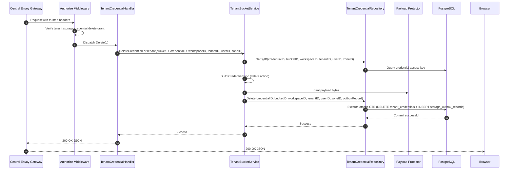
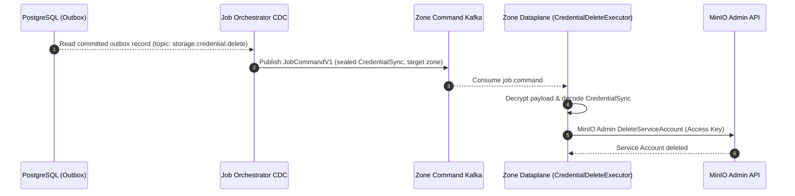
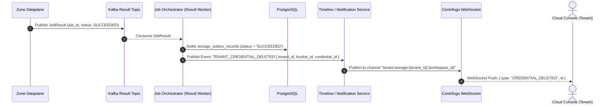

# Tenant Storage Credential Delete — God View

> **Critical-route revision (2026-08-26):** credential revocation uses the public `/api/v1/critical/storage/...` route. ACR consumes the exact session proof before the sole `/api/v1/tenant/critical/storage/...` rewrite, and Controlplane runs `RequireSessionProof` before `Authorize`. Older non-critical route text below is superseded.

Tenant Credential Deletion is an asynchronous credential revocation mutation. Controlplane
deletes the credential record in PostgreSQL and writes a sealed Zone outbox command in an atomic
CTE transaction. Physical service account revocation on MinIO occurs asynchronously via Dataplane
at the edge zone.

---

## API-scope contract

Browser calls neutral `DELETE /api/v1/storage/buckets/{id}/credentials/{credential_id}`.
ACR validates the Trinity tenant membership, resolves workspace and zone context, rewrites
the path to `/api/v1/tenant/storage/buckets/{id}/credentials/{credential_id}`, and injects
trusted identity headers (`x-user-id`, `x-workspace-id`, `x-zone-id`, `x-tenant-id`).
Controlplane requires `storage:credential:delete` permission.

---

## REST input and output

### Request headers used

| Header | Use |
|---|---|
| `Cookie` | ACR derives Trinity session, tenant membership, Zone, and workspace context. |
| `Origin` | CORS enforcement at Envoy / ACR. |
| `X-Requested-With` or `Sec-Fetch-Site` | Required by ACR CSRF check for `DELETE`. |
| `traceparent` | Injected into outbox record for distributed OpenTelemetry tracing. |

### Response payload

| Status | Payload | Reason |
|---|---|---|
| `200` | `{"status": "success", "data": null, "message": "tenant credential deletion initiated"}` | Credential deleted from PostgreSQL; outbox command queued. |
| `401` | `{"status": "error", "code": "UNAUTHORIZED", "message": "unauthorized"}` | Missing or invalid Trinity session cookie. |
| `403` | `{"status": "error", "code": "FORBIDDEN", "message": "permission denied"}` | Missing `storage:credential:delete` permission grant or inactive tenant membership. |
| `404` | `{"status": "error", "code": "NOT_FOUND", "message": "credential not found"}` | Credential does not exist or bucket is not owned by the tenant workspace. |
| `500` | `{"status": "error", "code": "INTERNAL_ERROR", "message": "internal_error"}` | Database error, payload sealing failure, or outbox insert error. |

---

## Phase 1 — Client → Envoy → ACR



---

## Phase 2 — Controlplane Desired-State Transaction



### Hop-by-Hop Contract — Phase 2

#### Hop 2.1: ContextInjector & Authorize Middleware
- **Input**: Headers `x-user-id`, `x-tenant-id`, `x-workspace-id`, `x-zone-id`.
- **Processing**: Evaluates L1 Permission Registry for key `{tenant_id}:{workspace_id}:storage:credential:delete`.
- **Output**: Validated request context.

#### Hop 2.2: TenantCredentialHandler → TenantBucketService
- **Input**: `bucketID`, `credentialID`, `workspaceID`, `tenantID`, `userID`, `zoneID`.
- **Processing**:
  1. Queries credential to retrieve `access_key`.
  2. Builds Protobuf `CredentialSync` with `action: "delete"`.
  3. Seals payload bytes via Protector with topic `storage.credential.delete`.
- **Output**: Call to `repo.Delete(ctx, credentialID, bucketID, workspaceID, tenantID, userID, zoneID, outboxRecord)`.

#### Hop 2.3: TenantCredentialRepository → PostgreSQL Atomic CTE
- **Input SQL Query**:
  ```sql
  WITH authorized_credential AS (
      SELECT c.id, c.access_key, b.name AS bucket_name, b.zone_id, b.tenant_id
      FROM storage.tenant_credentials c
      JOIN storage.tenant_buckets b ON c.bucket_id = b.id
      JOIN hierarchy.tenant_workspaces w ON b.workspace_id = w.id
      JOIN hierarchy.tenant_memberships m 
        ON m.tenant_id = w.tenant_id 
       AND m.user_id = $5 
       AND m.status = 'active'
      WHERE c.id = $1 
        AND c.bucket_id = $2 
        AND b.workspace_id = $3 
        AND b.tenant_id = $4 
        AND w.zone_id = $6
      FOR UPDATE OF c
  ),
  deleted_credential AS (
      DELETE FROM storage.tenant_credentials
      WHERE id IN (SELECT id FROM authorized_credential)
      RETURNING id
  ),
  inserted_outbox AS (
      INSERT INTO storage.storage_outbox_records (
          event_id, zone_id, job_topic, payload, owner_id, owner_type, status,
          job_version, resource_id, resource_name, payload_schema_version, trace_id, idle,
          actor_user_id, payload_key_id
      )
      SELECT $7, ac.zone_id, 'storage.credential.delete', $8, ac.tenant_id, 'TENANT', 'PENDING',
             1, ac.id::text, ac.bucket_name, 1, $9, 30,
             $5, $10
      FROM authorized_credential ac
  )
  SELECT id FROM deleted_credential;
  ```
- **Output**: Atomic deletion of `tenant_credentials` row and pending outbox insert.

#### Hop 2.4: Controlplane → Browser
- **Output**: HTTP `200 OK` JSON.

---

## Phase 3 — Outbox CDC Dispatch & Dataplane Execution



---

## Phase 4 — Job Settlement, Timeline & Realtime Notification



---

## Code map

- **God View SoT**: `god_view/storage/tenant_storage_credential_delete_god_view_workflow.md`
- **Controlplane Route**: `controlplane/internal/storage/route.go`
- **Controlplane Handler**: `controlplane/internal/storage/transport/http/handler/tenant_credential_handler.go` (`Delete`)
- **Controlplane Service**: `controlplane/internal/storage/service/tenant_bucket_service.go` (`DeleteCredentialForTenant`)
- **Controlplane Repository**: `controlplane/internal/storage/repository/tenant_credential_repo.go` (`Delete`)
- **Dataplane Executor**: `dataplane/src/executor/storage/credential.rs`
