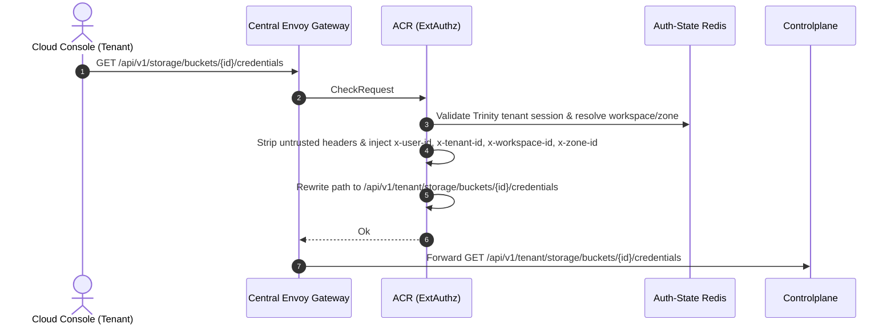
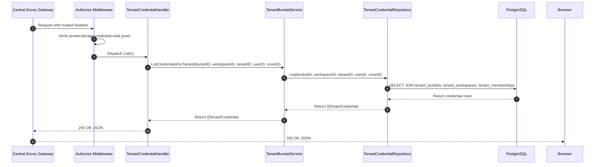

# Tenant Storage Credential List — God View

Tenant Credential List is a synchronous read workflow for querying all access credentials
associated with a specific tenant bucket. Controlplane executes 3-table join verification
in PostgreSQL to return flat projections of active credentials.

---

## API-scope contract

Browser calls neutral `GET /api/v1/storage/buckets/{id}/credentials`. ACR validates the
Trinity tenant membership, resolves workspace and zone context, rewrites the path to
`/api/v1/tenant/storage/buckets/{id}/credentials`, and injects trusted identity headers (`x-user-id`,
`x-workspace-id`, `x-zone-id`, `x-tenant-id`). Controlplane requires `storage:credential:read` permission.

---

## REST input and output

### Request headers used

| Header | Use |
|---|---|
| `Cookie` | ACR derives Trinity session, tenant membership, Zone, and workspace context. |
| `Origin` | CORS enforcement at Envoy / ACR. |

### Response payload

| Status | Payload | Reason |
|---|---|---|
| `200` | `{"status": "success", "data": [ { "id": "...", "bucket_id": "...", "access_key": "...", "policy": "...", "created_at": "...", "updated_at": "..." } ], "message": "tenant credentials retrieved successfully"}` | List of credentials for the target tenant bucket. |
| `401` | `{"status": "error", "code": "UNAUTHORIZED", "message": "unauthorized"}` | Missing or invalid Trinity session cookie. |
| `403` | `{"status": "error", "code": "FORBIDDEN", "message": "permission denied"}` | Missing `storage:credential:read` permission grant or inactive tenant membership. |
| `404` | `{"status": "error", "code": "NOT_FOUND", "message": "bucket not found"}` | Bucket does not exist or is not owned by the tenant workspace. |
| `500` | `{"status": "error", "code": "INTERNAL_ERROR", "message": "internal_error"}` | Database query failure. |

---

## Phase 1 — Client → Envoy → ACR



---

## Phase 2 — Controlplane Read Query



### Hop-by-Hop Contract — Phase 2

#### Hop 2.1: ContextInjector & Authorize Middleware
- **Input**: Headers `x-user-id`, `x-tenant-id`, `x-workspace-id`, `x-zone-id`.
- **Processing**: Evaluates L1 Permission Registry for key `{tenant_id}:{workspace_id}:storage:credential:read`.
- **Output**: Validated request context.

#### Hop 2.2: TenantCredentialHandler → TenantBucketService
- **Input**: `bucketID`, `workspaceID`, `tenantID`, `userID`, `zoneID`.
- **Output**: Call to `repo.List(ctx, bucketID, workspaceID, tenantID, userID, zoneID)`.

#### Hop 2.3: TenantCredentialRepository → PostgreSQL Query
- **Input SQL Query**:
  ```sql
  SELECT c.id, c.bucket_id, c.access_key, c.policy, c.created_at, c.updated_at
  FROM storage.tenant_credentials c
  JOIN storage.tenant_buckets b ON c.bucket_id = b.id
  JOIN hierarchy.tenant_workspaces w ON b.workspace_id = w.id
  JOIN hierarchy.tenant_memberships m 
    ON m.tenant_id = w.tenant_id 
   AND m.user_id = $4 
   AND m.status = 'active'
  WHERE c.bucket_id = $1 
    AND b.workspace_id = $2 
    AND b.tenant_id = $3 
    AND w.zone_id = $5
  ORDER BY c.created_at DESC;
  ```
- **Output**: Array of `TenantCredential` entities.

#### Hop 2.4: Controlplane → Browser
- **Output**: HTTP `200 OK` JSON.

---

## Code map

- **God View SoT**: `god_view/storage/tenant_storage_credential_list_god_view_workflow.md`
- **Controlplane Route**: `controlplane/internal/storage/route.go`
- **Controlplane Handler**: `controlplane/internal/storage/transport/http/handler/tenant_credential_handler.go` (`List`)
- **Controlplane Service**: `controlplane/internal/storage/service/tenant_bucket_service.go` (`ListCredentialsForTenant`)
- **Controlplane Repository**: `controlplane/internal/storage/repository/tenant_credential_repo.go` (`List`)
