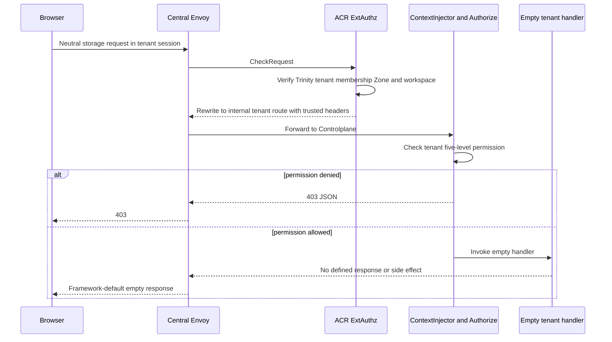
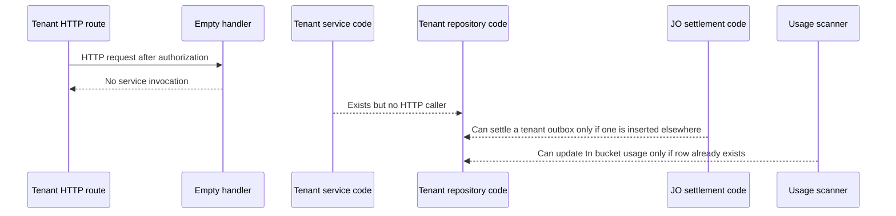

# Tenant Storage HTTP Surface — Unimplemented Contract Gap

This is **not** a God View workflow because no tenant Storage API has an
operational handler. It records the current exposed route surface so no document
can incorrectly claim tenant bucket/credential behavior exists. A future
implementation must create one end-to-end God View per tenant API before
enabling it.

## Registered but non-operational routes

| Neutral browser route | ACR internal route for verified tenant session | Permission middleware | Handler state |
|---|---|---|---|
| `POST /api/v1/storage/buckets` | `POST /api/v1/tenant/storage/buckets` | `storage:bucket:write` | Empty `TenantBucketHandler.Create` |
| `GET /api/v1/storage/buckets/{id}` | `GET /api/v1/tenant/storage/buckets/{id}` | `storage:bucket:read` | Empty `Get` |
| `GET /api/v1/storage/buckets` | `GET /api/v1/tenant/storage/buckets` | `storage:bucket:read` | Empty `List` |
| `PATCH /api/v1/storage/buckets/{id}/quota` | `PATCH /api/v1/tenant/storage/buckets/{id}/quota` | `storage:bucket:write` | Empty `UpdateQuota` |
| `DELETE /api/v1/storage/buckets/{id}` | `DELETE /api/v1/tenant/storage/buckets/{id}` | `storage:bucket:delete` | Empty `Delete` |
| `POST /api/v1/storage/buckets/{id}/credentials` | `POST /api/v1/tenant/storage/buckets/{id}/credentials` | `storage:credential:write` | Empty `TenantCredentialHandler.Create` |
| `GET /api/v1/storage/buckets/{id}/credentials` | `GET /api/v1/tenant/storage/buckets/{id}/credentials` | `storage:credential:read` | Empty `List` |
| `DELETE /api/v1/storage/buckets/{id}/credentials/{credential_id}` | `DELETE /api/v1/tenant/storage/buckets/{id}/credentials/{credential_id}` | `storage:credential:delete` | Empty `Delete` |

There is no tenant access-session endpoint. A tenant session therefore cannot
obtain a Zone Control access projection through this Storage module.

## Current request path

ACR does correctly select `/tenant` only from verified tenant membership and
injects trusted identity/workspace/Zone headers. `Authorize` can correctly
enforce the compiled tenant role key. After that guard, however, the invoked Gin
handler has an empty body: it does not bind input, call a service/repository,
write an envelope, insert outbox, or select a response status intentionally.

## Code present but unreachable from HTTP

Tenant service/repository/domain types and schema tables exist, as does JO
terminal logic for owner type `TENANT`. They are not proof of an active API:
the HTTP handlers never call them. Usage scanner also projects `tn-` bucket
usage to tenant rows and active members, but that runtime support does not make
tenant create/list/credential operations available.

## Security and implementation requirements before enablement

| Required future property | Current state |
|---|---|
| Separate tenant God View per API owner branch | Missing |
| Tenant membership and workspace authority recheck in repository CTE | Service/repository code exists but is not exercised by HTTP contract |
| Response envelope/status contract | Missing |
| Tenant access-session / Zone access record workflow | Missing |
| Clear physical bucket-name vs UUID route convention | Missing |
| Async command/result, rollback and user notification semantics | Cannot be inferred as an enabled workflow |
| Safe deployment | Routes should be removed or handlers return explicit `501` until implementation is completed. Current no-op behavior is ambiguous. |

## Code map

- `controlplane/internal/storage/route.go`
- `controlplane/internal/storage/transport/http/handler/tenant_bucket_handler.go`
- `controlplane/internal/storage/transport/http/handler/tenant_credential_handler.go`
- `controlplane/internal/storage/service/tenant_bucket_service.go`
- `controlplane/internal/storage/service/tenant_credential_service.go`
