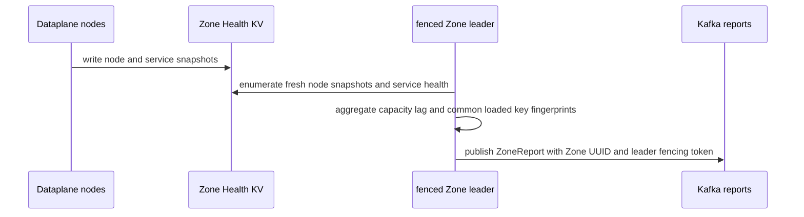
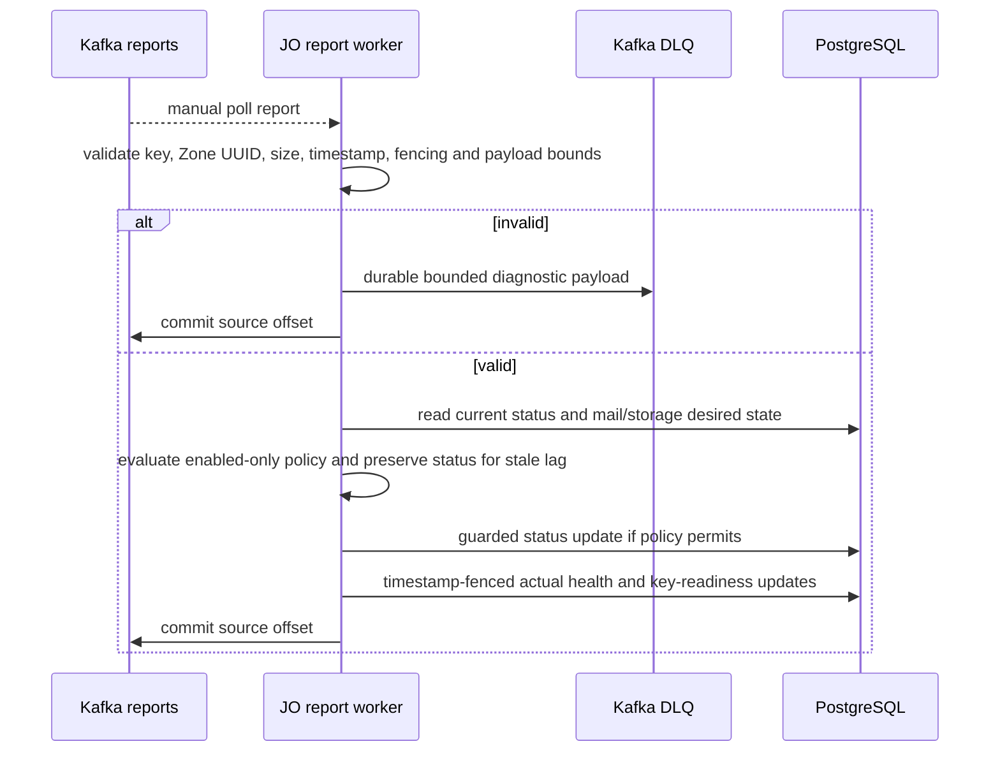

# Zone health report write-back — God View

Persists fresh Zone service observations and, when policy permits, an operational lifecycle transition. SRE desired state remains outside this workflow’s authority.

## Trigger and authority

| Trigger | Producer | Consumer | Durable owner |
|---|---|---|---|
| leader report timer | fenced Dataplane Zone leader | JO zone-report worker | PostgreSQL `actual_state`, key readiness, and policy-permitted status |

## Key contract

| Store | Key / topic | Contract |
|---|---|---|
| NATS Zone health KV | `zone.node.*`, `zone.service.mail`, `zone.service.storage`, `zone.service.hypervisor` | local observations |
| Kafka | `aurora.zone.reports.v1`, key=Zone UUID | bounded Protobuf `ZoneReport` |
| PostgreSQL | `zone_services.actual_*`, `zone_encryption_keys.loaded_*`, `zones.status` | timestamp and leader-fencing guarded write-back |

## Phase 1 — Dataplane aggregation

### Internal input and output

| Part | Contract |
|---|---|
| Input | fresh node snapshots up to 15 seconds old, service observations, leader fencing token and configured Zone UUID |
| Aggregation | sum node capacity/lag and intersect loaded key fingerprints across every fresh node |
| Output | bounded `ZoneReport` keyed by exact Zone UUID with timestamp and fencing token |
| Failure | health-key enumeration failure skips publication rather than fabricating an empty report |

Only snapshots fresh within 15 seconds contribute to node totals. If health keys cannot be listed, the leader skips publication rather than sending an empty aggregate.

## Phase 2 — JO validation and persistence

### Internal input and output

| Part | Contract |
|---|---|
| Input | Kafka record key and `ZoneReport` must agree; report has 1 MiB bound, timestamp window and bounded nested fields |
| Policy input | current status and mail/storage desired state reread from PostgreSQL for every valid report |
| Output | permitted lifecycle update, timestamp-fenced service actual health and fencing/timestamp-fenced key readiness |
| Settlement | invalid reports DLQ then commit; database error leaves source offset unsettled for replay |

Database failure leaves the offset unsettled. Reports may replay; `actual_observed_at` and leader fencing prevent stale observations from winning. Physical-node telemetry is not persisted as hierarchy business state.

## Policy boundary

Only enabled mail and storage participate in the current policy. The runtime can move within its guarded operational transitions (`active`/`draining`, or to `disabled` under its SQL guard); it cannot change `desired_state`, `planned`, or create a maintenance state.
