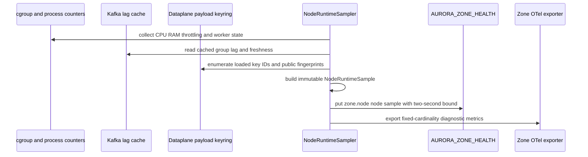
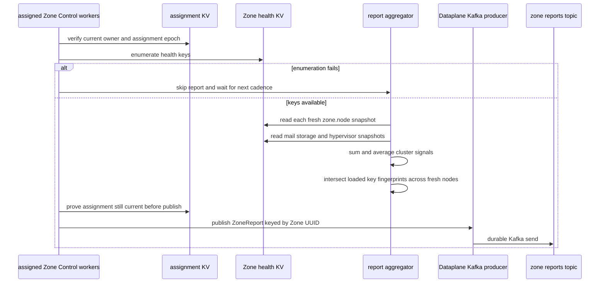
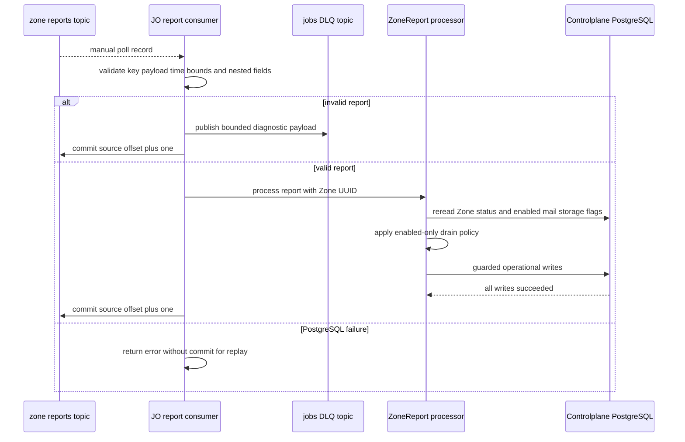
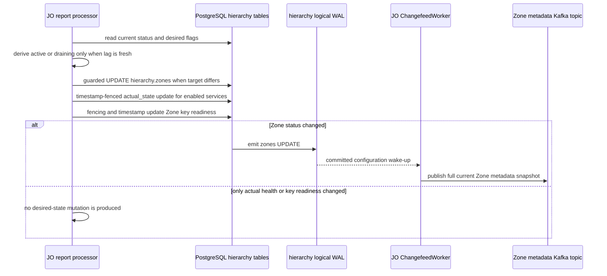

# Zone health report write-back — God View

This workflow turns fresh, Zone-local operational observations into Central
operational facts. It is an at-least-once telemetry pipeline with guarded
PostgreSQL writes. It does not let the Zone choose SRE desired service state or
create a planned/maintenance lifecycle transition.

The report has two consumers of its evidence:

1. JO may move an already operational Zone between `active` and `draining`
   under its SQL state-machine guard, and writes observed mail/storage health.
2. JO records which registered Zone payload-encryption keys are loaded on every
   fresh Dataplane replica, using report time plus assignment fencing as the
   readiness fence.

## Scope, authority, and durable boundaries

| Concern | Contract |
| --- | --- |
| Producer | Assigned Zone Control probe/report work units aggregate Zone health and publish `ZoneReport`. |
| Authoritative operational target | PostgreSQL `hierarchy.zones.status`, `hierarchy.zone_services.actual_state`, and `hierarchy.zone_encryption_keys` readiness columns. |
| SRE-owned facts | `zone_services.desired_state`, planned lifecycle, and service provisioning are not writable by this workflow. |
| Durable transport | Kafka `aurora.zone.reports.v1`, keyed by textual Zone UUID. Producer is idempotent with `acks=all`. |
| Consumer | JO group `aurora-job-orchestrator-zone-reports-v1`, auto commit disabled. One group member processes a record. |
| Terminal boundary | A valid report's source offset commits only after all required PostgreSQL writes return successfully. Invalid input is DLQed before its source offset commits. |
| Out of scope | Browser health APIs, OTel/Grafana storage, direct Central-to-Zone commands, worker scaling, and physical node persistence as hierarchy business state. |

## Evidence and key contract

| Store or topic | Key / table | Writer | Reader | Meaning |
| --- | --- | --- | --- | --- |
| Zone health KV | `AURORA_ZONE_HEALTH/zone.node.<sanitized_node_id>` | every Dataplane `NodeRuntimeSampler`, every five seconds | Zone Control report worker | resource sample, queue-lag cache state, active workers, and loaded public payload-key fingerprints. |
| Zone health KV | `zone.service.mail` | assigned mail probe | report worker | mail status/capacity aggregate, carrying the assignment epoch in JSON. |
| Zone health KV | `zone.service.storage` | assigned storage probe | report worker | storage status/capacity snapshot, carrying assignment epoch. |
| Zone health KV | `zone.service.hypervisor` | assigned Proxmox probe | report worker | per-node hypervisor inventory. It travels in the report but is not written by JO as hierarchy state. |
| Assignment KV | `AURORA_ZONE_CONTROL_ASSIGNMENTS/assignment.*.0` | assignment coordinator | probe/report workers | owner ID, assignment epoch, and expiry. |
| Kafka | `aurora.zone.reports.v1` | assigned Zone Control report worker | JO report worker | binary `zone.ZoneReport`; record key and embedded `zone_id` must agree at JO. |
| PostgreSQL | `hierarchy.zones` | guarded JO report worker | Controlplane/changefeed | current operational `status`, not a desired state. |
| PostgreSQL | `hierarchy.zone_services` | guarded JO report worker | Controlplane/watchdog | enabled-only `actual_state` and `actual_observed_at`. |
| PostgreSQL | `hierarchy.zone_encryption_keys` | guarded JO report worker | Controlplane key activation flow | per-key loaded timestamp plus observed timestamp and assignment fence. |

### `ZoneReport` contract

| Field | Producer calculation | JO validation / use |
| --- | --- | --- |
| `zone_id` | configured Dataplane `ZONE_ID` | exact string equality with Kafka record key and valid UUID. |
| `timestamp` | current Unix seconds when aggregation runs | positive, no more than five minutes future and no more than 24 hours old. It fences mail/storage observations. |
| cluster active nodes | count of `zone.node.*` entries whose `updated_at` is at most 15 seconds old | nonnegative. |
| CPU and RAM | arithmetic average over those fresh node entries | finite values in `[0, 1]`. |
| queue lag | saturating sum of fresh node cached lag | nonnegative. `job_queue_lag_stale` is ORed across samples or set true with zero alive nodes. |
| mail / storage | Zone Control probe snapshot status and capacity | both must exist and be `healthy`, `degraded`, or `down`; capacity must be 0–100. |
| hypervisors | last valid aggregate, or empty | at most 4,096 entries with bounded strings and nonnegative capacity pairs. Not persisted by JO. |
| loaded payload keys | intersection of key UUID + 32-byte fingerprint across every fresh node | at most 64 distinct UUIDs. A key is producer-ready only if all fresh replicas advertise precisely the same fingerprint. |
| assignment epoch | Zone Control report assignment epoch | must be positive and fit signed 64-bit range. It is used by the encryption-key SQL fence; the protobuf field keeps its legacy wire name. |

## Phase 1 — each Dataplane replica writes bounded local evidence

This phase is intentionally not a singleton. Each running Dataplane process
owns a `NodeRuntimeSampler`, which derives one immutable sample from its cgroup
measurements, worker-pool states, Kafka lag cache, and loaded private-keyring
public fingerprints. The sampler writes that sample to Zone-local JetStream KV
with a two-second write timeout, then waits five seconds or process shutdown.

### Internal input and output

| Part | Contract |
| --- | --- |
| Input | Local cgroup resource counters, worker states, admitted-job count, Kafka consumer's lag snapshot, and loaded Zone payload keys. |
| Output | JSON `NodeRuntimeSample` at a boot-suffixed `zone.node.<node_id>` key. The health bucket has one-day retention and history one. |
| Freshness fields | `sample_valid`, millisecond observation time, second `updated_at`, and lag-observed time distinguish fresh from stale signals. |
| Failure | A metric or KV failure is logged; it must not turn into zero load or a fabricated healthy node. Local admission separately fails closed on stale/invalid samples. |

The OTel exporter is a diagnostic sink only. Zone Control and local admission do
not read telemetry back from Victoria or the Collector as a control source.

## Phase 2 — assigned Zone Control workers aggregate and publish a report

Zone Control assigns storage, mail and hypervisor probe units independently and
assigns a separate `zone_report.0` unit. Each owner reads local health KV and
writes its service snapshot with its assignment epoch. The report worker checks
its epoch before Kafka publication; reassignment cancels the old task and the
new owner resumes from the latest KV values.

### Aggregation input and output

| Part | Contract |
| --- | --- |
| Cadence | Every `4,500 + random(0..1,000)` milliseconds while the session remains current. |
| Node inclusion | Enumerate health keys, read only `zone.node.*`, deserialize JSON, and include entries whose second-resolution `updated_at` is at most 15 seconds old. |
| Service input | Read `zone.service.mail`, `zone.service.storage`, and `zone.service.hypervisor`. Invalid or missing mail defaults to `down/0`; storage defaults to `unknown/0`; hypervisor defaults to an empty list. |
| Key readiness | Start from the first fresh node's key map and retain only a key/fingerprint present identically on every other fresh node. Sort the resulting key IDs before publication. |
| Publish | Encode `ZoneReport`, Kafka key equals configured textual Zone UUID, then send with the idempotent producer. |
| Failure | Health-key enumeration error skips the entire report rather than publishing a misleading zero aggregate. Individual unreadable or malformed node records are ignored. Kafka send failure is logged and the next cadence retries. |

The assigned report worker publishes a report even when there are no fresh nodes, but sets
`job_queue_lag_stale = true`. This lets Central retain lifecycle state rather
than interpreting zero lag as idle capacity.

## Phase 3 — JO validates transport evidence and evaluates lifecycle policy

### Input gate and poison settlement

| Check | Required condition |
| --- | --- |
| Size and encoding | nonempty Protobuf payload no larger than 1 MiB. |
| Route binding | Kafka key decodes to a UUID and exactly equals embedded `report.zone_id`. |
| Time | report timestamp is within the five-minute future and 24-hour past window. |
| Cluster values | finite average CPU/RAM within `[0,1]`, nonnegative lag/nodes/workers, and max workers not less than active workers. |
| Workloads | both mail and storage status/capacity pass the strict contract. |
| Keys | max 64 unique 16-byte UUIDs, each with a 32-byte fingerprint. |
| Assignment epoch | positive and no larger than signed 64-bit maximum. |

An invalid report is terminal only after `DeadLetterRecordV1` is durably
published. Its stored payload is capped at 4 KiB. A PostgreSQL or Kafka error
while handling an otherwise valid report is transient: the offset is left
uncommitted and Kafka redelivers it.

### Enabled-only drain policy

JO rereads `zones.status`, and whether the `mail` and `storage` services are
desired-enabled, for **every valid report**. It does not cache SRE input across
report processing or a Kafka rebalance.

| Current status and signal | Target returned by policy |
| --- | --- |
| Status is not `active` or `draining` | retain current state. |
| Lag is stale | retain current state. |
| Enabled mail/storage is `down` or capacity below 10 | `draining`. |
| `active` and queue lag > 5,000, pending jobs > 500, CPU > 0.90, or RAM > 0.90 | `draining`. |
| `draining` and lag < 4,000, pending < 400, CPU/RAM < 0.85, every enabled service healthy with capacity at least 50 | `active`. |
| Disabled service | excluded from both failure and recovery requirements. |

The report processor currently sets `pending_jobs = 0`; it has no separate
durable pending-work query. That means the threshold exists in the pure policy
but is not populated by the transport today.

## Phase 4 — guarded PostgreSQL write-back and lifecycle feedback

### Write order and fences

| Write | SQL guard and meaning |
| --- | --- |
| Zone status | Only writes a changed target when both current and target satisfy the runtime state-machine guard: `active ↔ draining`, or target `disabled` from operational states. The policy itself only generates active/draining. Planned and maintenance remain SRE-owned. |
| Mail/storage actual health | One `UPDATE ... FROM VALUES` writes only desired-enabled services and only when `actual_observed_at` is null or older than the report timestamp. It never UPSERTs missing service rows. |
| Key readiness | Every registered Zone key is evaluated against the report's key ID/fingerprint set. `loaded_at` becomes report time only on exact fingerprint match, otherwise null. The write accepts only a newer assignment epoch, or the same epoch with a nonolder observation time. |
| Hypervisor inventory | Explicitly not persisted by JO as hierarchy business state. It remains telemetry/report content. |

The status write is visible to the metadata propagation workflow because it
updates `hierarchy.zones`. Health updates also appear in logical replication,
but the Changefeed desired-state cache normally suppresses a configuration
snapshot when the replicated `desired_state` has not changed.

## Failure, replay, and correctness matrix

| Failure or race | Guard | Result |
| --- | --- | --- |
| Old Zone Control assignment resumes | assignment epoch/current-owner check before publish | it should not publish a new report after losing authority. |
| Report duplicate | timestamp fence for service state and assignment/time fence for keys | older observations do not replace newer accepted ones. |
| Status transition races an SRE update | guarded SQL predicate | a rejected update is not treated as success; next report rereads state. |
| Report has stale lag | policy retains lifecycle | no automatic recovery/drain based on an unknown queue. |
| One node lacks a payload key | intersection removes it | Central cannot see that key as loaded on every fresh replica. |
| JO fails after database write but before Kafka commit | at-least-once replay and idempotent fences | report may replay without reverting newer observation. |
| Invalid malicious transport input | strict validation then DLQ | poison record does not block the partition indefinitely after DLQ succeeds. |

## AS-IS discrepancies and limitations

| Item | Current code fact | Consequence |
| --- | --- | --- |
| Storage `unknown` cannot pass JO validation | The Dataplane aggregator defaults missing/unconfigured storage health to `unknown`, but JO accepts only `healthy`, `degraded`, or `down`. | Such a report is DLQed rather than becoming a normal degraded observation. This document does not relabel it as valid. |
| Node sample validity is not checked by this aggregator | The report code uses `updated_at <= 15s` but does not inspect `sample_valid` or the millisecond observation timestamp. | An invalid-but-recent node sample can contribute to the report, unlike local admission which fails closed on invalid samples. |
| Fencing token is not independently verified by JO | JO cannot read Zone KV and validates only that the token is positive/bounded. | Kafka topic ACLs and the Dataplane producer boundary are still required to prevent forged high tokens. |
| Report publisher has no local outbox | A failed Kafka send is logged and the next 4.5–5.5 second cycle builds a new report. | Individual observations can be skipped; this is telemetry, not a command settlement path. |
| Status `disabled` is SQL-permitted but policy does not generate it | `ZoneDrainPolicy` returns only active/draining changes. | Automatic disabling is not implemented by this report flow. |
| Hypervisor data is transient here | It is validated then intentionally not written to hierarchy business tables. | Do not treat it as durable Controlplane state. |

These gaps are the current end-to-end contract. Any change to make report data
stronger must update the producer, validator, SQL fence, and this God View as a
single workflow change.
