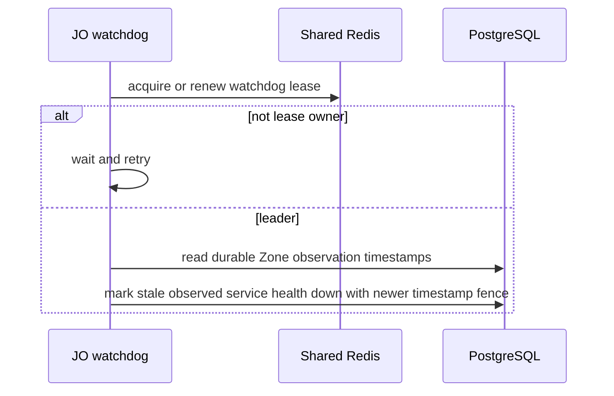
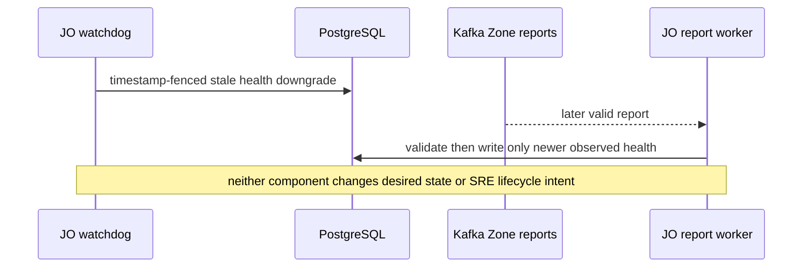

# Zone health watchdog — God View

Handles missing report evidence after a Dataplane failure. It is a timer-driven recovery workflow, separate from live Zone report processing.

## Trigger and authority

| Trigger | Leader election | Write authority | Prohibited writes |
|---|---|---|---|
| watchdog timer observes stale durable report timestamp | short Shared Redis lease | timestamp-fenced service `actual_state` | Zone desired state and SRE lifecycle intent |

## Phase 1 — singleton watchdog

### Internal input and output

| Part | Contract |
|---|---|
| Input | watchdog timer and durable Zone service observation timestamps |
| Coordination output | a single current JO replica owns the short Shared Redis watchdog lease |
| Durable output | only stale service `actual_state` is lowered through newer timestamp fence |
| Failure/retry | lease loss performs no write; PostgreSQL failure leaves no claim that recovery succeeded and next timer retries |

### Key contract

| Key / store | Operation | Owner / invariant |
|---|---|---|
| watchdog leader lease | Shared Redis | acquire/renew by one JO replica | stale owner cannot coordinate concurrent recovery |
| `zone_services.actual_observed_at` | PostgreSQL | timestamp-fenced update | report or watchdog with older evidence cannot win |

The Redis lease prevents concurrent replicas from issuing the same recovery writes. The database timestamp fence rejects a stale owner after failover.

## Phase 2 — recovery boundary

### Internal input and output

| Part | Contract |
|---|---|
| Trigger | next valid Zone report with newer timestamp/fencing evidence |
| Output | report worker may advance observed health through its own fenced write-back |
| Prohibited output | no `zone_services.desired_state` mutation and no `zones.status` mutation |

Absence of a heartbeat is health evidence, not SRE authorization.
