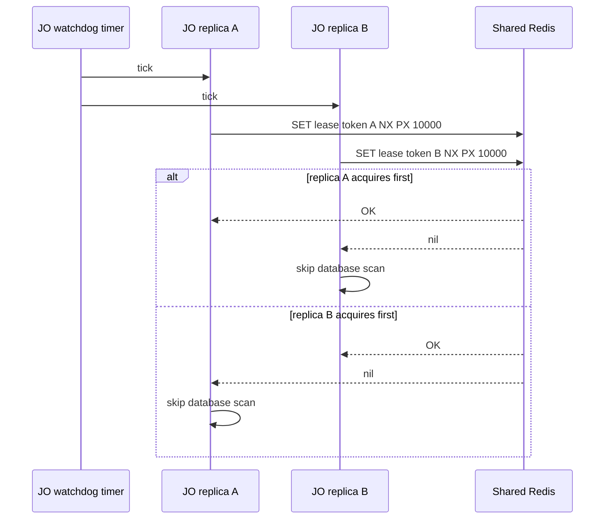
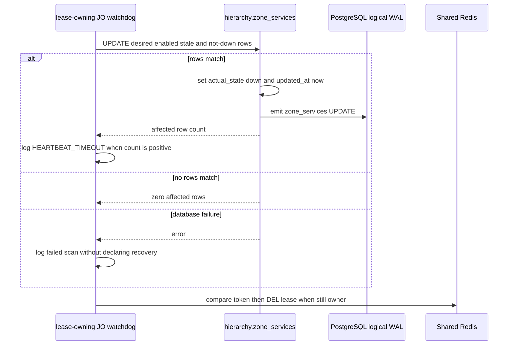
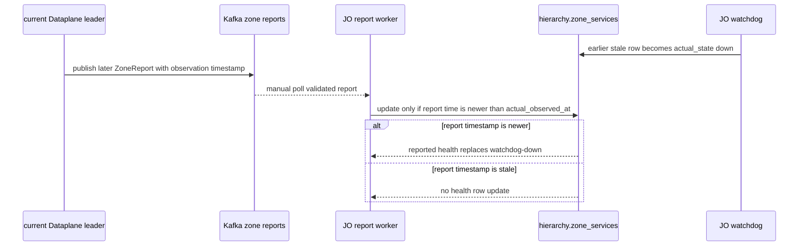

# Zone health watchdog — God View

This workflow is Central's dead-man switch for missing Zone report evidence.
It is separate from live `ZoneReport` processing: it periodically inspects the
durable observation timestamp already written in PostgreSQL and marks stale,
desired-enabled services down. It never issues a Zone command and never changes
what SRE asked a service to do.

The current implementation is a **cluster-wide** scan, despite the Zone name:
one short Shared Redis lease covers every eligible
`hierarchy.zone_services` row. The lease is coordination only. The durable SQL
predicate and state no-op make overlapping lease holders mostly harmless, but
the watchdog is not a timestamp-fenced writer in the same sense as the report
processor.

## Scope, authority, and timing

| Concern | Contract |
| --- | --- |
| Process owner | JO `zone_state::watchdog::run`, started as one of the JO runtime workers. |
| Trigger | Tokio interval ticks immediately at worker start, then every five seconds with missed ticks skipped. |
| Coordination key | Shared Redis `leader:{zone-health-watchdog}`. `SET NX PX 10000` gives one holder a ten-second lease token. |
| Durable read/write | PostgreSQL `hierarchy.zone_services`. The scan writes only `actual_state = 'down'` and `updated_at`. |
| Eligible row | `desired_state = TRUE`, `actual_observed_at < NOW() - 30 seconds`, and current actual state is not already `down`. |
| Prohibited writes | `desired_state`, `actual_observed_at`, Zone `status`, Zone planning/maintenance state, service topology, outbox, Kafka, and Zone KV. |
| Recovery producer | A subsequent valid Kafka `ZoneReport` processed by the regular JO report worker. |

## Key and state contract

| Store | Key / column | Owner | Meaning |
| --- | --- | --- | --- |
| Shared Redis | `leader:{zone-health-watchdog}` | currently elected watchdog invocation | random UUID token, ten-second PX TTL. It is not a durable business lock. |
| PostgreSQL | `zone_services.desired_state` | Controlplane SRE workflows | Whether the watchdog is allowed to observe that service. It never mutates it. |
| PostgreSQL | `zone_services.actual_state` | report worker and watchdog | Current operational observation; watchdog writes only `down`. |
| PostgreSQL | `zone_services.actual_observed_at` | report worker | Time of the last accepted report. Watchdog only reads it in the current code. |
| PostgreSQL | `zone_services.updated_at` | writer | Updated by watchdog as audit/change time. It is not report freshness. |
| Kafka | `aurora.zone.reports.v1` | Dataplane leader to JO report worker | Later valid reports can overwrite watchdog-down subject to report timestamp fencing. |

## Phase 1 — one JO replica receives temporary scan authority

### Input and output

| Part | Contract |
| --- | --- |
| Input | A five-second timer tick, a Shared Redis multiplexed connection, and a fresh randomly generated token. |
| Redis command | `SET leader:{zone-health-watchdog} <token> NX PX 10000`. |
| Success output | The holder may run one PostgreSQL scan immediately. |
| Non-owner output | No database read or write. The next tick tries again. |
| Redis failure | Log error and skip this tick. No optimistic database write is allowed. |

The worker does not renew a lease. It releases it after its SQL attempt with a
compare-token Lua script, but a long database stall can outlive the 10-second
TTL. In that case another replica may acquire and overlap the original scan.

## Phase 2 — the lease holder performs one guarded PostgreSQL downgrade

### Durable input and output

| Part | Contract |
| --- | --- |
| Input | All `hierarchy.zone_services` rows in the Central database. This is not restricted to a configured Zone ID. |
| Predicate | Service is desired-enabled, report observation timestamp is older than 30 seconds, and actual state is not already `down`. |
| Output | Set `actual_state = 'down'` and `updated_at = NOW()` for matching rows. |
| Idempotency | A concurrent or repeated watchdog scan sees `actual_state = 'down'` and affects zero rows. |
| Failure | Log error. The lease release attempt still runs; no success marker is persisted. A later tick repeats the scan. |

The watchdog does not start a transaction that combines Redis ownership with
the SQL write. Redis and PostgreSQL are deliberately separate failure domains.
The SQL `actual_state != 'down'` condition is the durable no-op guard when two
valid lease holders overlap after TTL expiry.

### What the logical changefeed does with this write

The database update may appear in the JO logical replication stream because it
updates `hierarchy.zone_services`. However, the changefeed's metadata path
compares `desired_state` against its durable-in-process cache. Since the
watchdog does not change desired state, the normal outcome is suppression: it
does not publish a Zone configuration snapshot merely because current health
became down. This preserves the difference between SRE intent and runtime
observation.

## Phase 3 — a later live report recovers operational evidence

The watchdog never declares a service healthy. Recovery comes only from a new
Dataplane leader report that passes JO's normal Kafka validation.

### Recovery input and output

| Part | Contract |
| --- | --- |
| Input | Valid `ZoneReport` with a mail/storage status, report timestamp, and Zone UUID binding. |
| Report-side database guard | `actual_observed_at IS NULL OR actual_observed_at < to_timestamp(report.timestamp)`. |
| Output | For desired-enabled mail/storage rows, report worker may write its reported `actual_state` and update `actual_observed_at`. |
| Not recovery | A Redis lease release, another watchdog tick, a KV health key, or an OTel metric does not change the Central durable health state. |

Because the watchdog deliberately leaves `actual_observed_at` unchanged, a
later report can recover health if its observation timestamp is newer than the
previous report time. It does not need to be newer than the wall-clock time of
the watchdog scan.

## Failure and recovery matrix

| Situation | Current result |
| --- | --- |
| Redis unavailable | No scan runs; each later five-second tick attempts Redis again. |
| Redis lease expires during slow SQL | Another replica can scan. Both writes use the durable `actual_state != 'down'` no-op predicate. |
| PostgreSQL unavailable | No row changes and no durable success marker. The future timer tick retries. |
| One Zone never emitted a report | Rows with a null `actual_observed_at` do **not** satisfy SQL's `<` predicate and are not marked down by this watchdog. |
| Service is desired-disabled | It is ignored even if its actual observation is stale. |
| Zone is planned, maintenance, or disabled but service desired flag remains true | The current query has no `zones.status` predicate, so it can mark that service down. |
| Report worker is unavailable | Watchdog can continue to downgrade stale health, but nothing restores healthy/degraded state until report processing resumes. |
| Watchdog process restarts | Redis TTL/token does not survive as an ownership claim; the next process tick competes for a fresh lease. PostgreSQL remains the durable state. |

## AS-IS discrepancy record

The earlier short God View described this as a timestamp-fenced watchdog. That
is not what the code does. The exact gaps are documented here so a future
implementation can reconcile them deliberately.

| Discrepancy | Evidence | Security or recovery effect |
| --- | --- | --- |
| Watchdog does not write `actual_observed_at` | Its SQL sets only `actual_state` and `updated_at`. | It cannot record the time of its own down observation and relies on state no-op for overlap. |
| No watchdog fencing token reaches PostgreSQL | Redis token is checked only by Redis at release. | A stale lease holder is not rejected by a token predicate at the database layer. |
| Null timestamps are skipped | `NULL < NOW() - interval` evaluates to null, not true. | Services that have never been reported do not become down through this flow. |
| Scan is global | The SQL has no Zone UUID or Zone status filter. | Operational semantics cover all Central Zones, not a single Zone. |
| Lease release errors are ignored | The Lua release result is assigned but not acted on. | TTL remains the recovery mechanism if Redis cannot release cleanly. |
| Reports use a different fence | Report processing compares report timestamps for service health and applies leader/time fencing for encryption keys. | Do not assume a watchdog update participates in those stronger report fences. |

This workflow remains useful as a conservative stale-report indicator, but its
current behavior must not be represented as a complete heartbeat or lifecycle
state machine.
