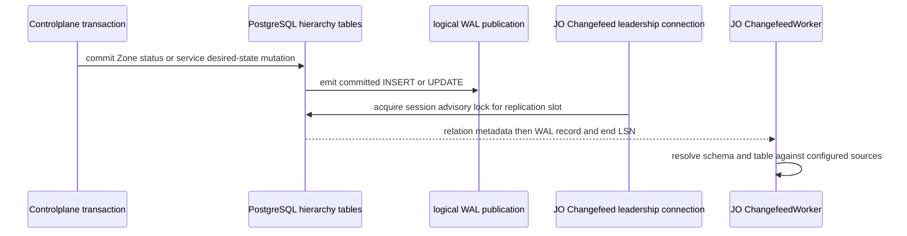
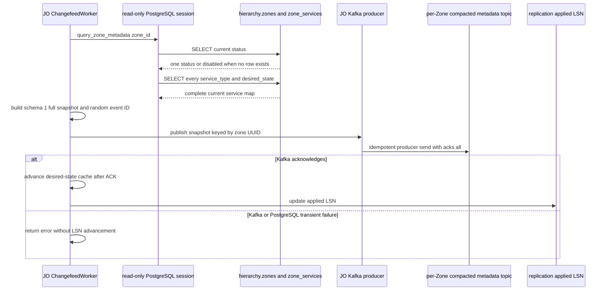
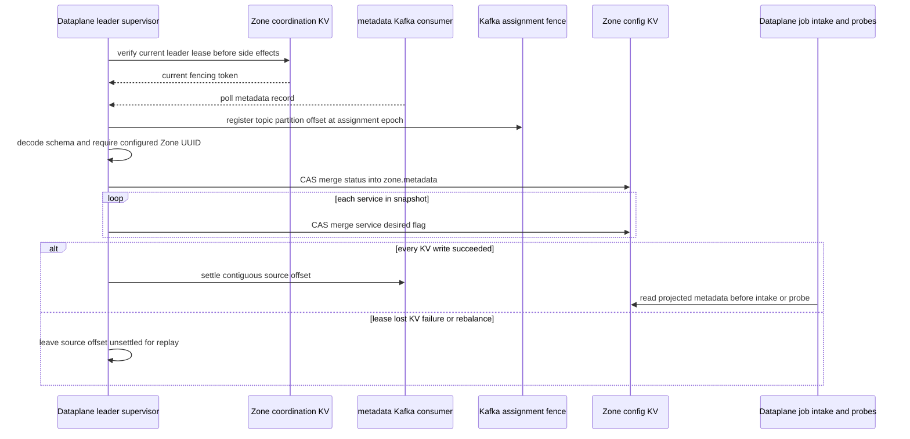

# Zone metadata propagation — God View

This workflow projects the committed, Central-owned Zone configuration into the
local runtime configuration of exactly one Zone. It begins after a PostgreSQL
transaction commits; it is not a browser request and it never changes the
authoritative hierarchy aggregate.

Its purpose is deliberately narrow: Dataplane needs a rebuildable local answer
to **is this Zone active and which service types are desired-enabled?** before
it admits work or runs leader-only infrastructure probes. PostgreSQL remains
the only source of truth for `hierarchy.zones` and
`hierarchy.zone_services`.

## Workflow scope, authority, and non-goals

| Concern | Contract |
| --- | --- |
| Workflow owner | Job Orchestrator (JO) ChangefeedWorker publishes the Central snapshot. The current fenced Dataplane leader projects it locally. |
| Authoritative state | PostgreSQL `hierarchy.zones.status` and `hierarchy.zone_services.desired_state`. |
| Local projection | The JSON aggregate at `AURORA_ZONE_CONFIG/zone.metadata`. It is replaceable cache, never an ownership or lifecycle source of truth. |
| Trigger | An `INSERT` or `UPDATE` received from the configured logical-replication publication for `hierarchy.zones` or `hierarchy.zone_services`. |
| Out of scope | Browser authorization, Zone job intake, `actual_state`, physical node health, service creation, Zone deletion, and a direct Dataplane-to-PostgreSQL query. |
| Authority prohibition | Neither JO nor Dataplane may mutate `desired_state` through this workflow. A local KV value cannot authorize an SRE lifecycle change. |

The starting write is owned by the separately documented Zone status or Zone
service desired-state workflow. This document starts at that write's durable
commit and traces the resulting runtime side effect end to end.

## Durable and projection contract

| Layer | Exact identifier | Producer | Consumer | Contract |
| --- | --- | --- | --- | --- |
| PostgreSQL | `hierarchy.zones` | Controlplane or guarded JO runtime status update | logical replication | Zone ID and current `status` are authoritative. |
| PostgreSQL | `hierarchy.zone_services` | Controlplane | logical replication | `desired_state` is authoritative. `actual_state` is operational evidence only. |
| Kafka | `aurora.zone.metadata.<zone_uuid>.v1` | JO ChangefeedWorker or JO repair responder | one current Zone metadata leader | `ZoneMetadataSnapshotV1`, keyed by the textual Zone UUID. The topic must be compacted by infrastructure provisioning. |
| Kafka | `aurora.jobs.dlq.v1` | Dataplane metadata listener | operators | `DeadLetterRecordV1` is durable evidence before poison source settlement. |
| Zone JetStream KV | bucket `AURORA_ZONE_CONFIG`, key `zone.metadata` | Dataplane metadata leader | Dataplane intake and leader probes | JSON `ZoneMetadata { status, services, updated_at }`. No TTL, history one, file storage. |
| Zone JetStream KV | `AURORA_ZONE_COORDINATION/lease.zone.leader` | Dataplane leader election | every leader duty | owner ID plus monotonic fencing token and expiry. It gates projection side effects. |

### `ZoneMetadataSnapshotV1` wire fields

| Field | Source | Validation or use |
| --- | --- | --- |
| `event_id` | random UUID for CDC, request UUID for repair | carried as event identity. The current projection does not persist or fence it. |
| `zone_id` | authoritative Zone UUID | must byte-match the configured Dataplane `ZONE_ID`. |
| `status` | current `hierarchy.zones.status` reread by JO | copied into `zone.metadata.status`. |
| `services[]` | all current `zone_services.service_type` and `desired_state` rows | each pair is merged into the local `services` map. |
| `observed_at_unix_ms` | JO wall clock | diagnostic only in the current Dataplane projector. It is not a stale-write fence. |
| `schema_version` | constant `1` | required by the Dataplane listener. |

## Phase 1 — committed hierarchy change becomes a Changefeed input

### Input and durable boundary

| Input | Required fact |
| --- | --- |
| PostgreSQL change | The transaction has committed an `INSERT` or `UPDATE` on a monitored hierarchy table. An uncommitted row is never visible to logical replication. |
| Zone identity | `zones.id`, or `zone_services.zone_id`, parses as a UUID. |
| Service input | The incoming row exposes `service_type` and `desired_state` when the changed relation is `zone_services`. |
| Output | A logical WAL record at a specific LSN. JO may advance that LSN only after it has reached a terminal outcome. |

`ChangefeedWorker` first acquires a PostgreSQL session advisory lock derived
from the configured replication-slot name. Standby JO replicas do not open a
second replication stream. A dead holder loses that session lock when its
PostgreSQL connection closes; a later retry opens a new session.

For a monitored `zones` row, JO reads `id`. For a monitored `zone_services`
row, it reads `zone_id`. A malformed UUID is classified as a permanent change
error, quarantined by the Changefeed worker, then its WAL position advances.
It is not retried forever as a transient database outage.

### Desired-state suppression rule

Before starting an expensive full snapshot reread, JO handles a
`zone_services` record as follows.

| Step | Behavior |
| --- | --- |
| Bootstrap | On process startup, JO reads every `(zone_id, service_type, desired_state)` into an in-process cache. The metadata database session is explicitly read-only. |
| Compare | If the incoming desired value equals the cached value, `process_zone_config_change` returns without publishing a snapshot. |
| Publish success | The cache is advanced only after Kafka acknowledges the snapshot. |
| Publish failure | The cache is not advanced and the WAL LSN remains unacknowledged, so replay repeats the same attempt. |
| `zones` row | No equivalent status cache exists. Each monitored Zone row reaches the full-snapshot path. |

This makes ordinary `actual_state` updates quiet **when** their replicated row
still contains the same `desired_state`. It does not make `actual_state` a
configuration input.

## Phase 2 — JO rereads the aggregate and publishes a durable snapshot

### Internal input and output

| Part | Contract |
| --- | --- |
| Input | Valid Zone UUID from the committed WAL record. The WAL row is only a wake-up, not the value copied to a Zone. |
| Reread | `query_zone_metadata` uses the read-only PostgreSQL session to query the current Zone status and every current service desired flag. |
| Output | One complete `ZoneMetadataSnapshotV1`, keyed by the same Zone UUID, to that Zone's metadata Kafka topic. |
| Producer durability | JO Kafka producer uses idempotence and `acks=all`. A successful `publish_message` is the publication boundary. |
| WAL settlement | The replication client advances `applied_lsn` only after this method succeeds, or after a permanent error has been durably quarantined. |

The database reread is intentional. A WAL row can be old by the time it is
processed, and a delta would require the Zone to reconstruct ordering between
status and service rows. The produced snapshot instead represents the complete
aggregate visible at the reread.

If PostgreSQL no longer has the Zone row, `query_zone_metadata` emits
`status = "disabled"` and an empty service map. This is a read fallback, not a
Zone-delete protocol.

## Phase 3 — a fenced Dataplane leader projects Kafka into Zone KV

### Leader precondition

Every Dataplane replica can run jobs, but only one current leader runs this
listener. It owns `lease.zone.leader` by a JetStream-KV compare-and-set lease:
15-second TTL, five-second renewal, hostname plus boot UUID owner ID, and a
monotonic fencing token. The supervisor cancels all leader duties when renewal
or a current-owner read fails.

| Input | Requirement |
| --- | --- |
| Kafka consumer | Group `aurora-zone-metadata-<zone_uuid>-v1`, auto commit disabled, at most eight records per poll. |
| Assignment fence | The consumer assignment epoch is registered before every record can settle. A rebalance after poll leaves the record unsettled. |
| Snapshot | Non-tombstone Protobuf, `schema_version == 1`, and byte-exact configured Zone UUID. |
| Output | Status merged first, then every service entry merged into `AURORA_ZONE_CONFIG/zone.metadata`. |
| Settlement | Kafka offset settles only after every KV update succeeds, or after a poison record is durably sent to the DLQ. |

`ZoneKvStore::update_zone_metadata` retries its compare-and-set merge at most
five times. A replay of an identical snapshot is safe because it overwrites the
same fields. A Kafka settlement failure after successful KV writes is also
expected to replay idempotently.

### Poison-record settlement

| Poison condition | Durable action | Source offset |
| --- | --- | --- |
| Kafka tombstone | Publish `ZONE_METADATA_TOMBSTONE_UNEXPECTED` to `aurora.jobs.dlq.v1`. The DLQ event ID is deterministic from source topic, partition, offset, and error code. | Settle only after DLQ publication succeeds. |
| Decode, schema, or Zone mismatch | Publish `ZONE_METADATA_PROTO_INVALID` with the original payload. | Settle only after DLQ publication succeeds. |
| DLQ publish failure | Log retryable failure. | Remains unsettled. |
| KV apply failure | Log retryable failure. | Remains unsettled. |

## Consumption semantics and failure boundary

The local projection is deliberately fail-closed. `ZoneMetadata::default()` is
`status = "inactive"` and no enabled services. An unavailable or corrupt
metadata value therefore does not become permission to admit new work.

| Failure or race | Current behavior |
| --- | --- |
| Another Dataplane replica becomes leader | The old session cancels and does not project or settle further records. The new leader reconsumes from the group. |
| Kafka unavailable at JO | WAL LSN stays behind the durable publication boundary and reconnect logic retries. |
| Kafka unavailable in Zone | The local metadata stays at its last projection. Intake should remain governed by that local value and its own fail-closed checks. |
| Zone KV unavailable | The metadata source offset stays uncommitted. No partially failed record is declared applied. |
| Process dies after KV write, before offset settlement | Kafka replay applies the same fields again. |
| Invalid source record | It cannot permanently block the compacted topic once DLQ persistence succeeds. |

## AS-IS gaps that this God View must not hide

| Gap | Evidence and consequence |
| --- | --- |
| Projection is not atomic | The listener writes status, then services one at a time. A crash or fifth CAS failure can leave a mixed aggregate until replay. |
| Absent services are never removed | `update_zone_metadata` only inserts or overwrites entries. A complete snapshot with no `mail` entry does not delete an older local `mail` flag. |
| No `DELETE` changefeed path | The Changefeed worker handles only `INSERT` and `UPDATE`; hard-delete/tombstone cleanup is not implemented. |
| No snapshot ordering fence | `event_id` and `observed_at_unix_ms` are not stored or compared by the Zone projector. Kafka partition order is relied on, but the KV value has no independent stale-write guard. |
| Topic provisioning is external | JO and Dataplane construct the per-Zone topic name but do not create or verify compaction themselves. The dev compose provisions only its declared Zone topic. A newly created Zone needs infrastructure topic provisioning before this workflow can converge. |

These are implementation facts, not permissions to infer missing state. A future
change that adds atomic replacement, service deletion, tombstones, or snapshot
generation must update this workflow and its recovery contract together.
