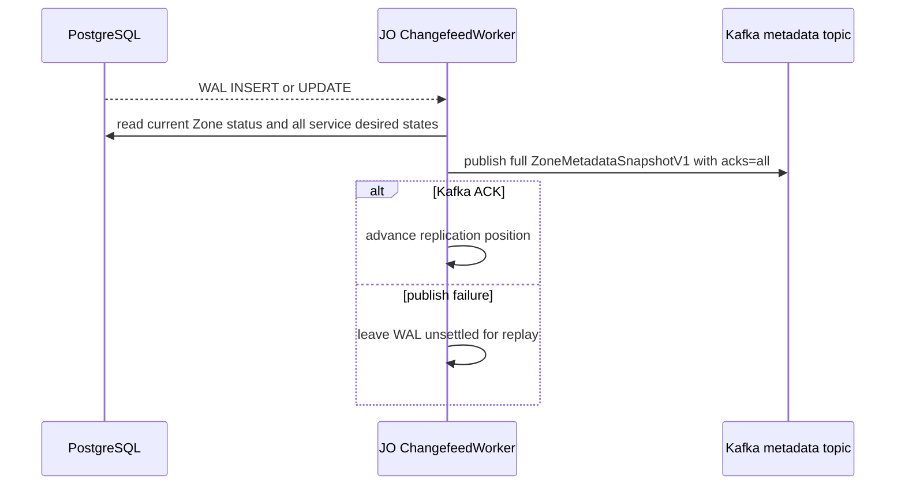
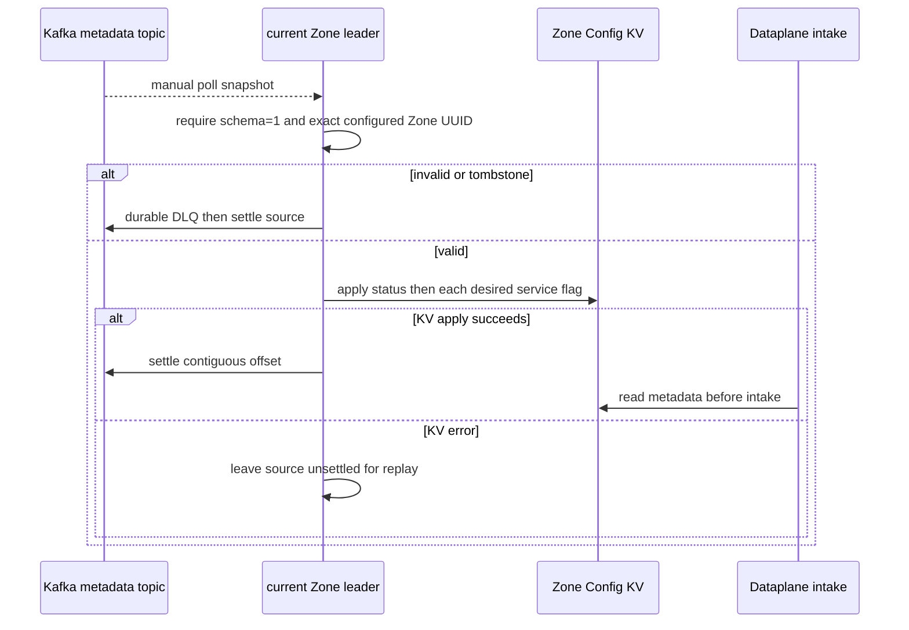

# Zone metadata propagation — God View

Projects Controlplane’s committed Zone status and desired-service changes into the configured Zone’s NATS KV. This is an asynchronous runtime workflow; it is not an HTTP response phase.

## Trigger and authority

| Trigger | Authoritative input | Owners | Durable settlement |
|---|---|---|---|
| WAL `INSERT` or `UPDATE` for `hierarchy.zones` or `hierarchy.zone_services` | PostgreSQL aggregate | JO ChangefeedWorker, Zone leader | Kafka `acks=all`, then consumer settlement after KV projection |

## Key contract

| Store | Key / topic | Value |
|---|---|---|
| Kafka | per-Zone metadata topic | `ZoneMetadataSnapshotV1` keyed by Zone UUID |
| NATS JetStream KV | `AURORA_ZONE_CONFIG/zone.metadata` | status plus desired service flags |

## Phase 1 — PostgreSQL WAL → JO

### Internal input and output

| Part | Contract |
|---|---|
| Input | decoded WAL `INSERT` or `UPDATE`; Zone ID comes from `zones.id` or `zone_services.zone_id` |
| JO reread | `query_zone_metadata` reads authoritative current status and all desired services through a read-only PostgreSQL session |
| Output | full `ZoneMetadataSnapshotV1` with event UUID, exact Zone UUID bytes, service map, timestamp and `schema_version=1` |
| Settlement | publication must receive Kafka `acks=all` before ChangefeedWorker advances replication position |

For `zone_services`, JO suppresses a record whose desired value equals its durable process cache. `actual_state` updates therefore do not republish desired metadata.

## Phase 2 — Kafka → Zone KV

### Internal input and output

| Part | Contract |
|---|---|
| Input | manual-consumed compacted-topic record under current Zone leader/Kafka assignment epoch |
| Validation | non-tombstone payload, Protobuf decode, `schema_version=1`, exact configured Zone UUID |
| Output | Config KV status then every service flag; Dataplane intake reads this projection |
| Settlement | poison record gets durable DLQ before source settle; transient KV failure leaves source unsettled |

Only the fenced Zone leader projects and settles. Missing, corrupt, or unavailable metadata makes intake fail closed; only `active` permits new work.

## Current limitation

The listener applies status and service entries sequentially; it does not atomically replace the entire KV aggregate or clear absent service entries. Changefeed also ignores WAL `DELETE`. The snapshot is complete at Kafka, but hard-delete detach/tombstone semantics are not implemented.
