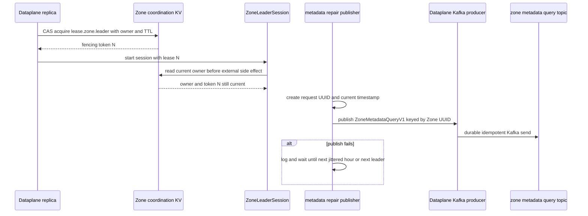
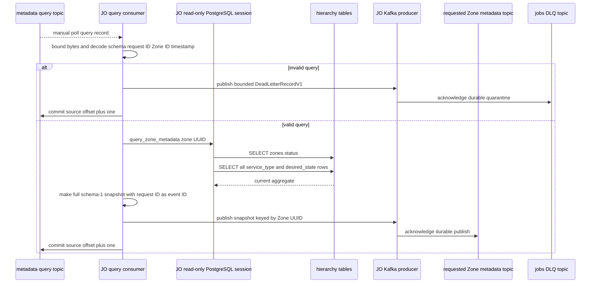
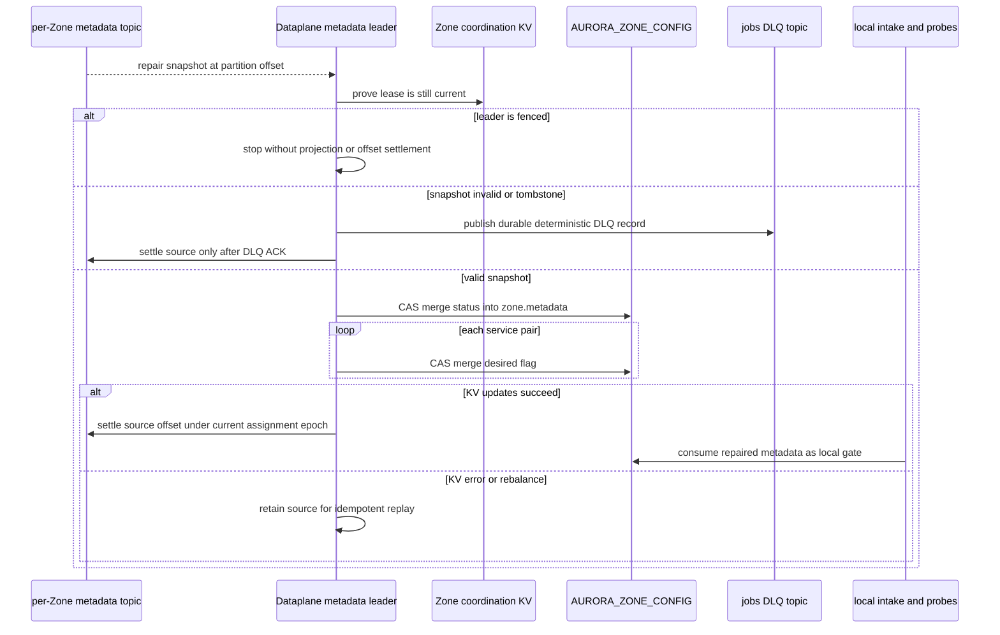

# Zone metadata repair — God View

This is the cold-start and periodic recovery path for the Zone metadata
projection. It deliberately does not query PostgreSQL from the Zone. A newly
elected Dataplane leader asks Central for a full snapshot through Kafka, then
uses the same local projection boundary as ordinary metadata propagation.

The workflow exists because a Zone can start after a Central configuration
change, miss an earlier live record, or retain an incomplete KV aggregate after
an interrupted projection. It is not a request-response RPC: the reply is a
durable record in the Zone's compacted metadata topic.

## Scope and authority

| Concern | Contract |
| --- | --- |
| Trigger owner | The current fenced Dataplane leader starts one repair publisher at leader-session start, then repeats after one hour plus 0–29 seconds of jitter. |
| Central responder | JO `run_metadata_query_listener` owns query validation and the read-only PostgreSQL reread. |
| Source of truth | PostgreSQL hierarchy Zone status and desired service state. |
| Zone authority | The Dataplane leader may write only the rebuildable `AURORA_ZONE_CONFIG/zone.metadata` projection. |
| Durable transport | Kafka query topic and per-Zone metadata topic, both manual-settlement at their consumers. |
| Explicit non-goals | The query cannot create a Zone, change service desired state, change Zone lifecycle, grant access, repair a deleted KV key by guessing data, or read Central PostgreSQL from the Zone. |

## Keys, topics, identities, and timing

| Layer | Identifier | Value and invariant |
| --- | --- | --- |
| Zone coordination KV | `AURORA_ZONE_COORDINATION/lease.zone.leader` | Leader CAS value contains `owner_id`, fencing token, and expiry. TTL 15 seconds, coordinator renews every five seconds. |
| Kafka request | `aurora.zone.metadata.queries.v1` | `ZoneMetadataQueryV1`, Kafka key is textual Zone UUID. This is not a Redis reply channel. |
| Kafka response | `aurora.zone.metadata.<zone_uuid>.v1` | Full `ZoneMetadataSnapshotV1` for exactly one Zone. Infrastructure must configure this per-Zone topic as compacted. |
| Kafka quarantine | `aurora.jobs.dlq.v1` | Invalid query or invalid Zone snapshot is recorded before that consumer settles its source. |
| Zone config KV | `AURORA_ZONE_CONFIG/zone.metadata` | JSON projection with no TTL. Absent metadata defaults to inactive and no services. |
| Request identity | `request_id` | New random UUID from the leader. JO copies it into reply `event_id`; it is correlation only today, not a local ordering fence. |
| Cadence | leader start, then `3,600 + random(0..30)` seconds | No immediate retry loop after an unsuccessful Kafka publish. The next timer or a later leader session tries again. |

### `ZoneMetadataQueryV1` contract

| Field | Producer | Current responder validation |
| --- | --- | --- |
| `request_id` | fresh leader-generated UUID bytes | exactly 16 bytes |
| `zone_id` | configured Dataplane Zone UUID bytes | exactly 16 bytes, then parsed into a UUID |
| `requested_at_unix_ms` | current leader wall-clock time | must be positive |
| `schema_version` | constant `1` | must equal `1` |

The responder accepts a maximum 64 KiB record. It does not use the Kafka record
key as an additional binding, and it does not currently enforce a clock window
or reject a nil UUID. Those AS-IS limits appear below rather than being hidden
behind a stronger description.

## Phase 1 — Dataplane acquires leader authority and emits a repair query

### Preconditions

Every Dataplane pod tries to acquire the same Zone-local JetStream KV lease.
The lease value is changed by compare-and-set, carries a monotonically
increasing fencing token, and uses a hostname plus boot UUID as its owner ID.
The elected pod is still a normal job worker; it merely gains the singleton
runtime duties for this leader session.

| Check | Result |
| --- | --- |
| Lease acquire succeeds within five seconds | Start leader session and all leader duties. |
| Lease held by another node | Wait roughly 1–2 seconds with jitter and retry election. |
| KV acquisition or current-owner read fails | Fail closed: no metadata query and no external leader side effect. |
| Lease renewal returns false or errors | Cancel the entire session, drain/abort duties, and let a future election occur. |

### Internal input and output

| Part | Contract |
| --- | --- |
| Input | Current `ZoneLeaderSession`, configured `ZONE_ID`, Kafka producer, and a valid current coordination lease. |
| Output | A schema-1 repair query keyed by the textual Zone UUID. |
| Publication boundary | `KafkaTransport::publish_message` encodes Protobuf and waits for the idempotent producer's `acks=all` result. |
| Failure | A failed publish only logs a warning. The leader does not synthesize `active`, clear KV, or contact PostgreSQL. |

The publisher runs immediately on entering its loop, so a newly elected leader
does not wait an hour for its first repair. Its next wait is cancellation-aware:
leader loss stops the task instead of letting an old leader publish after
failover.

## Phase 2 — JO validates the query and rereads Central authority

### Internal input and output

| Part | Contract |
| --- | --- |
| Consumer | Group `aurora-job-orchestrator-zone-metadata-query-v1`, auto commit disabled, polls every second. |
| Input bound | At most 64 KiB of payload. Missing Kafka value becomes an empty byte sequence and therefore fails decode. |
| Central read | A dedicated JO PostgreSQL session runs `SET default_transaction_read_only = on` before serving. |
| Output | Full `ZoneMetadataSnapshotV1` on the requested Zone's Kafka metadata topic, Kafka keyed by textual Zone UUID. |
| Query settlement | Commit `offset + 1` only after response publication succeeds, or after a durable query-DLQ publication for an invalid request. |

The WAL changefeed is not in this path. JO reads the current state directly,
which makes repair independent of whether a previous CDC publication was
missed. If no Zone exists for the requested UUID, `query_zone_metadata` returns
`disabled` with an empty service map; it does not mutate Central state.

### Invalid-query behavior

| Invalid condition | Terminal action |
| --- | --- |
| More than 64 KiB, non-Protobuf payload, unsupported schema, non-16-byte request/Zone ID, or nonpositive request time | Publish `ZONE_METADATA_QUERY_PROTO_INVALID` to `aurora.jobs.dlq.v1`, keeping at most 4 KiB of original payload. |
| DLQ publish errors | Return the error. The source query offset remains uncommitted and the record replays. |
| PostgreSQL or response publish errors | Return the error. The source query offset remains uncommitted and the record replays. |

## Phase 3 — current Zone leader projects the response into local KV

The response is consumed by the same leader-owned listener that receives live
CDC metadata snapshots. The response is not delivered to a temporary reply
queue and no direct JO-to-Dataplane RPC exists.

### Input, checks, and output

| Step | Exact behavior |
| --- | --- |
| Consumer creation | Leader opens group `aurora-zone-metadata-<zone_uuid>-v1` on only its Zone's topic, with manual commit and an assignment-epoch fence. |
| Side-effect gate | Before processing a poll and before external writes, `ZoneLeaderSession` reads the current coordination lease. A stale session returns without settling. |
| Decode | Tombstones, invalid Protobuf, non-v1 schema, and a Zone UUID that differs byte-for-byte from configured `ZONE_ID` are poison input. |
| Projection | It CAS-merges `status` first and each response service entry afterward into one JSON KV document. |
| Success settlement | The Kafka delivery settles only after every merge succeeded. |
| Poison settlement | Deterministic DLQ record first, then source settlement. |

## Recovery semantics

| Situation | Recovery result |
| --- | --- |
| Zone restarts with no config KV value | `zone.metadata` reads as inactive/no services until a compacted record or repair response is projected. |
| Leader changes during a query | The old leader can no longer project or settle after its lease check. The new leader publishes a new query and consumes the durable response topic. |
| Query succeeds but Zone is offline | The compacted metadata topic retains the latest broker record subject to broker retention/configuration. The next leader consumes it. |
| Response applies but offset commit fails | Replay writes the same status and service entries again. |
| Zone KV outage | Source record is not settled. The local value remains whatever was last successfully applied. |
| JO restart | Kafka consumer group resumes its uncommitted query. PostgreSQL reread is safe because the reply is a complete snapshot. |

## AS-IS gaps and discrepancy record

| Item | Current implementation fact | Consequence |
| --- | --- | --- |
| Request correlation is not a fence | The Dataplane projector neither stores `event_id` nor compares `observed_at_unix_ms`. | An old response has no independent local stale-write rejection beyond Kafka ordering. |
| Query key is not checked | JO validates the embedded `zone_id`, but not that the Kafka record key matches it. | Kafka ACLs/topic discipline remain part of the trust boundary. |
| UUID and timestamp validation is minimal | Exactly 16 bytes and positive timestamp are accepted. Nil UUID and arbitrarily old/future times are not rejected. | The request is bounded but not freshness-fenced. |
| Invalid-query DLQ ID is random | JO uses a fresh UUID for query poison records, unlike the deterministic metadata-listener DLQ identity. | A replay after a post-publish/pre-commit crash can create duplicate DLQ records. |
| Empty service map cannot clean local state | The projector does not remove old services absent from a full snapshot. | Repair cannot currently implement hard-delete or detach cleanup. |
| Per-Zone topic provisioning is outside code | JO/Dataplane calculate topic names but do not create or validate compaction. | A new Zone cannot rely on repair until its metadata topic is provisioned. |

The important invariant is therefore modest but real: repair can recreate or
refresh known fields from Central authority without a Zone database credential.
It is not yet an atomic replacement or deletion-reconciliation protocol.
