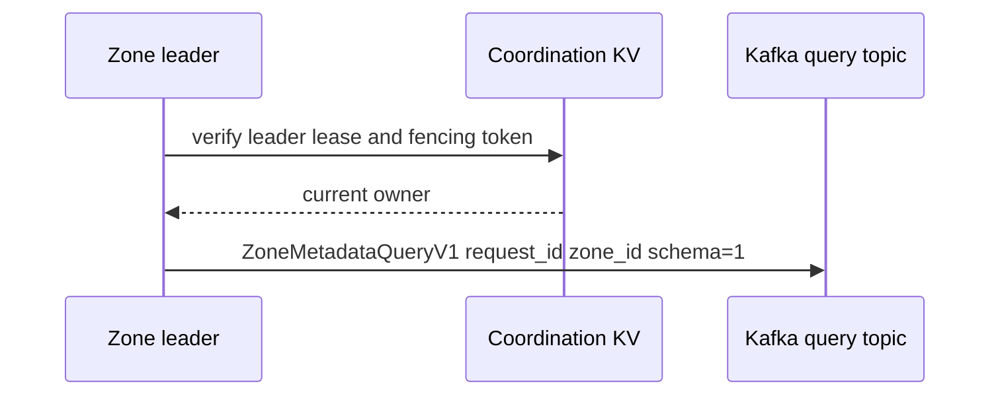
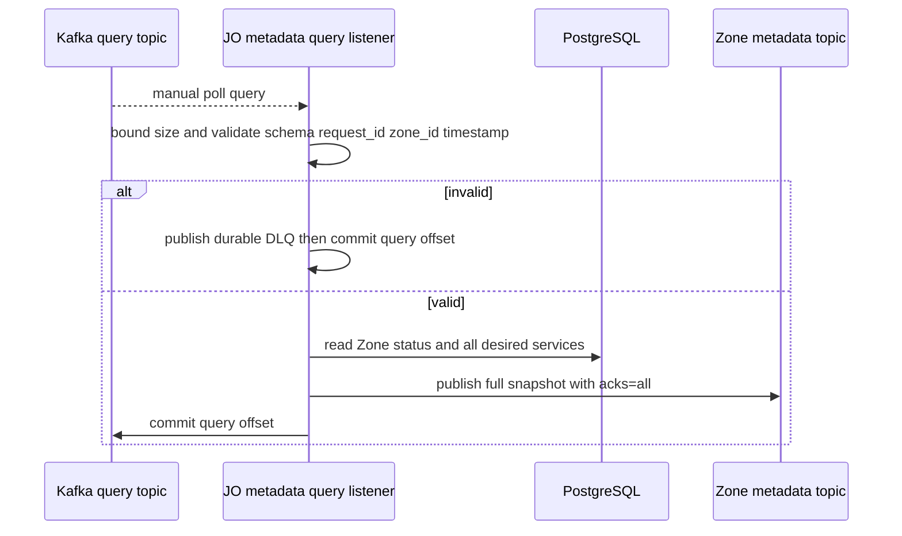
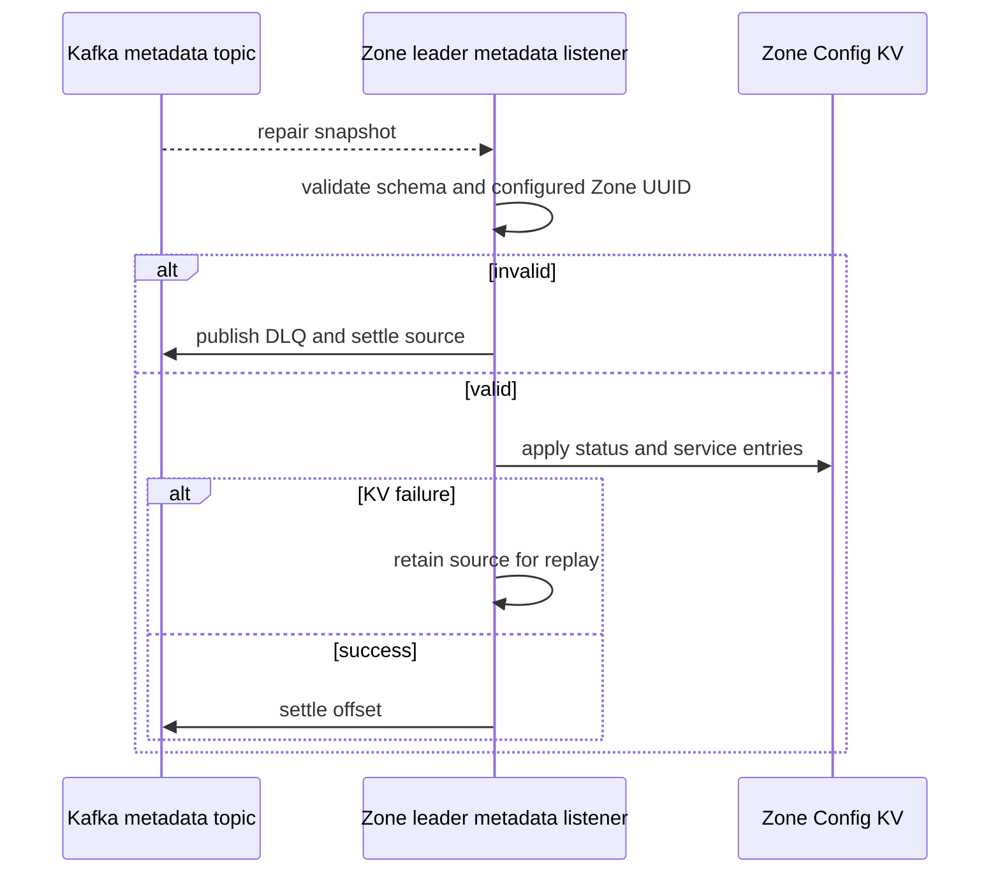

# Zone metadata repair — God View

Repairs a Zone’s local metadata projection after leader acquisition and periodically thereafter. It is independent of WAL delivery and has no browser request.

## Trigger and key contract

| Trigger | Owner | Request topic | Response topic |
|---|---|---|---|
| leader session start and hourly jittered timer | current fenced Zone leader | `aurora.zone.metadata.queries.v1` | that Zone’s compacted metadata topic |

## Phase 1 — Zone leader request

### Internal input and output

| Part | Contract |
|---|---|
| Input | leader-session fence, configured Zone UUID and new UUID request ID |
| Output | `ZoneMetadataQueryV1 { request_id, zone_id, requested_at_unix_ms, schema_version=1 }` keyed by Zone UUID |
| Failure/retry | failed publish has no durable local fallback; the same leader retries on next hourly-jittered timer or successor leader startup |

### Key contract

| Key / topic | Store | Owner / invariant |
|---|---|---|
| `AURORA_ZONE_COORDINATION/lease.zone.leader` | Zone NATS KV | leader fencing must permit side effect |
| metadata query topic | Kafka | durable request, not a Redis reply channel |

The leader publishes only while its session permits external side effects. A failed publish is logged and retried by the next timer; it does not infer a safe runtime state.

## Phase 2 — JO read-only responder

### Internal input and output

| Part | Contract |
|---|---|
| Input | manual-polled `ZoneMetadataQueryV1`, maximum 64 KiB, valid 16-byte request/Zone IDs and positive request timestamp |
| PostgreSQL read | `query_zone_metadata` through read-only JO session |
| Output | full snapshot to compacted per-Zone metadata topic using request ID as snapshot event ID |
| Settlement | invalid input is durably DLQed then query offset commits; valid query commits only after snapshot Kafka ack |

JO’s database session is read-only. The reply is not point-to-point: the compacted per-Zone metadata topic is the durable shared recovery log.

## Phase 3 — projection

### Internal input and output

| Part | Contract |
|---|---|
| Input | response snapshot on the same compacted Zone metadata topic used by WAL propagation |
| Output | leader projects KV then settles snapshot source offset |
| Failure | invalid snapshot is DLQed; KV write failure replays; no direct DP-to-PostgreSQL path exists |

If PostgreSQL no longer has that Zone, current query code returns `disabled` with an empty service map; absent flags are not cleared by the projector, so this is not hard-delete cleanup.
