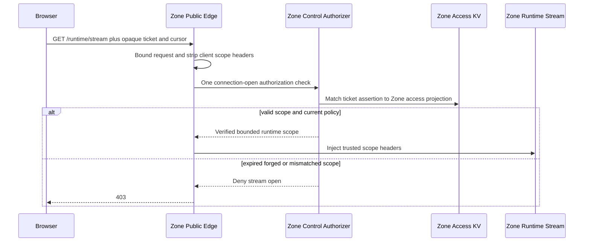
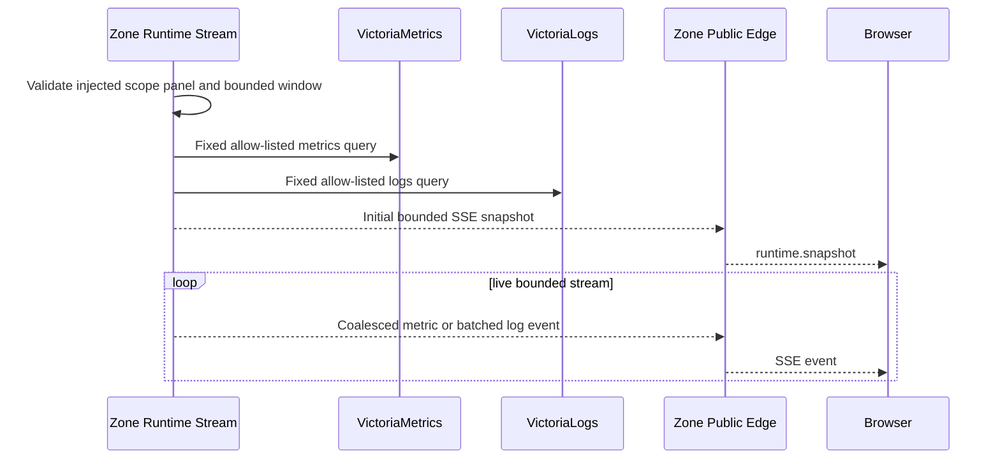

# Zone Runtime Stream Read — God View

This workflow serves diagnostic runtime data for one already-authorized Zone
resource. It is a read-plane only: it cannot change lifecycle, authorize a
business action, or confirm durable completion.

## API contract

| Part | Contract |
|---|---|
| Method/path | `GET /runtime/stream` through Zone Public Edge |
| Browser input | Short-lived opaque `runtime.read` ticket, bounded `Last-Event-ID`, and bounded time window only |
| Forbidden input | PromQL, LogsQL, Victoria endpoint, module/resource/owner/workspace/Zone headers, component scope, or ticket-derived identity |
| Edge output | Public Edge strips ticket/client scope headers and injects verified module, resource type/ID, owner, workspace, Zone, component, and panel headers |
| Response | SSE `runtime.snapshot`, `runtime.metric`, `runtime.log`, `runtime.state`, `runtime.event`, `runtime.gap`, `heartbeat`, or sanitized `stream.error` |

The ticket is issued by the documented Central control path before this request.
This request itself does not pass through ACR; Zone Public Edge and Zone Control
Authorizer enforce the already-issued ticket at stream open.

## Phase 1 — Browser → Zone Public Edge → Zone Control Authorizer

## Phase 2 — Zone Runtime Stream → Victoria read plane → Browser

## Failure and recovery

- Slow metrics are coalesced; bounded logs are batched. A lagging client gets
  `runtime.gap`, not an unbounded buffer.
- Victoria failure produces sanitized `stream.error`; it never changes resource
  status or a Controlplane operation.
- Ticket expiry, scope/policy change, disconnect, or stream limit closes the
  connection. The browser obtains a new ticket and reconnects.
- Replicas are stateless. Crash/restart loses only live stream state; the client
  reconnects and the durable Controlplane/timeline state remains authoritative.

