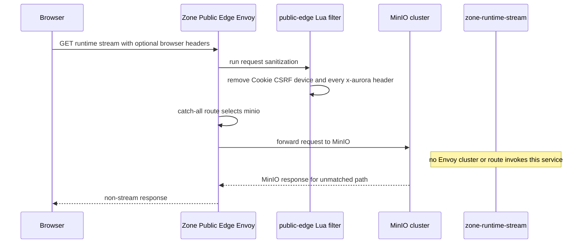
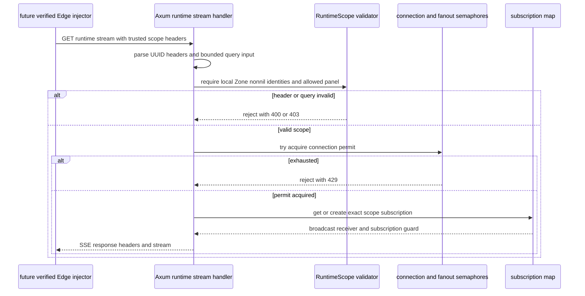
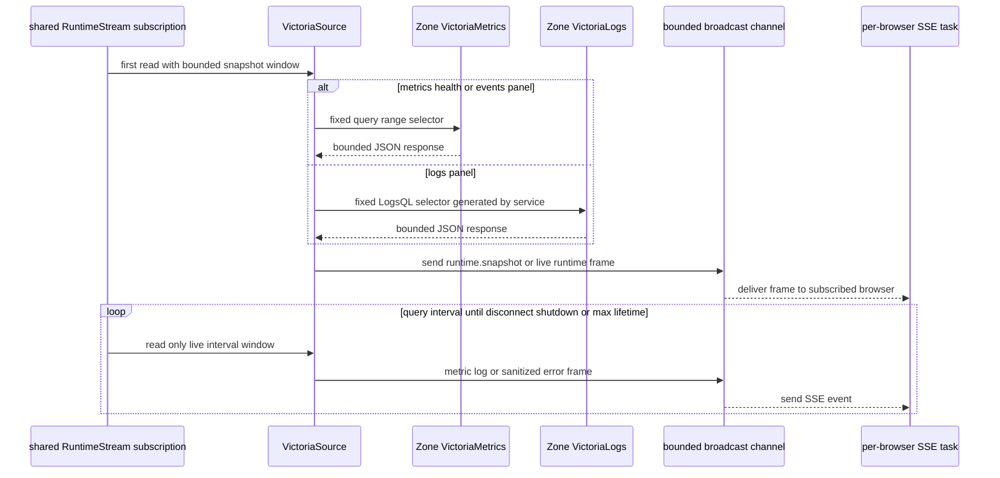
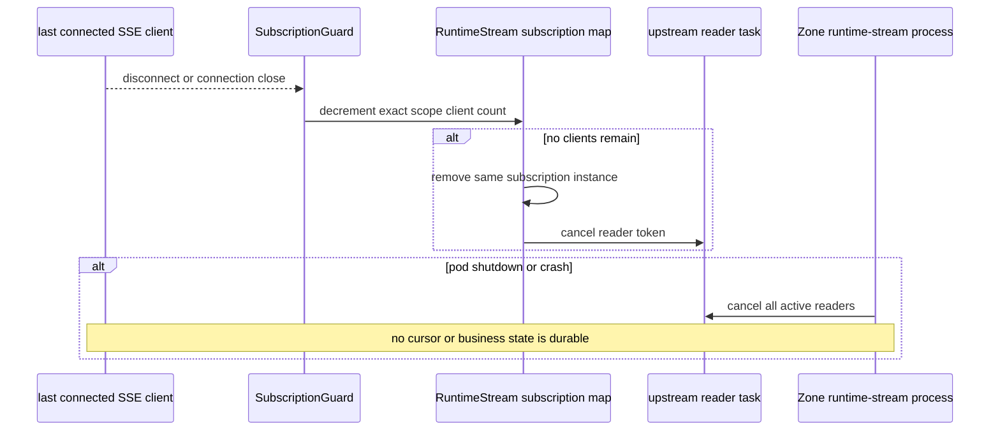

# Zone runtime stream read — God View

This document records the exact current state of the generic Zone runtime
read-plane. The Rust service is implemented and deployed on an internal Zone
network, but the browser-facing workflow claimed by the older document is not
wired. There is no public /runtime/stream route, no scoped-ticket issuer, and
no runtime ticket verifier in the checked-in Edge configuration.

That distinction is security-critical: zone-runtime-stream trusts injected scope
headers and performs no session, signature, or ownership lookup itself. It is
therefore a Zone-internal component today, not an end-to-end public API. The
previous short God View incorrectly described an active path through a Zone
Control Authorizer. That authorizer accepts only storage.object assertions and
has no runtime-stream route or ticket contract.

## AS-IS workflow status

| Layer | Checked-in behavior | Consequence |
| --- | --- | --- |
| Browser ingress | Zone Public Edge listens on TLS port 8080 and matches every path with prefix slash. | It routes /runtime/stream to the minio cluster, not to the Rust stream service. |
| Public Edge filtering | Lua removes every x-aurora caller header, Cookie, CSRF header, and client-device header. | A browser cannot inject trusted runtime scope, but neither can it reach the stream service. |
| Zone Control Edge | It exposes only /zone-control/v1/storage/buckets routes and calls the Rust ExtAuthz service. | It has no /runtime/stream route. |
| Zone Control Authorizer | It verifies Ed25519 storage.object control assertions plus a Zone access record. | It cannot validate a generic runtime.read ticket. |
| Stream Deployment | zone-runtime-stream has a ClusterIP/internal Compose exposure and network policy ingress from Zone Public Edge. | Network reachability is provisioned, but Envoy has no upstream cluster or route to use it. |
| Ticket source | No ACR, Controlplane, protobuf, or gateway code contains runtime.read or a runtime ticket endpoint. | No authenticated authority can create trusted scope today. |
| Stream service | Axum serves GET /runtime/stream when reached from a trusted internal caller. | Directly exposing it would be an authorization vulnerability. |

## Security boundary and non-goals

| Concern | Current contract |
| --- | --- |
| Service identity | The service is Zone-local and configured with exactly one non-nil ZONE_ID. |
| Trusted input | Only injected x-aurora runtime scope headers are accepted by the handler. They must originate from a future verified edge boundary. |
| Data sources | Only Zone VictoriaMetrics and VictoriaLogs HTTP endpoints. No Kafka, NATS, Redis, PostgreSQL, Vault, Kubernetes API, MinIO, or Controlplane credential exists in this service. |
| Browser input | When a route exists, browser input must be limited to an opaque authority artifact, Last-Event-ID, and a bounded snapshot query. The current code does not implement that authority artifact. |
| Query authority | Browser-supplied PromQL, LogsQL, Zone ID, owner ID, workspace ID, resource ID, module, resource type, panel, and component are not acceptable authority input. |
| Non-goals | Lifecycle mutation, command settlement, business authorization, durable timeline completion, raw query proxying, generic Victoria browsing, and credentials or secret delivery. |

The code trust model is intentionally one-way: a caller that can reach this
service with injected headers is treated as trusted. That is safe only after the
Edge route removes all caller copies and injects every scope field from a signed
or server-side verified authority record.

## Endpoint contract of the internal service

### Method, path, query, and headers

| Part | Current handler contract |
| --- | --- |
| Method and path | GET /runtime/stream. The Axum router also exposes internal /healthz and /metrics. |
| Accepted query field | Optional from_seconds. It is clamped to at least one second and must not exceed configured maximum snapshot seconds. |
| Rejected query fields | panel_id and component_id are explicitly rejected if present. Unknown query fields are rejected by deny_unknown_fields. |
| Resume input | Optional Last-Event-ID, maximum 128 ASCII alphanumeric, hyphen, underscore, or dot characters. It is a soft indication only, not a stored replay cursor. |
| Required trusted headers | x-aurora-zone-id, x-aurora-module, x-aurora-resource-type, x-aurora-resource-id, x-aurora-owner-id, x-aurora-workspace-id, and x-aurora-panel-id. |
| Optional trusted header | x-aurora-component-id. |
| Forbidden effect | The handler never reads a cookie, bearer token, opaque ticket, or client-selected scope. No such verification implementation exists yet. |

### Trusted header contract

| Header | Validation and use |
| --- | --- |
| x-aurora-zone-id | Required UUID and must exactly equal local configured ZONE_ID. |
| x-aurora-module | Required token, 1–64 characters of alphanumeric, dot, underscore, or hyphen. It becomes a fixed Victoria label. |
| x-aurora-resource-type | Required token, same bounded token alphabet. It becomes a fixed Victoria label. |
| x-aurora-resource-id | Required non-nil UUID. It becomes a fixed Victoria label. |
| x-aurora-owner-id | Required non-nil UUID. It becomes a fixed Victoria label. |
| x-aurora-workspace-id | Required non-nil UUID. It becomes a fixed Victoria label. |
| x-aurora-panel-id | Required allowed panel: health, metrics, logs, or events. It chooses a fixed query family. |
| x-aurora-component-id | Optional bounded token, 1–128 characters. It is regex-escaped before entering the fixed Victoria selector. |
| Last-Event-ID | Does not identify a resource and does not authorize replay. Its presence causes one runtime.gap event with cursor_not_replayed. |

### Output contract

| Response element | Current behavior |
| --- | --- |
| Content type | Axum SSE response with Cache-Control no-store, X-Content-Type-Options nosniff, and X-Accel-Buffering no. |
| Initial response | First source read emits runtime.snapshot. |
| Live metrics | runtime.metric after each successful non-log poll. |
| Live logs | runtime.log after each successful log poll. There is no line-by-line push channel; the bounded Victoria response is one SSE event. |
| Diagnostic state/events | RuntimeFrame reserves runtime.state and runtime.event, though the current Victoria reader emits snapshot, metric, log, and error frames. |
| Backpressure signal | runtime.gap for a lagged metric/state/event subscriber. |
| Heartbeat | heartbeat every configured interval. |
| Sanitized error | stream.error containing only a code such as VICTORIA_UNAVAILABLE, VICTORIA_RESPONSE_TOO_LARGE, VICTORIA_RESPONSE_INVALID, RUNTIME_SCOPE_INVALID, BACKPRESSURE, or STREAM_EXPIRED. |

## Phase 1 — actual public request path today: it does not reach the stream

This is the complete current browser path. It must be described before any
future design because it explains why a browser cannot rely on the stream
endpoint yet.

### Browser input and Edge behavior

| Browser input | Zone Public Edge behavior |
| --- | --- |
| GET /runtime/stream | Route matches catch-all prefix and selects minio. |
| Any Cookie, CSRF token, client-device header | Lua deletes it before upstream. |
| Any x-aurora header including a forged scope | Lua enumerates and deletes it before upstream. |
| SSE accept header or Last-Event-ID | Not an authority input. The route still selects MinIO. |
| Request lifetime | Envoy route timeout is disabled and idle timeout is 900 seconds, but this is applied to MinIO because no stream route exists. |

No ACR processing occurs in this path. No Central Envoy route is involved, and
no Zone Control ExtAuthz CheckRequest is made. The Stream service is not a
fallback target.

## Phase 2 — internal trusted-scope request processing in the Rust service

This phase describes code that runs only after a future route has performed the
missing authorization/injection boundary. It is an internal component behavior,
not permission to expose the port.

### Input validation and scope construction

| Step | Exact behavior |
| --- | --- |
| Extract identity | Parse Zone/resource/owner/workspace headers as UUIDs and reject malformed values with HTTP 400. |
| Extract bounded tokens | Validate module/resource type/panel and optional component according to the bounded token grammar. |
| Reject client scope query | Reject panel_id or component_id query parameters. The panel and component must arrive from trusted headers. |
| Bound snapshot | Use from_seconds or a default no greater than 60 seconds, minimum one. Reject if it exceeds configured max_snapshot. |
| Validate resume format | Reject malformed Last-Event-ID with HTTP 400; a valid value only triggers the soft gap semantics. |
| Validate full scope | Reject nonlocal Zone, nil resource/owner/workspace UUID, unsupported panel, zero window, or invalid token with HTTP 403. |
| Acquire capacity | Acquire one connection permit and fan-out subscription. Capacity exhaustion returns HTTP 429. |

The subscription key includes all scope fields, including snapshot seconds,
panel, and component. Clients with identical keys share a single upstream
reader; different snapshot windows intentionally form different groups.

## Phase 3 — bounded Victoria read and SSE fan-out

### Source query construction

| Panel | Upstream endpoint | Fixed selector family |
| --- | --- | --- |
| health | VictoriaMetrics /api/v1/query_range | aurora_runtime_health with fixed module, resource type, resource ID, owner ID, workspace ID, and component label matchers. |
| metrics | VictoriaMetrics /api/v1/query_range | same scoped selector with aurora_runtime_metric. |
| events | VictoriaMetrics /api/v1/query_range | same scoped selector with aurora_runtime_event. |
| logs | VictoriaLogs /select/logsql/query | fixed aurora_runtime_logs stream matcher plus the same scoped labels. |

The query strings are generated by the service; no raw browser query text is
accepted. The optional component string is regex-escaped so a
trusted-but-unusual component name cannot widen the label match.

### Poll and fan-out behavior

| Budget | Default and hard behavior |
| --- | --- |
| Connection permit | Default 1,024 current SSE clients. |
| Fan-out groups | Default 256 exact scope groups. |
| Per-group broadcast buffer | Default 128 events. |
| First source window | Requested bounded snapshot, capped at the configured 300-second hard maximum. |
| Live source window | Exactly the configured query interval, default one second. |
| Victoria request timeout | Two-second connect timeout and five-second end-to-end request timeout. |
| Event bytes | Default 256 KiB, never above four MiB. Oversized body returns a sanitized source error instead of being forwarded. |
| Log records | Default at most 100 per Logs request, never above 1,000 configured. |
| Stream lifetime | Default and hard maximum 300 seconds. |
| Heartbeat | Default 15 seconds, must be nonzero. |

If an SSE receiver lags, log panels emit stream.error with BACKPRESSURE and
close, because silently dropping ordered log lines would imply a complete tail.
Other panels drain to the newest frame, first emit runtime.gap, then continue.
A client disconnect drops its guard; when it was the last client of a group, the
subscription is removed and its reader cancellation token stops the upstream
poller.

## Phase 4 — deployment and process recovery

| Boundary | Current deployment fact |
| --- | --- |
| Pod topology | Kubernetes template uses three replicas, PDB minimum two, HPA three to thirty, read-only root filesystem, no service-account token, and non-root UID 65532. |
| Ingress network policy | Allows TCP 8080 only from pods labelled Zone Public Edge. |
| Egress network policy | Allows only VictoriaMetrics port 8428, VictoriaLogs port 9428, and DNS. |
| Compose exposure | Service has no host port. It is attached to zone-runtime-read and the dedicated zone-edge-runtime network. |
| Public Edge egress | Network policy and Compose network permit an eventual stream path, but Envoy route/cluster configuration is absent. |
| Crash/restart | Subscription map and cursors are in-memory. A valid future browser client must reconnect and obtain a newly valid authority artifact. No business state is lost or recovered here. |
| Shutdown | Runtime cancellation stops reader loops. Max stream lifetime bounds any client connection. |

## Required reconciliation before this can become an active API workflow

The current repository has an implementation and deployment boundary, but no
complete Client-to-Edge-to-authority path. The following are missing contracts,
not merely optional hardening tasks.

| Missing boundary | Why it is required |
| --- | --- |
| A single documented ticket/assertion issuer | Must derive Zone, owner, workspace, resource, module, component, panel, and expiry from an already authorized Central request. Browser must not choose them. |
| Exact ingress topology | The system must decide and document whether Client reaches Central Envoy/ACR first, Zone Public Edge with a signed artifact, or another explicit route. If ACR is in the path, the God View must begin Client to Envoy to ACR with every removed, overwritten, and injected header. |
| Zone Public Edge route and upstream cluster | Must route only GET /runtime/stream to zone-runtime-stream, strip all caller scope headers, disable unsafe retries, and inject the verified scope. The current catch-all MinIO route is not sufficient. |
| Verifier ownership | Current Zone Control Authorizer is storage-only. Runtime must have a separately specified verifier or a clearly safe verified-header handoff; it cannot be inferred from storage assertions. |
| Replay/expiry rule | Last-Event-ID is not a ticket and cannot serve as authorization. The authority artifact needs an expiry, audience, Zone binding, replay semantics, and revocation behavior. |
| End-to-end verification | A route/integration test must prove no direct browser can set trusted headers, no MinIO route receives stream requests, and expired/mismatched authority fails before the internal stream service. |

Until those decisions and code are shipped, the only correct browser-facing
status is **disabled/not exposed**. This deep internal contract is preserved so
the future end-to-end God View can attach to real components without treating a
staged design as an operating security boundary.
