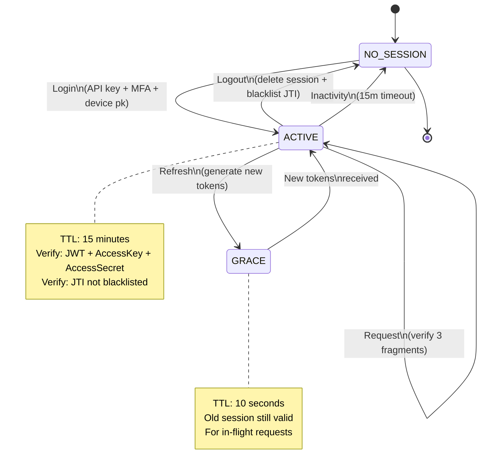

# Aurora Admin Authentication: Token Model & Lifecycle

> **Version**: v2.2  
> **Updated**: 2026-05-29  
> **Scope**: Admin/SRE/Operator Authentication  
> **Focus**: Token Architecture & Session Lifecycle  
> **Status**: Production Ready

---

## Executive Summary

Aurora Admin uses a **Fragment Token** architecture with **4-layer defense-in-depth** to protect infrastructure operations. This spec documents the token model and session lifecycle only—not authentication flows.

**Key Properties**:
- 3-fragment token (JWT + AccessKey + AccessSecret)
- Device binding via Ed25519 public key
- 15-minute inactivity timeout (Redis TTL)
- Instant session revocation (< 1ms)
- HA-safe token rotation (10s grace period)
- Separate admin plane (isolated from user plane)

---

## 1. Token Model

### 1.1 Fragment Token Architecture

Admin authentication uses **3 independent token fragments** that must all be valid for a request to succeed:

```
┌─────────────────────────────────────────────────────────────┐
│                    Fragment Token (3 parts)                  │
├─────────────────────────────────────────────────────────────┤
│                                                              │
│  Fragment 1: JWT (access_token cookie)                      │
│  ├─ Type: HS256 signed JWT                                  │
│  ├─ TTL: 15 minutes                                         │
│  ├─ Claims: sub=admin, access_key, jti, token_use, exp     │
│  ├─ Signed with: SecretFamilyAdminAPIKey                    │
│  └─ Verification: Stateless (gateway-level)                 │
│                                                              │
│  Fragment 2: AccessKey (access_key cookie)                  │
│  ├─ Type: UUIDv7                                            │
│  ├─ TTL: 15 minutes                                         │
│  ├─ Purpose: Redis session identifier                       │
│  ├─ Binding: Must match JWT claim                           │
│  └─ Verification: Stateful (Redis lookup)                   │
│                                                              │
│  Fragment 3: AccessSecret (access_secret cookie)            │
│  ├─ Type: 48-byte random entropy                            │
│  ├─ TTL: 15 minutes                                         │
│  ├─ Storage: SHA256 hash in Redis                           │
│  ├─ Binding: Must match hash in session                     │
│  └─ Verification: Hash comparison (Redis)                   │
│                                                              │
└─────────────────────────────────────────────────────────────┘
```

### 1.2 Why 3 Fragments?

| Fragment | Protects Against | Mechanism |
|----------|------------------|-----------|
| JWT | Token tampering | Signature verification |
| AccessKey | Token substitution | Claim binding + Redis lookup |
| AccessSecret | Session hijacking | Hash comparison + entropy |

**Attack Scenario**: If attacker steals JWT via XSS:
- ❌ Cannot use JWT alone (missing AccessKey + AccessSecret cookies)
- ❌ Cannot forge AccessSecret (48-byte entropy + hash)
- ❌ Cannot substitute AccessKey (claim binding check)
- ✅ Request rejected with 401

### 1.3 Separation from User Plane

Admin tokens are **completely isolated** from user/customer tokens:

| Aspect | Admin | User |
|--------|-------|------|
| Secret Family | `SecretFamilyAdminAPIKey` | `SecretFamilyAccess` |
| Cookie Path | `/admin` | `/` |
| Session Key Prefix | `iam:admin:session:*` | `iam:user:session:*` |
| Cookie Names | `access_token`, `access_key`, `access_secret` | Same names, different path |
| Device ID Cookie | `client_device_id` (365d) | `device_id` (user-specific) |
| Middleware | `AdminAPIKeyAuth` | `Access` |
| Verification | 3-fragment + device binding | JWT only |

**Implication**: Admin session cannot be used for user operations and vice versa.

---

## 2. Token Lifecycle

### 2.1 State Diagram



### 2.2 Session States

| State | Duration | Condition | Action |
|-------|----------|-----------|--------|
| **ACTIVE** | 15m | Session exists in Redis | Accept requests |
| **GRACE** | 10s | Old session after refresh | Accept in-flight requests |
| **BLACKLISTED** | 15m (logout) / 15s (refresh) | JTI in blacklist | Reject requests |
| **EXPIRED** | — | TTL=0 in Redis | Auto-delete, reject requests |
| **REVOKED** | — | Explicit logout | Immediate delete + blacklist |

---

## 3. Token Components

### 3.1 JWT (access_token)

**Structure**:
```
Header: {
  "alg": "HS256",
  "typ": "JWT"
}

Payload: {
  "sub": "admin",
  "access_key": "<UUIDv7>",
  "jti": "<UUIDv7>",
  "token_use": "admin_api",
  "iat": <unix_seconds>,
  "exp": <unix_seconds>
}

Signature: HMAC-SHA256(header.payload, secret_family=admin_api_key)
```

**Properties**:
- **Stateless**: Verified at gateway without DB/Redis lookup
- **Short-lived**: 15 minutes (AdminSessionTTL)
- **Rotated**: New JWT on every refresh
- **Revocable**: JTI tracked in blacklist

**Verification**:
1. Signature check (HMAC-SHA256)
2. Expiry check (exp < now)
3. JTI blacklist check (Redis)

### 3.2 AccessKey (access_key cookie)

**Properties**:
- **Type**: UUIDv7 (128-bit random)
- **TTL**: 15 minutes (AdminSessionTTL)
- **Storage**: Redis session key
- **Binding**: Must match JWT claim `access_key`
- **Rotation**: New UUIDv7 on every refresh

**Purpose**:
- Session identifier (lookup in Redis)
- Binding token to session (claim == cookie)
- Prevents token substitution attacks

**Example**:
```
Cookie: access_key=550e8400-e29b-41d4-a716-446655440000
JWT Claim: "access_key": "550e8400-e29b-41d4-a716-446655440000"
Redis Key: "iam:admin:session:550e8400-e29b-41d4-a716-446655440000"
```

### 3.3 AccessSecret (access_secret cookie)

**Properties**:
- **Type**: 48-byte random entropy (384 bits)
- **TTL**: 15 minutes (AdminSessionTTL)
- **Storage**: SHA256 hash in Redis session
- **Plaintext**: Only in RAM during request
- **Rotation**: New 48-byte on every refresh

**Purpose**:
- Session entropy (prevents brute force)
- Binding token to session (hash comparison)
- Prevents session hijacking

**Verification**:
```
Received: access_secret (plaintext from cookie)
Stored: SHA256(access_secret) in Redis session
Check: SHA256(received) == stored
```

### 3.4 ClientDeviceID (client_device_id cookie)

**Properties**:
- **Type**: UUIDv7 (128-bit random)
- **TTL**: 365 days (AdminTrustedDeviceTTL)
- **Storage**: Redis session + PostgreSQL
- **Binding**: Linked to device public key
- **Renewal**: Extended 365d on every refresh

**Purpose**:
- Persistent device identification
- Device tracking (audit trail)
- Device revocation capability
- Trusted device state

**Lifecycle**:
- Generated at login
- Persisted in cookie (365d)
- Reused on returning device
- Bound to Ed25519 public key
- Can be revoked (device blacklist)

---

## 4. Redis Session Storage

### 4.1 Session Record

**Key**: `iam:admin:session:{AccessKey}`

**Value**:
```json
{
  "AccessKey": "<UUIDv7>",
  "AccessSecretHash": "<SHA256 hash>",
  "TrackedDeviceID": "<UUIDv7>",
  "DevicePublicKey": "<Ed25519 public key>",
  "TokenJTI": "<UUIDv7>",
  "Version": 1,
  "LastSeenAt": <unix_seconds>,
  "LastSeenIP": "<IP address>",
  "LastSeenUserAgent": "<User-Agent>",
  "LastSeenDirty": false,
  "ExpiresAt": <unix_seconds>
}
```

**TTL**: 15 minutes (AdminSessionTTL)

### 4.2 Session Verification

On every request, middleware verifies:

1. **JWT Signature**: HMAC-SHA256 valid
2. **JWT Expiry**: exp > now
3. **AccessKey Binding**: JWT claim == cookie
4. **AccessSecret Hash**: SHA256(cookie) == Redis value
5. **Session Exists**: Redis key found
6. **JTI Blacklist**: Not in `iam:blacklist:{JTI}`

All 6 checks must pass for request to proceed.

### 4.3 JTI Blacklist

**Key**: `iam:blacklist:{JTI}`

**Value**: `"1"` (marker)

**TTL**:
- On logout: 15 minutes (AdminSessionTTL)
- On refresh: 15 seconds (grace period + buffer)

**Purpose**: Prevent replay of revoked tokens

**Local Cache**:
- In-process cache for `revoked=true` (5-minute TTL)
- Reduces Redis load for high-traffic verification
- Does NOT cache `revoked=false` (logout/revoke must be instant)

---

## 5. Token Rotation

### 5.1 Rotation Trigger

Token rotation happens on **every refresh** (not on every request):

- Frontend detects `X-Session-Expires-In < 300s` (5 minutes)
- Frontend calls `POST /admin/auth/refresh`
- Backend generates new tokens
- Frontend receives new cookies

### 5.2 What Rotates

| Component | Old | New | Reason |
|-----------|-----|-----|--------|
| AccessKey | UUIDv7 | UUIDv7 | Session ID rotation |
| AccessSecret | 48-byte | 48-byte | Entropy refresh |
| JWT Token | Signed | Signed | Token refresh |
| JTI | UUIDv7 | UUIDv7 | Revocation ID rotation |

**All 4 components rotate together** to maintain consistency.

### 5.3 HA Grace Period

After refresh, old session is **not deleted immediately**:

```
T=0s:    Refresh → new session (TTL=15m), old session (TTL=10s)
T=0-10s: In-flight requests with old cookies still pass
T=10s:   Old session auto-expires
T=10s+:  Old cookies → 401 Unauthorized
```

**Purpose**: Allow in-flight requests to complete in multi-instance environment

**Mechanism**:
- Old session TTL set to 10 seconds
- Old JTI blacklisted with TTL=15 seconds (buffer)
- CAS version check prevents concurrent refresh conflicts

---

## 6. Cookie Specification

### 6.1 Security Matrix

| Cookie | HttpOnly | Secure | SameSite | TTL | Path | Purpose |
|--------|----------|--------|----------|-----|------|---------|
| `access_token` | ✅ | ✅ | Lax | 15m | `/admin` | JWT stateless auth |
| `access_key` | ✅ | ✅ | Lax | 15m | `/admin` | Session ID |
| `access_secret` | ✅ | ✅ | Lax | 15m | `/admin` | Session entropy |
| `client_device_id` | ✅ | ✅ | Lax | 365d | `/admin` | Device tracking |

### 6.2 Cookie Flags

**HttpOnly = true**
- JavaScript cannot read via `document.cookie`
- Protects against XSS token theft
- Only sent in HTTP request headers

**Secure = true**
- Cookie only transmitted over HTTPS
- Protects against man-in-the-middle
- Required on production

**SameSite = Lax**
- Cookie sent on cross-site navigation (Lax mode)
- Protects against CSRF attack
- Allows cross-site GET requests

**Path = /admin**
- Cookie only sent for `/admin/*` requests
- Isolates admin scope from user scope
- Reduces cookie exposure

---

## 7. Inactivity Timeout

### 7.1 Mechanism

- **Redis TTL**: 15 minutes (AdminSessionTTL)
- **Auto-extend**: NO (stateless design)
- **Refresh required**: Before TTL expires
- **Expiry action**: Redis auto-delete

### 7.2 Timeline

```
T=0m:    Login → session TTL=15m
T=5m:    Request → session TTL=10m (NOT extended)
T=10m:   Request → session TTL=5m (NOT extended)
T=15m:   Session expires → Redis auto-delete
T=15.5m: Request with old cookies → 401 Unauthorized
```

### 7.3 Frontend Prevention

Frontend prevents inactivity logout by:

1. Checking `X-Session-Expires-In` header on every response
2. If < 300s (5 minutes), trigger silent refresh
3. Silent refresh: `POST /admin/auth/refresh`
4. Receive new cookies
5. Continue working

**Multi-tab coordination**: Use localStorage mutex to ensure only one tab refreshes at a time.

---

## 8. Device Binding

### 8.1 Device Identification

**ClientDeviceID**:
- Generated at login (UUIDv7)
- Stored in 365-day cookie
- Bound to Ed25519 public key
- Persisted in Redis session
- Tracked in PostgreSQL

**Purpose**:
- Persistent device identification
- Audit trail (which device performed action)
- Device revocation capability
- Anomaly detection (new device login)

### 8.2 Device Public Key

**Storage**:
- Provided by client at login
- Stored in Redis session
- Stored in PostgreSQL device registry
- Used for signature verification

**Format**: Ed25519 public key (32 bytes)

**Purpose**:
- Verify device signature for ultra-sensitive operations
- Bind session to specific device
- Prevent device impersonation

### 8.3 Device Revocation

When device is revoked:
1. Delete device public key from PostgreSQL
2. Delete all sessions for that device from Redis
3. Admin must login from different device

---

## 9. Threat Model & Mitigations

| Threat | Mitigation | Token Component |
|--------|-----------|-----------------|
| **Session Hijacking** | 3-fragment token | JWT + AccessKey + AccessSecret |
| **Token Substitution** | AccessKey binding | Claim == cookie check |
| **XSS Token Theft** | HttpOnly cookie | JavaScript cannot read |
| **CSRF Attack** | SameSite=Lax | Browser-level protection |
| **Man-in-the-Middle** | Secure flag | HTTPS only |
| **Replay Attack** | JTI + timestamp | Blacklist + rotation |
| **Inactivity Leak** | Redis TTL | Auto-expire 15m |
| **Device Hijacking** | Ed25519 binding | Public key verification |
| **Brute Force** | Rate limiting | Per-IP limit on login |
| **User Enumeration** | Generic errors | Same 401 for all failures |
| **Multi-Tab Race** | Grace period | 10s window for in-flight |
| **HA Inconsistency** | CAS version | Optimistic concurrency |

---

## 10. Configuration

### 10.1 Security Config

```go
type SecurityCfg struct {
    AdminAPITokenTTL      time.Duration  // 15 * 24 * time.Hour (API key lifetime)
    AdminSessionTTL       time.Duration  // 15 * time.Minute (session + JWT TTL)
    AdminTrustedDeviceTTL time.Duration  // 365 * 24 * time.Hour (device cookie)
    AdminAllowedCIDRs     []string       // IP whitelist
}
```

### 10.2 Token TTLs

| Token | TTL | Config |
|-------|-----|--------|
| JWT (access_token) | 15 minutes | AdminSessionTTL |
| AccessKey | 15 minutes | AdminSessionTTL |
| AccessSecret | 15 minutes | AdminSessionTTL |
| ClientDeviceID | 365 days | AdminTrustedDeviceTTL |
| API Key (plaintext) | 15 days | AdminAPITokenTTL |
| JTI Blacklist (logout) | 15 minutes | AdminSessionTTL |
| JTI Blacklist (refresh) | 15 seconds | Grace period + buffer |
| Grace Period | 10 seconds | Hardcoded |

---

## 11. Security Principles

Aurora Admin token model follows:

1. **Defense in Depth**: 3 independent fragments
2. **Zero Trust**: Every request re-verifies all 3 fragments
3. **Short-Lived**: 15-minute tokens, rotate on every refresh
4. **Fail-Closed**: Missing fragment → 401, not fallback
5. **Stateless Edge**: JWT verify at gateway (no DB)
6. **Stateful Revocation**: Redis session for instant logout
7. **Device Binding**: Ed25519 for ultra-sensitive ops
8. **Plane Isolation**: Admin tokens separate from user tokens

---

## 12. Operational Guarantees

| Capability | Guarantee | Latency |
|-----------|-----------|---------|
| Instant Logout | ✅ Supported | < 1ms (Redis DEL) |
| Session Revocation | ✅ Immediate | < 1ms |
| Token Verification | ✅ Stateless | < 100ms (Redis timeout) |
| HA Safe Refresh | ✅ Supported | 10s grace window |
| Device Tracking | ✅ Supported | 365d cookie |
| Inactivity Auto Logout | ✅ Supported | 15 minutes |
| Replay Resistance | ✅ Supported | JTI blacklist |

---

## 13. References

- **JWT**: RFC 7519
- **TOTP**: RFC 6238
- **Ed25519**: RFC 8032
- **UUID v7**: RFC 9562
- **OWASP**: Session Management Cheat Sheet
- **NIST**: SP 800-63B (Authentication & Lifecycle Management)

