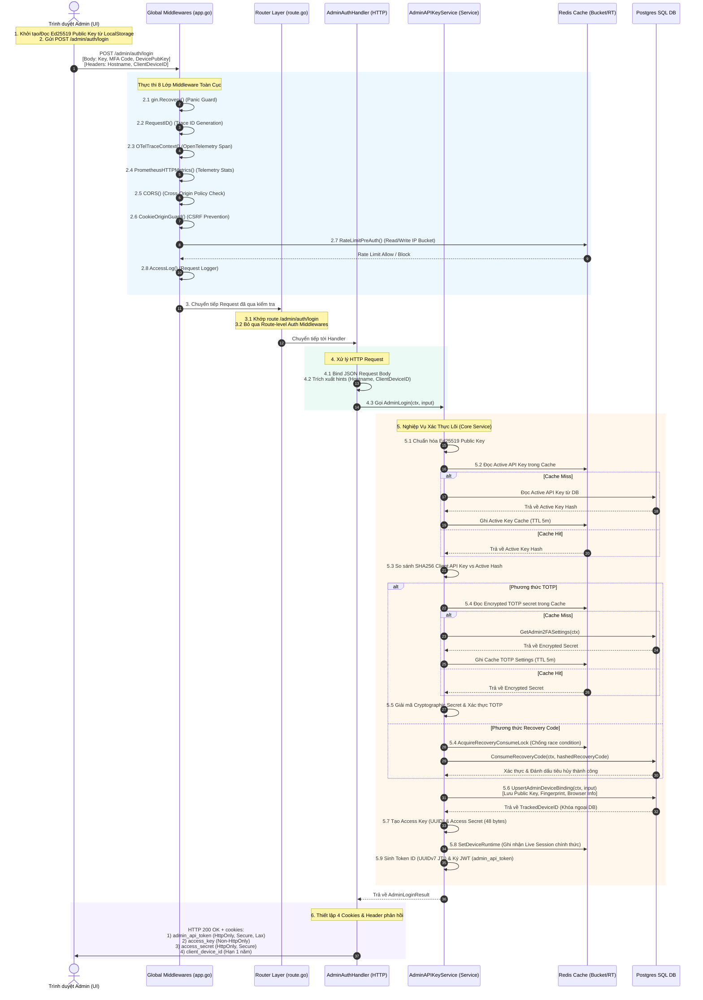

# Báo Cáo Phân Tích Chuyên Sâu: Luồng Đăng Nhập Admin (Admin Login Flow)

Báo cáo này cung cấp cái nhìn toàn cảnh chi tiết và phân tích sâu sắc về **Luồng Đăng Nhập của Admin** trong hệ thống **Aurora Cloud**. Tiến trình được mô tả chi tiết từng bước, đi từ giao diện người dùng (UI Component), qua 8 lớp Middleware toàn cục (Global Middlewares), tầng Routing & Handler, đến nghiệp vụ logic (Service/Domain Layer) và kết thúc tại các hạ tầng lưu trữ (Redis Cache & Postgres SQL Database).

---

## 1. Bản Đồ Trực Quan Luồng Đi Toàn Bộ Hệ Thống (End-to-End Sequence Diagram)

Sơ đồ dưới đây mô tả hành trình của một Request đăng nhập đi qua tất cả các lớp trong hệ thống:



---

## 2. Chi Tiết Từng Lớp Thực Thi (Step-by-Step Flow)

### LỚP 1: Khởi Chạy Tại Giao Diện (Client UI - Browser)

* **File nguồn**: [Login.tsx](admin-ui/src/pages/auth/Login.tsx)

1. **Thiết lập Cặp Khóa Thiết bị (Device Binding Key)**:
    * Khi trang Login được nạp, hàm `getOrCreateDevicePublicKey()` sẽ chạy để tìm kiếm cặp khóa Ed25519 lưu trong `localStorage` tại key `admin.device.public_key.v1`.
    * Nếu không tìm thấy, trình duyệt sẽ dùng WebCrypto API (`crypto.subtle.generateKey`) để tạo một cặp khóa **Ed25519** bất đối xứng.
    * Khóa công khai được xuất dưới dạng raw bytes, mã hóa Base64 và lưu cố định vào `localStorage` của trình duyệt. Cặp khóa này đóng vai trò xác định tính "chính chủ" của thiết bị vật lý trong các giao dịch ký số sau này.
2. **Submit Request**:
    * Quản trị viên nhập vào **Admin API Key** và **MFA Code** (sau khi chọn phương thức xác thực: `totp` hoặc `recovery_code`).
    * Client thực hiện gửi yêu cầu HTTP POST đến `/admin/auth/login` với JSON payload:

      ```json
      {
        "admin_api_key": "<trimmed_api_key>",
        "mfa_method": "totp" | "recovery_code",
        "mfa_code": "<trimmed_code>",
        "device_public_key": "<base64_encoded_public_key>"
      }
      ```

    * Đồng thời, Client tự động kèm các thông tin Header và Cookies hỗ trợ nhận dạng:
      * Header `X-Device-Hostname` & `X-Device-Name-Alt` (được đọc từ thông tin trình duyệt).
      * Cookie hoặc Header `client_device_id` (nếu đây là trình duyệt đã từng truy cập trước đó).

---

### LỚP 2: Động Cơ Middleware Toàn Cục (Global Middlewares - app.go)

* **File nguồn**: [app.go](controlplane/internal/app/app.go#L129-L139)

Trước khi chạm tới bất cứ dòng code nào của route `/admin/auth/login`, Request bắt buộc phải đi qua chuỗi **8 Global Middlewares** của Gin Engine theo thứ tự nghiêm ngặt sau:

```
[Request] ──> 1. gin.Recovery() ──> 2. RequestID() ──> 3. OTelTraceContext() ──> 4. PrometheusHTTPMetrics()
               └───> 5. CORS() ──> 6. CookieOriginGuard() ──> 7. RateLimitPreAuth() ──> 8. AccessLog() ──> [Route Handler]
```

1. **`gin.Recovery()` (Panic Guard)**:
    * **Nhiệm vụ**: Bảo vệ Controlplane không bị crash nếu có lỗi logic nghiêm trọng xảy ra gây ra Panic trong các lớp xử lý phía sau.
    * **Hành động**: Bắt tất cả các Panic, ghi log chi tiết stack trace và trả về HTTP `500 Internal Server Error` một cách lịch sự cho client.
2. **`middleware.RequestID()` (Trace ID & Request ID Alignment)**:
    * **Nhiệm vụ**: Liên kết định danh giao dịch duy nhất cho toàn bộ luồng xử lý và ghi nhận vào Logger Context.
    * **Hành động**:
      * Kiểm tra header `X-Request-ID` do **Envoy Proxy** sinh ra ở tầng biên để kế thừa.
      * Nếu không có, cố gắng trích xuất trực tiếp mã `Trace ID` từ W3C `traceparent` header (của Envoy/APM) để đồng bộ tuyệt đối giữa log phẳng (Loki) và biểu đồ vết (Tempo).
      * Nếu cả hai đều trống, tự sinh một chuỗi ngẫu nhiên mới (fallback). Đặt định danh thu được vào context của Gin qua key `logger.KeyRequestID` để mọi câu lệnh log phía sau tự động gắn tag, đồng thời trả về response header `X-Request-ID`.
3. **`middleware.OTelTraceContext()` (OpenTelemetry Tracing)**:
    * **Nhiệm vụ**: Tích hợp công cụ phân phối tracing (distributed tracing) bằng OpenTelemetry.
    * **Hành động**: Vô điều kiện trích xuất Trace Context (`obs.Extract`) từ HTTP headers để OTel tự động khôi phục cấu trúc phân cấp, bắt đầu một Span con mới (`POST /admin/auth/login`), tiêm thông tin Span vào context của request. Giúp giám sát hiệu năng thực thi của luồng login chi tiết đến từng miliseconds trên hệ thống Jaeger/Tempo.
4. **`middleware.PrometheusHTTPMetrics()` (Telemetry Statistics)**:
    * **Nhiệm vụ**: Ghi nhận các số liệu telemetry toàn cục về lượng traffic.
    * **Hành động**: Đo thời gian xử lý và tăng số đếm (counters) của Prometheus theo các chiều dữ liệu (Labels): HTTP Method (`POST`), Path (`/admin/auth/login`), và Status Code (ví dụ `200`, `401`, `500`).
5. **`middleware.CORS()` (Cross-Origin Resource Sharing)**:
    * **Nhiệm vụ**: Kiểm soát an toàn các yêu cầu tài nguyên chéo nguồn giữa UI (Front-end) và API (Back-end).
    * **Hành động**: Đối khớp `Origin` header gửi lên với danh sách cho phép `cfg.App.AllowedOrigins`. Đặt các headers CORS cần thiết (`Access-Control-Allow-Origin`, `Access-Control-Allow-Credentials`, v.v.).
6. **`middleware.CookieOriginGuard()` (CSRF Protection)**:
    * **Nhiệm vụ**: Ngăn chặn tấn công giả mạo yêu cầu chéo trang (CSRF - Cross-Site Request Forgery).
    * **Hành động**: Nếu request mang cookie, middleware kiểm tra và bảo đảm `Origin` hoặc `Referer` header khớp chính xác với miền của API. Đối với các request đăng nhập `/admin/auth/login` (chưa có cookie session), middleware cho phép đi qua an toàn.
7. **`middleware.RateLimitPreAuth()` (Anti-DDoS / Brute Force Protection)**:
    * **Nhiệm vụ**: Giới hạn tần suất gửi yêu cầu để chống tấn công Brute Force bẻ khóa API Key hoặc spam làm nghẽn hệ thống.
    * **Hành động**:
      * Sử dụng Redis làm bộ nhớ đệm tập trung (thông qua `ratelimit.NewBucket` chạy thuật toán Token Bucket).
      * Đọc IP nguồn của client và truy xuất khóa rate-limit `global_preauth:<client_ip>`.
      * Với cấu hình `1200 requests/minute`, nếu vượt ngưỡng, middleware trả về HTTP `429 Too Many Requests` ngay lập tức, ngăn không cho request tiếp tục chạy xuống Database hay tốn tài nguyên xử lý mã hóa.
8. **`middleware.AccessLog()` (Global Logger)**:
    * **Nhiệm vụ**: Ghi nhận nhật ký truy cập có định dạng chuẩn hóa của toàn bộ hệ thống.
    * **Hành động**: Đợi request xử lý xong ở các tầng dưới, thu thập latency, kích thước response, và ghi ra dòng log có cấu trúc (Structured Log JSON) chứa đầy đủ thông tin IP, URL, Request ID, Latency, và Agent.

---

### LỚP 3: Phân Phối Định Tuyến & HTTP Handler (Routing & Handler)

* **File nguồn**:
  * [route.go](file:///home/phucle/Desktop/New/controlplane/internal/iam/route.go#L58-L60)
  * [admin_auth_handler.go](file:///home/phucle/Desktop/New/controlplane/internal/iam/transport/http/handler/admin_auth_handler.go)

1. **Khớp Route**:
    * Gin Router khớp đường dẫn `POST /admin/auth/login`. Do đây là endpoint thiết lập phiên (bootstrap session), route này **không được cấu hình qua các route-level auth middleware** (như `AdminAPIKeyAuth` hay `AdminCriticalSignature`). Request đi thẳng vào hàm `module.AdminAuthHandler.Login`.
2. **Bind JSON Request Body**:
    * `admin_auth_handler.go` thực hiện kiểm tra kiểu dữ liệu đầu vào (Binding & Validation) thông qua struct `AdminLoginRequest` sử dụng thẻ `binding:"required"`. Nếu thiếu API Key hoặc các tham số cần thiết, nó trả về HTTP `400 Bad Request`.
3. **Trích xuất Client Device ID**:
    * Trích xuất thông tin `client_device_id` từ Cookies (`client_device_id`) hoặc Header `X-Client-Device-ID`. Bản chất của biến này là nhận diện thiết bị vật lý dài hạn (Permanent Device ID).
4. **Gọi Tầng Service nghiệp vụ**:
    * Đóng gói toàn bộ thông tin đã trích xuất và gọi xuống tầng Service:

      ```go
      result, err := h.svc.AdminLogin(ctx, iamEntity.AdminLoginRequest{
          RawAPIKey:       request.AdminAPIKey,
          MFAMethod:       request.MFAMethod,
          MFACode:         request.MFACode,
          DevicePublicKey: request.DevicePublicKey,
          ClientDeviceID:  clientDeviceIDHint,
          Hostname:        c.GetHeader("X-Device-Hostname"),
          ...
      })
      ```

---

### LỚP 4: Tầng Nghiệp Vụ Xác Thực Lõi (Core Service Layer)

* **File nguồn**: [admin_api_key_service.go](file:///home/phucle/Desktop/New/controlplane/internal/iam/service/admin_api_key_service.go)

Tại đây, hệ thống thực hiện một chuỗi các bước kiểm chứng mật mã và thiết lập phiên làm việc chính thức:

#### 1. Chuẩn hóa Khóa Thiết bị (Device Public Key Normalization)

* Trích xuất Base64 khóa công khai Ed25519 gửi từ Client lên, giải mã sang dạng byte thô để kiểm chứng cấu trúc chuẩn (phải chính xác 32 bytes).

* Encode lại thành chuỗi Base64 chuẩn hóa để đảm bảo tính đồng nhất khi lưu trữ và tạo dấu vân tay (Fingerprint) của thiết bị.

#### 2. Xác thực API Key (API Key Verification)

* Hệ thống áp dụng chiến lược **2-Layer Caching** nhằm giảm tải truy cập I/O xuống Database:
  1. **Layer 1**: Đọc từ bộ nhớ đệm cục bộ (Go In-Memory Cache) hoặc Redis tập trung thông qua `apiKeyCache.GetActiveAPIKey`.
  2. **Layer 2**: Nếu Cache bị Miss, thực hiện truy vấn trực tiếp Postgres DB qua Repository (`s.repo.GetActiveAdminAPIKey`), sau đó ghi ngược lại vào Redis Cache với TTL 5 phút để tối ưu hiệu năng cho các request tiếp theo.

* Sau khi có API Key hợp lệ hoạt động (`ActiveKey`), hệ thống tiến hành băm SHA256 chuỗi API Key của Client gửi lên và so khớp với chuỗi mã băm bảo mật (`KeyHash`) đã lưu trữ.

#### 3. Kiểm chứng Đa Yếu Tố (MFA Validation)

Tùy thuộc vào phương thức lựa chọn của Admin:

* **Hình thức TOTP**:
  * Truy xuất thông số cài đặt 2FA của Admin từ SQL Database (áp dụng cơ chế cache Redis 5 phút tương tự để tăng tốc).
  * Giải mã Khóa bí mật TOTP (được mã hóa đối xứng trong Database) bằng khóa **Runtime Master Key** của hệ thống thông qua `security.DecryptSecret`.
  * Tính toán và so khớp mã OTP dùng hàm `totp.ValidateCustom` với cấu hình chống lệch giờ (Clock Skew = 1 chu kỳ 30 giây).
* **Hình thức Recovery Code (Mã Khôi Phục)**:
  * Băm SHA256 mã khôi phục Client gửi lên.
  * Để loại bỏ triệt để tấn công Race Condition sử dụng đồng thời một mã khôi phục trên nhiều request (Double-Consume Attack), hệ thống sử dụng lệnh `SETNX` của Redis (`AcquireRecoveryConsumeLock`) để tạo một khóa độc quyền (Distributed Lock).
  * Gọi Database thực hiện tiêu hủy mã khôi phục một cách an toàn (`s.repo.ConsumeRecoveryCode`).

#### 4. Ghi Nhận Thiết bị Vật Lý (Postgres Database Persistence)

* Tạo mã băm Fingerprint (SHA256) từ Khóa Công khai của thiết bị.

* Gọi hàm `s.repo.UpsertAdminDeviceBinding` để lưu thông tin cấu hình thiết bị vật lý của Admin xuống Postgres Database. Bảng dữ liệu sẽ ghi nhận:
  * Dấu vân tay khóa công khai, Trình duyệt, Hệ điều hành, Hostname, Địa chỉ IP đăng nhập.
  * Liên kết với ID định danh trình duyệt dài hạn (`client_device_id`).
  * Hệ thống trả về khóa chính `TrackedDeviceID` để làm liên kết vật lý cho phiên làm việc.

#### 5. Thiết lập Trạng thái Phiên Làm Việc (Redis Session Registry)

* Tạo một cặp khóa phiên làm việc ngẫu nhiên: `AccessKey` (UUIDv4) và `AccessSecret` (Mã ngẫu nhiên an toàn dài 48 bytes).

* Đóng gói toàn bộ cấu hình trạng thái của phiên thành struct `UserDeviceRuntime`:
  * `AccessKey` làm định danh phiên chính.
  * `AccessSecretHash`: Lưu trữ mã băm SHA256 của `AccessSecret`.
  * `TrackedDeviceID`: Mã định danh thiết bị vật lý liên kết trong Postgres DB.
  * `DevicePublicKey`: Khóa công khai Ed25519 dùng để xác minh chữ ký của các thao tác khẩn cấp về sau.
  * `LastSeenAt`: Ghi nhận mốc thời gian hoạt động cuối cùng của Admin.
* Ghi đối tượng này vào Redis Cache tập trung (`s.deviceRT.SetDeviceRuntime`) với thời gian hết hạn của phiên `AdminSessionTTL` (ví dụ: 15 phút đến 2 giờ).

#### 6. Sinh Token Định Danh & Ký JWT

* Tạo một mã Token ID duy nhất sử dụng chuẩn **UUIDv7** để làm khóa JTI (`adminJTI`). UUIDv7 giúp các index ID sắp xếp theo thời gian tối ưu hơn.

* Thực hiện ký mã Token JWT `admin_api_token` thông qua thư viện mật mã `security.Sign` sử dụng họ khóa `SecretFamilyAdminAPIKey`. Token JWT sẽ mang các Claims:

  ```go
  security.Claims{
      Subject:   "admin",
      AccessKey: accessKey, // ID phiên runtime liên kết
      TokenID:   adminJTI,   // JTI duy nhất của token
      TokenUse:  "admin_api",
      ...
  }
  ```

---

### LỚP 5: Trả Phản Hồi & Thiết Lập Cookies (Response & Cookie Issuance)

* **File nguồn**: [admin_auth_handler.go](file:///home/phucle/Desktop/New/controlplane/internal/iam/transport/http/handler/admin_auth_handler.go)

Khi Service trả về kết quả thành công (`AdminLoginResult`), Handler tiến hành viết các Cookie bảo mật và thiết lập các Headers phản hồi cho Client:

1. **Thiết lập 4 Cookies Bảo mật**:
    * **`admin_api_token`**: Chứa chuỗi mã hóa ký số JWT.
      * *Cơ chế*: `HttpOnly: true` (chống mã độc XSS đọc token), `Secure: true` (chỉ truyền qua HTTPS), `SameSite: Lax`, hạn dùng khớp với thời gian sống của token.
    * **`access_key`**: Định danh phiên hoạt động hiện tại (UUID).
      * *Cơ chế*: `HttpOnly: false` (cho phép JS ở Client đọc để phục vụ tính toán chữ ký số `AdminCriticalSignature` cho các request nhạy cảm), `Secure: true`.
    * **`access_secret`**: Khóa bí mật thứ 3 của phiên làm việc.
      * *Cơ chế*: `HttpOnly: true` (bảo vệ khỏi mã độc XSS), `Secure: true`.
    * **`client_device_id`**: Mã định danh thiết bị vật lý dài hạn.
      * *Cơ chế*: Hạn dùng cố định **365 ngày** để ghi vết phần cứng thiết bị.
2. **Đặt Headers phản hồi**:
    * `X-Client-Device-ID`: Trả về mã thiết bị vật lý định danh.
    * `X-Session-Expires-In`: Trả về số giây còn lại của phiên làm việc để Client kích hoạt cơ chế tự động refresh ngầm (Silent Refresh).
3. **HTTP Response**:
    * Trả về HTTP `200 OK` kèm JSON:

      ```json
      {
        "code": "success",
        "data": {
          "ok": true
        },
        "message": "ok"
      }
      ```

---

## 3. Tổng Kết Bản Đồ Lưu Trữ Trạng Thế Đăng Nhập (State Storage Matrix)

Bảng dưới đây tổng hợp các dữ liệu được ghi lại trong suốt quá trình đăng nhập của Admin:

| Tên Dữ Liệu | Nơi Lưu Trữ | Loại Lưu Trữ | Thời Gian Sống (TTL) | Mục Đích Sử Dụng |
| :--- | :--- | :--- | :--- | :--- |
| **Ed25519 Private Key** | Client (Browser) | `localStorage` | Vĩnh viễn (cho đến khi xóa cache) | Dùng để ký số mật mã xác thực thiết bị đối với các API đặc biệt nhạy cảm. |
| **API Key Cache** | Redis & RAM Cache | Key-Value Cache | `5 phút` | Giảm tải truy cập DB khi kiểm tra API Key hệ thống. |
| **TOTP Settings Cache** | Redis & RAM Cache | Key-Value Cache | `5 phút` | Giảm tải truy cập DB khi nạp cấu hình MFA. |
| **Recovery Lock** | Redis Cache | `SETNX` Lock | `10 giây` | Distributed Lock chống tấn công Race Condition / Double-Consume mã khôi phục. |
| **Device Binding** | Postgres SQL DB | Relational Table | Vĩnh viễn (Persistent) | Quản lý, kiểm toán phần cứng thiết bị Admin đã đăng ký trong hệ thống. |
| **Live Runtime Session** | Redis Cache | `UserDeviceRuntime` struct | `AdminSessionTTL` (15m - 2h) | Nguồn thông tin chính xác duy nhất (Single Source of Truth) phản ánh trạng thái hoạt động thực của phiên. |
| **Access Token (JWT)** | Client Cookies | Cookie (`admin_api_token`) | Khớp Session TTL | Mảnh ghép xác thực cryptographic tự chứa thông tin định danh phiên làm việc. |
| **Access Key & Secret** | Client Cookies | Cookies (`access_key`, `access_secret`) | Khớp Session TTL | Hai mảnh ghép runtime dùng để liên kết chặt chẽ token JWT với Live Session trong Redis. |

---

## 4. Ranh Giới Bảo Mật Của Hệ Thống Giám Sát (Envoy Tracing Boundary)

Hệ thống thiết lập ranh giới bảo mật nghiêm ngặt đối với dữ liệu tracing phân tán nhằm tránh rò rỉ thông tin hạ tầng ra Internet:

1. **Giao tiếp nội bộ (Internal Tracing)**:
   * **Controlplane Go API** khi xử lý xong sẽ ghi nhận header `traceparent` vào gói tin phản hồi HTTP gửi trả lại cho **Envoy Edge Proxy** để đóng Span và lưu vết log.
2. **Giao tiếp ngoại bộ (External Response Stripping)**:
   * **Envoy Edge Proxy** được cấu hình thuộc tính `response_headers_to_remove` chứa `"traceparent"`.
   * Trước khi gói tin phản hồi HTTP thực tế rời khỏi Envoy để quay lại trình duyệt của Client, Envoy sẽ **tự động bóc tách và triệt tiêu** hoàn toàn header `traceparent` ra khỏi Response.
   * Client bên ngoài chỉ nhận được duy nhất header **`X-Request-ID`** phục vụ việc báo lỗi/tra cứu log thô thông thường, đảm bảo kiến trúc hạ tầng tracing bên trong hoàn toàn ẩn giấu đối với mạng công cộng.
