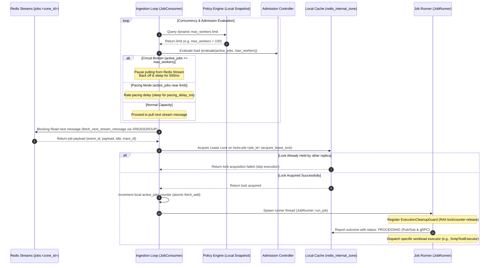

# Dataplane Runtime - Job Consumer & Admission Control Specification

This document specifies the generic Dataplane execution runtime. It details the worker loop, concurrency limits (admission control), distributed lease locks, and task scheduling mechanisms.

---

## 🔄 Ingestion & Concurrency Lifecycle Sequence

All incoming jobs pushed to the Redis stream `jobs:<zone_id>` are fetched, validated, and scheduled according to the following runtime sequence:

---

## 📥 How Jobs are Received (Job Ingestion Loop)

- **Entrypoint File**: `dataplane/src/job_receiver/consumer.rs`
- **Caller/Function**: `JobConsumer::start_ingestion` (Starts at Line 32)
- **Redis Query Callsite**: `dataplane/src/infra/redis/query.rs` -> `fetch_next_stream_message` (Starts at Line 18)

### Description

The main ingestion engine runs a continuous, async-blocking loop polling the zone-specific Redis Stream `jobs:<zone_id>`. This ingestion loop runs within an independent worker spawned dynamically as a Tokio green task by the `WorkerLifecycleManager`.

To facilitate automated scaling, the orchestrator polls real-time queue metrics (including Redis stream lag, message latency, and connection states) and feeds them into the `AutoScaleEngine`. Based on these metrics, the pool dynamically provisions additional workers (scale-up) or terminates active loops (scale-down) up to the limit configured by the Policy Engine. If no new messages are present, the worker dynamically paces itself before retrying.

---

## ⚙️ How Policy Engine Limits are Evaluated

- **Entrypoint File**: `dataplane/src/policyengine/engine.rs`
- **Caller/Function**: `PolicyEngine::current` (Starts at Line 63)

### Description

At the start of each ingestion loop cycle, the consumer retrieves a dynamic snapshot of the active cluster policies (such as the `max_workers` concurrent task capacity ceiling) via the local `PolicyEngine`. This allows the instance to adapt instantly to load-shedding limits without requiring a restart.

---

## 🛡️ How Admission Control Limits Overloads

- **Entrypoint File**: `dataplane/src/job_receiver/admission.rs`
- **Caller/Function**: `AdmissionController::evaluate` (Starts at Line 35)

### Description

Before pulling new messages from the Redis Stream, the ingestion loop evaluates the node's capacity ratio. The `evaluate` method computes the resource index `r = max(active_ratio, cpu_usage, ram_usage)` where `active_ratio = current_active / max_workers`:

- **Circuit Broken Mode**: If `r >= 80%` (`0.8`), the circuit breaker trips (OPEN), pausing stream ingestion and sleeping for `500ms`. It remains OPEN until load recovers and drops below `50%` (`0.5`) (hysteresis threshold).
- **Pacing Mode**: If `0.0 < r < 0.8`, a dynamic, linear pacing delay is applied: `pacing_delay_ms = 1000 * (r / 0.8)` ms. This delays the fetch operation to naturally pace the ingestion rate before the node hits limits, preventing thundering herds.

---

## 🔒 How Distributed Lease Locks are Managed

- **Lock Acquisition Callsite**: `dataplane/src/infra/redis/query.rs` -> `acquire_lease_lock` (Starts at Line 142)
- **Lock Release Callsite**: `dataplane/src/infra/redis/query.rs` -> `release_lease_lock` (Starts at Line 163)

### Description

To achieve reliable multi-replica HA execution without double-processing jobs, the consumer attempts to acquire a distributed lease lock on `locks:job:<job_id>` in `redis_internal_zone` immediately after deserialization. The lock TTL is matched directly with the job's `idle` lease duration. If lock acquisition fails, the job is skipped.

---

## 🚀 How Jobs are Executed & Cleaned Up

- **Task Spawner Callsite**: `dataplane/src/job_receiver/runner.rs` -> `JobRunner::run_job` (Starts at Line 37)
- **RAII Cleanup Guard**: `dataplane/src/job_receiver/runner.rs` -> `ExecutionCleanupGuard::drop` (Starts at Line 19)

### Description

Once the lock is acquired, the consumer increments the active task counter and calls `run_job`, spawning a non-blocking async Tokio task:

- **Early Processing Notification**: Before executing the workload, the runner immediately publishes a `PROCESSING` status update via Redis Pub/Sub and gRPC. This allows the Controlplane DB status to instantly move to `PROCESSING` and triggers real-time progress notifications to the UI.
- **Execution Guard**: The runner registers an `ExecutionCleanupGuard` (RAII pattern).
- **Lease Timeout**: Workload execution is wrapped in an early timeout (90% of the lease lock TTL) to protect against hanging sockets.
- **Auto Release**: When the executor finishes (or if it timeouts/panics/cancels), the `ExecutionCleanupGuard` drops. This drops the active job count and releases the Redis lock asynchronously, ensuring complete resource cleanup and preventing leakage.

---

## 📐 Architectural Design Patterns

The Dataplane's high-performance, resilient runtime is built using several core design patterns:

### 1. Job Ingestion Loop: Reactive Pull / Event Loop Pattern

- **Implementation**: `dataplane/src/job_receiver/consumer.rs`
- **Pattern**: An asynchronous, non-blocking polling loop subscribing to Redis Streams via `XREADGROUP`. It operates on a **Pull Model** to allow backpressure propagation where downstream workers decide when they are ready to process more items, rather than having tasks pushed to them blindly.

### 2. Policy Engine: Thread-Safe State Snapshot / Observer Pattern

- **Implementation**: `dataplane/src/policyengine/engine.rs`
- **Pattern**: Employs an observer-cache pattern with atomic snapshot swaps. To ensure zero-lock reads in the fast path of the worker threads, the `PolicyEngine` holds a local cache of limits (e.g. `max_workers`). Changes are pushed to the engine and swapped atomically using thread-safe pointers (`Arc`), preventing database or lock contention during limit checks.

### 3. Admission Control: Circuit Breaker with Hysteresis & Rate Pacing

- **Implementation**: `dataplane/src/job_receiver/admission.rs`
- **Pattern**: Implements a **Circuit Breaker** with hysteresis bounds to shield the node from cascading resource failures. If local CPU, RAM, or worker thread usage exceeds `80%`, the loop cuts ingestion (OPEN state). It stays open until usage drops below `50%` (CLOSED state). Additionally, near-capacity workloads trigger a linear **Rate Pacing Delay** to prevent thundering herd spikes.

### 4. Worker Pool & Auto Scale: Dynamic Task Spawning & Scaler Strategy

- **Implementation**: `dataplane/src/workerpool/lifecycle.rs` & `dataplane/src/workerpool/auto_scale.rs`
- **Pattern**: Instead of managing a custom operating system thread-pool with heavy mutex locks, this implementation uses a **Tokio task-allocation pattern** where logical workers map directly to lightweight Tokio green tasks. The `WorkerLifecycleManager` manages graceful shutdowns via `CancellationToken` and tracking wrappers. The `AutoScaleEngine` applies a **Strategy Pattern** to scale active loops up or down based on lag and latency metrics, with a hard resource safeguard capping scaling at 90%.

### 5. Distributed Lock and Lease: Centralized Heartbeat Lease Pattern with RAII Cleanup Guard

- **Implementation**: `dataplane/src/infra/redis/query.rs`, `dataplane/src/workerpool/heartbeat.rs` & `dataplane/src/job_receiver/runner.rs`
- **Pattern**: Implements a **Lease Lock Pattern** using Redis key-value isolation (`SETNX` with TTL) to guarantee exactly-once processing in HA clusters. To prevent ghost-job duplicates on long-running tasks, the node maintains a thread-safe `ActiveLockRegistry` and runs a single background **Lock Heartbeat Watcher**. Every 10 seconds, this watcher uses **Redis Pipelining** to batch-extend the TTL of all active locks to 30 seconds. If a node crashes, the heartbeat ceases, letting the lock expire within 30 seconds so other replicas can reclaim it. Lock cleanup is bound to an **RAII (Resource Acquisition Is Initialization)** `ExecutionCleanupGuard` that synchronously removes keys from the local registry and asynchronously deletes the Redis lock when exiting scope.

### 6. Job Dispatch Workload: Command / Strategy Pattern

- **Implementation**: `dataplane/src/job_receiver/consumer.rs`
- **Pattern**: Utilizes a dynamic **Command Dispatcher** pattern. The ingestion loop parses incoming jobs by their dot-separated namespace/topic prefix (e.g., routing `mail.test_connection` to `SmtpTestExecutor`). The runner resolves these namespaces to individual execution strategies, decoupling the ingestion loop framework from concrete job business logic.
