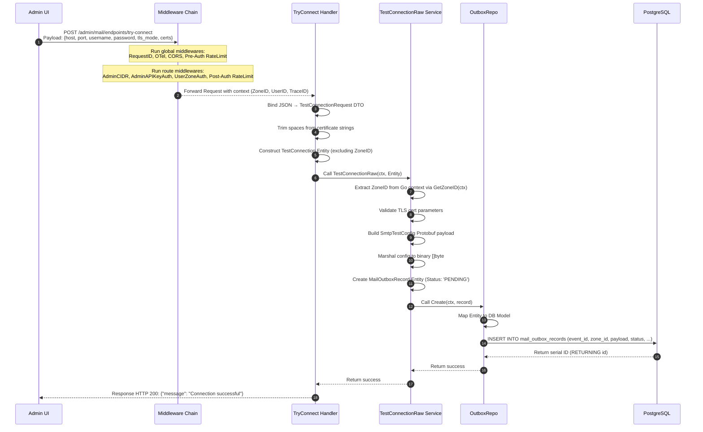

# Outbound Email System - Try Connect Flow Specification
>
> [!NOTE]
> This document specifies **Phase 1 (Outbox Ingestion)** of the Try Connect flow.
> Subsequent phases (CDC logical replication, Redis Streams transport, Dataplane execution, and feedback callback) are scheduled for subsequent architectures.

---

## 🗺️ Architectural Context

The "Try Connect" feature allows SREs and Administrators to test SMTP server configurations on-the-fly *before* saving them as persistent Mail Endpoints.

To ensure **High Availability (HA)**, **DDoS/Abuse Protection**, and **Fault Isolation**, the design decouples the UI request from the actual SMTP network handshake:

1. **Phase 1 (Ingestion)**: The Controlplane validates parameters, checks zones, and writes a transient connection job to a transactional Outbox table (`mail_outbox_records`).
2. **Phase 2 (Transport)**: CDC (Change Data Capture) parses PostgreSQL WAL logs and streams the event to the correct Dataplane Redis Stream.
3. **Phase 3 (Execution)**: A Dataplane worker retrieves the task, runs the actual network handshake, and records the result.
4. **Phase 4 (Callback)**: The result is written back to the Controlplane to update the outbox record's final status.

---

## 🛡️ Middleware Chain & Context Injections

Before reaching the `TryConnect` HTTP Handler, a request goes through a strict multi-layer security and telemetry chain.

### 1. Global Middleware (defined in `controlplane/internal/app/app.go`)

| Middleware | Purpose / Action | Context Injections |
| :--- | :--- | :--- |
| **`gin.Recovery()`** | Prevents server crashes by catching panics and returning a `500 Internal Server Error`. | None |
| **`middleware.RequestID()`** | Extracts or generates a unique correlation ID: (1) Reads Envoy edge `X-Request-ID`, (2) Falls back to W3C `traceparent` Trace ID, (3) Falls back to generated UUID. | **Gin**: `c.Set("request_id", reqID)`; **HTTP Header**: `X-Request-ID: reqID` |
| **`middleware.OTelTraceContext(...)`** | Integrates OpenTelemetry tracing. Extracts span parent context from headers and starts a child span. | **Go Context**: `c.Request.Context()` is updated with the OTel Span context. |
| **`middleware.PrometheusHTTPMetrics(...)`** | Measures HTTP request count, latency, and active inflight count at global scope. | None |
| **`middleware.CookieOriginGuard(...)`** | CSRF prevention. Checks request `Origin` or `Referer` headers against allowed domain hosts. | None |
| **`middleware.RateLimitPreAuth(...)`** | Defends edge computing resources from DDoS. Checks IP token bucket before heavy parsing. | None |
| **`middleware.AccessLog()`** | Logs transaction data (URI, method, duration, client IP, Request ID) at log termination. | None |
| **`middleware.AdminXSSI()`** | Prevents Cross-Site Script Inclusion by prepending `)]}',\n` to JSON responses. | None |

### 2. Route-specific Middleware (defined in `controlplane/internal/mail/route.go`)

| Middleware | Purpose / Action | Context Injections |
| :--- | :--- | :--- |
| **`middleware.AdminCIDR()`** | Evaluates client IP against compiled allowed CIDRs / static IP whitelist. Fail-Closed. | None |
| **`middleware.AdminAPIKeyAuth()`** | Performs session cookie verification: (1) Decodes JWT from `admin_api_token` candidate key rotation keys, (2) Checks session access secret hash in L2 Redis cache. | **Gin & Go Context**: `constant.ContextKeyUserID` ("user_id") -> `claims.Subject` (Value: `"admin"`); **HTTP Header**: `X-Session-Expires-In` |
| **`middleware.UserZoneAuth()`** | Multi-tenancy isolation. (1) Extracts `zone_code` cookie, (2) Queries L1 `"zone_by_code"` loader to resolve UUID, (3) Compares claims Zone ID with resolved Zone ID. | **Go Context**: `zoneIDCtxKey{}` -> resolved `uuid.UUID` (injected via `ContextWithZoneID`) |
| **`middleware.RateLimitPostAuth(...)`** | Anti-probing rate limit based on identity key: `path + clientIP + user_id / access_key`. | None |

---

## 🔄 End-to-End Sequence (Phase 1 Ingestion)



---

## 📊 Database Schema & Field Mappings

The transient job is written to `mail_outbox_records` under the mail module schema.

### 1. Database Table DDL (`000004_mail_outbox.up.sql`)

```sql
CREATE TABLE IF NOT EXISTS mail_outbox_records (
    id BIGSERIAL PRIMARY KEY,
    event_id VARCHAR(64) UNIQUE NOT NULL,
    zone_id VARCHAR(64) NOT NULL,
    job_topic VARCHAR(100) NOT NULL,
    payload BYTEA NOT NULL,
    user_id VARCHAR(64) NOT NULL,
    status VARCHAR(50) NOT NULL DEFAULT 'PENDING' CHECK (status IN ('PENDING', 'PUBLISHED', 'PROCESSING', 'COMPLETED', 'SUCCEEDED', 'FAILED')),
    completed_at TIMESTAMP WITH TIME ZONE,
    job_version INT NOT NULL DEFAULT 1,
    resource_id VARCHAR(64),
    payload_schema_version INT NOT NULL DEFAULT 1,
    trace_id VARCHAR(64),
    idle INT,
    error_code VARCHAR(100),
    error_message TEXT
);
```

### 2. Complete Struct & Column Mapping

| DTO Field / Context Source | Entity / Protobuf Field | DB Model Field (`db` Tag) | Database Column |
| :--- | :--- | :--- | :--- |
| Generated `uuid.NewV7()` | `EventID` | `EventID` (`event_id`) | `event_id` |
| `middleware.GetZoneID(ctx)` | `ZoneID` | `ZoneID` (`zone_id`) | `zone_id` |
| Static String | `JobTopic` (`"mail.test_connection"`) | `JobTopic` (`job_topic`) | `job_topic` |
| Form DTO Params | `SmtpTestConfig` Protobuf payload | `Payload` (`payload`) | `payload` |
| `ctx.Value(ContextKeyUserID)` | `UserID` | `UserID` (`user_id`) | `user_id` |
| Static Enum | `OutboxStatusPending` | `Status` (`status`) | `status` |
| Static Version | `JobVersion` (`1`) | `JobVersion` (`job_version`) | `job_version` |
| Static Identifier | `ResourceID` (`"transient_test"`) | `ResourceID` (`resource_id`) | `resource_id` |
| Static Schema | `PayloadSchemaVersion` (`1`) | `PayloadSchemaVersion` (`payload_schema_version`) | `payload_schema_version` |
| `trace.SpanContextFromContext` | `TraceID` | `TraceID` (`trace_id`) | `trace_id` (nullable) |
| Static Timeout | `Idle` (`90`) | `Idle` (`idle`) | `idle` (nullable) |

---

## 🔒 Security & Reliability Guarantees

1. **Server-Side Zone Enforcement**: The client UI does not supply `zone_id`. It is resolved directly on the server by reading the authenticated user's `zone_code` cookie and mapping it to the zone UUID through the high-performance in-memory L1 cache loader. This prevents cross-tenant spoofing.
2. **Fail-Closed Operations**: Critical checks (such as CIDR whitelist parsing, JWT candidates loading, and Redis session integrity checks) act as fail-closed gates. If any of these systems fail or lose connectivity, requests are rejected immediately rather than bypassed.
3. **Fail-Open Telemetry**: Prometheus metrics and OpenTelemetry tracing act as fail-open features. If monitoring collectors are offline, business requests continue to execute successfully.
4. **Outbox Pattern Integrity**: By saving the SMTP connection test as a transactional record inside PostgreSQL, the Controlplane remains stateless and unaffected by slow network connections. The asynchronous queue worker in the Dataplane executes the request reliably without blocking HTTP request threads.
