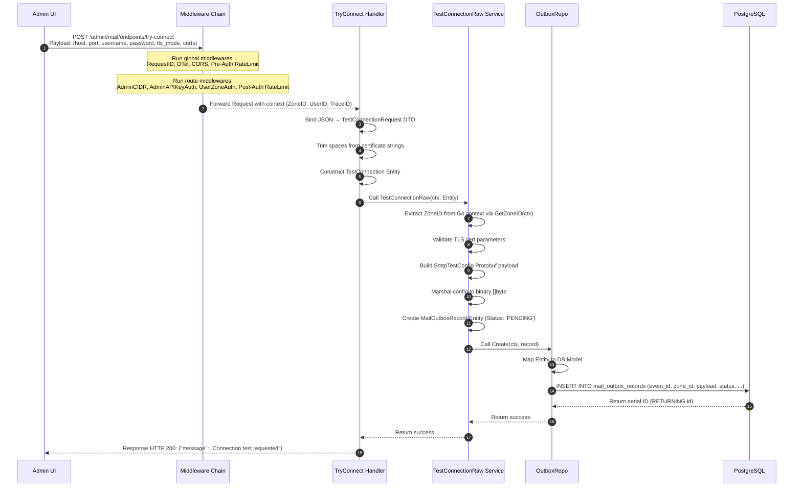
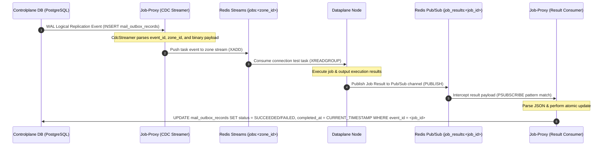
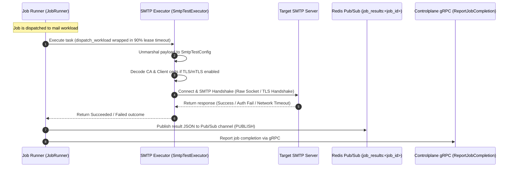

# Outbound Email System - Try Connect Flow Specification
>
> [!NOTE]
> This document specifies **Phase 1 (Outbox Ingestion)** of the Try Connect flow.
> Subsequent phases (CDC logical replication, Redis Streams transport, Dataplane execution, and feedback callback) are scheduled for subsequent architectures.

---

## 🗺️ Architectural Context

The "Try Connect" feature allows SREs and Administrators to test SMTP server configurations on-the-fly *before* saving them as persistent Mail Endpoints.

To ensure **High Availability (HA)**, **DDoS/Abuse Protection**, and **Fault Isolation**, the design decouples the UI request from the actual SMTP network handshake:

1. **Phase 1 (Ingestion)**: The Controlplane validates parameters, checks zones, and writes a transient connection job to a transactional Outbox table (`mail_outbox_records`).
2. **Phase 2 (Transport)**: CDC (Change Data Capture) parses PostgreSQL WAL logs and streams the event to the correct Dataplane Redis Stream.
3. **Phase 3 (Execution)**: A Dataplane worker retrieves the task, runs the actual network handshake, and records the result.
4. **Phase 4 (Callback)**: The result is written back to the Controlplane to update the outbox record's final status.

---

## 🔍 Code Callsites & References (TOC)

| Lifecycle Stage | Caller / Callsite | File Path | Function / Line Range |
| :--- | :--- | :--- | :--- |
| **Frontend Trigger** | UI Connection Test Click | `admin-ui/src/pages/mail/NewMailEndpoint.tsx` | `tryConnect` (~L144-L180) |
| **Global Middlewares** | Request Lifecycle Gateways | `controlplane/internal/app/app.go` | `App` (~L244-L256) |
| **Route Registration** | Endpoint Binding | `controlplane/internal/mail/route.go` | `RegisterRoutes` (~L170-L177) |
| **HTTP Handler** | Request Parsing & validation | `controlplane/internal/mail/transport/http/handler/endpoint_handler.go` | `TryConnect` (~L354-L407) |
| **Service Layer** | Business validation & outbox construction | `controlplane/internal/mail/service/endpoint_service_impl.go` | `TestConnectionRaw` (~L364-L449) |
| **Outbox Repo** | DB transactional insert | `controlplane/internal/mail/repository/postgres/outbox_repo_postgres.go` | `Create` (~L59-L82) |

---

## 🛡️ Middleware Chain & Context Injections

Before reaching the `TryConnect` HTTP Handler, a request goes through a strict multi-layer security and telemetry chain.

### 1. Global Middleware (defined in `controlplane/internal/app/app.go`)

| Middleware | Purpose / Action | Context Injections |
| :--- | :--- | :--- |
| **`gin.Recovery()`** | Prevents server crashes by catching panics and returning a `500 Internal Server Error`. | None |
| **`middleware.RequestID()`** | Extracts or generates a unique correlation ID: (1) Reads Envoy edge `X-Request-ID`, (2) Falls back to W3C `traceparent` Trace ID, (3) Falls back to generated UUID. | **Gin**: `c.Set("request_id", reqID)`; **HTTP Header**: `X-Request-ID: reqID` |
| **`middleware.OTelTraceContext(...)`** | Integrates OpenTelemetry tracing. Extracts span parent context from headers and starts a child span. | **Go Context**: `c.Request.Context()` is updated with the OTel Span context. |
| **`middleware.PrometheusHTTPMetrics(...)`** | Measures HTTP request count, latency, and active inflight count at global scope. | None |
| **`middleware.CookieOriginGuard(...)`** | CSRF prevention. Checks request `Origin` or `Referer` headers against allowed domain hosts. | None |
| **`middleware.RateLimitPreAuth(...)`** | Defends edge computing resources from DDoS. Checks IP token bucket before heavy parsing. | None |
| **`middleware.AccessLog()`** | Logs transaction data (URI, method, duration, client IP, Request ID) at log termination. | None |
| **`middleware.AdminXSSI()`** | Prevents Cross-Site Script Inclusion by prepending `)]}',\n` to JSON responses. | None |

### 2. Route-specific Middleware (defined in `controlplane/internal/mail/route.go`)

| Middleware | Purpose / Action | Context Injections |
| :--- | :--- | :--- |
| **`middleware.AdminCIDR()`** | Evaluates client IP against compiled allowed CIDRs / static IP whitelist. Fail-Closed. | None |
| **`middleware.AdminAPIKeyAuth()`** | Performs session cookie verification: (1) Decodes JWT from `admin_api_token` candidate key rotation keys, (2) Checks session access secret hash in L2 Redis cache. | **Gin & Go Context**: `constant.ContextKeyUserID` ("user_id") -> `claims.Subject` (Value: `"sre"`); **HTTP Header**: `X-Session-Expires-In` |
| **`middleware.UserZoneAuth()`** | Multi-tenancy isolation. (1) Extracts `zone_code` cookie, (2) Queries L1 `"zone_by_code"` loader to resolve UUID, (3) Compares claims Zone ID with resolved Zone ID. | **Go Context**: `zoneIDCtxKey{}` -> resolved `uuid.UUID` (injected via `ContextWithZoneID`) |
| **`middleware.RateLimitPostAuth(...)`** | Anti-probing rate limit based on identity key: `path + clientIP + user_id / access_key`. | None |

---

## 🔄 End-to-End Sequence (Phase 1 Ingestion)

---

## 📊 Database Schema & Field Mappings

The transient connection test job is written to the `mail_outbox_records` table under the mail module schema. The fields are mapped as follows:

| DTO Field / Context Source | Entity / Protobuf Field | DB Model Field (`db` Tag) | Database Column |
| :--- | :--- | :--- | :--- |
| Generated `uuid.NewV7()` | `EventID` | `EventID` (`event_id`) | `event_id` |
| `middleware.GetZoneID(ctx)` | `ZoneID` | `ZoneID` (`zone_id`) | `zone_id` |
| Static String | `JobTopic` (`"mail.test_connection"`) | `JobTopic` (`job_topic`) | `job_topic` |
| Form DTO Params | `SmtpTestConfig` Protobuf payload | `Payload` (`payload`) | `payload` |
| `ctx.Value(ContextKeyUserID)` | `UserID` | `UserID` (`user_id`) | `user_id` |
| Static Enum | `OutboxStatusPending` | `Status` (`status`) | `status` |
| Static Version | `JobVersion` (`1`) | `JobVersion` (`job_version`) | `job_version` |
| Static Identifier | `ResourceID` (`"transient_test"`) | `ResourceID` (`resource_id`) | `resource_id` |
| Static Schema | `PayloadSchemaVersion` (`1`) | `PayloadSchemaVersion` (`payload_schema_version`) | `payload_schema_version` |
| `trace.SpanContextFromContext` | `TraceID` | `TraceID` (`trace_id`) | `trace_id` (nullable) |
| System Time (when completed) | `CompletedAt` | `CompletedAt` (`completed_at`) | `completed_at` (nullable) |
| Dataplane Error (on failure) | `ErrorCode` | `ErrorCode` (`error_code`) | `error_code` (nullable) |
| Dataplane Error Msg (on failure) | `ErrorMessage` | `ErrorMessage` (`error_message`) | `error_message` (nullable) |

## 🔄 Phase 2: Job Lifecycle (CDC & Dataplane Execution)

This phase manages the asynchronous execution of the SMTP test job via Change Data Capture (CDC), Redis Streams transport, Dataplane worker execution, and status synchronization back to the Controlplane database.

### 1. Architectural Components & Callsites

| Component | Responsibility | File Path / Context |
| :--- | :--- | :--- |
| **CDC Streamer** | Logical replication hook. Listens to PostgreSQL WAL for `mail_outbox_records` inserts and publishes to Redis Streams. | `job-proxy/src/cdc/mod.rs` |
| **Redis Streams** | High-throughput, distributed event message broker. | Stream Key Pattern: `jobs:<zone_id>` |
| **Dataplane Worker** | Consumer that parses `SmtpTestConfig` protobuf, runs SMTP network handshake, and outputs job results. Implemented by `SmtpTestExecutor`. | `dataplane/src/executor/mail/test_connection.rs` |
| **Result Consumer** | Consumes job execution results and updates the `mail_outbox_records` table status in Controlplane database. | `job-proxy/src/result_consumer.rs` |

### 2. Sequence 1: Job Lifecycle (High-Level Synchronization)

---

### 3. Sequence 2: Dataplane Job Execution (SMTP Connection Test)

> [!NOTE]
> The generic ingestion loop, admission control, and lease lock acquisition are documented in the separate [Dataplane Runtime Specification](file:///home/phucle/Desktop/New/spec/dataplane/dataplane_runtime.md).

