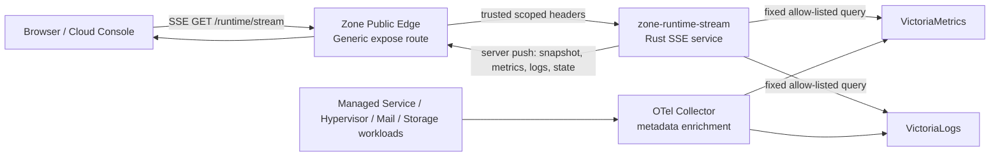

# Zone Runtime Stream

`zone-runtime-stream` là service runtime read-plane dùng chung cho toàn bộ
workload trong một Zone. Managed Service là adapter đầu tiên; Hypervisor, Mail
và Storage sẽ dùng cùng contract sau này.

Service này không thay thế Controlplane, Job Orchestrator hoặc Dataplane:

- Controlplane giữ desired state và lifecycle durable.
- Job Orchestrator/Dataplane giữ command, apply và terminal result.
- Zone Runtime Stream chỉ phục vụ metrics, logs, health và runtime events.
- VictoriaMetrics/VictoriaLogs là nguồn read-only; mất dữ liệu stream không làm
  mất business state.

## Topology



The browser does not poll Victoria and does not send PromQL/LogsQL. The Edge
verifies the generic runtime ticket, strips browser-controlled scope headers and
injects the trusted owner/workspace/Zone/resource scope.

## Runtime scope

Every subscription is bound to:

```text
module + resource_type + resource_id + owner_id + workspace_id + zone_id
       + component_id + panel_id + bounded snapshot window
```

The service rejects nil identities, a foreign Zone, unsupported panel names and
unbounded snapshot windows. Resource ownership remains an upstream ACR/Zone
Authorizer decision; this process is not an ownership database.

## Server-push model

The public contract is Server-Sent Events (SSE), because V1 is strictly
server-to-browser. A stream sends an initial bounded snapshot and then live
events. `Last-Event-ID` is a soft cursor: reconnecting may replay a bounded
window or emit `runtime.gap`, but it never reads a Controlplane inbox.

Victoria does not need to expose a browser-facing push API. The service uses a
bounded server-side incremental reader and fans out the result. A single
upstream reader is shared by clients with the same scope, component and panel;
the upstream query rate therefore scales with fan-out groups, not browsers.

Supported event names:

```text
runtime.snapshot
runtime.metric
runtime.log
runtime.state
runtime.event
runtime.gap
heartbeat
stream.error
```

The event payload is diagnostic data only. It must never contain credentials,
raw query text, private keys, customer secrets or protected command payloads.

## Backpressure and failure semantics

- Metrics use bounded coalescing; newer samples replace intermediate samples.
- Logs are batched and size-limited. A lagging client receives a `runtime.gap`
  event instead of causing unbounded memory growth.
- State transitions preserve per-resource ordering. If ordering cannot be
  preserved, the stream closes with a sanitized retryable error.
- Each client has a bounded broadcast buffer, a maximum lifetime and a
  connection permit. Client disconnect cancels the local subscription when no
  other client uses it.
- Replicas are stateless. A replica crash causes SSE reconnect; no durable
  business state is lost and no cross-Zone state is reconstructed here.
- SIGTERM stops accepting new work, cancels readers and drains active streams
  within the configured lifetime budget.
- Victoria errors are sent as sanitized `stream.error` frames and do not become
  lifecycle failures.

`/metrics` exposes fixed-cardinality counters/gauges for active connections,
rejections, fan-out groups, Victoria queries/errors and backpressure gaps.
Runtime resource/owner/workspace IDs never become metric labels. `/healthz` is
the process health endpoint; the Zone deployment remains responsible for
readiness and network-policy enforcement.

## Security boundary

The service has read-only egress to Zone Victoria endpoints only. It must not
receive credentials for Controlplane PostgreSQL, Kafka, NATS, Redis, Vault,
Zone KV or Kubernetes API. The Edge route must disable automatic retries for the
long-lived stream.

The service accepts only trusted injected headers:

```text
x-aurora-module
x-aurora-resource-type
x-aurora-resource-id
x-aurora-owner-id
x-aurora-workspace-id
x-aurora-zone-id
x-aurora-component-id
x-aurora-panel-id
```

These headers are not client authority. Public Edge must strip caller-supplied
copies before injection. Scope and panel values are validated again at this
boundary as defense in depth.

## Configuration

See [`.env.example`](./.env.example). Required identity and Victoria endpoints
fail fast. Connection, fan-out, snapshot, heartbeat, query and buffer budgets
are bounded at bootstrap; there is no unbounded default queue.

The Zone deployment template is
[`k8s/zone-runtime-stream.yaml`](../k8s/zone-runtime-stream.yaml). It runs as a
three-replica, stateless read plane with a read-only NetworkPolicy to the Zone
Victoria services and ingress only from the Zone Public Edge. The public route
and scoped `runtime.read` ticket remain a separate security gate; deploying this
service does not expose a direct host or browser path.

`RUNTIME_STREAM_MAX_EVENT_BYTES` bounds each Victoria response embedded in an
SSE event, while `RUNTIME_STREAM_MAX_LOG_LINES` bounds the Victoria Logs request.
Oversized responses are replaced by a byte count and SHA-256 digest, never
forwarded in full to a browser. Component IDs are escaped before they enter the
fixed regex query so a valid component name cannot widen its scope.

Docker development injects the app-owned `.env` from
`dev/zone/compose.yml`. The service is attached only to the
Zone Victoria read network and the dedicated Public Edge runtime network; it
does not share the Dataplane/Zone KV/MinIO network or the Central transport
network.

## Module rollout

Managed Service is the first adapter. Its adapter owns only module-specific
panel/query definitions. Future Hypervisor, Mail and Storage adapters must map
their telemetry to the same metadata and event envelope; they must not add a new
gateway, browser protocol or arbitrary query endpoint.

## Verification

Run from this directory:

```bash
cargo fmt --check
cargo test
cargo clippy --all-targets --all-features -- -D warnings
```

The current implementation deliberately keeps the stream read-plane separate
from lifecycle completion and notification timeline projection.
